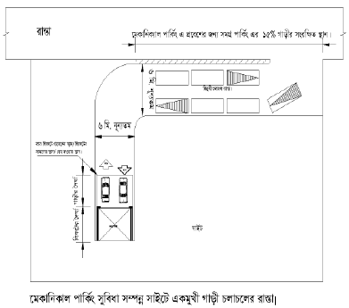
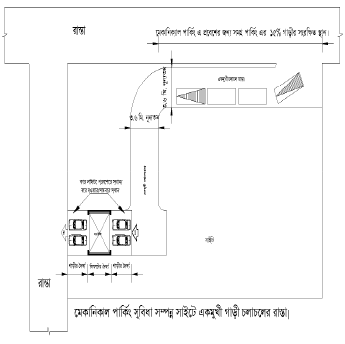
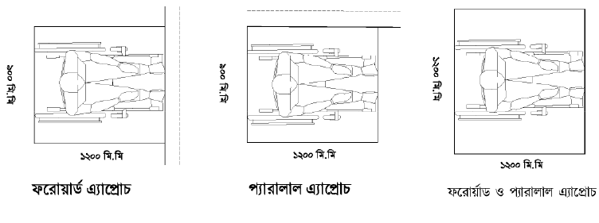
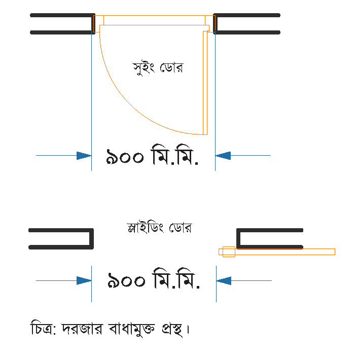
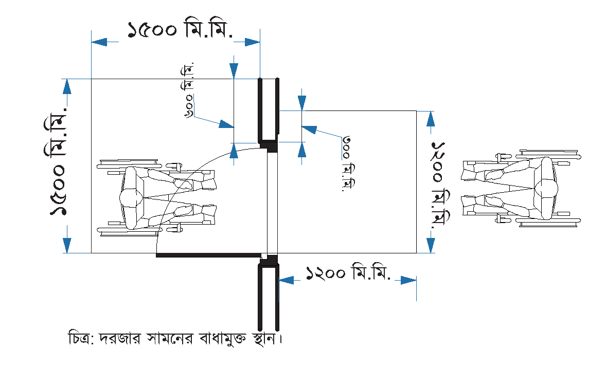
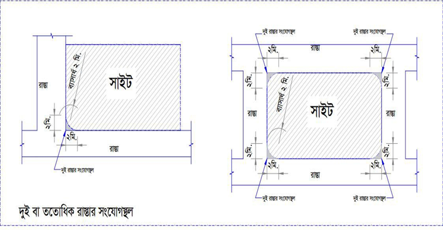
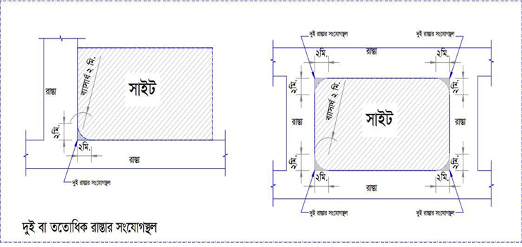
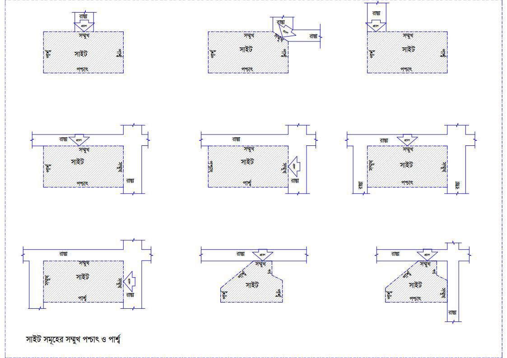
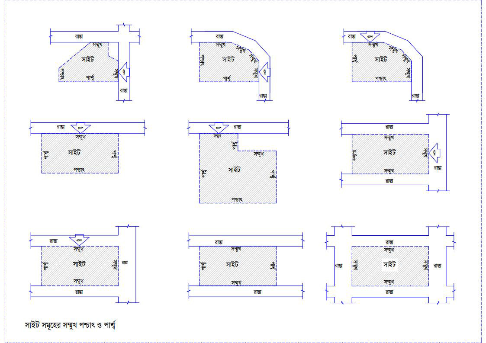

# Dhaka Metropolitan Building Rules, 2025

# **13409**

## প্রথম অধ্যায়
### প্রারম্ভিক

#### **১। শিরোনাম, প্রয়োগ ও প্রবর্তন।**
##### (১) এই বিধিমালা ঢাকা মহানগর ইমারত বিধিমালা, ২০২৫ নামে অভিহিত হইবে।
##### (২) ইহা Town Improvement Act, 1953 (Act No. XIII of 1953) এর আওতাভুক্ত ঢাকা মহানগর মহাপরিকল্পনাভুক্ত (Master Plan) এলাকার জন্য প্রযোজ্য হইবে।
##### (৩) ইহা অবিলম্বে কার্যকর হইবে।

#### **২। সংজ্ঞা।**
##### বিষয় বা প্রসঙ্গের পরিপন্থী কোনো কিছু না থাকিলে, এই বিধিমালায়—
###### (১) “অনুমোদিত নকশা” অর্থ Bangladesh National Building Code, 2020 এবং এতদসংক্রান্ত প্রচলিত অন্যান্য বিধি-বিধান অনুযায়ী যথাযথ কর্তৃপক্ষ কর্তৃক অনুমোদিত নকশা;

---

# **13410**

**বাংলাদেশ গেজেট, অতিরিক্ত, ডিসেম্বর ১৪, ২০২৫**

#### **২। সংজ্ঞা (চলমান)**

##### **(২)** **"অথরাইজড অফিসার"** অর্থ Building Construction Act, 1952 এর section 2 এর clause (a)-তে বর্ণিত Authorised Officer;

##### **(৩)** **"অঙ্গন"** বা **"আঙিনা"** অর্থ ভূমিতে অবস্থিত ইমারত দ্বারা সম্পূর্ণ বা আংশিকভাবে বেষ্টিত স্থায়ীভাবে উন্মুক্ত কোনো পরিসর;

##### **(৪)** **"অগ্নি নিরাপদ সিঁড়ি”** অর্থ বিভিন্ন তলা হইতে ল্যান্ডিং বা লবি দ্বারা সংযোজিত অগ্নি-নিরোধক উপকরণ দ্বারা নির্মিত সিঁড়ি, যাহা অগ্নি-প্রতিরোধক দরজার মাধ্যমে ইমারত বা অন্যান্য ব্যবহারিক এলাকা হইতে সুরক্ষিত এবং ইমারতের বহির্ভাগে খোলা স্থানের সহিত উন্মুক্ত থাকিবে;

##### **(৫)** **“অগ্নি-প্রতিরোধক দরজা"** অর্থ বিশেষভাবে তৈরি দরজা (Fire Grade) যাহা নির্দিষ্ট সময়ের জন্য তাপ ও আগুন সঞ্চালনের প্রতিরোধক হিসাবে কাজ করে;

##### **(৬)** **"অকুপেন্সি টাইপ"** অর্থ পরিশিষ্ট-৩ এ নির্ধারিত ইমারতের ব্যবহারভিত্তিক শ্রেণিবিন্যাস এবং উক্ত নির্ধারিত ধরনের ব্যবহারের সহিত সংশ্লিষ্ট আনুষঙ্গিক ব্যবহারও ইহার অন্তর্ভুক্ত হইবে; তবে এক্ষেত্রে কোনো অস্পষ্টতা নিরসরণকল্পে কোড অনুসরণ করিতে হইবে;

##### **(৭)** **"আইন”** অর্থ Building Construction Act, 1952 (Act No. II of 1953);

##### **(৮)** **"আবেদন”** অর্থ এই বিধিমালার অধীন কোনো আবেদন;

##### **(৯)** **"আবেদনকারী"** অর্থ সংশ্লিষ্ট ভূমির বৈধ মালিক অথবা ভূমির বৈধ মালিক কর্তৃক আমমোক্তারনামা বলে আবেদনকারী হিসাবে নিযুক্ত ব্যক্তি অথবা প্রতিষ্ঠান;

##### **(১০)** **"আবেদন ফি"** অর্থ এই বিধিমালার অধীন সেবাগ্রহীতা কর্তৃক দাখিলকৃত আবেদনের ফি;

##### **(১১)** **"আচ্ছাদিত স্থান"** অর্থ ইমারত দ্বারা ভূমিতলসহ উপরিভাগের আচ্ছাদিত ক্ষেত্র, যাহা প্রিন্থ স্তরের ঠিক পরবর্তী স্তর বা তলা, তবে নিম্নবর্ণিত স্থানসমূহ ইহার অন্তর্ভুক্ত হইবে না, যথা:-

###### **(ক)** বাগান, পারগোলা, তরুশালা, জলাশয়, সুইমিংপুল (অনাচ্ছাদিত), গাছের নিচের বেদী, জলাধার, ফোয়ারা এবং আসন;

###### **(খ)** জলনির্গমন ব্যবস্থা, কালভার্ট, সেপটিক ট্যাংক, সোক পিট;

###### **(গ)** সীমানা প্রাচীর ও ফটক, পোর্চ, র‍্যাম্প, উন্মুক্ত সিঁড়ি (গ্রাউন্ড ফ্লোর), গার্ডরুম, বিচ্ছিন্ন পাম্প হাউস (বৃহৎ শিল্প, এ্যাপার্টমেন্ট কমপ্লেক্স, ইত্যাদি) গার্বেজ সুট, অনাচ্ছাদিত যেকোনো ইউটিলিটি স্ট্রাকচার, কার্নিশ এবং সানসেড কর্তৃক আচ্ছাদিত স্থান;

##### **(১২)** **"আপিল কমিটি"** অর্থ বিধি ৩১ এর অধীন গঠিত আপিল কমিটি;

---

# **13411**

**বাংলাদেশ গেজেট, অতিরিক্ত, ডিসেম্বর ১৪, ২০২৫**

#### **২। সংজ্ঞা (চলমান)**

##### **(১৩)** **"আবেদনকারী প্রতিনিধি”** অর্থ নকশা প্রণয়ন ও নির্মাণ তদারকির নিমিত্ত কর্তৃপক্ষ কর্তৃক নিবন্ধিত ডেভেলপার, সরকার অনুমোদিত পেশাজীবী প্রতিষ্ঠান কর্তৃক নিবন্ধিত স্থপতি, প্রকৌশলী বা পরিকল্পনাবিদ এবং সরকার কর্তৃক নিবন্ধিত এতদসংশ্লিষ্ট অন্যান্য কারিগরি ব্যক্তি বা প্রতিষ্ঠান যাহাকে ভূমির মালিকের পক্ষে আবেদনকারী হিসাবে দায়িত্ব পালন করিবার উদ্দেশ্যে নিম্নবর্ণিত শর্তসাপেক্ষে মনোনীত করা হইয়াছে, যথা:-

###### **(ক)** আবেদনকারীর প্রতিনিধির নিয়োগ লিখিতভাবে কর্তৃপক্ষ কর্তৃক নির্ধারিত ফরমের মাধ্যমে ও স্বাক্ষরযুক্ত হইতে হইবে; এবং

###### **(খ)** আবেদনকারীর প্রতিনিধি কর্তৃক দাখিলকৃত ভূমি বা সম্পত্তির দলিলাদির সঠিকতা সর্ম্পকে আবেদনকারী দায়ী থাকিবেন;

##### **(১৪)** **"অ্যাজ-বিল্ট ড্রয়িং"** বা **"ইমারতের নির্মিত নকশা"** অর্থ নির্মাণকাজ সম্পন্ন হইবার পর সংশ্লিষ্ট কারিগরি (স্থপতি বা প্রকৌশলী) ব্যক্তি দ্বারা স্বাক্ষরিত ইমারতের বাস্তবায়িত বা নির্মিত স্থাপত্য, কাঠামো, বিল্ডিং সার্ভিসেস সম্পর্কিত সকল নকশা;

##### **(১৫)** **"ইমারত”** অর্থ আইনের section 2 এর clause (b) এবং কোডের Article 6 এ সংজ্ঞায়িত Building;

##### **(১৬)** **"ইমারত নির্মাণ কমিটি”** অর্থ আইনের section 3 এর sub-section (2) এ উল্লিখিত কমিটি;

##### **(১৭)** **"ইমারতের উচ্চতা"** অর্থ রেফারেন্স ডেটাম (নিকটতম ফুটপাতের উচ্চতা অথবা উহার কেন্দ্রস্থলে অবস্থিত নিকটতম রাস্তা বা রাস্তা সংলগ্ন ফুটপাথের উচ্চতা, যাহা বেশি) হইতে ভবনের সর্বোচ্চ বিন্দু পর্যন্ত উল্লম্ব দূরত্ব, যাহার মধ্যে ইমারতের উপর অন্যান্য স্থাপনা বা ইমারতের অন্যান্য উপাদান, যেমন ইমারতের ছাদে অবস্থিত সিঁড়িঘর, জলাধার, স্থাপত্যের উপাদান, লাইটনিং এরেস্টর, এন্টেনা বা মোবাইল টাওয়ার, ইত্যাদি অন্তর্ভুক্ত হইবে;

##### **(১৮)** **"ইমারত পরিদর্শক"** অর্থ কর্তৃপক্ষ কর্তৃক নিয়োগপ্রাপ্ত কোনো ব্যক্তি যিনি ইমারত সংশ্লিষ্ট পরিদর্শন কাজে নিয়োজিত হইবেন;

##### **(১৯)** **"ইলেকট্রিক্যাল ইঞ্জিনিয়ার বা তড়িৎ প্রকৌশলী"** অর্থ যিনি সংশ্লিষ্ট বিষয়ে স্নাতক ডিগ্রি প্রাপ্ত, ইন্সটিটিউশন অব ইঞ্জিনিয়ার্স, বাংলাদেশ এর সদস্য এবং বিধি ৩৬ অনুযায়ী তালিকাভুক্ত;

##### **(২০)** **"উচ্চতা”** অর্থ

###### **(ক)** কক্ষের উচ্চতার ক্ষেত্রে সম্পন্নকৃত মেঝের উপর হইতে বাঁধামুক্ত ছাদের নিচ তল পর্যন্ত উলম্ব পরিমাপ;

---

# **13412**

**বাংলাদেশ গেজেট, অতিরিক্ত, ডিসেম্বর ১৪, ২০২৫**

#### **২। সংজ্ঞা (চলমান)**

##### **(২০)** **"উচ্চতা" (চলমান)**

###### **(খ)** কোনো তলার উচ্চতার ক্ষেত্রে সম্পন্নকৃত একটি তলার মেঝের উপর হইতে অন্য তলার মেঝের উপর পর্যন্ত অথবা পরবর্তী তল না থাকিলে ছাদ বা আচ্ছাদনের উপর পর্যন্ত উলম্ব পরিমাপ;

###### **(গ)** দেয়ালের উচ্চতা হিসাবে একটি দেয়ালের ভূমি হইতে দেয়ালের উপরিভাগ পর্যন্ত উলম্ব পরিমাপ;

##### **(২১)** "**উন্মুক্ত জায়গা বা স্থান**" অর্থ সাইটের সর্বোচ্চ ভূমি আচ্ছাদনের বহির্ভূত অংশ যাহা ভূমিতল হইতে উর্ধ্বদিকে স্থায়ীভাবে উন্মুক্ত;

##### **(২২)** "**উন্নয়ন স্বত্ত্ব বিনিময় (Transfer of Development Rights, TDR)**" অর্থ কর্তৃপক্ষের আওতাধীন প্রেরণ এলাকা (sending site, যেখানে মহাপরিকল্পনা, আইন বা বিধিমালা দ্বারা উন্নয়ন কার্যক্রম অনুমোদিত নহে কিংবা সংরক্ষিত এলাকা যেমন, উন্মুক্ত স্থান, কৃষি জমি, বন্যাপ্রবাহ এলাকা, পরিবেশগতভাবে সংবেদনশীল এলাকা, ঐতিহাসিক গুরুত্বপূর্ণ স্থান বা স্থাপনা ইত্যাদি) হইতে গ্রহণ এলাকায় (receiving site, যেখানে মহাপরিকল্পনা, আইন বা বিধিমালা অনুযায়ী উন্নয়ন কার্যক্রম অনুমোদিত) উন্নয়ন স্বত্ত্ব অর্থের বা সুবিধাদির বিনিময়ে স্থানান্তর হয়;

##### **(২৩)** "**এট্রিয়াম (Atrium)**" অর্থ ইমারতের অভ্যন্তরে একাধিক তল বিশিষ্ট একটি বৃহৎ আয়তনের স্থান যাহা সর্বনিম্ন ২ (দুই) তলা ও অনুমোদিত ভবনের উচ্চতাকে সর্বোচ্চ, করিডোর বা অনুরূপ উপাদান রহিয়াছে এবং যাহার উপরিতল গ্লেজিং (Glazing) বা তল দ্বারা সম্পূর্ণ বা আংশিক আচ্ছাদিত, তবে যথাযথ বায়ু চলাচলের ব্যবস্থা থাকিতে হইবে;

##### **(২৪)** "**এয়ারওয়েল**" বা "**লাইটওয়েল**" অর্থ প্রাকৃতিক বায়ু ও আলো চলাচলের সুবিধা অর্জনের উদ্দেশ্যে ইমারতের অভ্যন্তরে অবস্থিত ঊর্ধ্বদিকে স্থায়ীভাবে উন্মুক্ত পরিসর যাহা ইমারত দ্বারা আবদ্ধ;

##### **(২৫)** "**এপার্টমেন্ট কমপ্লেক্স**" অর্থ একাধিক ভবনের মধ্যে একগুচ্ছ আবাস বা এপার্টমেন্ট বা ফ্ল্যাটের সমাবেশ যেখানে বেসরকারী আবাসিক প্রকল্পের ভূমি উন্নয়ন বিধিমালা, ২০০৪ ও বিশদ অঞ্চল পরিকল্পনা অনুযায়ী সাধারণ নাগরিক সুযোগ-সুবিধা সকলের সম্মিলিত ব্যবহারের জন্য বিদ্যমান থাকে;

##### **(২৬)** "**ঐতিহ্যবাহী ইমারত বা স্থাপনা বা স্থান বা এলাকা**" অর্থ সরকার কর্তৃক অনুমোদিত এবং গেজেটকৃত ঐতিহ্যবাহী ইমারত বা স্থাপনা বা স্থান বা এলাকা;

##### **(২৭)** "**এলাকা ভিত্তিক Floor Area Ratio (FAR)**" অর্থ মহাপরিকল্পনায় বর্ণিত প্রতিটি জনঘনত্ব ব্লকের অধীন উল্লিখিত FAR;

##### **(২৮)** "**কর্তৃপক্ষ**" অর্থ Town Improvement Act, 1953 এর অধীন প্রতিষ্ঠিত রাজধানী উন্নয়ন কর্তৃপক্ষ (রাজউক);

---

# **13413**

**বাংলাদেশ গেজেট, অতিরিক্ত, ডিসেম্বর ১৪, ২০২৫**

#### **২। সংজ্ঞা (চলমান)**

##### **(২৯)** **"কাজ আরম্ভ"** অর্থ ইমারত নির্মাণের উদ্দেশ্যে মাটি কাটা, পাইলিং বা ভিত্তি নির্মাণ বা যেকোনো নির্মাণ, পুনঃনির্মাণ অথবা বিদ্যমান ইমারতে পরিবর্তন বা পরিবর্ধনের প্রকৃত সূত্রপাত;

##### **(৩০)** **"কার্নিশ"** অর্থ রোদ বা বৃষ্টি হইতে রক্ষার জন্য ইমারতের সর্বশেষ ছাদের বর্ধিতাংশ যাহা কোনো দেয়াল দ্বারা আবদ্ধ করা যাইবে না;

##### **(৩১)** **"কাড় (Loft)"** অর্থ ছাদ ও মেঝের মধ্যবর্তী অপর একটি ছাদ দ্বারা তৈরি অন্যূন ১.৫ (এক দশমিক পাঁচ) মিটার উচ্চতা বিশিষ্ট স্থান, যাহা তাপ প্রতিরোধ এবং সর্বোচ্চ ছাদের আর্দ্রতা প্রতিরোধক হিসাবে, স্যানিটারি, মেকানিক্যাল কাজে, পানি সংরক্ষণ, ছাদে বাগান, সুইমিং পুল বা অনুরূপ কাজে ব্যবহৃত হইতে পারে;

##### **(৩২)** **"কোড"** অর্থ Bangladesh National Building Code (BNBC), 2020;

##### **(৩৩)** **"স্ট্রাকচারাল প্রকৌশলী"** অর্থ কোনো পুরকৌশলী বা পুর-প্রকৌশলী যিনি কাঠামো ডিজাইন (design) প্রণয়নে অভিজ্ঞ এবং বিধি ৩৬ অনুযায়ী কারিগরি ব্যক্তি হিসাবে তালিকাভুক্ত ও সংশ্লিষ্ট পেশাজীবী প্রতিষ্ঠানের সদস্য;

##### **(৩৪)** **"কারিগরি ব্যক্তি"** অর্থ বিধি ৩৬ এর অধীন তালিকাভুক্ত কোনো কারিগরি ব্যক্তি;

##### **(৩৫)** **"চেয়ারম্যান"** অর্থ রাজধানী উন্নয়ন কর্তৃপক্ষের চেয়ারম্যান;

##### **(৩৬)** **"চিমনি"** অর্থ ইমারতের এইরূপ অংশ যাহার মাধ্যমে তাপ উৎপাদনকারী যন্ত্রাদি হইতে দহনক্রিয়ার মাধ্যমে নির্গত বা উৎপন্ন বস্তুসমূহ ধূম্রনালীর মাধ্যমে উন্মুক্ত বাতাসে নির্গত হয়;

##### **(৩৭)** **"জিওটেকনিক্যাল প্রকৌশলী"** অর্থ বিধি ৩৬ হইতে বিধি ৩৮ এ বর্ণিত স্নাতক বা স্নাতকোত্তর পুর-প্রকৌশলী যাহার জিও টেকনিক্যাল বা ফাউন্ডেশন ইঞ্জিনিয়ারিং বিষয়ে অভিজ্ঞতা রহিয়াছে এবং যিনি ইনস্টিটিউশন অব ইঞ্জিনিয়ার্স, বাংলাদেশ (IEB) এর সদস্য;

##### **(৩৮)** **"জাতীয় বা আঞ্চলিক মহাসড়ক বা প্রধান সড়ক"** অর্থ সংশ্লিষ্ট আইন অনুযায়ী বা রাজধানী উন্নয়ন কর্তৃপক্ষ বা সড়ক ও জনপথ অধিদপ্তর কর্তৃক নির্ধারিত জাতীয় বা আঞ্চলিক মহাসড়ক বা প্রধান সড়ক;

##### **(৩৯)** **"ঝুঁকিপূর্ণ ইমারত"** অর্থ কোড অনুযায়ী কাঠামোগত অনিরাপদ, জরাজীর্ণ, অস্বাস্থ্যকর, অগ্নি-ঝুঁকিপূর্ণ, যথাযথ জরুরি নির্গমন পথবিহীন, ভগ্নপ্রায়, যথাযথ রক্ষণাবেক্ষণবিহীন, পরিত্যক্ত, অধিবাসী ও সংলগ্ন এলাকার জনসাধারণের নিরাপত্তার প্রতি হুমকি হিসাবে কর্তৃপক্ষ কর্তৃক চিহ্নিত যেকোনো ইমারত বা নির্মাণকার্য;

---

# **13414**

**বাংলাদেশ গেজেট, অতিরিক্ত, ডিসেম্বর ১৪, ২০২৫**

#### **২। সংজ্ঞা (চলমান)**

##### **(৪০)** **"ঝুলন্ত প্ল্যান্টার"** অর্থ ইমারত হইতে বর্ধিত একটি ঝুলন্ত সর্বোচ্চ ০.৫০ (শূন্য দশমিক পাঁচ শূন্য) মিটার গভীরতা বিশিষ্ট স্থান যাহাতে গাছপালা জন্মাইতে পারে এবং যাহার ক্ষেত্রফল সংশ্লিষ্ট ফ্লোর এরিয়ার সর্বোচ্চ ২.৫% (দুই দশমিক পাঁচ শতাংশ) পর্যন্ত হইতে পারিবে, ইহার অধিক হইলে FAR অন্তর্ভুক্ত হইবে; তবে কোনোক্ষেত্রেই সেটব্যাকে করা যাইবে না;

##### **(৪১)** **"টোটাল ফ্লোর এরিয়া"** অর্থ ইমারতের সকল ফ্লোর (FAR অন্তর্ভুক্ত ও বহির্ভূত) এরিয়ার যোগফল;

##### **(৪২)** **"ডিটেইলড এরিয়া প্ল্যান (DAP)"** অর্থ মহাপরিকল্পনার আওতাভুক্ত কোনো এলাকার পরিকল্পিত উন্নয়নের জন্য বিস্তারিত স্থানিক নকশাসহ পরিকল্পনা;

##### **(৪৩)** **"ডিজিটাল স্বাক্ষর"** অর্থ তথ্য ও যোগাযোগ প্রযুক্তি আইন, ২০০৬ (২০০৬ সনের ৩৯ নং আইন) এর ধারা ২ এর দফা (১)-এ সংজ্ঞায়িত ইলেকট্রনিক স্বাক্ষর;

##### **(৪৪)** **"ডিপ্লোমা স্থপতি"** অর্থ এইরূপ কারিগরি ব্যক্তি যিনি স্বীকৃত কোনো পলিটেকনিক ইনস্টিটিউট বা কারিগরি ইনস্টিটিউট হইতে স্থাপত্য বিষয়ে ডিপ্লোমা ইন আর্কিটেকচার সনদপ্রাপ্ত ও ইনস্টিটিউশন অব ডিপ্লোমা ইঞ্জিনিয়ার্স, বাংলাদেশ এর সদস্য এবং বিধি ৩৬ অনুযায়ী তালিকাভুক্ত;

##### **(৪৫)** **"ডিপ্লোমা প্রকৌশলী"** অর্থ এইরূপ কারিগরি ব্যক্তি যিনি স্বীকৃত কোনো পলিটেকনিক ইনস্টিটিউট বা কারিগরি ইনস্টিটিউট হইতে প্রকৌশল বিষয়ে ডিপ্লোমা ইন ইঞ্জিনিয়ারিং সনদপ্রাপ্ত ও ইনস্টিটিউশন অব ডিপ্লোমা ইঞ্জিনিয়ার্স বাংলাদেশ এর সদস্য, এবং বিধি ৩৬ অনুযায়ী তালিকাভুক্ত;

##### **(৪৬)** **"ডেভেলপার"** অর্থ রিয়েল এস্টেট ব্যবসা পরিচালনার উদ্দেশ্যে রিয়েল এস্টেট উন্নয়ন ও ব্যবস্থাপনা আইন, ২০১০ (২০১০ সনের ৪৮ নং আইন) এর অধীনে নিবন্ধিত ব্যক্তি;

##### **(৪৭)** **“নির্মাণ”** অর্থ যেকোনো ধরনের ইমারত বা স্থাপনা নির্মাণ, পুনঃনির্মাণ বা প্রতিস্থাপন;

##### **(৪৮)** **“নির্মাণ তদারকি”** অর্থ বিধি ৩৬ অনুযায়ী তালিকাভুক্ত সংশ্লিষ্ট কারিগরি ব্যক্তি কর্তৃক পূর্ণকালীন নির্মাণ তদারকি;

##### **(৪৯)** **“নির্মাতা”** অর্থ আবেদনকারী ভূমি মালিক বা আবেদনকারী কর্তৃক নিয়োজিত নির্মাণকারী ব্যক্তি বা প্রতিষ্ঠান;

##### **(৫০)** **“নির্মাণ অনুমোদন নকশা”** অর্থ এই বিধিমালার অধীন নির্মাণ সময়ের জন্য কর্তৃপক্ষ কর্তৃক ইমারত বা স্থাপনার স্থাপত্য, কাঠামোগত, ইলেকট্রিক্যাল, প্লাম্বিং নকশা এবং, প্রযোজ্য ক্ষেত্রে, মেকানিক্যাল, অগ্নিনিরাপত্তা ও নির্বাপন নকশা;

##### **(৫১)** **“নকশা”** অর্থ এই বিধিমালার অধীন ইমারত বা স্থাপনা নির্মাণের উদ্দেশ্যে প্রস্তুতকৃত কোনো নকশা;

---

# **13415**

**বাংলাদেশ গেজেট, অতিরিক্ত, ডিসেম্বর ১৪, ২০২৫**

#### **২। সংজ্ঞা (চলমান)**

##### **(৫২)** "**নগর উন্নয়ন কমিটি**" অর্থ বিধি ৩২ এর অধীন গঠিত নগর উন্নয়ন কমিটি;

##### **(৫৩)** “**নির্মাণ অনুমোদন ফি**” অর্থ এই বিধিমালার অধীন স্থাপনা নির্মাণের নিমিত্ত পরিশিষ্ট ৪ এ উল্লিখিত ফি;

##### **(৫৪)** "**নগর পুনঃউন্নয়ন**" অর্থ শহরের কোনো ঝুঁকিপূর্ণ, জরাজীর্ণ বা অপ্রতুল নাগরিক সুযোগ-সুবিধা সম্পন্ন এলাকার সহজাত বৈশিষ্ট্য অক্ষুণ্ণ রাখিয়া পুনঃউন্নয়ন প্রক্রিয়ায় উক্ত এলাকার জীবনযাত্রার মান, অর্থনৈতিক অবস্থা ও কাঠামোগত উন্নয়ন;

##### **(৫৫)** “**তলা**” অর্থ ইমারতের যেকোনো ফ্লোর বা মেঝের উপরিপৃষ্ঠ এবং পরবর্তী ফ্লোরের সম্পন্নকৃত উপরিভাগ অথবা পরবর্তী ফ্লোর না থাকিলে ছাদ বা অন্য আচ্ছাদনের সম্পন্নকৃত উপরিপৃষ্ঠ;

##### **(৫৬)** "**তালিকাভুক্ত ইমারত বা স্থাপনা**" অর্থ নান্দনিক, ঐতিহাসিক, বৈজ্ঞানিক, সামাজিক, ধর্মীয় প্রতিষ্ঠান অথবা আধ্যাত্মিক গুরুত্ব বহনকারী অথবা সরকার কর্তৃক অনুমোদিত ও গেজেটকৃত ইমারত বা স্থাপনা;

##### **(৫৭)** "**পরিশিষ্ট**” অর্থ এই বিধিমালার কোনো পরিশিষ্ট;

##### **(৫৮)** “**প্রস্থান পথ (Exit)**" অর্থ কোনো বিল্ডিং এর যেকোনো তলা হইতে রাস্তা বা নিরাপদ উন্মুক্ত স্থানে যাইবার জন্য বহির্গমন পথ;

##### **(৫৯)** "**প্রাকৃতিক বায়ু চলাচল ব্যবস্থা**" বা "**বায়ু চলাচল ব্যবস্থা**” অর্থ ইমারতের দরজা-জানালা মাধ্যমে বাতাসের স্বাভাবিক প্রবাহ ঘরের অভ্যন্তরে সরবরাহ ব্যবস্থা;

##### **(৬০)** "**প্যারাপেট**” অর্থ অন্যূন ১ (এক) মিটার উচ্চতা বিশিষ্ট রেলিং অথবা দেয়াল যাহা ছাদ বা তলের চারপাশ ঘিরে তৈরিকৃত;

##### **(৬১)** "**পার্কিং স্থান**" অর্থ যানবাহন রাখিবার মতো আবদ্ধ বা খোলা, বিধি অনুযায়ী আচ্ছাদিত বা উন্মুক্ত পর্যাপ্ত আয়তনের জায়গা, যাহার সহিত যানবাহন যাতায়াত উপযোগী পথের মাধ্যমে ভিতর ও বাহিরের রাস্তার সংযোগ থাকে;

##### **(৬২)** "**পেশাজীবী প্রতিষ্ঠান**" অর্থ বিধি ৩৬ এ উল্লিখিত কোনো প্রতিষ্ঠান;

##### **(৬৩)** "**পরিকল্পনাবিদ**” অর্থ যিনি নগর ও অঞ্চল বা গ্রামীণ পরিকল্পনা বিষয়ে স্নাতক ডিগ্রিপ্রাপ্ত ও বাংলাদেশ ইনস্টিটিউট অব প্লানার্স এর সদস্য এবং বিধি ৩৬ অনুযায়ী তালিকাভুক্ত;

##### **(৬৪)** "**পরামর্শক**” অর্থ বিধি ৩৬ অনুযায়ী তালিকাভুক্ত কোনো কারিগরি ব্যক্তি বা প্রতিষ্ঠান;

##### **(৬৫)** "**প্লাম্বিং প্রকৌশলী**" অর্থ স্থপতি, পুরকৌশলী, যান্ত্রিক প্রকৌশলী বা ডিপ্লোমা পুরকৌশলী যিনি প্লাম্বিং বিষয়ে অভিজ্ঞ এবং বিধি ৩৬ অনুযায়ী কারিগরি ব্যক্তি হিসাবে তালিকাভুক্ত ও সংশ্লিষ্ট পেশাজীবী প্রতিষ্ঠানের সদস্য;

---

# **13416**

**বাংলাদেশ গেজেট, অতিরিক্ত, ডিসেম্বর ১৪, ২০২৫**

#### **২। সংজ্ঞা (চলমান)**

##### **(৬৬)** "**পয়ঃনিষ্কাশন ব্যবস্থা**" অর্থ যেকোনো পয়ঃনালী, নর্দমা, সেপটিক ট্যাংক, সোকওয়েল, পরিশোধন কেন্দ্র অথবা সংশ্লিষ্ট অন্যান্য ব্যবস্থাদি;

##### **(৬৭)** "**পাহাড়**" অর্থ সন্নিহিত স্থান হইতে নির্দিষ্ট আয়তনের উঁচু কোনো প্রাকৃতিক ভূখন্ড যাহা মাটি বা পাথরের তৈরি, প্রায় বর্তুলাকার এবং যাহার ঢাল খুব তীক্ষ্মভাবে খাড়া নহে;

##### **(৬৮)** “**প্লিন্থ**” অর্থ প্লট সংলগ্ন রাস্তার সাপেক্ষে অন্যূন ০.৪৫ (শূন্য দশমিক চার পাঁচ) মিটার ও অনধিক ১.৮৫ (এক দশমিক আট পাঁচ) মিটার এবং Formation Level হইতে সর্বোচ্চ ১ (এক) মিটার উচ্চতা বিশিষ্ট মেঝে যাহা ভবনের মূল তল হিসাবে বিবেচ্য;

##### **(৬৯)** “**পোডিয়াম**” অর্থ ইমারতের সম্পূর্ণ (প্যারাপেড ব্যতীত) বা আংশিক নিম্নাংশ যাহা ইমারতের সম্মুখ সংলগ্ন রাস্তার উপরিতল হইতে ১২ (বারো) মিটার উচ্চতার মধ্যে সীমাবদ্ধ হইবে;

##### **(৭০)** "**প্রকৌশলী**” অর্থ যিনি প্রকৌশল বিষয়ে স্নাতক ডিগ্রিপ্রাপ্ত এবং বিধি ৩৬ অনুযায়ী কারিগরি ব্যক্তি হিসাবে তালিকাভুক্ত এবং সংশ্লিষ্ট পেশাজীবী প্রতিষ্ঠানের সদস্য;

##### **(৭১)** "**পরামর্শক প্রতিষ্ঠান**" অর্থ পেশাজীবী প্রতিষ্ঠানের সদস্য ও বিধি অনুযায়ী তালিকাভুক্ত কারিগরি লোকবলের সমন্বয়ে গঠিত প্রতিষ্ঠান যাহা পেশাগত সেবা প্রদানের জন্য গঠিত;

##### **(৭২)** "**ফরম**" অর্থ কর্তৃপক্ষ কর্তৃক নির্ধারিত ফরম;

##### **(৭৩)** "**ফলস সিলিং**” অর্থ কক্ষের উচ্চতার মধ্যে একটি মধ্যবর্তী অতিরিক্ত ছাদ, যাহা নান্দনিক কারণে, ভান্ডার বা সার্ভিস তদারকি, ইত্যাদি কাজে ব্যবহৃত হয়, তবে উহা বসবাসযোগ্য নহে;

##### **(৭৪)** "**ফিনস্ বা লুভার (Fins or Louver)**" অর্থ ইমারতের একটি খাড়া বা আনুভূমিক উপাদান, যাহা সচরাচর সূর্য ও বৃষ্টি হইতে রক্ষা পাইবার জন্য জানালা, বারান্দা, বেলকনি ও করিডোরের বহির্মুখে ব্যবহৃত হয়;

##### **(৭৫)** "**ফিনিসড্ ফ্লোর লেভেল (Finished Floor Level)**" অর্থ মেঝের সম্পন্নকৃত উপরিতল;

##### **(৭৬)** "**ফিনিসড্ গ্রাউন্ড লেভেল (Finished Ground Level)**" অর্থ জমির সম্পন্নকৃত উপরিতল;

##### **(৭৭)** "**ফিনিসড্ সিলিং লেভেল (Finished Celling Level)**" অর্থ ছাদের সম্পন্নকৃত নিম্নতল;

##### **(৭৮)** "**ফুটপাত**” অর্থ রাস্তার পার্শ্বে বা অন্য কোনো স্থানে পায়ে হাঁটার পথ;

##### **(৭৯)** "**ফ্ল্যাট বা এপার্টমেন্ট**” অর্থ বাসযোগ্য একক আবাস, যাহার মধ্যে রান্নাঘর, গোসলখানা, শৌচাগার, প্রসাধনকক্ষ, ইত্যাদি অন্তর্ভুক্ত থাকিবে;

---

# **13417**

**বাংলাদেশ গেজেট, অতিরিক্ত, ডিসেম্বর ১৪, ২০২৫**

#### **২। সংজ্ঞা (চলমান)**

##### **(৮০)** "**ফ্লোর এরিয়া (Floor Area)**" অর্থ দেয়াল ও অন্যান্য ভারবাহী কাঠামোর আনুভূমিক ক্ষেত্রফলসহ ইমারতের ব্যবহারযোগ্য একটি তলার ক্ষেত্রফল;

##### **(৮১)** “**ফ্লোর এরিয়া অনুপাত (Floor Area Ratio বা FAR)**" অর্থ জমির ক্ষেত্রফলের অনুপাতে ইমারতে সন্নিবেশযোগ্য সম্পূর্ণ মেঝের ক্ষেত্রফল, যথা: একটি প্লটের মাঝে তৈরি সম্পূর্ণ ফ্লোর এরিয়ার যোগফলকে উক্ত প্লটের বিদ্যমান জমির ক্ষেত্রফল দ্বারা বিভাজনের ফল, যাহার ফর্মুলা নিম্নরূপ—

####### 

$$FAR = \frac{জমির ক্ষেত্রফল (প্রযোজ্য ক্ষেত্রে রাস্তার জন্য ছাড়িয়া দেওয়া জমির ক্ষেত্রফল ব্যতীত)）}{সকল মেঝের সম্মিলিত ক্ষেত্রফল (বিধিমালার আওতায় ছাড়যোগ্য ক্ষেত্রফলসমূহ ব্যতীত）}$$

##### **(৮২)** "**বসতবাড়ি**" অর্থ স্বতন্ত্র বসবাস, রন্ধন এবং স্বাস্থ্য ব্যবস্থার সুবিধা সংবলিত এক স্বাবলম্বী বসত ব্যবস্থা যাহা এক বা একাধিক কক্ষের সমন্বয়ে গঠিত ইমারত বা ইমারতের অংশবিশেষ;

##### **(৮৩)** "**বন্যার পানি উচ্চতা**" অর্থ একটি নির্দিষ্ট এলাকার জন্য ভূমি অথবা নদীর সর্বোচ্চ তল হইতে বন্যাকালীন পানির উচ্চতা, যাহা বাংলাদেশ পানি উন্নয়ন বোর্ড কর্তৃক Flood Hazard Map এ সংরক্ষিত;

##### **(৮৪)** “**বসবাসযোগ্য কক্ষ**" অর্থ লিভিং রুম, শয়ন, অধ্যয়ন বা খাওয়ার জন্য ব্যবহৃত কক্ষ; তবে বাথরুম, টয়লেট, রান্নাঘর, লন্ড্রি, ভান্ডার, করিডোর, প্যান্ট্রি, ভূগর্ভস্থ রুম, চিলেকোঠা, অনিয়মিত ব্যবহৃত জায়গা ইহার অন্তর্ভুক্ত হইবে না;

##### **(৮৫)** "**বসবাস বা ব্যবহার সনদ**" অর্থ বিধি ২২ এর অধীন প্রদত্ত বসবাস বা ব্যবহার সনদ বা, ক্ষেত্রমত, বিধি ২৫ এর অধীন নবায়নকৃত বসবাস বা ব্যবহার সনদ;

##### **(৮৬)** "**বহুতল ইমারত**" অর্থ কোডের Article 6 এ সংজ্ঞায়িত High Rise Building বা বহুতল ইমারত;

##### **(৮৭)** "**ব্যালকনি**” অর্থ ইমারতের মূল অংশ হইতে বহিঃদিকে বর্ধিত যাহা প্লিন্থ হইতে অন্যূন ২.২৮৬ (দুই দশমিক দুই আট ছয়) মিটার উচ্চতায় ব্যবহারযোগ্য জায়গা যাহার ভূমি পর্যন্ত বর্ধিত কোনো অবলম্বন নাই, বাহিরের দিকে নিরেট কোনো বেষ্টনী দ্বারা সম্পূর্ণ আবদ্ধ নহে এবং যাহার ২ (দুই) বা ৩ (তিন) পার্শ্ব অবাধ বা উন্মুক্ত থাকিবে:

####### **তবে শর্ত থাকে যে,**

###### **(ক)** ব্যালকনিতে ব্যবহৃত নিরেট বেষ্টনীর উচ্চতা সর্বোচ্চ ১.২৫ (এক দশমিক দুই পাঁচ) মিটার হইবে;

###### **(খ)** কোনো অবস্থাতেই ইমারতের সেটব্যাকের মধ্যে উক্ত ব্যালকনি বর্ধিত হইতে পারিবে না;

---

# **13418**

**বাংলাদেশ গেজেট, অতিরিক্ত, ডিসেম্বর ১৪, ২০২৫**

#### **২। সংজ্ঞা (চলমান)**

##### **(৮৮)** "**ব্যত্যয়কৃত ইমারত বা ভবন**" অর্থ কোড ও বিধির ব্যত্যয় করিয়া নির্মিত অনুমোদিত বা অননুমোদিত ইমারত;

##### **(৮৯)** "**বারান্দা**" অর্থ ইমারতের যেকোনো তলে অবস্থিত অংশ, যেখানে ছাদ বা সিলিং রহিয়াছে ও কমপক্ষে একটি দিক বাহিরের দিকে ২.১৩ (দুই দশমিক এক তিন) মিটার উচ্চতা পর্যন্ত খোলা এবং বিধি অনুযায়ী অন্যূন উচ্চতা বিশিষ্ট বেষ্টনী বা গার্ডরেইল দ্বারা আবদ্ধ;

##### **(৯০)** "**বিদ্যমান ইমারত**" অর্থ এই বিধিমালা কার্যকর হইবার পূর্বে কর্তৃপক্ষ কর্তৃক অনুমোদিত বা অ-অনুমোদিত কোনো ইমারত;

##### **(৯১)** "**বিশেষ এলাকা**" অর্থ প্রাকৃতিক বা সাংস্কৃতিক গুরুত্ব বহনকারী এবং মহাপরিকল্পনার অধীন প্রস্তুত বিশদ অঞ্চল পরিকল্পনাতে নির্দেশিত এলাকা;

##### **(৯২)** "**বিশেষ ইমারত**" অর্থ বিধি ১০ এর উপ-বিধি (১) এ উল্লিখিত শ্রেণির ইমারত;

##### **(৯৩)** "**বেজমেন্ট**" অর্থ ইমারতের তল যাহার ৫০% (পঞ্চাশ শতাংশ) বা তদূর্ধ্ব অংশ প্রধান প্রবেশ পথের সর্বোচ্চ উপরিতল হইতে ১ (এক) মিটার বা তদূর্ধ্ব গভীরতায় অবস্থিত;

##### **(৯৪)** "**ভূমি আচ্ছাদন**" অর্থ ইমারত দ্বারা আবৃত জমির পরিমাণ যাহা শতকরা হার হিসাবে উল্লিখিত হইবে, যথা:—

####### 

$$ভূমি আচ্ছাদন (Ground Coverage) = \frac{বিধিমালার আওতায় ছাড়যোগ্য ক্ষেত্রফল বাদে ইমারত দ্বারা জমির আবৃত এলাকা \times ১০০}{জমির ক্ষেত্রফল (প্রযোজ্য ক্ষেত্রে রাস্তার জন্য ছাড়িয়া দেওয়া জমির ক্ষেত্রফল ব্যতীত)}$$

##### **(৯৫)** "**পরিকল্পনা অনুমোদনপত্র**" অর্থ কর্তৃপক্ষ কর্তৃক Town Improvement Act, 1953 (Act No. XIII of 1953) এর অধীন প্রণীত মহাপরিকল্পনা এবং মহানগরী, বিভাগীয় শহর ও জেলা শহরের পৌর এলাকাসহ দেশের সকল পৌর এলাকার খেলার মাঠ, উন্মুক্ত স্থান, উদ্যান এবং প্রাকৃতিক জলাধার সংরক্ষণ আইন, ২০০০ (২০০০ সনের ৩৬ নং আইন) ও সংশ্লিষ্ট অন্যান্য আইন ও বিধিমালার আলোকে প্রদত্ত পরিকল্পনা অনুমোদন সম্পর্কিত পত্র;

##### **(৯৬)** "**ভূমি জরিপকারী**" অর্থ কোনো কারিগরি ব্যক্তি যিনি ভূমি জরিপকারী হিসাবে বিধি ৩৬ এ উল্লিখিত কোনো পেশাজীবী প্রতিষ্ঠানে তালিকাভুক্ত;

##### **(৯৭)** "**মহাপরিকল্পনা**" অর্থ Town Improvement Act, 1953 (Act No. XIII of 1953) এর অধীন প্রণীত সর্বশেষ অনুমোদিত পরিকল্পনা;

---

# **13419**

**বাংলাদেশ গেজেট, অতিরিক্ত, ডিসেম্বর ১৪, ২০২৫**

#### **২। সংজ্ঞা (চলমান)**

##### **(৯৮)** "**মেজানাইন তলা (Mezzanine Floor)**" অর্থ যেকোনো কক্ষের মেঝে ও ছাদের অন্তর্বর্তী এক বা একাধিক আংশিক তলা, তবে ইহা মেঝের আয়তনের এক তৃতীয়াংশ অপেক্ষা অধিক হইতে পারিবে না, ইমারতের তলা গণনা করিবার ক্ষেত্রে মেজানাইন তলাকে ইমারতের তলা হিসাবে গণ্য করা হইবে না, কিন্তু মেজানাইন তলার প্রযোজ্য অংশ FAR ভুক্ত ক্ষেত্রফল এর অন্তর্ভুক্ত হইবে;

##### **(৯৯)** "**মেঝে**" অর্থ ভূমির আনুভূমিক ইমারতের তলা;

##### **(১০০)** "**মেকানিক্যাল ইঞ্জিনিয়ার বা যন্ত্র প্রকৌশলী**" অর্থ যিনি সংশ্লিষ্ট বিষয়ে স্নাতক ডিগ্রিপ্রাপ্ত, ইন্সটিটিউশন অব ইঞ্জিনিয়ার্স, বাংলাদেশ এর সদস্য এবং বিধি ৩৬ অনুযায়ী তালিকাভুক্ত;

##### **(১০১)** "**যান্ত্রিক বায়ু চলাচল ব্যবস্থা**" অর্থ যান্ত্রিকভাবে কোনো ইমারত বা উহার অংশ বিশেষ বাতাস প্রবেশ অথবা প্রয়োজনে বাতাস বাহির করিয়া দেওয়ার ব্যবস্থা;

##### **(১০২)** "**রাস্তা**" অর্থ ভূমি-জরিপ ম্যাপ, সংশ্লিষ্ট সিটি কর্পোরেশন, রাজধানী উন্নয়ন কর্তৃপক্ষ, মিউনিসিপ্যালিটি বা সমজাতীয় নাগরিক সুবিধা প্রদানকারী কোনো সংস্থার ম্যাপ বা রেকর্ডভুক্ত চলাচলের পথ, সকল ধরনের সড়ক, মহাসড়ক, বিদ্যমান সড়ক সংলগ্ন ফুটপাথ, ড্রেন অথবা পথ নির্মাণের জন্য নির্ধারিত স্থান (ROW); এবং উক্ত রাস্তাকে নিকটবর্তী গাড়ি চলাচলের জন্য উপযুক্ত কোনো রাস্তার সহিত সংযুক্ত হইতে হইবে;

##### **(১০৩)** "**রাস্তার প্রস্থ**" অর্থ রাস্তা, রাস্তা-সংলগ্ন ড্রেন, ফুটপাথ, ইত্যাদিসহ রাস্তার সর্বমোট বিস্তার এবং রাস্তার প্রস্থ বিবেচনার জন্য প্লটের রাস্তা সংলগ্ন দুই পাশের সীমানা কর্ণার হইতে উভয় দিকে ৫০ (পঞ্চাশ) মিটার রাস্তার দৈর্ঘ্য পর্যন্ত গড় (ন্যূনতম এবং সর্বোচ্চ) প্রস্থ বিদ্যমান রাস্তার প্রস্থ হিসাবে বিবেচনা করিতে হইবে;

##### **(১০৪)** "**রিয়েল এস্টেট উন্নয়ন প্রকল্প বা প্রকল্প**" অর্থ আবাসিক বা প্রাতিষ্ঠানিক বা বাণিজ্যিক বা শিল্প প্লট উন্নয়ন ও বরাদ্দকরণ এবং নিম্নবর্ণিত প্রকল্প বা প্রকল্পসমূহ ইহার অন্তর্ভুক্ত হইবে, যথা:—

###### **(ক)** ডেভেলপার কর্তৃক বেসরকারি রিয়েল এস্টেট নির্মাণ, ক্রয়-বিক্রয়, বরাদ্দ, ইত্যাদির জন্য গৃহীত প্রকল্প বা প্রকল্পসমূহ;

###### **(খ)** সরকারের উদ্যোগে রিয়েল এস্টেট নির্মাণ, ক্রয়-বিক্রয়, বরাদ্দ, ইত্যাদির জন্য গৃহীত প্রকল্প বা প্রকল্পসমূহ;

##### **(১০৫)** "**রোডভিত্তিক FAR**" অর্থ মহাপরিকল্পনার আলোকে রাস্তার প্রশস্ততার ভিত্তিতে বিধি ৪৭ অনুসারে নির্ধারিত FAR;

##### **(১০৬)** "**স্থপতি**" অর্থ যিনি স্থাপত্য বিষয়ে স্নাতক ডিগ্রিপ্রাপ্ত এবং ইনস্টিটিউট অব আর্কিটেক্টস, বাংলাদেশ এর সদস্য এবং বিধি ৩৬ অনুযায়ী তালিকাভুক্ত;

---

# **13420**

**বাংলাদেশ গেজেট, অতিরিক্ত, ডিসেম্বর ১৪, ২০২৫**

#### **২। সংজ্ঞা (চলমান)**

##### **(১০৭)** "**সংশোধন বা পরিবর্তন**" অর্থ অনুমোদিত নকশার ব্যবহার পরিবর্তন বা কোনো স্থাপত্য বা কাঠামোগত পরিবর্তন যেমন: ইমারতের ক্ষেত্রফল বা উচ্চতার সহিত সংযোজন, অংশবিশেষ অপসারণ এবং কোনো দেয়াল, কলাম, বিম, সিঁড়ি, লিফট বা মেঝে নির্মাণ, কর্তন বা অপসারণ এর মাধ্যমে কাঠামোর কোনো পরিবর্তন, কোনো প্রবেশপথ বা বহির্গমন পথের পরিবর্তন বা বন্ধ করা অথবা যে কোনো উপকরণ ও সরঞ্জামাদি পরিবর্তন;

##### **(১০৮)** "**সংযোজন**" অর্থ ইমারতের মেঝের ক্ষেত্রফল, উচ্চতা বা ঘন আয়তনের সহিত যেকোনো ধরনের স্থাপনা যুক্তকরণ;

##### **(১০৯)** "**সংরক্ষিত এলাকা**" অর্থ বিশদ অঞ্চল পরিকল্পনা বা ডিটেইলড এরিয়া প্ল্যান (DAP) বা অন্য কোনো আইন বিধি দ্বারা সংজ্ঞায়িত সংরক্ষিত এলাকা;

##### **(১১০)** "**সারণি**" অর্থ এই বিধিমালার কোনো সারণি;

##### **(১১১)** "**সেটব্যাক (Setback)**" অর্থ প্রতিটি ইমারতের সম্মুখে, পার্শ্বে এবং পশ্চাতে ন্যূনতম উন্মুক্ত স্থান;

##### **(১১২)** "**সেটব্যাক লাইন**" অর্থ প্লট বা সাইটে প্রস্তাবিত বা বিদ্যমান ইমারতের চতুর্দিকের অনুমোদনযোগ্য বা অনুমোদিত সীমারেখা;

##### **(১১৩)** "**সার্ভিস ড্রইং**" অর্থ বিধি ৩৬ অনুযায়ী নিবন্ধিত কারিগরি ব্যক্তি কর্তৃক প্রস্তুতকৃত নকশাসমূহ, যাহাতে নিম্নবর্ণিত বিষয়সমূহ অন্তর্ভুক্ত থাকিবে, যথা:-

###### **(ক)** পানি সরবরাহ, পয়ঃ ও পানি নিষ্কাশন, প্রযোজ্য ক্ষেত্রে, রেইন ওয়াটার হার্ভেস্টিং, সুয়ারেজ ট্রিটমেন্ট প্ল্যান্ট (STP), শিল্পবর্জ্য শোধনাগার (ETP), ড্রেইনেজ, গ্যাস সরবরাহ, রেটিকুলেটেড গ্যাস সরবরাহ সিস্টেম, ইত্যাদির লে-আউট প্ল্যান ও ড্রইং;

###### **(খ)** বৈদ্যুতিক স্থাপনা, উপ-কেন্দ্র, বৈদ্যুতিক সার্কিট ডায়াগ্রাম, সৌর বৈদ্যুতিক, ইত্যাদির লে-আউট প্ল্যান ও ড্রইং;

###### **(গ)** শীতাতপ নিয়ন্ত্রণ ব্যবস্থার (যদি থাকে) প্ল্যান, ডিজাইন ও লে-আউট এবং লিফট, এস্কেলেটর ও মুভিং ওয়াক স্থাপন (যদি থাকে) স্থাপনের ড্রইং;

###### **(ঘ)** গ্যারেজ, উত্তাপন (Heating), অভ্যন্তরীণ শব্দ (Acoustics) নিয়ন্ত্রণ সংক্রান্ত ড্রইং (প্রযোজ্য ক্ষেত্রে);

###### **(ঙ)** বিল্ডিং ম্যানেজমেন্ট সিস্টেম (BMS) সংক্রান্ত ড্রইং (প্রযোজ্য ক্ষেত্রে);

###### **(চ)** ফাইবার অপটিক্যাল ক্যাবল নেটওয়ার্ক এর জন্য ডাক্ট (বহুতল ইমারতের ক্ষেত্রে বাধ্যতামূলক);

###### **(ছ)** ভবনের অন্যান্য সেবাসমূহের বিস্তারিত ড্রইং (প্রযোজ্য ক্ষেত্রে);

---

# **13421**

**বাংলাদেশ গেজেট, অতিরিক্ত, ডিসেম্বর ১৪, ২০২৫**

#### **২। সংজ্ঞা (চলমান)**

##### **(১১৪)** "**সার্ভিস কক্ষ**" অর্থ বসবাস ব্যতীত অন্যান্য কক্ষ এবং আবৃত স্থান, যেমন- পার্কিং এরিয়া, ইলেকট্রো মেকানিক্যাল সহায়ক কক্ষ, এয়ার কন্ডিশニング প্ল্যান্ট, বিল্ডিং সার্ভিসেসের জন্য সংরক্ষিত স্থান, রেটিকুলেটেড গ্যাস সরবরাহ কক্ষ, মেডিকেল গ্যাস কক্ষ, জেনারেটর এর জন্য নির্ধারিত স্থান, গৃহস্থালী কাজের জন্য স্টোর রুম, স্ট্রং রুম সার্ভিস স্টেশন, অদাহ্য বস্তু রাখিবার কক্ষসমূহ, ইত্যাদি;

##### **(১১৫)** "**সার্ভিস রোড**" অর্থ সার্ভিসের প্রয়োজনে প্লটের সম্মুখে পশ্চাতে কিংবা পার্শ্বে সংরক্ষিত রাস্তা বা লেইন;

##### **(১১৬)** "**সাইট**" অর্থ ইমারত নির্মাণ, ভূমি উন্নয়ন, পুকুর খননের জন্য নির্দিষ্ট সীমারেখা বেষ্টিত স্থান;

##### **(১১৭)** "**সানশেড**" অর্থ রোদ বা বৃষ্টি হইতে রক্ষার জন্য ইমারতের বহিঃদেওয়ালের উপর স্থাপিত ওভার হ্যাং যাহা মূল স্থাপনা হইতে সর্বোচ্চ ০.৫ (শূন্য দশমিক পাঁচ) মিটার পর্যন্ত বর্ধিত;

##### **(১১৮)** "**সার্বজনীন গম্যতা**" অর্থ সার্বজনীন গম্যতা নীতিতে নকশাকৃত নির্মিত পরিবেশ;

##### **(১১৯)** "**সার্বজনীন ডিজাইন**" অর্থ এমন একটি নকশানীতি কার্যক্রম যেখানে বিশেষ সক্ষমতা সম্পন্ন ও বিশেষচাহিদা সম্পন্ন ব্যক্তি বিশেষের প্রয়োজনকে আলাদা না করিয়া সকল মানুষের সার্বজনীন প্রয়োজনকে পরিকল্পনায় অর্ন্তভুক্ত করা হয়।

## দ্বিতীয় অধ্যায়

### পরিকল্পনা ও ইমারত নির্মাণ অনুমোদন পত্রের আবেদন, অনুমোদন এবং বসবাস বা ব্যবহার সনদ, ইত্যাদি

#### **৩। পরিকল্পনা, ইমারত নির্মাণ ও বসবাস উপযোগিতার অনুমোদন পদ্ধতি।**

##### (১) এই বিধিমালার অধীন পরিকল্পনা, ইমারত নির্মাণ, উহার নকশা এবং বসবাস উপযোগিতার অনুমোদন পদ্ধতি নিম্নবর্ণিত পর্যায়ে সম্পন্ন হইবে, যথা:--

###### (ক) পরিকল্পনা অনুমোদন (Planning Permit);

###### (খ) নির্মাণ অনুমোদন (Construction Permit); এবং

###### (গ) বসবাস বা ব্যবহার সনদ (Occupancy Certificate)।

##### (২) উপ-বিধি (১) এ উল্লিখিত বিষয়ে আবেদনকারী নিজে বা তাহার প্রতিনিধির মাধ্যমে আবেদন করিতে পারিবে।

##### (৩) উপ-বিধি (১) এ উল্লিখিত অনুমোদন বা, ক্ষেত্রমত, সনদ প্রদানের আবেদন ও নিষ্পত্তি সংক্রান্ত বিষয়াদি ইলেক্ট্রনিক বা ডিজিটাল পদ্ধতিতে সম্পাদন করিতে হইবে।

---

# **13422**

**বাংলাদেশ গেজেট, অতিরিক্ত, ডিসেম্বর ১৪, ২০২৫**

#### **৪। পরিকল্পনা অনুমোদনপত্রের আবেদন।**

##### (১) নির্মাণ অনুমোদনপত্রের আবেদন দাখিলের পূর্বে কর্তৃপক্ষের আওতাভুক্ত যেকোনো ভূমিতে ইমারত নির্মাণের ক্ষেত্রে, কর্তৃপক্ষের নিকট হইতে পরিকল্পনা অনুমোদন গ্রহণের জন্য আবেদন করিতে হইবে।

##### (২) উপ-বিধি (১) এ উল্লিখিত আবেদনের সহিত নিম্নবর্ণিত কাগজাদি দাখিল করিতে হইবে, যথা:—

###### (ক) আবেদনকারী ও, ক্ষেত্রমত, প্রস্তাবিত উন্নয়ন কাজে ব্যবহৃত ভূমি বা ভবনের মালিকের জাতীয় পরিচয়পত্র, হালনাগাদ ভূমি উন্নয়ন কর, দলিল, সর্বশেষ নামজারি খতিয়ান ও প্রযোজ্য ক্ষেত্রে, অন্যান্য কাগজপত্রের মূল কপির স্ক্যান কপি;

###### (খ) পরিশিষ্ট ৪ অনুযায়ী ফি পরিশোধের প্রমাণ পত্র;

###### (গ) উপযুক্ত স্কেলের (যেমন- ১:১৯৮০, ১:৭৯২) ন্যূনতম ৪ (চার) টি কো-অর্ডিনেট মানসহ ডিজিটাল সার্ভে (পরিমাপযোগ্য ফরম্যাটে ড্রইং, pdf, jpeg) এবং জমি ও সংলগ্ন রাস্তার স্থিরচিত্র (jpeg format);

###### (ঘ) আবেদনকারীর প্রতিনিধি কর্তৃক আবেদন দাখিলের ক্ষেত্রে প্রতিনিধি নিয়োগ সংক্রান্ত প্রত্যয়নপত্র।

##### (৩) উপ-বিধি (২) এ উল্লিখিত কাগজাদি ছাড়াও বিশেষ ক্ষেত্রে, যেমন:- ৫ একরের অধিক পরিমাণের ভূমিতে এপার্টメント কমপ্লেক্স বা রিয়েল এস্টেট উন্নয়ন প্রকল্প, ব্লকভিত্তিক উন্নয়ন, বিশেষ ইমারত, ইত্যাদি নিম্নবর্ণিত কাগজাদি দাখিল করিতে হইবে, যথা:—

###### (ক) বেসরকারী আবাসিক প্রকল্পের ভূমি উন্নয়ন বিধিমালা, ২০০৪ অনুসারে অনুমোদিত বেসরকারি আবাসিক প্রকল্প এলাকার ক্ষেত্রে সংশ্লিষ্ট হাউজিং কোম্পানি কর্তৃক প্রদত্ত চূড়ান্ত পজেশন সার্টিফিকেট এবং, প্রযোজ্য ক্ষেত্রে, প্লট একত্রীকরণ পত্র;

###### (খ) বেসরকারী আবাসিক প্রকল্পের ভূমি উন্নয়ন বিধিমালা, ২০০৪ অনুযায়ী নাগরিক সুবিধা সংবলিত Pdf ফরম্যাটে লে-আউট প্ল্যান;

###### (গ) কনসেপ্ট প্ল্যান সংবলিত পরিকল্পনা প্রতিবেদন;

###### (ঘ) ১:১৯৮০ স্কেলে সাইট প্ল্যান;

###### (ঙ) প্রক্ষেপিত জনসংখ্যার আলোকে নগর পরিকল্পনা, পারিপার্শিক অবস্থা, প্রস্তাবিত প্রকল্পের সহিত বিদ্যমান যোগাযোগ ব্যবস্থা, পলিসি ও অন্যান্য বিধি বিধানের আলোকে সামঞ্জস্যতা, ইত্যাদি বিষয়াদি সংক্রান্ত পরিকল্পনাবিদ কর্তৃক প্রস্তুত ও স্বাক্ষরিত পরিকল্পনা প্রতিবেদন;

###### (চ) প্রযোজ্য ক্ষেত্রে, জমির মালিকানার বিষয়ে জেলা প্রশাসকের অনাপত্তিপত্র;

---

# **13423**

**বাংলাদেশ গেজেট, অতিরিক্ত, ডিসেম্বর ১৪, ২০২৫**

#### **৪। পরিকল্পনা অনুমোদনপত্রের আবেদন (চলমান)**

##### (৩) (চলমান)

###### (ছ) প্রযোজ্য ক্ষেত্রে, বেসরকারি বিমান চলাচল কর্তৃপক্ষ, সংশ্লিষ্ট সিটি কর্পোরেশন বা অন্য কোনো স্থানীয় সরকার কর্তৃপক্ষ, সড়ক ও জনপথ অধিদপ্তর, বাংলাদেশ অভ্যন্তরীণ নৌ-পরিবহন কর্তৃপক্ষ, গণপূর্ত অধিদপ্তর, জাতীয় গৃহায়ন কর্তৃপক্ষ অথবা অন্য কোনো সংশ্লিষ্ট সংস্থা বা মন্ত্রণালয়ের অনাপত্তি পত্র;

###### (জ) প্রযোজ্য ক্ষেত্রে, পরিবেশগত সমীক্ষা প্রতিবেদন এবং পরিবেশ অধিদপ্তরের অনাপত্তিপত্র ও অবস্থানগত ছাড়পত্র;

###### (ঝ) প্রযোজ্য ক্ষেত্রে, ট্রাফিক সমীক্ষা প্রতিবেদন, ইত্যাদি এবং ঢাকা পরিবহন সমন্বয় কর্তৃপক্ষের অনাপত্তিপত্র;

###### (ঞ) প্রযোজ্য ক্ষেত্রে, ঢাকা পরিবহন সমন্বয় কর্তৃপক্ষ হইতে অনুমোদিত Traffic Impact Assessment (TIA) ও Traffic Circulation ছাড়পত্র; এবং

###### (ট) প্রযোজ্য ক্ষেত্রে, Key Point Installation (কেপিআই) বা হেরিটেজ সংক্রান্ত বিষয়ে সংশ্লিষ্ট মন্ত্রণালয়, বিভাগ বা প্রতিষ্ঠানের অনাপত্তিপত্র।

##### (৪) উপ-বিধি (১) এর অধীন আবেদন প্রাপ্তির পর কর্তৃপক্ষ কর্তৃক পরিকল্পিত ও উন্নয়নকৃত সাইট অ্যান্ড সার্ভিসেস প্রকল্প এলাকার প্লটের ক্ষেত্রে রাজউক বা জাতীয় গৃহায়ন কর্তৃপক্ষের এস্টেট ও ভূমি শাখা হইতে জমির মালিকানা ও অনুমোদিত লে-আউেটর বিষয়ে অনাপত্তি গ্রহণ করিতে হইবে।

#### **৫। পরিকল্পনা অনুমোদনের সাধারণ শর্তাবলি।**

##### (১) যেকোনো অকুপেন্সি টাইপের ইমারতের পরিকল্পনা অনুমোদনের নিমিত্ত উক্ত অকুপেন্সি টাইপের জন্য সারণি-৫ এ উল্লিখিত ন্যূনতম FAR বিবেচনার ক্ষেত্রে উক্ত ন্যূনতম FAR সূচক সাপেক্ষে, কেবল বিদ্যমান রাস্তার প্রশস্ততা বিবেচ্য হইবে।

##### (২) বিশেষ ইমারত নির্মাণ অনুমোদনের ক্ষেত্রে ইমারত নির্মাণ কমিটি, কর্তৃপক্ষ কর্তৃক পরিকল্পনা অনুমোদনপত্রে আরোপিত শর্তের অতিরিক্ত শর্ত আরোপ করিতে পারিবে, যাহা কর্তৃপক্ষ কর্তৃক আরোপিত শর্তের প্রতিবন্ধক হইবে না:

####### **তবে শর্ত থাকে যে,** ইমারত নির্মাণ কমিটি কর্তৃক আরোপিত শর্তের মাধ্যমে কর্তৃপক্ষ কর্তৃক পরিকল্পনা অনুমোদনপত্রে আরোপিত কোনো শর্ত অপসারণ করা যাইবে না।

#### **৬। পরিকল্পনা অনুমোদনের আবেদন অনুমোদন, প্রত্যাখ্যান ও বাতিল।**

##### (১) পরিকল্পনা অনুমোদনপত্রের আবেদন দাখিলের ৩০ (ত্রিশ) কার্যদিবসের মধ্যে সংশ্লিষ্ট আইন, বিধিমালা ও মহাপরিকল্পনার ভিত্তিতে আবেদন, প্রয়োজনে যেকোনো শর্ত সাপেক্ষে, অনুমোদন বা প্রত্যাখ্যানের মাধ্যমে নিষ্পত্তি করা হইবে:

####### **তবে শর্ত থাকে যে,** ৫ (পাঁচ) একরের অধিক পরিমাণের ভূমিতে এপার্টメント কমপ্লেক্স বা রিয়েল এস্টেট উন্নয়ন প্রকল্প, ব্লকভিত্তিক উন্নয়ন ও বিশেষ ইমারতের ক্ষেত্রে পরিকল্পনা অনুমোদনের আবেদন নিষ্পত্তির সময়সীমা হইবে ৪৫ (পঁয়তাল্লিশ) কার্যদিবস।

---

# **13424**

**বাংলাদেশ গেজেট, অতিরিক্ত, ডিসেম্বর ১৪, ২০২৫**

#### **৬। পরিকল্পনা অনুমোদনের আবেদন অনুমোদন, প্রত্যাখ্যান ও বাতিল (চলমান)**

##### (২) পরিকল্পনা অনুমোদনপত্রের আবেদন, কর্তৃপক্ষের নগর পরিকল্পনার শাখার উপনগর পরিকল্পনাবিদ পর্যায়ে নিষ্পত্তি হইবে:

####### **তবে শর্ত থাকে যে,** ৫ (পাঁচ) একরের অধিক পরিমাণের ভূমিতে এপার্টメント কমপ্লেক্স বা রিয়েল এস্টেট উন্নয়ন প্রকল্প, ব্লকভিত্তিক উন্নয়ন ও বিশেষ ইমারতের ক্ষেত্রে কর্তৃপক্ষের নগর পরিকল্পনাবিদ বা প্রধান নগর পরিকল্পনাবিদের অনুমোদনক্রমে, নিষ্পত্তি করিতে হইবে।

##### (৩) পরিকল্পনা অনুমোদনের আবেদন অনুমোদিত হইলে আবেদনকারীর অনুকূলে পরিকল্পনা অনুমোদনপত্র ইস্যু করা হইবে।

##### (৪) কর্তৃপক্ষ পরিকল্পনা অনুমোদনের আবেদন, প্রয়োজনে, যুক্তিসংগত শর্ত সাপেক্ষে, অনুমোদন অথবা প্রত্যাখ্যান করিতে পারিবে。

##### (৫) আবেদনকারীর কোনো তথ্যের ঘাটতি থাকিলে অথবা কোনো অতিরিক্ত তথ্যের প্রয়োজন হইলে উহা আবেদনকারীকে অবহিত করিতে হইবে এবং অনুরূপ অবহিতকরণের ৩০ (ত্রিশ) দিন অতিবাহিত হইবার পরও কোনো তথ্য প্রদান বা জবাব পাওয়া না গেলে আবেদন প্রত্যাখ্যান করা যাইবে।

##### (৬) যদি কোনো আবেদনকারী মহাপরিকল্পনায় বর্ণিত ভূমি ব্যবহারের উদ্দেশ্য ব্যতীত অন্য কোনো উদ্দেশ্যে ভূমি ব্যবহারের আবেদন করে তাহা হইলেও উক্ত আবেদন প্রত্যাখ্যান করা যাইবে।

##### (৭) পরিকল্পনা অনুমোদন কোনো উন্নয়ন বা নির্মাণ কাজের অনুমতি বলিয়া গণ্য হইবে না এবং ইহা আবেদনকারীকে কোনোরূপ কাজ আরম্ভ বা সম্পাদনের অধিকার প্রদান করিবে না।

##### (৮) পরিকল্পনা অনুমোদনপত্রের কোনো শর্ত লঙ্ঘন বা মালিকানা সংক্রান্ত মিথ্যা তথ্য প্রদান করা হইলে পরিকল্পনা অনুমোদনপত্র বাতিল করিতে হইবে।

##### (৯) উপ-বিধি (৮) অনুযায়ী কোনো পরিকল্পনা অনুমোদন বাতিল হইলে বিষয়টি ভবন মালিক ও সংশ্লিষ্ট সকলকে কর্তৃপক্ষ কর্তৃক অবহিত করিতে হইবে।

##### (১০) পরিকল্পনা অনুমোদন বাতিল হইবার সঙ্গে সঙ্গে নির্মাণ অনুমোদনপত্র ও বসবার বা ব্যবহার সনদ বাতিল করিতে হইবে এবং কর্তৃপক্ষ সংশ্লিষ্ট সকলকে বিষয়টি অবহিত করিবে।

#### **৭। পরিকল্পনা অনুমোদন প্রত্যাখ্যানের বিরুদ্ধে আপিল।**

##### (১) কোনো পরিকল্পনা অনুমোদনের আবেদন প্রত্যাখ্যান করা হইলে, আবেদনকারী উক্তরূপে প্রত্যাখ্যাত হইবার ৩০ (ত্রিশ) দিনের মধ্যে পরিশিষ্ট ৪ এ বর্ণিত ফি পরিশোধ সাপেক্ষে, কর্তৃপক্ষের চেয়ারম্যান বরারর আপিল করিতে পারিবে।

##### (২) উপ-বিধি (১) এর অধীন কোনো আপিল আবেদন প্রাপ্তির ৩০ (ত্রিশ) দিনের মধ্যে চেয়ারম্যান আপিল আবেদনের বিষয়ে সিদ্ধান্ত প্রদান করিবেন।

---

# **13425**

**বাংলাদেশ গেজেট, অতিরিক্ত, ডিসেম্বর ১৪, ২০২৫**

#### **৭। পরিকল্পনা অনুমোদন প্রত্যাখ্যানের বিরুদ্ধে আপিল (চলমান)**

##### (৩) উপ-বিধি (২) এর অধীন আপিলে প্রদত্ত সিদ্ধান্তের বিরুদ্ধে কোনো পক্ষ সংক্ষুব্ধ হইলে তিনি উক্ত সিদ্ধান্ত প্রাপ্তির ৩০ (ত্রিশ) দিনের মধ্যে পরিশিষ্ট ৪ এ বর্ণিত ফি পরিশোধ সাপেক্ষে, সরকার বরারর পুনরায় আপিল করিতে পারিবেন।

##### (৪) উপ-বিধি (৩) এর অধীন কোনো আপিল আবেদন প্রাপ্তির ৬০ (ষাট) দিনের মধ্যে সরকার আপিল আবেদনের বিষয়ে সিদ্ধান্ত প্রদান করিবেন।

##### (৫) উপ-বিধি (৪) এর অধীন আপিলে প্রদত্ত সিদ্ধান্তের বিরুদ্ধে উক্ত সিদ্ধান্ত প্রাপ্তির ১৫ (পনেরো) দিনের মধ্যে সরকার বরারর উহা পুনর্বিবেচনার আবেদন করা যাইবে এবং সরকার এইরূপ পুনর্বিবেচনার আবেদন ৩০ (ত্রিশ) দিনের মধ্যে নিষ্পত্তি করিবে।

#### **৮। পরিকল্পনা অনুমোদনপত্রের মেয়াদ।**

##### (১) পরিকল্পনা অনুমোদনপত্র প্রাপ্তির পর নকশা অনুমোদনের আবেদন দাখিলের নিমিত্ত পরিকল্পনা অনুমোদনপত্রের মেয়াদ হইবে অনুমোদনের তারিখ হইতে ২ (দুই) বৎসর।

##### (২) উপ-বিধি (১) এ বর্ণিত মেয়াদ উত্তীর্ণ হইবার পূর্বে কোনো আবেদনকারী, পরিশিষ্ট ৪ এ বর্ণিত ফি পরিশোধপূর্বক, পরিকল্পনা অনুমোদনপত্র নবায়নের জন্য আবেদন করিতে পারিবেন।

##### (৩) উপ-বিধি (২) এর অধীন নবায়নের কোনো আবেদন প্রাপ্তির পর কর্তৃপক্ষ, আইন, মহাপরিকল্পনা, কোড এবং এই বিধিমালার সংশ্লিষ্ট বিধির সহিত সংগতিপূর্ণ হওয়া সাপেক্ষে, অনুমোদনপত্রের মেয়াদ অতিক্রান্ত হইবার পর হইতে অনুমোদনপত্রে উল্লিখিত মহাপরিকল্পনার অনুরূপ প্রস্তাবনা বলবৎ থাকা সাপেক্ষে, এক বৎসরের জন্য পরিকল্পনা অনুমোদনপত্র নবায়ন করিতে পারিবে।

##### (৪) পরিকল্পনা অনুমোদনপত্র বা, প্রযোজ্য ক্ষেত্রে, নবায়নকৃত পরিকল্পনা অনুমোদনপত্রের মেয়াদ উত্তীর্ণ হইলে নূতন করিয়া পরিকল্পনা অনুমোদন গ্রহণ করিতে হইবে।

#### **৯। নির্মাণ অনুমোদনপত্রের আবেদন।**

##### (১) কোনো ব্যক্তি, সরকারি, আধা-সরকারি, বেসরকারি বা স্বায়ত্তশাসিত সংস্থা নূতন কোনো ইমারত বা স্থাপনা নির্মাণ করিতে চাহিলে অথবা বিদ্যমান ইমারত বা স্থাপনা পরিবর্তন বা সংযোজন করিতে চাহিলে আইন, এই বিধিমালা এবং সংশ্লিষ্ট বিধি-বিধান অনুযায়ী কর্তৃপক্ষের নিকট হইতে নির্মাণ অনুমোদনপত্রের আবেদন করিতে হইবে。

##### (২) উপ-বিধি (১) এ উল্লিখিত আবেদনের সহিত নিম্নবর্ণিত তথ্য, কাগজাদি ও নকশা দাখিল করিতে হইবে, যথা:—

###### (ক) পরিকল্পনা অনুমোদনপত্র;

###### (খ) কারিগরি নিয়োগ পত্র: প্রকল্পে আবেদনকারী এবং কারিগরি ব্যক্তি চুক্তিবদ্ধ হইয়াছেন মর্মে ৩০০ (তিনশত) টাকার ননজুডিসিয়াল স্ট্যাম্পে যৌথ স্বাক্ষরে অঙ্গীকারনামা এবং আবেদনকারী প্রতিষ্ঠানের ক্ষেত্রে কারিগরি ব্যক্তির নিয়োগপত্র;

###### (গ) নির্ধারিত স্কেলে প্রয়োজনীয় নকশা: নকশা অনুমোদনের জন্য কোড অনুসরণপূর্বক স্থাপত্য, কাঠামোগত, ইলেকট্রিক্যাল, মেকানিক্যাল, এবং প্লাম্বিং নকশা;

---

# **13426**

**বাংলাদেশ গেজেট, অতিরিক্ত, ডিসেম্বর ১৪, ২০২৫**

#### **৯। নির্মাণ অনুমোদনপত্রের আবেদন (চলমান)**

##### (২) (চলমান)

###### (ঘ) ব্যক্তি বা বেসরকারি প্রতিষ্ঠানের আবেদনের ক্ষেত্রে হালনাগাদ আয়কর রিটার্ন স্লিপ;

###### (ঙ) অনলাইন সিস্টেম হইতে প্রাপ্ত পরিকল্পনা অনুমোদন পত্র সংশ্লিষ্ট তথ্যাদি;

###### (চ) কোড অনুসরণপূর্বক প্রকৌশলীর ডিজাইন প্রতিবেদন; এবং

###### (ছ) ইনডেমিনিটি বন্ড: গভীর ভিত্তি (foundation) নির্মাণ, পাইলিং, বেজমেন্ট বা ভূগর্ভস্থ তলা নির্মাণ কাজের ক্ষেত্রে কর্তৃপক্ষ অনুমোদিত ফরমে আবেদনকারী কর্তৃক স্বাক্ষরিত ইনডেমিনিটি বন্ড (Indemnity bond)。

##### (৩) উপ-বিধি (২) এ উল্লিখিত কাগজাদি ছাড়াও বিশেষ ইমারত নির্মাণ বা, প্রযোজ্য ক্ষেত্রে, নিম্নবর্ণিত কাগজাদি দাখিল করিতে হইবে, যথা:—

###### (ক) রাস্তার জন্য জমি সমর্পণের ইজমেন্ট দলিল;

###### (খ) অগ্নিনিরাপত্তা ও নির্বাপণ নকশা;

###### (গ) কর্তৃপক্ষ কর্তৃক ডেভেলপারের নিবন্ধনের কপি;

###### (ঘ) ইজমেন্ট দলিল;

###### (ঙ) ফায়ার সার্ভিস ও সিভিল ডিফেন্স অধিদপ্তরের অনাপত্তিপত্র;

###### (চ) Key Point Installation (কেপিআই) বা হেরিটেজ সংক্রান্ত বিষয়ে সংশ্লিষ্ট মন্ত্রণালয়, বিভাগ বা প্রতিষ্ঠানের অনাপত্তিপত্র;

###### (ছ) ক্যান্টনমেন্ট বোর্ড, জাতীয় গৃহায়ন কর্তৃপক্ষ, গণপূর্ত অধিদপ্তর, ঢাকা ম্যাস ট্রানজিট কোম্পানি লিমিটেড, বেসরকারি বিমান চলাচল কর্তৃপক্ষ বা সংশ্লিষ্ট প্রতিষ্ঠানের অনুমোদনপত্র;

###### (জ) পূর্বতন অনুমোদিত নকশা, যদি থাকে;

###### (ঝ) বিশেষ ইমারতের ১:১০০ স্কেলে অঙ্কিত লে-আউট ড্রইং যাহাতে মধ্যে নিম্নবর্ণিত তথ্যসমূহ সন্নিবেশিত থাকিবে, যথা:—

####### (১) সাইটের সকল দিকের মাপ ও সীমানা;
####### (২) প্রযোজ্য ক্ষেত্রে, সাইটের উপর স্থাপিত ভবনসমূহের পরিসীমা, ভবনসমূহের বহিঃস্থ অংশের মাপ, উচ্চতা, তলার সংখ্যা ও বাধ্যতামূলক উন্মুক্ত স্থানের মাপ;
####### (৩) প্রযোজ্য ক্ষেত্রে, সাইটের উপর অবস্থিত ভবন ও কাঠামোসমূহের প্রস্তাবিত ও বিদ্যমান অবস্থান, পুকুর বা জলাশয়ের অবস্থান, বাগানসহ অন্যান্য এলাকা, নিচুভূমি, উন্মুক্ত তৃণভূমি, বনাঞ্চল, ইত্যাদি;

---

# **13427**

**বাংলাদেশ গেজেট, অতিরিক্ত, ডিসেম্বর ১৪, ২০২৫**

#### **৯। নির্মাণ অনুমোদনপত্রের আবেদন (চলমান)**

##### (৩) (চলমান)

###### (ঝ) বিশেষ ইমারতের লে-আউট ড্রইং (চলমান)

####### (৪) এলাকা ও রাস্তাসমূহের নাম, প্রস্থ;
####### (৫) পার্শ্ববর্তী রাস্তা ও তাহাদের প্রস্থের সঙ্গে সম্পর্ক বিবেচনা করিয়া সংশ্লিষ্ট সাইট ও প্লটের দিকসমূহের নির্দেশক (indication of directions), সাইটের সহিত সংযুক্ত রাস্তার প্রস্থ এবং ব্যক্তিগত বা নিজেদের রাস্তার ক্ষেত্রে সমগ্র রাস্তার দৈর্ঘ্য ও প্রস্থ;
####### (৬) রাস্তা হইতে সাইটের প্রবেশ পথ (entrance) ও নির্গমন পথের (exit) উপর স্থাপিত গেটের অবস্থান, প্রস্তাবিত ও বিদ্যমান ইমারতসমূহের চারপাশ ঘিরে নর্দমার (ড্রেইন), যদি থাকে, অবস্থান ও পানিপ্রবাহের দিক নির্দেশক;
####### (৭) ভূগর্ভস্থ জলাধার, সেপটিক ট্যাংক, সোক পিট, Sewerage Treatment Plant ও পয়ঃনিষ্কাশন লাইনের সহিত সংযোগসমূহের অবস্থান, যদি থাকে;
####### (৮) সাইটের অভ্যন্তরে বর্জ্য বা আবর্জনা সংগ্রহস্থলের অবস্থান;
####### (৯) নির্মাণ অনুমোদনের আবেদনের সহিত পরিকল্পনা অনুমোদনপত্র প্রদানকালে অনুমোদনকৃত সকল ধারণাগত নকশা, স্যাটেলাইট ইমেজ, ম্যাপ, প্রযোজ্য ক্ষেত্রে, অন্যান্য সংস্থার অনাপত্তি, পরিকল্পনা প্রতিবেদন;
####### (১০) একাধিক ভবন, অন্যান্য কাঠামো ও স্থাপনা অন্তর্ভুক্ত রহিয়াছে এইরূপ বিশেষ ইমারতের ক্ষেত্রে প্রস্তুতকৃত একটি মাস্টারপ্ল্যান যাহা পরিকল্পনা অনুমোদনপত্রের সহিত সংযুক্ত এবং যাহাতে সকল ভবন বা কাঠামো, রাস্তাসমূহের লে-আউট, ভূমির উপর অবস্থিত সকল বস্তু ও সকল ভৌগোলিক উপাদান, যেমন- গাছ, পাহাড়, পুকুর বা জলাশয়, মাটি খনন বা মাটি ফরাট, ইত্যাদির অবস্থান, পরিসীমা ও নাগরিক সুবিধাসমূহ প্রদর্শিত থাকে;

##### **(ঞ)** বেজমেন্ট ও মেজানাইন (mezzanine) তলাসহ ভবনের সকল তলার ১:১০০ স্কেলে অঙ্কিত ফ্লোর প্ল্যান যাহাতে নিম্নবর্ণিত তথ্যসমূহ সন্নিবেশিত থাকিবে, যথা:—

###### (১) দরজা ও জানালার অবস্থান সহকারে সকল কক্ষ ও ফাঁকা জায়গার মাপ, আকার, অবস্থান ও ব্যবহার;

###### (২) সিঁড়িঘর, লিফট কোর, র‍্যাম্প, জরুরি বহির্গমন সিঁড়ির অবস্থান ও ম্যাপ;

###### (৩) ছাদের পানি নিষ্কাশন ব্যবস্থা, টেরাস (যদি থাকে), প্রযোজ্য ক্ষেত্রে, লিফটের মেশিনরুম, সিঁড়িঘরের ছাদ, জরুরি বহির্গমন, ছাদে স্থায়ী জলাধার, যদি থাকে, ও পানি বেরিয়ে যাওয়ার পথ প্রদর্শনপূর্বক ছাদের নকশা;

###### (৪) প্রযোজ্য ক্ষেত্রে, প্রবেশ পথ (entrance), নির্গমন পথ (exit), ড্রপিং বে ড্রাইভওয়ে ও পার্কিং স্থান প্রদর্শনপূর্বক পার্কিং পরিকল্পনা এবং নিরাপত্তা চৌকির (security post) অবস্থান;

---

# **13428**

**বাংলাদেশ গেজেট, অতিরিক্ত, ডিসেম্বর ১৪, ২০২৫**

#### **৯। নির্মাণ অনুমোদনপত্রের আবেদন (চলমান)**

##### **(ঞ)** ফ্লোর প্ল্যান (চলমান)

###### (৫) প্রযোজ্য ক্ষেত্রে, বৈদ্যুতিক ও যান্ত্রিক কক্ষের অবস্থান; এবং

###### (৬) একাধিক ভবন বা স্থাপনা রহিয়াছে এইরূপ কমপ্লেক্সের ক্ষেত্রে যানবাহন ও পথচারীদের জন্য প্রবেশ পথ, অভ্যন্তরীণ চলাচলের রাস্তা, যাত্রীদের জন্য গাড়ি হইতে অবতরণ এবং আরোহণের ব্যবস্থা;

##### **(ট)** প্রয়োজনীয় অংশে মাপসহ ১:১০০ স্কেল অনুসরণপূর্বক প্রস্তুতকৃত নকশার অন্তর্গত অন্যূন ২ (দুই)টি সেকশন (লম্বালম্বি ও আড়াআড়ি) যাহার মধ্যে অন্তত একটি সেকশনকে অবশ্যই সিঁড়িঘর ছেদ (cut) করিতে হইবে এবং ছেদ করা নকশায় নিম্নবর্ণিত বিষয়গুলি প্রদর্শন করিতে হইবে, যথা:—

###### (১) মেজানাইন (mezzanine) তলাসহ, প্রযোজ্য ক্ষেত্রে, প্রতিটি তলার উচ্চতা, চিলেকোঠা (loft), উপরে স্থাপিত জলাধার (যদি থাকে), লিফটের মেশিন রুম (যদি থাকে), ছাদের কিনারা বরাবর প্যারাপেট (parapet) এর উচ্চতা, বর্তমান ভূমি, রাস্তা ও ফুটপাথের প্রেক্ষিতে ইমারতের সর্বোচ্চ উচ্চতা;

###### (২) বিভিন্ন অংশের মাপ, যাহাদের বহিঃস্থ দিকগুলি দেয়াল হইতে সম্প্রসারিত (ব্যালকনি, সানশেড, ইত্যাদি); এবং

###### (৩) মেঝে-তল (floor surface) এর বর্তমান ও প্রস্তাবিত লেভেল (level);

##### **(ঠ)** ১:১০০ স্কেলে প্রণীত ভবনের সর্বোচ্চ উচ্চতা ও প্রয়োজনীয় মাপসহ সকল দিকের elevation drawing;

##### **(ড)** কোড অনুসরণপূর্বক ১:১০০ স্কেল অনুসরণ করিয়া ভবনের প্রস্তুতকৃত নিম্নবর্ণিত কাঠামো নকশা (Structural Design) যাহাতে নিম্নবর্ণিত তথ্যাদি সন্নিবেশিত থাকিবে, যথা:—

###### (১) কোড মোতাবেক সিসমিক ডিটেইলিং ও প্যারামিটারসহ জেনারেল নোট (General Notes) এবং ম্যাটেরিয়াল স্পেসিফিকেশন;

###### (২) ফাউন্ডেশন ডিটেইলড প্লান, সেকশন, প্রযোজ্য ক্ষেত্রে, Shore Protection ও Excavation ডিজাইন;

###### (৩) কলাম, শিয়ার ওয়াল ও রিটেইনিং ওয়ালের লে-আউট এবং সিডিউল ও ডিটেইলিং;

###### (৪) বীম লে-আউট ও ডিটেইলিং;

###### (৫) স্লাবের পুরুত্ব (thickness)-সহ রেইনফোর্সমেন্ট (reinforcement) ডিটেইলড (detailed);

###### (৬) সিঁড়ির পুরুত্ব (thickness) রেইন্সফোর্সমেন্ট ডিটেইলড;

---

# **13429**

**বাংলাদেশ গেজেট, অতিরিক্ত, ডিসেম্বর ১৪, ২০২৫**

#### **৯। নির্মাণ অনুমোদনপত্রের আবেদন (চলমান)**

##### **(ড)** কাঠামো নকশা (Structural Design) (চলমান)

###### (৭) স্ট্যান্ডার্ড স্পেসিফিকেশনসহ সেপ্টিক ট্যাংক, আন্ডারগ্রাউন্ড এবং ওভারহেড ওয়াটার ট্যাঙ্কের প্ল্যান, সেকশনসহ রেইন্সফোর্সমেন্ট ডিটেইলড;

###### (৮) প্রযোজ্য ক্ষেত্রে, এক্সপানশন জয়েন্ট, সিসমিক জয়েন্ট ডিটেইলড;

###### (৯) র‍্যাম্প ও লিফট কোরের ডিটেইল্ড; এবং

###### (১০) কোড অনুসারে প্রকৌশলী কর্তৃক স্বাক্ষরিত প্রত্যয়নপত্র;

##### **(ঢ)** কোড অনুসরণপূর্বক, পঠনযোগ্য ও যথাযথ স্কেল অনুসরণে ভবনের নিম্নবর্ণিত মেকানিক্যাল, ইলেকট্রিক্যাল, প্লাম্বিং (MEP) ও অগ্নি-নিরাপত্তা নকশা (design) যাহাতে নিম্নবর্ণিত তথ্যাদি সন্নিবেশিত থাকিবে, যথা:—

###### (১) কোডে উল্লিখিত নীতিমালা অনুযায়ী ইমারত বা স্থাপনার বিস্তারিত ইলেকট্রিক্যাল বা ইলেকট্রো মেকানিক্যাল নকশা;

###### (২) প্রযোজ্য ক্ষেত্রে, Sewage Treatment Plant-সহ কোড অনুসারে ইমারত বা স্থাপনার বিস্তারিত প্লাম্বিং (plumbing) নকশা;

###### (৩) এই বিধিমালা বা কোড অনুযায়ী অগ্নি নিরাপত্তা ও নির্বাপন নকশা বা, প্রযোজ্য ক্ষেত্রে, ফায়ার সার্ভিস ও সিভিল ডিফেন্স অধিদপ্তর কর্তৃক অনুমোদিত নকশা;

###### (৪) প্রযোজ্য ক্ষেত্রে, শীততাপ নিয়ন্ত্রণ, বায়ু চলাচল ও ভেন্টিলেশন ব্যবস্থা;

###### (৫) প্রযোজ্য ক্ষেত্রে, ফায়ার হাইড্রেন্ট ও অগ্নি নির্বাপন ব্যবস্থা;

###### (৬) প্রযোজ্য ক্ষেত্রে, ফায়ার ডিটেকশন, এলার্ম ও জরুরি নির্গমণ ব্যবস্থা;

###### (৭) প্রযোজ্য ক্ষেত্রে, বৈদ্যুতিক সাবস্টেশন, জেনারেটর ও সৌর বিদ্যুৎ ব্যবস্থা;

###### (八) প্রযোজ্য ক্ষেত্রে, আর্থিং, বজ্রপাত নিরোধক ও বিদ্যুৎ সরবরাহ ব্যবস্থা;

###### (৯) প্রযোজ্য ক্ষেত্রে, পানি সরবরাহ পয়ঃ ও পানি নিষ্কাশন ও পয়ঃপরিশোধন ব্যবস্থা;

###### (১০) প্রযোজ্য ক্ষেত্রে, শব্দ নিয়ন্ত্রণ ব্যবস্থা;

###### (১১) প্রযোজ্য ক্ষেত্রে, লিফট, এসকেলেটর, মুভিং ওয়াক, ইত্যাদির ব্যবস্থা; এবং

###### (১২) কোড অনুসারে প্রকৌশলী কর্তৃক স্বাক্ষরিত প্রত্যয়নপত্র;

##### **(ণ)** ডিজাইন প্রতিবেদন যাহাতে নিম্নবর্ণিত বিষয় সন্নিবেশিত থাকিবে, যথা:—

###### (১) সাইটের মৃত্তিকা পরীক্ষা প্রতিবেদন;

###### (২) কোড অনুযায়ী ক্যালকুলেশনসহ বিস্তারিত ডিজাইন প্রতিবেদন;

---

# **13430**

**বাংলাদেশ গেজেট, অতিরিক্ত, ডিসেম্বর ১৪, ২০২৫**

#### **৯। নির্মাণ অনুমোদনপত্রের আবেদন (চলমান)**

##### **(ণ)** ডিজাইন প্রতিবেদন (চলমান)

###### (৩) ম্যাটেরিয়ালস স্পেসিফিকেশনসহ স্ট্রাকচারাল ডিজাইন প্রতিবেদন, কারিগরি তথ্যাদি ও কর্মপদ্ধতি (**Construction Work Safety Plan**) যাহাতে নির্মাণ কার্যক্রমের কারণে পার্শ্ববর্তী কোনো ইমারত, স্থাপনা, সাইট, ইউটিলিটি সার্ভিস লাইন, রাস্তা বা অন্য কোনো অবকাঠামো বা জানমাল ও পরিবেশের ক্ষতি না হয়;

###### (৪) ইলেকট্রিক্যাল বা ইলেকট্রোমেকানিক্যাল ডিজাইন ক্যালকুলেশন রিপোর্ট; প্লাম্বিং ও পানি সরবরাহ এবং, প্রযোজ্য ক্ষেত্রে, Sewage Treatment Plant (STP) এর ডিজাইন ক্যালকুলেশন রিপোর্ট。

##### **(৪)** পরিকল্পনা অনুমোদনপত্র গ্রহণ করা হইয়া থাকিলে নির্মাণ অনুমোদন আবেদনকালে মালিকানা সংক্রান্ত কাগজপত্র পুনরায় দাখিল করিতে হইবে না।

##### **(৫)** নির্মাণ অনুমোদনের আবেদনের প্রেক্ষিতে নির্মাণ সময়ের জন্য কর্তৃপক্ষ কর্তৃক ইমারত বা স্থাপনার স্থাপত্য, কাঠামোগত, ইলেকট্রিক্যাল, প্লাম্বিং নকশা এবং, প্রযোজ্য ক্ষেত্রে, মেকানিক্যাল, অগ্নিনিরাপত্তা ও নির্বাপন নকশা '**নির্মাণ অনুমোদন নকশা**' হিসাবে গণ্য হইবে।

##### **(৬)** ইমারত বা স্থাপনার সম্পূর্ণ বা আংশিক নির্মাণ শেষে বসবাস বা ব্যবহার সনদ প্রাপ্তি ইমারতের সম্পূর্ণ বা আংশিক অংশের চূড়ান্ত অনুমোদন হিসাবে গণ্য হইবে।

#### **১০। বিশেষ ইমারত।**

##### (১) নিম্নবর্ণিত যেকোনো বৈশিষ্ট্যসম্পন্ন স্থাপনার ক্ষেত্রে উহা বিশেষ ইমারত হিসাবে গণ্য হইবে, যথা:—

###### (ক) ৭,৫০০ (সাত হাজার পাঁচশত) বর্গমিটারের অধিক (গ্রস এরিয়া) মেঝে বিশিষ্ট যেকোনো ইমারত;

###### (খ) জাতীয় মহাসড়কের সহিত সরাসরি সংযোগ বিশিষ্ট যেকোনো ইমারত;

###### (গ) মহাপরিকল্পনায় নির্দেশিত ২ (দুই) বা ততোধিক প্রধান সড়কের ১০০ (একশত) মিটার সংযোগস্থলে প্রস্তাবিত স্থাপনা;

###### (ঘ) পরিবেশ অধিদপ্তর কর্তৃক ঘোষিত পরিবেশগত সংকটাপন্ন এলাকার ২৫০ (দুইশত পঞ্চাশ) মিটার দূরত্বের মধ্যে যেকোনো ধরনের নির্মাণ বা উন্নয়ন;

###### (ঙ) ইটের ভাটাসহ পরিবেশ দূষণমূলক বা বিপজ্জনক ব্যবহারের ভবন (J) বা স্বাস্থ্যসেবা (D);

###### (চ) সরকার কর্তৃক চিহ্নিত ঐতিহ্যবাহী ইমারত বা স্থাপনার সীমানা প্রাচীর হইতে ২৫０ (দুইশত পঞ্চাশ) মিটার দূরত্বের মধ্যে যেকোনো নির্মাণ বা উন্নয়ন;

###### (ছ) মহাপরিকল্পনায় চিহ্নিত প্রাকৃতিক সৌন্দর্যমণ্ডিত এলাকার ১৫০ (একশত পঞ্চাশ) মিটার দূরত্বের মধ্যে যেকোনো নির্মাণ বা উন্নয়ন (Water Based Park, বন্যাপ্রবাহ এলাকা, বনভূমি, উদ্যান);

---

# **13431**

**বাংলাদেশ গেজেট, অতিরিক্ত, ডিসেম্বর ১৪, ২০২৫**

#### **১০। বিশেষ ইমারত (চলমান)**

##### (১) (চলমান)

###### (জ) মহাপরিকল্পনায় চিহ্নিত বনাঞ্চল, পাহাড়ি এলাকা অথবা পাহাড় হিসাবে দৃশ্যমান ভূমি অথবা এইরূপ ভূমির ১৫০ (একশত পঞ্চাশ) মিটারের মধ্যে যেকোনো ধরনের নির্মাণ বা উন্নয়ন;

###### (ঝ) নদী তীরবর্তী ২৫০ (দুইশত পঞ্চাশ) মিটার দূরত্বের মধ্যে যেকোনো ধরনের নির্মাণ বা উন্নয়ন;

###### (ঞ) ৫,০০০ (পাঁচ হাজার) বর্গমিটারের অধিক (গ্রস এরিয়া) মেঝে বিশিষ্ট কোনো বিপণী কেন্দ্র; এবং

###### (ট) প্রযুক্তিগত অথবা পরিবেশগত কারণে এই বিধিমালার বিধানাবলি সরাসরি প্রয়োগ করা যাইবে না এইরূপ বৈশিষ্ট্যসম্পন্ন স্থাপনা যাহা সন্নিহিত এলাকায় বিশেষ প্রভাব তৈরি করিতে পারে।

##### (২) বিশেষ ইমারতের জন্য কোনো অতিরিক্ত নকশা অনুমোদন গ্রহণ করিতে হইবে না।

#### **১১। বিশেষ ইমারতের নির্মাণ অনুমোদনে বিবেচ্য বিষয়।**

##### (১) বিশেষ ইমারত নির্মাণ অনুমোদনে ইমারত নির্মাণ কমিটি কর্তৃক নকশা ও প্রতিবেদন যাচাইকালে নিম্নবর্ণিত বিষয়াদিসহ প্রাসঙ্গিক অন্যান্য বিষয় বিবেচনা করিতে হইবে, যথা:—

###### (ক) পরিকল্পনা অনুমোদনপত্রের শর্তাবলি পালন করা হইয়াছে কিনা এবং কোনো অতিরিক্ত শর্তাদি প্রযোজ্য কিনা;

###### (খ) ঐতিহ্যবাহী ইমারত (heritage) সংলগ্ন ও প্রাকৃতিক সৌন্দর্যমণ্ডিত এলাকার ক্ষেত্রে প্রস্তাবিত ইমারতের উচ্চতা, ব্যবহার, নির্মাণ সময়ের সঙ্গে প্রস্তাবিত ইমারতের সামঞ্জস্যতা, প্রভৃতি;

###### (গ) পরিকল্পনা প্রতিবেদন অনুযায়ী প্রস্তাবিত প্রকল্প সন্নিহিত পারস্পরিক এলাকার সঙ্গে সামঞ্জস্যপূর্ণ কিনা;

###### (ঘ) প্রয়োজনীয় নাগরিক সুবিধাদির সংস্থান করা হইয়াছে কিনা;

###### (ঙ) সমাবেশ, বাণিজ্যিক, ইত্যাদি ব্যবহারের কারণে অধিক পরিমাণে যানবাহন সমাগমের জন্য পর্যাপ্ত ট্রাফিক সার্কুলেশন ব্যবস্থার সংস্থান করা হইয়াছে কিনা;

###### (চ) নদী তীরবর্তী বা বন্যাপ্রবণ এলাকার ক্ষেত্রে প্রকল্পের অবস্থান বন্যার প্রাকৃতিক প্রবাহ বাধাগ্রস্ত করিবে কিনা, প্রকল্প বাস্তবায়ন করা হইলে বন্যার পানির স্বাভাবিক উচ্চতা, গতিবেগ, ইত্যাদি বৃদ্ধি পাইবে কিনা কিংবা বৃষ্টির পানি নিষ্কাশন কিরূপ প্রভাব সৃষ্টি করিবে;

###### (ছ) প্রকল্প বাস্তবায়নের ফলে কোনো পরিবেশগত বিরূপ প্রতিক্রিয়া সৃষ্টি হইবে কিনা এবং হইলে সেক্ষেত্রে সম্ভাব্য করণীয়; এবং

###### (জ) বর্জ্য ব্যবস্থাপনার ক্ষেত্রে প্রয়োজনীয় ইউটিলিটি সরবরাহ পর্যাপ্ত কিনা।

---

# **13432**

**বাংলাদেশ গেজেট, অতিরিক্ত, ডিসেম্বর ১৪, ২০২৫**

#### **১১। বিশেষ ইমারতের নির্মাণ অনুমোদনে বিবেচ্য বিষয় (চলমান)**

##### (২) জাতীয় স্বার্থ সংশ্লিষ্ট অথবা বিশেষ প্রভাবসম্পন্ন কোনো প্রকল্পের ক্ষেত্রে অথবা পরিবেশের উপর বৈরী প্রভাব ফেলিতে পারে এইরূপ কোনো প্রকল্পের ক্ষেত্রে কর্তৃপক্ষ প্রকল্পের সকল নকশা জনসাধারণের অবলোকন ও মতামতের জন্য ১৫ (পনেরো) দিন যাবৎ সহজে দৃশ্যমান কোনো স্থানে প্রদর্শনের ব্যবস্থা করিবে।

##### (৩) উপ-বিধি (২) এর অধীন প্রদর্শনের পর যদি কোনো ব্যক্তি বিবেচনা করেন যে, কোনো প্রকল্প আইন, এই বিধিমালা অথবা বিদ্যমান অন্য কোনো আইন বা বিধি-বিধানের পরিপন্থি হইবে বা উহা জনগণ অথবা পরিবেশকে ক্ষতিগ্রস্থ বা বিপন্ন করিবে তাহা হইলে সংশ্লিষ্ট ব্যক্তির আবেদনের প্রেক্ষিতে উক্ত প্রকল্পের নকশাসমূহ তাহাকে পর্যবেক্ষণের সুযোগ প্রদান করিতে হইবে।

##### (৪) উপ-বিধি (২) এর অধীন প্রদর্শনের পর জনগণের নিকট হইতে প্রাপ্ত সকল মতামত, যদি থাকে, বিবেচনাক্রমে ইমারত নির্মাণ কমিটি অনুমোদন বা প্রত্যাখ্যানের সিদ্ধান্ত গ্রহণ করিবে।

#### **১২। নকশা বিষয়ে কারিগরি ব্যক্তির করণীয়।**

##### (১) আবেদনকারী কর্তৃক দায়িত্বপ্রাপ্ত কারিগরি ব্যক্তি তদ্কর্তৃক প্রণীত ও নির্মাণ অনুমোদনের জন্য দাখিলকৃত নকশায় স্বাক্ষর বা ডিজিটাল স্বাক্ষর প্রদান করিবেন।

##### (২) উপ-বিধি (১) এ বর্ণিত নকশা কম্পিউটার এইডেড ড্রইং এবং JPEG বা pdf উভয় ফরম্যাটে দাখিল করিতে হইবে।

##### (৩) নির্মাণ অনুমোদনের জন্য দাখিলকৃত সকল নকশায় নিম্নবর্ণিত তথ্যসমূহ সন্নিবেশিত থাকিতে হইবে, যথা:—

###### (ক) নকশার শিরোনাম;

###### (খ) পরিকল্পনা অনুমোদনপত্রের স্মারক নম্বর ও তারিখ;

###### (গ) আবেদনকারীর পূর্ণ নাম, ঠিকানা, ফোন নম্বর, ই-মেইল, অমুদ্রিত বা ডিজিটাল স্বাক্ষর;

###### (ঘ) সংশ্লিষ্ট কারিগরি ব্যক্তিবর্গের নাম, ঠিকানা, ফোন নম্বর, সংশ্লিষ্ট পেশাজীবী ইনস্টিটিউশনের সদস্য নম্বর ও রেজিস্ট্রেশন নম্বর;

###### (ঙ) আবেদনকারীর প্রতিনিধি কর্তৃক আবেদনকৃত নকশায় সংশ্লিষ্ট প্লট বা হোল্ডিং মালিকের নাম, ঠিকানা, ফোন নম্বর, ই-মেইল, আবেদনকৃত প্লট সংলগ্ন রাস্তা বা সড়কের নাম;

###### (চ) কোড অনুসারে ইমারত নির্মাণ ও প্রস্তাবিত ব্যবহারের ধরন; এবং

###### (ছ) নির্মাণ সাইটটি যে থানার অন্তর্গত সেই থানা ও মৌজার নাম, এবং সিএস খতিয়ান বা এসএ খতিয়ান, আরএস খতিয়ান বা/ এবং মহানগর জরিপে উল্লিখিত দাগ নম্বর ও, প্রযোজ্য ক্ষেত্রে, প্লট নম্বর।

---

# **13433**

**বাংলাদেশ গেজেট, অতিরিক্ত, ডিসেম্বর ১৪, ২০২৫**

#### **১৩। নির্মাণ অনুমোদনপত্রের আবেদন অনুমোদন, প্রত্যাখ্যান ও বাতিল।**

##### (১) নির্মাণ অনুমোদনপত্রের আবেদন প্রাপ্তির পর সংশ্লিষ্ট অথরাইজড অফিসার বিধি ৩৬ অনুযায়ী তালিকাভুক্ত কারিগরি ব্যক্তিবর্গের সমন্বয়ে গঠিত ইমারত নির্মাণ কমিটি কর্তৃক নকশা ও প্রতিবেদনসমূহ পরীক্ষা ও যাচাই করিবে।

##### (২) ইমারত নির্মাণ কমিটি উপ-বিধি (১) অনুযায়ী প্রেরিত নকশা ও প্রতিবেদনসমূহ যাচাই করিয়া বিধি ১৫ এ উল্লিখিত সময়সীমার মধ্যে অনুমোদনযোগ্য হইলে অনুমোদনের জন্য এবং অনুমোদনযোগ্য না হইলে কারণ উল্লেখপূর্বক প্রত্যাখানের জন্য অথরাইজড অফিসারকে সুপারিশ করিবে।

##### (৩) উপ-বিধি (২) এর অধীন সুপারিশ প্রাপ্তির পর অথরাইজড অফিসার আবেদনটি অনুমোদন বা প্রত্যাখ্যান করিবে এবং বিষয়টি আবেদনকারীকে অবহিত করিবে।

##### (৪) যদি কোনো আবেদনকারীর দলিলাদি বা তথ্যের ঘাটতি থাকে অথবা নকশা সংশোধনের প্রয়োজন হয় তবে তাহা অথরাইজড অফিসার আবেদনকারীকে জানাইবেন এবং প্রয়োজনীয় তথ্যাদি দাখিল বা নকশা সংশোধনের জন্য ৪৫ (পঁয়তাল্লিশ) দিন সময় প্রদান করিবেন।

##### (৫) উপ-বিধি (৪) এ উল্লিখিত সময় অতিবাহিত হইবার পর প্রয়োজনীয় তথ্য বা সংশোধিত নকশা দাখিল করা না হইলে আবেদনটি প্রত্যাখ্যান করা হইবে।

##### (৬) অনুমোদিত নির্মাণ অনুমোদনপত্রের কোনো শর্ত লঙ্ঘন করা হইলে বা মালিকানা সংক্রান্ত কোনো ভুল বা মিথ্যা তথ্য দাখিল করা হইয়াছে মর্মে প্রমাণিত হইলে সংশ্লিষ্ট নির্মাণ অনুমোদনপত্র বাতিল করা যাইবে।

##### (৭) উপ-বিধি (৬) অনুযায়ী কোনো নির্মাণ অনুমোদনপত্র বাতিল করা হইলে কর্তৃপক্ষ ভবন মালিক ও সংশ্লিষ্ট সকলকে অবহিত করিবে।

##### (৮) নির্মাণ অনুমোদনপত্র প্রাপ্তির পর নির্মাণ কাজ আরম্ভ করিবার অন্যূন ৭ (সাত) দিন পূর্বে আবেদনকারী নির্মাণ কাজ আরম্ভের বিষয়টি কর্তৃপক্ষকে অবহিত করিবে।

---

# **13434**

**বাংলাদেশ গেজেট, অতিরিক্ত, ডিসেম্বর ১৪, ২০২৫**

#### **১৩। নির্মাণ অনুমোদনপত্রের আবেদন অনুমোদন, প্রত্যাখ্যান ও বাতিল (চলমান)**

##### (৯) নির্মাণ অনুমোদনপত্রের আবেদন সুপারিশ প্রাপ্ত হইলে পরিশিষ্ট ৪ অনুসারে নির্মাণ অনুমোদন ফি জমা দিতে হইবে এবং উক্তরূপ ফি জমাদানের পর ইমারত নির্মাণ কমিটি অনুমোদিত নকশায় স্বাক্ষর প্রদান করিবে।

##### (১০) কোনো নির্মাণ অনুমোদনপত্রের আবেদন প্রত্যাখ্যান করা হইলে নির্মাণ অনুমোদন ফি গ্রহণ ব্যতিরেকে অথরাইজড অফিসার আইন, এই বিধিমালা, কোড বা অন্যান্য আইন ও বিধি-বিধানের সুনির্দিষ্ট বিধান ও কারণ উল্লেখপূর্বক আবেদনকারীকে প্রত্যাখ্যান পত্র প্রেরণ করিবে।

#### **১৪। নির্মাণ অনুমোদনের আবেদন প্রত্যাখ্যানের বিরুদ্ধে আপিল।**

##### (১) কোনো নির্মাণ অনুমোদনপত্রের আবেদন প্রত্যাখ্যান করা হইলে, আবেদনকারী উক্তরূপে প্রত্যাখ্যাত হইবার ৩০ (ত্রিশ) দিনের মধ্যে পরিশিষ্ট ৪ এ বর্ণিত ফি পরিশোধ সাপেক্ষে, আপিল কমিটি বরাবর আপিল আবেদন করিতে পারিবে।

##### (২) উপ-বিধি (১) এর অধীন কোনো আপিল আবেদন প্রাপ্তির পর আপিল কমিটি, উপ-বিধি (৩) ও (৪) এর বিধান সাপেক্ষে, ৩০ (ত্রিশ) দিনের মধ্যে আপিল আবেদনের বিষয়ে সিদ্ধান্ত গ্রহণ করিবে।

##### (৩) উপ-বিধি (২) অনুযায়ী আপিল নিষ্পত্তির ক্ষেত্রে আপিল কমিটি আইনি স্পষ্টতা ও অধিকতর সিদ্ধান্তের জন্য বিষয়টি নগর উন্নয়ন কমিটিতে প্রেরণ করিতে পারিবে।

##### (৪) উপ-বিধি (২) এ যাহা কিছুই থাকুক না কেন, নগর উন্নয়ন কমিটি উপ-বিধি (৩) এর অধীন কোনো আবেদন প্রাপ্ত হইলে ৪৫ (পঁয়তাল্লিশ) দিনের মধ্যে সুপারিশ প্রদান করিবে এবং নগর উন্নয়ন কমিটির সুপারিশের আলোকে কর্তৃপক্ষ ব্যবস্থা গ্রহণ করিবে।

##### (৫) আপিলে নির্মাণ অনুমোদনের আবেদন—

###### (ক) প্রত্যাখ্যাত হইলে আবেদনকারীকে বিষয়টি লিখিতভাবে অবহিত করিতে হইবে; অথবা

###### (খ) অনুমোদিত হইলে বিধি ১৩ এর উপ-বিধি (৯) অনুসরণ করিয়া সংশ্লিষ্ট অথরাইজড অফিসার অনুমোদিত নকশাসহ অনুমোদনপত্র আবেদনকারীকে প্রেরণ করিবে।

#### **১৫। নির্মাণ অনুমোদনপত্রের মেয়াদ।**

##### (১) বিধি ১৩, বা ক্ষেত্রমত, বিধি ১৪ এর অধীন প্রদত্ত ইমারত বা অবকাঠামোর নির্মাণ অনুমোদনপত্রের মেয়াদ হইবে ৩ (তিন) বৎসর এবং এইরূপ মেয়াদের মধ্যে ইমারতের অন্যূন প্লিন্থ লেভেল পর্যন্ত নির্মাণ সম্পন্ন করিতে হইবে।

##### (২) আবেদনকারী উপ-বিধি (১) অনুযায়ী ব্যবস্থা গ্রহণে ব্যর্থ হইলে নূতন করিয়া নির্মাণ অনুমোদনপত্র গ্রহণ করিতে হইবে।

#### **১৬। অনুমোদিত নকশা সংশোধন।**

##### (১) এই বিধিমালা জারির পূর্বে নির্মিত ও নির্মাণাধীন উভয় ক্ষেত্রে অনুমোদিত ভবনসমূহের সর্বমোট ক্ষেত্রফলসহ তলা প্রতি ক্ষেত্রফল অপরিবর্তিত ও নকশার বহিঃঅবয়ব (দৈর্ঘ্য $\times$ প্রস্থ $\times$ উচ্চতা) অনুমোদিত পরিমাপের মধ্যে রাখিয়া যে বিধিমালার অধীনে নকশা অনুমোদিত হইয়াছে সেই বিধিমালা অনুযায়ী অভ্যন্তরীণ পরিবর্তন বা সংশোধন করা যাইবে।

---

# **13435**

**বাংলাদেশ গেজেট, অতিরিক্ত, ডিসেম্বর ১৪, ২০২৫**

#### **১৬। অনুমোদিত নকশা সংশোধন (চলমান)**

##### (২) এই বিধিমালার অধীন অনুমোদিত নকশার ক্ষেত্রে শুধু অভ্যন্তরীণ পুনর্বিন্যাসের ক্ষেত্রে সর্বমোট মেঝের আয়তন, FAR, আবাসন ইউনিট, কাঠামোগত নকশা, ভূমি আচ্ছাদনের পরিমাণ, বাইরের পরিসীমা এবং ভার্টিক্যাল সার্কুলেশন পদ্ধতি বা পথের অবস্থানগত পরিবর্তন না হইলে নূতন করিয়া অনুমোদনের প্রয়োজন হইবে না।

##### (৩) কক্ষের উচ্চতায় পরিবর্তন ২০ (বিশ) সেন্টিমিটারের মধ্যে হইলে নূতন কোনো অনুমোদনের প্রয়োজন হইবে না যদি না উচ্চতার সহিত সংশ্লিষ্ট অন্যান্য বাধ্যবাধকতা যথাযথ থাকে।

##### (৪) নির্মাণ অনুমোদনপত্রের মেয়াদে অনুমোদিত নকশার কোনো সংশোধনের প্রয়োজন হইলে আবেদনকারী অনুমোদিত নকশাসহ সংশোধিত নকশা সংযুক্ত করিয়া আবেদন দাখিল করিবেন।

##### (৫) নকশা সংশোধনের কারণে মেঝের ক্ষেত্রফল বৃদ্ধি পাইলে পরিশিষ্ট ৪ অনুযায়ী ফি পরিশোধ করিতে হইবে।

##### (৬) সংশোধিত নকশা পুনরায় অনুমোদনের পূর্বে ভবনের সংশোধিত অংশের নির্মাণকাজ সম্পন্ন করা হইলে এবং অনুরূপ পরিবর্তন এই বিধিমালার অধীন অনুমোদনযোগ্য হইলে পরিশিষ্ট ৪ এ বর্ণিত নির্মাণ অনুমোদনের দশগুণ ফি এবং Building Construction Act, 1952 অনুসারে ধার্যকৃত জরিমানা প্রদানপূর্বক পুনরায় নির্মাণ অনুমোদনপত্র গ্রহণ করিতে হইবে।

#### **১৭। নির্মাণ সংশ্লিষ্ট বিষয়ে আবেদনকারী, কারিগরি ব্যক্তি ও অন্যান্যদের দায়িত্ব ও দায়িত্বে অবহেলা।**

##### (১) ইমারত নির্মাণে অনুমোদনপ্রাপ্ত আবেদনকারী কোনো অবস্থাতেই অনুমোদিত নকশা ও দলিলাদির পরিপন্থি কোনো কাজ করিতে পারিবে না।

##### (২) নির্মাণ অনুমোদনপত্র ইস্যু করিবার পর সংশ্লিষ্ট অথরাইজড অফিসারকে অবহিত না করিয়া কোনো নির্মাণ, খনন, অপসারণ বা সাইটে কোনো কাজ আরম্ভ করা যাইবে না।

##### (৩) সকল স্থাপত্য, কাঠামোগত ও সার্ভিস নকশা তদারকির জন্য আবেদনকারী কর্তৃক কারিগরি ব্যক্তি নিয়োজিত করিতে হইবে।

##### (৪) নির্মাণ সম্পর্কিত তথ্যাবলি সংবলিত সাইনবোর্ড ও অনুমোদিত নকশাসমূহের কপি সাইটে সহজে দৃশ্যমান স্থানে প্রদর্শন করিতে হইবে।

##### (৫) আবেদনকারীর স্থগিতকৃত কাজ পুনরায় আরম্ভ করিবার কমপক্ষে ১৫ (পনেরো) দিন পূর্বে কর্তৃপক্ষ কর্তৃক নির্ধারিত আবেদন ফরমের মাধ্যমে কাজ আরম্ভ করিবার বিষয়টি কর্তৃপক্ষকে অবহিত করিতে হইবে।

##### (৬) প্রকল্পে নিয়োজিত কোনো কারিগরি ব্যক্তির নূতন নিয়োগ অথবা পরিবর্তন সম্পর্কে কর্তৃপক্ষকে নিয়োগ বা পরিবর্তনের ১৫ (পনেরো) দিনের মধ্যে অবহিত করিতে হইবে এবং কারিগরি ব্যক্তি পরিবর্তনের ক্ষেত্রে পূর্বের কারিগরি ব্যক্তিবর্গকে অবহিতকরণপূর্বক নূতন নিয়োগপ্রাপ্ত কারিগরি ব্যক্তি দায়িত্ব গ্রহণ না করা পর্যন্ত নির্মাণ কাজ স্থগিত থাকিবে।

---

# **13436**

**বাংলাদেশ গেজেট, অতিরিক্ত, ডিসেম্বর ১৪, ২০২৫**

#### **১৭। নির্মাণ সংশ্লিষ্ট বিষয়ে আবেদনকারী, কারিগরি ব্যক্তি ও অন্যান্যদের দায়িত্ব ও দায়িত্বে অবহেলা (চলমান)**

##### (৭) ইমারতের নকশা প্রণয়ন, ইমারত নির্মাণকাল, ইমারত নির্মাণ শেষে অথবা ব্যবহারের সময়ে ত্রুটিপূর্ণ নকশা বা ভুল তথ্য প্রদান, ডিজাইনে বর্ণিত স্পেসিফিকেশন হইতে অপেক্ষাকৃত নিম্নমানের নির্মাণ সামগ্রী ব্যবহার, নির্মাণ নকশার ব্যত্যয় করিয়া নির্মাণ কাজ পরিচালনা, নির্মাণ নকশায় বর্ণিত নির্মাণ সামগ্রী ব্যবহার না করিয়া নিম্নমানের নির্মাণ সামগ্রী ব্যবহারের কারণে নির্মাণজনিত ত্রুটি এবং অন্যান্য আনুষঙ্গিক ত্রুটির জন্য নিম্নবর্ণিত ব্যক্তি বা প্রতিষ্ঠান, স্ব স্ব দায়িত্বে অবহেলা ও সংশ্লিষ্ট নির্মাণ ত্রুটির জন্য দায়ী থাকিবেন, যথা:—

###### (ক) বিধি ৩৬ অনুসারে আবেদনকারীর সহিত চুক্তিবদ্ধ কারিগরি ব্যক্তি;

###### (খ) নির্মাণ তদারকিতে নিযুক্ত কারিগরি ব্যক্তি; এবং

###### (গ) ভবন মালিক, আবেদনকারী, ডেভেলপার বা ঠিকাদার।

##### (৮) ভূমির মালিকানা ও আবেদনকারী কর্তৃক দাখিলকৃত যেকোনো অসত্য তথ্যের জন্য আবেদনকারী দায়ী থাকিবেন।

##### (৯) ইমারত বা স্থাপনার স্থাপত্য, কাঠামোগত, ইলেকট্রিক্যাল, প্লাম্বিং, অগ্নি নিরাপত্তা, পরিকল্পনা প্রতিবেদনসহ যাবতীয় নকশার ডিজাইন পর্যাপ্ততা (**design adequacy**) ও উপযুক্ততার যাবতীয় দায়িত্বভার সংশ্লিষ্ট নকশা প্রণয়নকারী স্থপতি, প্রকৌশলী, ডিপ্লোমা স্থপতি/ ডিপ্লোমা প্রকৌশলী বা, ক্ষেত্রমত, পরিকল্পনাবিদের উপর বর্তাইবে।

##### (১০) ইমারত নির্মাণকালীন যেকোনো দুর্ঘটনা সংক্রান্ত ঝুঁকি প্রশমন করিবার লক্ষ্যে ইমারত মালিক, ডেভেলপার এবং ঠিকাদার নির্মাণ মেয়াদকালের জন্য বাধ্যতামূলক দায় বীমা গ্রহণ করিবেন এবং ইমারত নির্মাণ শেষে শিল্প, বাণিজ্যিক এবং এ্যাপার্টমেন্ট কমপ্লেক্স অকুপেন্সি টাইপ ইমারতের ক্ষেত্রে বসবাস বা ব্যবহার সনদ গ্রহণ সাপেক্ষে, ইমারতের ব্যবহার আরম্ভ হইতে অন্যূন ১০ (দশ) বৎসর পর্যন্ত যেকোনো দুর্ঘটনা সংক্রান্ত ঝুঁকি প্রশমন করিবার লক্ষ্যে ইমারত মালিক বাধ্যতামূলক দায় বীমা গ্রহণ করিবেন।

##### (১১) আবেদনকারী বা নিয়োজিত কারিগরি ব্যক্তি, কর্তৃপক্ষের পরিদর্শনের সময়, নিজ খরচে প্রয়োজনীয় তথ্য, ড্রইং ও নির্মাণ উপকরণ পরীক্ষার প্রতিবেদনসহ অন্যান্য প্রয়োজনীয় কাগজপত্র সরবরাহ করিবেন।

##### (১২) ইমারত বা স্থাপনার নকশা প্রণয়ন ও পর্যায়ভিত্তিক পরিদর্শন, নির্মাণ তদারকি অথবা কেবল নির্মাণ তদারকিতে নিযুক্ত কোনো কারিগরি ব্যক্তির ইমারত বা প্রকল্পের সহিত তাহার সংশ্লিষ্টতার মেয়াদ নির্মাণ কাজ সম্পূর্ণ হইবার পূর্বেই সমাপ্ত হইলে ১৫ (পনেরো) দিনের মধ্যে সম্পূর্ণ বা আংশিক কাজ তদারকি বিষয়ে লিখিতভাবে কর্তৃপক্ষকে অবহিত করিতে হইবে।

##### (১৩) ইমারত বা যেকোনো স্থাপনা নির্মাণ প্রকল্পের নকশা প্রণয়নে নিযুক্ত কোনো কারিগরি ব্যক্তি কর্তৃক প্রণীত নকশা কর্তৃপক্ষ কর্তৃক অনুমোদনের পর কারিগরি ব্যক্তিকে অবহিত না করিয়া নির্মাণ কাজ আরম্ভ করা হইলে অথবা নির্মাণকালে অনুমোদিত নকশার ব্যত্যয় করা হইলে সংশ্লিষ্ট কারিগরি ব্যক্তি অবিলম্বে আবেদনকারীকে লিখিতভাবে সতর্ক করিবেন এবং কর্তৃপক্ষকে অবহিত করিবেন।

---

# **13437**

**বাংলাদেশ গেজেট, অতিরিক্ত, ডিসেম্বর ১৪, ২০২৫**

#### **১৭। নির্মাণ সংশ্লিষ্ট বিষয়ে আবেদনকারী, কারিগরি ব্যক্তি ও অন্যান্যদের দায়িত্ব ও দায়িত্বে অবহেলা (চলমান)**

##### (১৪) উপ-বিধি (১৩) এর অধীন সতর্ক করা সত্ত্বেও আবেদনকারী নির্মাণ কাজ অব্যাহত রাখিলে কারিগরি ব্যক্তি বিষয়টি কর্তৃপক্ষকে এবং তাহার পেশাজীবী প্রতিষ্ঠানকে লিখিতভাবে অবহিত করিবেন এবং তিনি উক্ত নির্মাণ কাজে সংশ্লিষ্ট থাকিবেন না মর্মে আবেদনকারীকে লিখিতভাবে অবহিত করিবেন।

##### (১৫) নির্মাণ কাজ আংশিক বা সম্পূর্ণ সমাপনান্তে বসবাস বা ব্যবহার সনদ গ্রহণের জন্য নির্মাণ সমাপ্তি সনদ প্রদান করা পর্যন্ত কারিগরি ব্যক্তির দায়িত্বের সংশ্লিষ্টতা থাকিবে।

##### (১৬) নিম্নবর্ণিত কার্যাবলি কারিগরি ব্যক্তির দায়িত্বে অবহেলা হিসাবে গণ্য হইবে, যথা:—

###### (ক) কারিগরি ব্যক্তির তত্ত্বাবধানে ইমারত বা স্থাপনা নির্মাণে কর্তৃপক্ষ কর্তৃক অনুমোদিত নকশার কোনো ব্যত্যয়;

###### (খ) কর্তৃপক্ষ কর্তৃক অনুমোদিত নকশা, যেমন- স্থাপত্য নকশা, কাঠামো নকশা ও অন্যান্য সার্ভিস ড্রইং, ইত্যাদি সম্পর্কিত ভুল তথ্য প্রদান;

###### (গ) অগ্নি-প্রতিরোধক অথবা অনান্য নিরাপত্তা ব্যবস্থা সম্পর্কিত ভুল তথ্য প্রদান;

###### (ঘ) পরিকল্পনা প্রতিবেদনে ভুল তথ্য প্রদান; এবং

###### (ঙ) নির্মাণ অনুমোদন কমিটিকে অসৎ উদ্দেশ্যে প্রভাবিতকরণ।

#### **১৮। কারিগরি ব্যক্তি ও আবেদনকারীর মধ্যে বিরোধ নিষ্পত্তি।**

##### (১) কারিগরি ব্যক্তি ও আবেদনকারীর মধ্যে নির্মাণ সংশ্লিষ্ট বিষয়ে কোনো বিরোধ সৃষ্টি হইলে সংশ্লিষ্ট পেশাজীবী প্রতিষ্ঠানের মাধ্যমে নিষ্পত্তি করিয়া কর্তৃপক্ষকে অবহিত না করা পর্যন্ত নির্মাণ কাজ স্থগিত থাকিবে।

##### (২) উপ-বিধি (১) এর অধীন পেশাজীবী প্রতিষ্ঠানের মাধ্যমে ৩০ (ত্রিশ) দিনের মধ্যে বিরোধ নিষ্পত্তি করা সম্ভব না হইলে উক্ত বিরোধ কর্তৃপক্ষ কর্তৃক নিষ্পত্তি করা হইবে এবং এই ক্ষেত্রে কর্তৃপক্ষের সিদ্ধান্ত চূড়ান্ত বলিয়া গণ্য হইবে।

#### **১৯। নির্মাণ প্রকল্পের তদারকি।**

##### (১) আবেদনকারী কর্তৃক নিয়োজিত কারিগরি ব্যক্তি তাহার স্বাক্ষরসহ কর্তৃপক্ষ কর্তৃক অনুমোদিত চেকলিস্ট অনুযায়ী স্থাপনা ও প্রকল্পের নির্মাণকাজ তদারকি প্রতিবেদন কর্তৃপক্ষ বরাবর দাখিল করিবেন।

##### (২) উপ-বিধি (১) এ উল্লিখিত প্রতিবেদনে কারিগরি ব্যক্তি এই মর্মে প্রত্যয়ন করিবেন যে,—

###### (ক) যে সকল ছবি, তথ্য ও প্রতিবেদন জমা দেওয়া হইয়াছে তাহা সম্পন্ন নির্মাণ কাজের সত্য ও সঠিক চিত্র; এবং

###### (খ) কাজটি আইন, অনুমোদিত নকশা, কোড এবং এই বিধিমালা অনুযায়ী সম্পন্ন হইয়াছে।

##### (৩) উপ-বিধি (১) এ উল্লিখিত প্রতিবেদনে কারিগরি ব্যক্তি কর্তৃক পরবর্তীতে প্রতিবেদনের ভুল-ত্রুটি গোচরীভূত হইলে তিনি অনুরূপ ভুল সংশোধন করিবার বিষয়ে ব্যবস্থা গ্রহণ করিবেন।

---

# **13438**

**বাংলাদেশ গেজেট, অতিরিক্ত, ডিসেম্বর ১৪, ২০২৫**

#### **১৯। নির্মাণ প্রকল্পের তদারকি (চলমান)**

##### (৪) ইমারত বা স্থাপনা নির্মাণকালে কর্তৃপক্ষ কর্তৃক নির্ধারিত ফরম বা পদ্ধতি অনুসারে পর্যায়ক্রমে নিম্নবর্ণিত প্রতিবেদন জমা প্রদান করিতে হইবে, যথা:—

###### (ক) ভিত্তি (foundation) নির্মাণ আরম্ভের প্রাক্কালে ও নির্মাণের পর এতদসংশ্লিষ্ট প্রতিবেদন;

###### (খ) প্রিন্থ লেভেল এবং প্রত্যেকটি তলা ও ছাদ লেভেল নির্মাণের পর এতদসংশ্লিষ্ট প্রতিবেদন;

###### (গ) ইলেকট্রিক্যাল বা ইলেকট্রো মেকানিক্যাল, পানি সরবরাহ ও পয়ঃনিষ্কাশন ব্যবস্থা (plumbing system) এর সংকটপূর্ণ পর্যায় (critical phase) সম্পন্ন হইবার পর এতদসংশ্লিষ্ট প্রতিবেদন; এবং

###### (ঘ) নির্মাণকাজ সম্পন্ন হইবার পর এতদসংশ্লিষ্ট প্রতিবেদন।

##### (৫) অনুমোদিত নকশা ও এই বিধিমালা অনুযায়ী সংশ্লিষ্ট নির্মাণ সম্পন্ন করা না হইলে কর্তৃপক্ষ প্রচলিত আইন এবং এই বিধিমালা অনুযায়ী সংশ্লিষ্টদের বিরুদ্ধে প্রয়োজনীয় ব্যবস্থা গ্রহণ করিবে।

##### (৬) নির্মাণ সংশ্লিষ্ট কারিগরি ব্যক্তি ভুল বা অসত্য তথ্য বা কাগজপত্র জমা প্রদান করিলে বা জমাদানের পর উক্ত অসত্য ও ভুল তথ্য সম্পর্কে অবগত হইবার পর তাহা সংশোধন করিতে অনিচ্ছুক বা ব্যর্থ হইলে, কর্তৃপক্ষ সংশ্লিষ্ট কারিগরি ব্যক্তির কার্যক্রম স্থগিত রাখিতে পারিবে অথবা আইনানুগ ব্যবস্থা গ্রহণ করিবে, এবং তাহার বিরুদ্ধে সদস্য পদ বাতিল বা স্থগিতের নিমিত্ত ব্যবস্থা গ্রহণের লক্ষ্যে সংশ্লিষ্ট পেশাজীবী সংগঠনকে বিষয়টি অবহিত করিবে।

#### **২০। নির্মাণ সংশ্লিষ্ট নিরাপত্তা।**

##### (১) নির্মাণ কাজের ফলে কোনো রাস্তায় বা স্থানে জনসাধারণের জন্য বাধা, বিপত্তি অথবা অসুবিধা সৃষ্টি হইলে আবেদনকারী কর্তৃক উক্ত স্থানে অস্থায়ী ঘের, জীবনরক্ষাকারী বাধা (Shield) এবং বিকল্প চলাচল পথ তৈরি করিয়া জনসাধারণের নিরাপত্তা নিশ্চিত করিতে হইবে।

##### (২) নির্মাণ প্রকল্পের দ্রব্যাদি ও জিনিসপত্র জনপথে কিংবা ফুটপাতে রাখিয়া জনসাধারণের চলাচলে অসুবিধা সৃষ্টি অথবা দিবারাত্রির কোনো সময়ই সাইটে পাথর বা খোয়া ভাঙ্গানো মেশিন ব্যবহার করা যাইবে না।

##### (৩) আবাসিক এলাকায় সন্ধ্যা ৬টা হইতে সকাল ৬টা পর্যন্ত কোনো যন্ত্রপাতি ব্যবহার বা নির্মাণ পদ্ধতির মাধ্যমে নির্মাণ সাইট বা প্রকল্পস্থলে বিরক্তিকর কোনো আওয়াজ বা কোডে বর্ণিত গ্রহণযোগ্য মাত্রার অধিক শব্দের সৃষ্টি করা যাইবে না।

##### (৪) উপ-বিধি (২) হইতে (৩) এ বর্ণিত বিধানের ব্যত্যয় ঘটিলে কর্তৃপক্ষ আবেদনকারী কিংবা নির্মাতা প্রতিষ্ঠানের বিরুদ্ধে আইনানুগ ব্যবস্থা গ্রহণ করিতে পারিবে।

##### (৫) বিদ্যমান আইন, বিধিমালা, এবং সরকার কর্তৃক, সময় সময়, প্রণীত বিধি-বিধান অনুযায়ী নিরাপত্তা সংক্রান্ত সকল বিধান যথাযথভাবে অনুসরণ করিতে হইবে।

##### (৬) নির্মাণ প্রকল্পে নিয়োজিত শ্রমিক ও কারিগরি ব্যক্তিবর্গের সুরক্ষার নিমিত্ত কোডে উল্লিখিত শর্তাবলির বাস্তবায়ন নিশ্চিত করিতে হইবে।

---

# **13439**

**বাংলাদেশ গেজেট, অতিরিক্ত, ডিসেম্বর ১৪, ২০২৫**

#### **২১। নির্মাণ কাজ স্থগিতকরণ অথবা অননুমোদিত কাঠামো ভাঙিয়া দেওয়া, ইত্যাদি।**

##### (১) কর্তৃপক্ষ নিম্নবর্ণিত ক্ষেত্রে নির্মাণ কাজ স্থগিত, ইউটিলিটি সংযোগ বিচ্ছিন্নকরণ, সঠিক পদ্ধতি প্রয়োগ অথবা কাঠামো ভাঙ্গিবার আদেশ প্রদান করিতে পারিবে, যদি—

###### (ক) কর্তৃপক্ষ কর্তৃক অনুমোদিত নকশার ব্যত্যয় করা হয়;

###### (খ) কর্তৃপক্ষের অনুমোদন ব্যতিরেকে ইমারত নির্মাণ কাজ করা হয়;

###### (গ) যেকোনো পর্যায়ে অনুমোদিত নকশা বহির্ভূত নির্মাণ কাজ গোচরীভূত হয়;

###### (ঘ) কর্তৃপক্ষকে বিধি মোতাবেক অবহিতকরণ ব্যতিরেকে নির্মাণ কাজ আরম্ভ বা পরিচালনা করা হয়;

###### (ঙ) পরিকল্পনা অনুমোদনপত্র ও নির্মাণ অনুমোদনপত্রের নিয়ম ও শর্তসমূহ লঙ্ঘন করা হয়;

###### (চ) নির্মাণ কাজ চলাকালে পার্শ্ববর্তী জনগণের জীবন ও ধন-সম্পত্তির ক্ষতিসহ পরিবেশের জন্য হুমকি ও ঝুঁকিপূর্ণ হয়।

##### (২) নির্মাণ অনুমোদনপত্র স্থগিত বা বাতিল করা যাইবে, যদি—

###### (ক) সংশ্লিষ্ট জমি বা প্লটের বিষয়ে কোনো আইনগত জটিলতা দেখা দেয়;

###### (খ) অনুমোদনের শর্তাবলি ভঙ্গ করা হয়;

###### (গ) আবেদনপত্র বা অন্যান্য প্রযোজ্য ফরমসমূহে ভুল অথবা মিথ্যা তথ্য পরিবেশন করা হয়;

###### (ঘ) অনুমোদন গ্রহণের পর ব্যবহারের ধরন পরিবর্তন করা হয়;

###### (ঙ) নির্মাণ কাজ চলাকালে পার্শ্ববর্তী জনগণের জীবন ও ধন-সম্পত্তির ক্ষতিসহ পরিবেশের জন্য হুমকি ও ঝুঁকিপূর্ণ হয়।

##### (৩) কোনো ইমারতের অনুমোদিত নকশা বাতিল বা স্থগিত করা হইলে কর্তৃপক্ষ কর্তৃক তাহা আইন প্রয়োগকারী সংস্থা, সেবাদানকারী প্রতিষ্ঠান, বিধি বহির্ভূত নকশা প্রণয়নকারীর বিরুদ্ধে প্রয়োজনীয় ব্যবস্থা গ্রহণের নিমিত্ত সংশ্লিষ্ট পেশাজীবী প্রতিষ্ঠান এবং, প্রযোজ্য ক্ষেত্রে, ব্যাংক বা অর্থ বিনিয়োগকারী প্রতিষ্ঠানকে ৩০ (ত্রিশ) দিনের মধ্যে অবহিত করিতে হইবে।

##### (৪) যে সকল ইমারতের অনুমোদিত নকশা বাতিল বা স্থগিত করা হয় সেই সকল ইমারতে কোনো রূপ সেবা প্রদান না করিবার জন্য অথবা ইতোমধ্যে প্রদত্ত সেবা প্রত্যাহার করিবার জন্য কর্তৃপক্ষ সংশ্লিষ্ট সেবাদানকারী প্রতিষ্ঠানকে অবহিত করিবে।

#### **২২। বসবাস বা ব্যবহার সনদ।**

##### (১) ইমারত বা স্থাপনার নির্মাণের পর বসবাস বা ব্যবহারের জন্য বসবাস বা ব্যবহার সনদ গ্রহণ করিতে হইবে:

####### **তবে শর্ত থাকে যে,** ইমারত বা স্থাপনার আংশিক অংশের বসবাস বা ব্যবহারের জন্যও সনদ গ্রহণ করিতে হইবে।

##### (২) পরিশিষ্ট ৪ এ বর্ণিত ফি প্রদান সাপেক্ষে, কর্তৃপক্ষের নিকট বসবাস বা ব্যবহার সনদের আবেদন করিতে হইবে।

---

# **13440**

**বাংলাদেশ গেজেট, অতিরিক্ত, ডিসেম্বর ১৪, ২০২৫**

#### **২২। বসবাস বা ব্যবহার সনদ (চলমান)**

##### (৩) অথরাইজড অফিসার উপ-বিধি (২) এর অধীন আবেদন প্রাপ্তির ১৫ (পনেরো) কার্যদিবসের মধ্যে আবেদনকারী ও কারিগরি ব্যক্তির উপস্থিতিতে ইমারতটি পরিদর্শন করিবেন।

##### (৪) উপ-বিধি (৩) এর অধীন পরিদর্শনের ক্ষেত্রে নিম্নবর্ণিত প্রতিবেদন ও কাগজাদি বিবেচনা করিতে হইবে, যথা:—

###### (ক) ভিত্তি, প্রিন্থ লেভেল এবং প্রত্যেকটি ফ্লোর ও রুফ লেভেলের আংশিক নির্মাণ সমাপ্তির প্রতিবেদন;

###### (খ) অনুমোদিত নকশা অনুসরণপূর্বক নির্মাণ কাজটি সম্পন্ন হইয়াছে এবং নির্মাণ কাজ সঠিক রহিয়াছে মর্মে নির্মাণ তদারককারী কারিগরি ব্যক্তি বা, ক্ষেত্রমত, নির্মাণকারী প্রতিষ্ঠান কর্তৃক স্বাক্ষরিত তদারকি প্রতিবেদন ও প্রত্যয়নপত্র;

###### (গ) প্রযোজ্য ক্ষেত্রে, ইমারতের নির্মিত নকশা।

##### (৫) উপ-বিধি (৪) এ উল্লিখিত পরিদর্শন প্রতিবেদন ও অন্যান্য কাগজপত্র, পরিষেবা, কাঠামোগত নিরাপত্তা, অগ্নি নিরাপত্তা ও পরিকল্পনা সংশ্লিষ্ট প্রয়োজনীয় শর্তাবলি পর্যালোচনপূর্বক অথরাইজড অফিসার আবেদনের তারিখ হইতে ৩০ (ত্রিশ) দিনের মধ্যে আবেদন অনুমোদন বা, ক্ষেত্রমত, প্রত্যাখ্যান করিতে পারিবেন:

####### **তবে শর্ত থাকে যে,** কোনো আবেদন প্রত্যাখ্যান করিতে হইলে দায় দায়িত্ব নিরূপণসহ প্রত্যাখ্যান করিতে হইবে।

##### (৬) বসবাস বা ব্যবহার সনদ ইমারত বা স্থাপনার চূড়ান্ত অনুমোদন বলিয়া গণ্য হইবে।

#### **২৩। বসবাস বা ব্যবহার সনদ প্রত্যাখ্যানের বিরুদ্ধে আপিল।**

##### (১) কোনো বসবাস বা ব্যবহার সনদ আবেদন প্রত্যাখ্যান করা হইলে, আবেদনকারী উক্তরূপে প্রত্যাখ্যাত হইবার ৩০ (ত্রিশ) দিনের মধ্যে পরিশিষ্ট ৪ এ বর্ণিত ফি পরিশোধ সাপেক্ষে, আপিল কমিটি বরাবর আপিল আবেদন করিতে পারিবে।

##### (২) উপ-বিধি (১) এর অধীন কোনো আপিল আবেদন প্রাপ্তির পর আপিল কমিটি, উপ-বিধি (৪) ও (৫) এর বিধান সাপেক্ষে, ৩০ (ত্রিশ) দিনের মধ্যে আপিল আবেদনের বিষয়ে সিদ্ধান্ত গ্রহণ করিবে।

##### (৩) উপ-বিধি (২) অনুযায়ী আপিল নিষ্পত্তির ক্ষেত্রে আপিল কমিটি আইনি স্পষ্টতা ও অধিকতর সিদ্ধান্তের জন্য বিষয়টি নগর উন্নয়ন কমিটিতে প্রেরণ করিতে পারিবে।

##### (৪) উপ-বিধি (২) এ যাহা কিছুই থাকুক না কেন, নগর উন্নয়ন কমিটি উপ-বিধি (৩) এর অধীন আবেদন প্রাপ্তির ৪৫ (পঁয়তাল্লিশ) দিনের মধ্যে সুপারিশ প্রদান করিবে এবং নগর উন্নয়ন কমিটির সুপারিশের আলোকে কর্তৃপক্ষ ব্যবস্থা গ্রহণ করিবে।

##### (৫) আপিলে বসবাস বা ব্যবহার সনদ আবেদন অনুমোদিত বা প্রত্যাখ্যাত হইলে আবেদনকারীকে বিষয়টি লিখিতভাবে অবহিত করিতে হইবে।

---

# **13441**

**বাংলাদেশ গেজেট, অতিরিক্ত, ডিসেম্বর ১৪, ২০২৫**

#### **২৪। ইমারতের ব্যবহার।**

##### (১) অনুমোদিত বসবাস বা ব্যবহার সনদ ব্যতীত কোনো ভবন, ফ্ল্যাট বা স্পেস আবাসিক, বাণিজ্যিক, শিল্প বা অন্য যে কোনো কাজে ব্যবহার করা যাইবে না।

##### (২) কোনো ডেভেলপার কোম্পানি কর্তৃক আবাসিক প্রকল্পের লে-আউট প্ল্যান অনুমোদনের পূর্বে উক্ত প্রকল্পের অন্তর্গত ভূমি বা প্লট হস্তান্তর, বিক্রয় অথবা রেজিস্ট্রি করা যাইবে না।

##### (৩) কোনো ইমারত বা স্থাপনা বসবাস বা ব্যবহার সনদে উল্লিখিত ব্যবহারের উদ্দেশ্য বহির্ভূত অন্য কোনো কাজে ব্যবহার করা যাইবে না বা অন্য কাউকে এইরূপ ব্যবহার করিতে দেওয়া যাইবে না।

##### (৪) বসবাস বা ব্যবহার সনদ ব্যতীত কোনো ভবনে কোনো প্রকার ইউটিলিটি সার্ভিসের নতুন সংযোগ প্রদান করা যাইবে না।

##### (৫) বসবাস বা ব্যবহার সনদ ব্যতীত কোনো ইমারতের সম্পূর্ণ বা আংশিক (অ্যাপার্টমেন্ট বা ফ্ল্যাট) হস্তান্তর, নামজারি ও রেজিস্ট্রেশন করা যাইবে না।

##### (৬) ডেভেলপার, রিয়েল এস্টেট এজেন্ট, আইনসম্মত প্রতিনিধি (আমমোক্তার), বন্ধককারী প্রতিষ্ঠান (মর্টগেজ), বা সম্পদ বিক্রয় বা হস্তান্তরের সঙ্গে সম্পৃক্ত কোনো স্বত্বাধিকারী কোম্পানি (title company) কর্তৃক নূতন মালিক বা ব্যবহারকারীকে বসবাস বা ব্যবহার সনদের কপি প্রদান করিতে হইবে।

#### **২৫। বসবাস বা ব্যবহার সনদ নবায়ন।**

##### (১) নিম্নবর্ণিত ক্ষেত্রে বসবাস বা ব্যবহার সনদ নবায়ন করিতে হইবে, যথা:—

###### (ক) ইমারতের সম্পূর্ণ বা আংশিক ব্যবহার পরিবর্তন;

###### (খ) নকশা সংশোধনের ক্ষেত্র ব্যতীত অনুমোদিত নকশার ব্যত্যয় বা পরিবর্তন;

###### (গ) যেকোনো ধরনের দুর্যোগ, যেমন- অগ্নি, ভূমিকম্প, ইত্যাদি কারিগরি ব্যক্তি কর্তৃক যাচাইক্রমে ইমারতের কাঠামো বা ইউটিলিটি সার্ভিস ক্ষতিগ্রস্ত হওয়া।

##### (২) বসবাস বা ব্যবহার সনদ নবায়নের জন্য পরিশিষ্ট ৪ এ উল্লিখিত ফি প্রদানপূর্বক কর্তৃপক্ষের নিকট আবেদন করিতে হইবে।

##### (৩) উপ-বিধি (২) অনুসারে আবেদন প্রাপ্তির ১৫ (পনেরো) দিনের মধ্যে কর্তৃপক্ষ ভবনটি পরিদর্শন করিবে এবং পরিদর্শনকালে, অনুমোদিত নকশার কোনো প্রকার বিচ্যুতি বা অসংগতি বিদ্যমান না থাকিলে পরবর্তী ২০ (বিশ) দিনের মধ্যে বসবাস বা ব্যবহার সনদ নবায়ন করিবে, অন্যথায় শনাক্তকৃত বিচ্যুতি বা অসংগতি লিপিবদ্ধ করিয়া আবেদনটি প্রত্যাখ্যান করিবে।

#### **২৬। বসবাস বা ব্যবহার সনদ নবায়ন প্রত্যাখ্যানের বিরুদ্ধে আপিল।**

##### (১) কোনো বসবাস বা ব্যবহার সনদ নবায়নের আবেদন প্রত্যাখ্যান করা হইলে, আবেদনকারী উক্তরূপে প্রত্যাখ্যাত হইবার ৩০ (ত্রিশ) দিনের মধ্যে পরিশিষ্ট ৪ এ বর্ণিত ফি পরিশোধ সাপেক্ষে, আপিল কমিটি বরাবর আপিল করিতে পারিবে।

---

# **13442**

**বাংলাদেশ গেজেট, অতিরিক্ত, ডিসেম্বর ১৪, ২০২৫**

#### **২৬। বসবাস বা ব্যবহার সনদ নবায়ন প্রত্যাখ্যানের বিরুদ্ধে আপিল (চলমান)**

##### (২) উপ-বিধি (১) এর অধীন কোনো আপিল আবেদন প্রাপ্তির পর আপিল কমিটি, উপ-বিধি (৪) ও (৫) এর বিধান সাপেক্ষে, ৩০ (ত্রিশ) দিনের মধ্যে আপিল আবেদনের বিষয়ে সিদ্ধান্ত গ্রহণ করিবে এবং উক্ত সিদ্ধান্ত চূড়ান্ত বলিয়া গণ্য হইবে।

##### (৩) উপ-বিধি (২) অনুযায়ী আপিল নিষ্পত্তির ক্ষেত্রে আপিল কমিটি আইনি স্পষ্টতা ও অধিকতর সিদ্ধান্তের জন্য বিষয়টি নগর উন্নয়ন কমিটিতে প্রেরণ করিতে পারিবে।

##### (৪) উপ-বিধি (২) এ যাহা কিছুই থাকুক না কেন, নগর উন্নয়ন কমিটি উপ-বিধি (৩) এর অধীন আবেদন প্রাপ্তির ৪৫ (পঁয়তাল্লিশ) দিনের মধ্যে সুপারিশ প্রদান করিবে এবং নগর উন্নয়ন কমিটির সুপারিশ পর্যালোচনা করিয়া আপিল কমিটি চূড়ান্ত সিদ্ধান্ত গ্রহণ করিবে।

##### (৫) আপিলে বসবাস বা ব্যবহার সনদ নবায়নের আবেদন অনুমোদিত বা প্রত্যাখ্যাত হইলে আবেদনকারীকে বিষয়টি লিখিতভাবে অবহিত করিতে হইবে।

##### (৬) বিধি ২৫ এর উপ-বিধি (১) এ উল্লিখিত কারণ থাকা সত্ত্বেও বসবাস বা ব্যবহার সনদ নবায়ন করা না হইলে তজ্জন্য ইমারতের স্বত্বাধিকারী, কারিগরি ব্যক্তি এবং কর্তৃপক্ষের সংশ্লিষ্ট কর্মচারী ও কর্মকর্তা দায়বদ্ধ থাকিবেন এবং দায়ী ব্যক্তির বিরুদ্ধে আইনগত ব্যবস্থা গ্রহণ করা হইবে।

#### **২৭। টাওয়ার নির্মাণ ও পুকুর খনন, ইত্যাদির জন্য অনুমোদন, সংশোধন ও পরিবর্তন ফি।**

##### টাওয়ার নির্মাণ ও পুকুর খনন, ইত্যাদির জন্য অনুমোদন, সংশোধন ও পরিবর্তন অনুমোদনের ক্ষেত্রে পরিশিষ্ট ৪ এ বর্ণিত নির্ধারিত ফি প্রদান করিতে হইবে।

#### **২৮। কর্তৃপক্ষের পরিদর্শন, কর্তব্য ও দায়িত্ব।**

##### (১) কর্তৃপক্ষ বা তদ্কর্তৃক ক্ষমতাপ্রাপ্ত কোনো কর্মচারী বা ইমারত পরিদর্শক বা কর্তৃপক্ষ কর্তৃক নিয়োগপ্রাপ্ত ব্যক্তি বা প্রতিষ্ঠান নির্মাণাধীন ইমারত নির্মাণের কাজ পরিদর্শন এবং অনুমোদিত নকশা, প্রতিবেদন ও স্পেসিফিকেশন অনুযায়ী নির্মাণ কাজ বাস্তবায়ন হইতেছে কিনা তাহা পরীক্ষা করিবে এবং, এক্ষেত্রে, প্রয়োজনে, দূর-পরিবীক্ষণ (Remote sensing) ও প্রযুক্তির সহায়তা গ্রহণ করা যাইবে।

##### (২) বিধি ১৯ এর উপ-বিধি ৪ অনুসারে প্রতিবেদন প্রাপ্তির পর কর্তৃপক্ষ বা তদ্কর্তৃক ক্ষমতাপ্রাপ্ত কোনো কমিটি, কর্মকর্তা বা ইমারত পরিদর্শক নির্মাণাধীন ইমারতের প্লিন্থ স্তর পর্যন্ত নির্মাণ চলাকালীন ও প্রতি তলার নির্মাণ কাজ অন্তত একবার করিয়া পরিদর্শন করিবেন এবং অনুমোদিত নকশা ও নিয়মানুযায়ী নির্মাণ কাজটি সম্পন্ন করা হইতেছে কিনা সে বিষয়ে কর্তৃপক্ষের নিকট কর্তৃপক্ষ কর্তৃক নির্ধারিত ছক অনুযায়ী স্থিরচিত্র ও ভিডিওসহ প্রতিবেদন দাখিল করিবেন এবং পরবর্তীতে নির্মিত বা নির্মাণাধীন ইমারতের যেকোনো ধরনের ব্যত্যয়ের ক্ষেত্রে তদানুযায়ী দায় দায়িত্ব নিরূপণ করা হইবে।

##### (৩) কর্তৃপক্ষ বা তদ্কর্তৃক ক্ষমতাপ্রাপ্ত বা নিয়োগকৃত কোনো ব্যক্তি বা প্রতিষ্ঠানের দায়-দায়িত্ব হইবে নিম্নরূপ, যথা:—

###### (ক) কর্তৃপক্ষ বা তদ্কর্তৃক ক্ষমতাপ্রাপ্ত বা নিয়োগকৃত কোনো কর্মচারী আইন, কোড এবং এই বিধিমালার বিধান অনুসারে যে সকল দায়িত্ব পালনের ক্ষমতাপ্রাপ্ত তাহা নির্ধারিত সময়ে যথাযথভাবে পরিপালন করা;

---

# **13443**

**বাংলাদেশ গেজেট, অতিরিক্ত, ডিসেম্বর ১৪, ২০২৫**

#### **২৮। কর্তৃপক্ষের পরিদর্শন, কর্তব্য ও দায়িত্ব (চলমান)**

##### (৩) (চলমান)

###### (খ) কর্তৃপক্ষ বা তদ্কর্তৃক ক্ষমতাপ্রাপ্ত বা নিয়োগকৃত কোনো কর্মচারী কোনোভাবেই প্রত্যক্ষ বা পরোক্ষভাবে পরিকল্পনা প্রণয়ন, নকশা প্রণয়ন, নির্মাণ তদারকি, মেরামত, রক্ষণাবেক্ষণ, পরিবর্তন বা পরিবর্ধনে সংশ্লিষ্ট কোনো ইমারত, কোনো কাজের বা উপকরণের সার্টিফিকেটশন, উপকরণ সরবরাহ, শ্রম, সরঞ্জাম, কোড বা এই বিধিমালার বিধান দ্বারা নিয়ন্ত্রিত যন্ত্রপাতি বা অন্য কোনো কাজের সংশ্লিষ্ট না হওয়া;

###### (গ) কর্তৃপক্ষ বা তদ্কর্তৃক ক্ষমতাপ্রাপ্ত বা নিয়োগকৃত কোনো কর্মচারী কর্তৃক প্রত্যক্ষ বা পরোক্ষভাবে নির্মাণ সংশ্লিষ্ট ব্যবসা পরিচালনা, পরিকল্পনাকারী, প্রকৌশলী, স্থপতি, নির্মাতা বা সরবরাহকারী হিসাবে জড়িত না হওয়া।

##### (৪) কর্তৃপক্ষ বা তদ্কর্তৃক ক্ষমতাপ্রাপ্ত বা নিয়োগকৃত কোনো কর্মচারী উপ-বিধি (৩) এ বর্ণিত কোনো দায়িত্বের ব্যত্যয় করিলে আইন ও সংশ্লিষ্ট বিধি-বিধান অনুসারে সংশ্লিষ্ট কর্মচারীর বিরুদ্ধে প্রয়োজনীয় ব্যবস্থা গ্রহণ করা যাইবে।

## তৃতীয় অধ্যায়

### কমিটি

#### **২৯। কমিটি গঠন।**

##### (১) এই বিধিমালার উদ্দেশ্য পূরণকল্পে, নিম্নরূপ এক বা একাধিক কমিটি থাকিবে, যথা:---

###### (ক) ইমারত নির্মাণ কমিটি;

###### (二) আপিল কমিটি;

###### (গ) নগর উন্নয়ন কমিটি।

##### (২) কর্তৃপক্ষ, প্রয়োজনে, অন্য যেকোনো কমিটি গঠন করিতে পারিবে।

#### **৩০। ইমারত নির্মাণ কমিটি।**

##### (১) আইনের section 3 এর sub-section (2) অনুযায়ী বিভিন্ন কারিগরি সদস্যের সমন্বয়ে এক বা একাধিক ইমারত নির্মাণ কমিটি থাকিবে এবং কমিটিতে অথরাইজড অফিসার ও কারিগরি সদস্যের মতামত বাধ্যতামূলক হইবে।

##### (২) আপিল কমিটি বা নগর উন্নয়ন কমিটির কোনো সদস্যকে এই কমিটির সদস্য পদে মনোনীত করা যাইবে না।

#### **৩১। আপিল কমিটি গঠন।**

##### (১) আপিল কমিটি নিম্নবর্ণিত সদস্য সমন্বয়ে গঠিত হইবে, যথা:---

###### (ক) কর্তৃপক্ষের চেয়ারম্যান, যিনি উহার সভাপতিও হইবেন;

###### (খ) গৃহায়ন ও গণপূর্ত মন্ত্রণালয় কর্তৃক মনোনীত অন্যূন যুগ্মসচিব পদমর্যাদার একজন প্রতিনিধি; এবং

###### (গ) কর্তৃপক্ষের প্রধান নগর স্থপতি, যিনি উহার সদস্য-সচিবও হইবেন।

---

# **13444**

**বাংলাদেশ গেজেট, অতিরিক্ত, ডিসেম্বর ১৪, ২০২৫**

#### **৩১। আপিল কমিটি গঠন (চলমান)**

##### (২) আপিল কমিটি, প্রয়োজনে, যেকোনো বিশেষজ্ঞ বা পেশাজীবী ব্যক্তি অথবা প্রতিষ্ঠানের পরামর্শ গ্রহণ করিতে পারিবে।

##### (৩) ইমারত নির্মাণ কমিটির কোনো সদস্যকে আপিল কমিটির সদস্য পদে মনোনীত করা যাইবে না।

#### **৩২। নগর উন্নয়ন কমিটি।**

##### (১) নগর উন্নয়ন কমিটি নিম্নবর্ণিত সদস্য সমন্বয়ে গঠিত হইবে, যথা:—

###### (ক) সচিব, গৃহায়ন ও গণপূর্ত মন্ত্রণালয়, যিনি উহার সভাপতিও হইবেন;

###### (খ) চেয়ারম্যান, রাজধানী উন্নয়ন কর্তৃপক্ষ;

###### (গ) চেয়ারম্যান, জাতীয় গৃহায়ন কর্তৃপক্ষ;

###### (ঘ) বিভাগীয় কমিশনার, ঢাকা;

###### (ঙ) প্রধান প্রকৌশলী, গণপূর্ত অধিদপ্তর;

###### (চ) প্রধান স্থপতি, স্থাপত্য অধিদপ্তর;

###### (ছ) সংশ্লিষ্ট সিটি কর্পোরেশনের প্রধান নির্বাহী কর্মকর্তা;

###### (জ) পরিচালক, নগর উন্নয়ন অধিদপ্তর;

###### (ঝ) সভাপতি, ইনস্টিটিউট অব আর্কিটেক্টস বাংলাদেশ;

###### (ঞ) সভাপতি, বাংলাদেশ ইনস্টিটিউট অব প্ল্যানার্স;

###### (ট) সভাপতি, ইনস্টিটিউশন অব ইঞ্জিনিয়ার্স, বাংলাদেশ;

###### (ঠ) সভাপতি, ইনস্টিটিউশন অব ডিপ্লোমা ইঞ্জিনিয়ার্স, বাংলাদেশ;

###### (ড) সরকার কর্তৃক মনোনীত বিশ্ববিদ্যালয়ের ৪ (চার) জন অধ্যাপক যাহাদের মধ্যে ১ (এক) জন পরিবেশ বিষয়ক, ১ (এক) জন স্থাপত্য বিষয়ক, ১ (এক) জন পরিকল্পনা বিষয়ক ও ১ (এক) পুর-প্রকৌশল বিষয়ক হইবেন;

###### (ঢ) সরকার কর্তৃক মনোনীত সুশীল সমাজের ৩ (তিন) জন প্রতিনিধি এবং আইন প্রণয়ন ও ব্যাখ্যা প্রদান সংশ্লিষ্ট কাজে অভিজ্ঞতাসম্পন্ন সরকারের ১ (এক) জন কর্মকর্তা;

###### (ণ) নির্বাহী পরিচালক, ঢাকা পরিবহন সমন্বয় কর্তৃপক্ষ;

###### (ত) মহাপরিচালক, ফায়ার সার্ভিস ও সিভিল ডিফেন্স অধিদপ্তর;

###### (থ) প্রধান প্রকৌশলী (প্রকল্প ও বাস্তবায়ন), রাজধানী উন্নয়ন কর্তৃপক্ষ; এবং

###### (দ) প্রধান নগর পরিকল্পনাবিদ, রাজধানী উন্নয়ন কর্তৃপক্ষ, যিনি উহার সদস্য-সচিবও হইবেন।

---

# **13445**

**বাংলাদেশ গেজেট, অতিরিক্ত, ডিসেম্বর ১৪, ২০২৫**

#### **৩২। নগর উন্নয়ন কমিটি (চলমান)**

##### (২) উপ-বিধি (১) এর দফা (ঠ) ও (ড)-তে উল্লিখিত সদস্যগণের মেয়াদ হইবে মনোনয়নের তারিখ হইতে ২ (দুই) বৎসর।

##### (৩) নগর উন্নয়ন কমিটি, প্রয়োজনে, যেকোনো বিশেষজ্ঞ বা পেশাজীবী ব্যক্তি অথবা প্রতিষ্ঠানের পরামর্শ গ্রহণ করিতে পারিবে।

##### (৪) ইমারত নির্মাণ অনুমোদন সংশ্লিষ্ট কোনো ব্যক্তিকে নগর উন্নয়ন কমিটির সদস্য পদে মনোনীত করা যাইবে না।

#### **৩৩। নগর উন্নয়ন কমিটির কার্যাবলি।**

##### নগর উন্নয়ন কমিটির কার্যাবলি নিম্নরূপ হইবে, যথা:---

###### (ক) কর্তৃপক্ষের আওতাভুক্ত এলাকার সকল পরিকল্পনা, উন্নয়ন এবং উন্নয়ন নিয়ন্ত্রণ কাজের জন্য নীতি ও ভবিষ্যৎ রূপরেখা বিষয়ে সুপারিশ করা;

###### (খ) এই বিধিমালার আওতায় নিষ্পত্তিযোগ্য নহে এইরূপ কোনো বিষয়ে কার্যকর দিক-নির্দেশনা ও সিদ্ধান্ত প্রদান করা;

###### (গ) কর্তৃপক্ষের নিকট হইতে কোনো বিষয়ে ব্যাখ্যা বা বিশ্লেষণের জন্য লিখিত অনুরোধ প্রাপ্ত হইলে, প্রয়োজনে, সংশ্লিষ্ট পেশাজীবী বা বিশেষজ্ঞের সহিত আলোচনা ও পরামর্শের ভিত্তিতে প্রয়োজনীয় নির্দেশনা প্রদান করা;

###### (ঘ) ঢাকা মহানগরীর অবকাঠামো উন্নয়ন কার্যক্রম সমন্বয়, পরিকল্পনা প্রণয়ন, পরিবহন ব্যবস্থা উন্নয়ন, নিয়ন্ত্রণ ও বাস্তবায়নে সার্বিক সহায়তা করা; এবং

###### (ঙ) এই বিধিমালার উদ্দেশ্যপূরণকল্পে, ন্যায় ও সমতা বিধানকল্পে প্রয়োজনীয় অন্যান্য নির্দেশনা প্রদান করা।

#### **৩৪। নগর উন্নয়ন কমিটির সভা।**

##### (১) নগর উন্নয়ন কমিটি, প্রয়োজনে, প্রতিমাসে অন্যূন একবার সভায় মিলিত হইবে।

##### (২) নগর উন্নয়ন কমিটির যেকোনো সভায় কোরামের জন্য অন্যূন দুই তৃতীয়াংশ সদস্যের উপস্থিতির প্রয়োজন হইবে।

##### (৩) সভায় উপস্থিত নগর উন্নয়ন কমিটির প্রত্যেক সদস্যের একটি করিয়া ভোটাধিকার থাকিবে।

##### (৪) সভার যেকোনো সিদ্ধান্ত সভায় উপস্থিত সদস্যদের সংখ্যাগরিষ্ট ভোটে গৃহীত হইবে, তবে ভোটের সমতার ক্ষেত্রে সভাপতি দ্বিতীয় বা নির্ণায়ক ভোট প্রদান করিতে পারিবে।

#### **৩৫। নগর উন্নয়ন কমিটি কর্তৃক উপ-কমিটি গঠন, ইত্যাদি।**

##### (১) নগর উন্নয়ন কমিটি উহার কার্যাবলি সুষ্ঠুভাবে সম্পাদনের জন্য এবং এতদ্‌সংক্রান্ত সুপারিশ প্রদানের এক বা একাধিক উপ-কমিটি গঠন করিতে পারিবে।

##### (২) উপ-বিধি (১) এ উল্লিখিত যেকোনো উপ-কমিটিতে, প্রয়োজনে, সরকারি কর্মকর্তা, বিশেষজ্ঞ বা পেশাজীবী কোনো ব্যক্তিকে অন্তর্ভুক্ত করা যাইবে।

##### (৩) নগর উন্নয়ন কমিটি উপ-কমিটির যেকোনো সুপারিশ সম্পূর্ণ বা আংশিকভাবে গ্রহণ অথবা অগ্রাহ্য করিতে পারিবে।

---

# **13446**

**বাংলাদেশ গেজেট, অতিরিক্ত, ডিসেম্বর ১৪, ২০২৫**

## চতুর্থ অধ্যায়

### কারিগরি ব্যক্তির তালিকা, শ্রেণিবিন্যাস, ইত্যাদি

#### **৩৬। কারিগরি ব্যক্তি, ইত্যাদি।**

##### (১) এই বিধিমালার উদ্দেশ্যপূরণকল্পে, নিম্নবর্ণিত পেশাজীবী প্রতিষ্ঠানের তালিকাভুক্ত সদস্যগণ কারিগরি ব্যক্তি হইবার যোগ্য হইবেন, যথা:---

| ক্রমিক নং | পেশাজীবী প্রতিষ্ঠানের নাম | নিবন্ধনযোগ্য কারিগরি ব্যক্তির পেশা |
| --- | --- | --- |
| (১) | (২) | (৩) |
| ১। | ইঞ্জিনিয়ার্স ইনস্টিটিউশন, বাংলাদেশ | প্রকৌশলী |
| ২। | ইনস্টিটিউট অব আর্কিটেক্টস, বাংলাদেশ | স্থপতি |
| ৩। | বাংলাদেশ ইনস্টিটিউট অব প্ল্যানার্স | পরিকল্পনাবিদ |
| ৪। | ইনস্টিটিউশন অব ডিপ্লোমা ইঞ্জিনিয়ার্স, বাংলাদেশ | ডিপ্লোমা প্রকৌশলী, ডিপ্লোমা স্থপতি |

##### (২) প্রকল্পের আরম্ভেই আবেদনকারীকে কারিগরি ব্যক্তিগণের সহিত চুক্তিবদ্ধ হইতে হইবে এবং কারিগরি ব্যক্তিগণ তাহাদের স্বাক্ষরিত নকশা জমা প্রদান করিবেন।

#### **৩৭। পেশাজীবী প্রতিষ্ঠানের দায়িত্ব, ইত্যাদি।**

##### (১) সংশ্লিষ্ট পেশাজীবী প্রতিষ্ঠান কারিগরি ব্যক্তির কাজ ও সেবার মান এবং পেশাগত সততা ও দক্ষতা নিশ্চিত করিবার দায়িত্ব পালন করিবে এবং সংশ্লিষ্ট ব্যক্তির নিবন্ধন সংক্রান্ত যাবতীয় তথ্যাদি ও তাহার বিরুদ্ধে আনীত শাস্তিমূলক ব্যবস্থার, যদি থাকে, বিষয়ে, সময় সময়, কর্তৃপক্ষকে অবহিত করিবে।

##### (২) কোনো কারিগরি ব্যক্তি এই বিধিমালার কোনো বিধান লঙ্ঘন করিলে কর্তৃপক্ষ সংশ্লিষ্ট কারিগরি ব্যক্তির সদস্য পদ বাতিলের নিমিত্ত সংশ্লিষ্ট পেশাজীবী প্রতিষ্ঠানকে অবহিত করিবে।

##### (৩) বিধি ৩৬ এর অধীন তালিকাভুক্ত কারিগরি ব্যক্তি ব্যতীত অন্য কোনো ব্যক্তি ইমারত নির্মাণের নিমিত্ত নকশা প্রণয়ন ও স্বাক্ষর প্রদান, নির্মাণ কাজ পরিদর্শন ও তদারকি, প্রতিবেদন তৈরি এবং তদসংশ্লিষ্ট কোনো কাজ করিতে পারিবে না।

#### **৩৮। কারিগরি ব্যক্তির কর্তৃত্ব ও দায়িত্ব, ইত্যাদি।**

##### (১) ইমারতের ধরন বা ব্যবহার অনুসারে নিম্নবর্ণিত ছক ১ এ উল্লিখিত ইমারতের শ্রেণি এবং নিম্নবর্ণিত ছক ২ এ উল্লিখিত কারিগরি বিষয়ে অভিজ্ঞতা ও যোগ্যতাসম্পন্ন ব্যক্তি এই বিধিমালা অনুযায়ী নকশা প্রণয়ন ও স্বাক্ষর প্রদান, প্রতিবেদন তৈরি ও স্বাক্ষর করিতে পারিবে, যথা:—

---

# **13447**

**বাংলাদেশ গেজেট, অতিরিক্ত, ডিসেম্বর ১৪, ২০২৫**

#### **৩৮। কারিগরি ব্যক্তির কর্তৃত্ব ও দায়িত্ব, ইত্যাদি (চলমান)**

##### **ছক-১**

**ইমারতের উচ্চতা, মেঝের আয়তন ও ব্যবহার অনুযায়ী ইমারতের শ্রেণিবিভাগ**

| ইমারতের শ্রেণি | ইমারতের উচ্চতা | মেঝের ক্ষেত্রফল | ব্যবহারের শ্রেণি |
| --- | --- | --- | --- |
| I | ২ (দুই) তলা অথবা ৮ (আট) মিটার উচ্চতা বিশিষ্ট ইমারত (বেজমেন্ট ব্যতীত) | ২৫০ বর্গমিটার পর্যন্ত ক্ষেত্রফল বিশিষ্ট ইমারত | A (A1-A2) |
| II | ৫ (পাঁচ) তলা পর্যন্ত ইমারত (বেজমেন্ট ব্যতীত বা বেজমেন্টসহ) | ১০০০ বর্গমিটার পর্যন্ত ক্ষেত্রফল বিশিষ্ট ইমারত | A (A1-A5) এবং A6 |
| III | ১০ (দশ) তলা বা ৩৩ (তেত্রিশ) মিটারের অধিক উচ্চতা পর্যন্ত ইমারত (বেজমেন্ট ব্যতীত বা বেজমেন্টসহ) | ৭৫০০ বর্গমিটার পর্যন্ত ক্ষেত্রফল বিশিষ্ট ইমারত | A, B, C, E1, E2, F1, F2 এবং H1 |
| IV | বেজমেন্টসহ বা ব্যতীত যেকোনো উচ্চতার ইমারত | যেকোনো ক্ষেত্রফল | সকল শ্রেণির ব্যবহার |

##### **ছক-২**

**ডিজাইন, নকশা, প্রতিবেদন এবং নথিতে স্বাক্ষর করিবার জন্য যোগ্য নিবন্ধিত কারিগরি ব্যক্তিবর্গ**

| ক্রমিক নং | কাজের ধরন | নিবন্ধিত কারিগরি ব্যক্তি | ভবনের শ্রেণির ভিত্তিতে সর্বনিম্ন প্রয়োজনীয় অভিজ্ঞতা (বৎসরে) |  |  |  |
| --- | --- | --- | --- | --- | --- | --- |
|  |  |  | I | II | III | IV |
| (১) | (২) | (৩) | (৪) | (৫) | (৬) | (৭) |
| ১। | ভূমি জরিপ | পুর প্রকৌশলী | আবশ্যক নহে | আবশ্যক নহে | আবশ্যক নহে | আবশ্যক নহে |
|  |  | পরিকল্পনাবিদ | আবশ্যক নহে | আবশ্যক নহে | আবশ্যক নহে | আবশ্যক নহে |
|  |  | ডিপ্লোমা প্রকৌশলী (পুর) | আবশ্যক নহে | ৩ | ৩ | ৩ |
|  |  | সনদ প্রাপ্ত জরিপকারী | আবশ্যক নহে | ৩ | ৩ | ৩ |

---

# **13448**

**বাংলাদেশ গেজেট, অতিরিক্ত, ডিসেম্বর ১৪, ২০২৫**

#### **৩৮। কারিগরি ব্যক্তির কর্তৃত্ব ও দায়িত্ব, ইত্যাদি (চলমান)**

##### **ছক-২ (চলমান)**

| ক্রমিক নং | কাজের ধরন | নিবন্ধিত কারিগরি ব্যক্তি | ভবনের শ্রেণির ভিত্তিতে সর্বনিম্ন প্রয়োজনীয় অভিজ্ঞতা (বৎসরে) |  |  |  |
| --- | --- | --- | --- | --- | --- | --- |
|  |  |  | I | II | III | IV |
| (১) | (২) | (৩) | (৪) | (৫) | (৬) | (৭) |
| ২। | পরিকল্পনা প্রতিবেদন / টিআইএ / লে-আউট প্রণয়ন পরিকল্পনা সংশ্লিষ্ট যেকোনো এসেসমেন্ট | পরিকল্পনাবিদ | আবশ্যক নহে | আবশ্যক নহে | ৩ | ৫ |
| ৩। | মৃত্তিকা পরীক্ষা প্রতিবেদন | জিওটেকনিক্যাল প্রকৌশলী যিনি মৃত্তিকা পরীক্ষার প্রতিবেদন বিশ্লেষণে অভিজ্ঞতা অর্জন করিয়াছেন | আবশ্যক নহে | আবশ্যক নহে | আবশ্যক নহে | আবশ্যক নহে |
|  |  | পুর প্রকৌশলী যিনি মৃত্তিকা পরীক্ষার প্রতিবেদন বিশ্লেষণে অভিজ্ঞতা অর্জন করিয়াছেন | আবশ্যক নহে | ২ | ২ | ৫ |
| ৪। | স্থাপত্য নকশা | স্থপতি | আবশ্যক নহে | আবশ্যক নহে | ২ | ৮ |
|  |  | পুর প্রকৌশলী | আবশ্যক নহে | আবশ্যক নহে | আবশ্যক নহে | আবশ্যক নহে |
|  |  | ডিপ্লোমা স্থপতি | আবশ্যক নহে | ৫ | আবশ্যক নহে | আবশ্যক নহে |
| ৫। | কাঠামোগত নকশা | পুর প্রকৌশলী যাহার কাঠামোগত নকশা করিবার অভিজ্ঞতা অথবা Professional Engineer (পিইঞ্জ) সনদ রহিয়াছে | আবশ্যক নহে | ২ | ৪ | ৮ (কাঠামোগত নকশা করিবার ক্ষেত্রে ৫ বৎসরের অভিজ্ঞতা) |
|  |  | পুরপ্রকৌশলী যাহার কাঠামোগত নকশায় স্নাতকোত্তর সনদ রহিয়াছে | আবশ্যক নহে | ১ | ৩ | ৮ (কাঠামোগত নকশা করিবার ৪ বৎসরের অভিজ্ঞতা) |

---

# **13449**

**বাংলাদেশ গেজেট, অতিরিক্ত, ডিসেম্বর ১৪, ২০২৫**

#### **৩৮। কারিগরি ব্যক্তির কর্তৃত্ব ও দায়িত্ব, ইত্যাদি (চলমান)**

##### **ছক-২ (চলমান)**

| ক্রমিক নং | কাজের ধরন | নিবন্ধিত কারিগরি ব্যক্তি | ভবনের শ্রেণির ভিত্তিতে সর্বনিম্ন প্রয়োজনীয় অভিজ্ঞতা (বৎসরে) |  |  |  |
| --- | --- | --- | --- | --- | --- | --- |
|  |  |  | I | II | III | IV |
| (১) | (২) | (৩) | (৪) | (৫) | (৬) | (৭) |
| ৬। | প্র্লাম্বিং নকশা | প্লাম্বিং প্রকৌশলী | আবশ্যক নহে | আবশ্যক নহে | ৪ | ৮ |
|  |  | স্থপতি | আবশ্যক নহে | আবশ্যক নহে | আবশ্যক নহে | --- |
|  |  | ডিপ্লোমা প্রকৌশলী (পুর) | আবশ্যক নহে | ৩ | আবশ্যক নহে | আবশ্যক নহে |
| ৭। | যান্ত্রিক নকশা (HVAC/উল্লম্ব পরিবহন) | যন্ত্র প্রকৌশলী | আবশ্যক নহে | ২ | ৪ | ৮ |
| ৮। | বৈদ্যুতিক নকশা | তড়িৎ প্রকৌশলী | আবশ্যক নহে | ২ | ৪ | ৮ |
|  |  | ডিপ্লোমা প্রকৌশলী (তড়িৎ) | আবশ্যক নহে | ৩ | আবশ্যক নহে | আবশ্যক নহে |
| ৯। | নির্মাণ তদারকি | স্থপতি বা প্রকৌশলী অথবা পিইঞ্জ | আবশ্যক নহে | ২ | ৪ | ৮ |
|  |  | ডিপ্লোমা স্থপতি বা ডিপ্লোমা প্রকৌশলী | আবশ্যক নহে | ২ | ৪ | ২০* |
| ১০। | ভবন অপসারণ | পুর প্রকৌশলী | আবশ্যক নহে | আবশ্যক নহে | ২ | ৮ |
|  |  | ডিপ্লোমা প্রকৌশলী (পুর) | আবশ্যক নহে | ২ | আবশ্যক নহে | আবশ্যক নহে |
| ১১। | সমাপ্তি প্রতিবেদন | স্থপতি এবং প্রকৌশলী | আবশ্যক নহে | ২ | ৪ | ৮ |

##### *** ভবনের শ্রেণি IV এর জন্য উপযুক্ত এবং নিবন্ধিত বা লাইসেন্সধারী স্থপতি বা প্রকৌশলী দ্বারা প্রতি স্বাক্ষরিত।**

##### (২) কর্তৃপক্ষ উপ-বিধি (১) এ উল্লিখিত ব্যক্তি ব্যতীত অন্য কোনো ব্যক্তি কর্তৃক প্রস্তুতকৃত নকশা বা প্রতিবেদন অনুমোদনের জন্য বিবেচনা করিবে না।

##### (৩) নকশা প্রণয়নকারী কারিগরি ব্যক্তিকে প্রকল্প সাইটের সঠিক অবস্থান, সংলগ্ন রাস্তাসমূহের প্রশস্ততা, জমির পরিমাণ ও পরিমাপ এবং, প্রযোজ্য ক্ষেত্রে, পরিকল্পনা প্রতিবেদনে উল্লিখিত নির্দেশনাসমূহ নিশ্চিত হইয়া এই বিধিমালার বিধান সাপেক্ষে নকশা প্রণয়ন করিতে হইবে।

---

# **13450**

**বাংলাদেশ গেজেট, অতিরিক্ত, ডিসেম্বর ১৪, ২০২৫**

#### **৩৮। কারিগরি ব্যক্তির কর্তৃত্ব ও দায়িত্ব, ইত্যাদি (চলমান)**

##### (৪) একটি ইমারতের বিভিন্ন স্তর, বিভিন্ন ধরনের নকশা বা প্রতিবেদন বা নির্মাণকার্যে নিয়োজিত দলগতভাবে বা কোনো প্রতিষ্ঠানের পক্ষে কর্মরত কারিগরি বিষয়ে অভিজ্ঞ একাধিক ব্যক্তি থাকিলে অন্যূন একজনের সংশ্লিষ্ট বিষয়ে কাজ করিবার যোগ্যতা থাকিতে হইবে এবং এক্ষেত্রে প্রত্যেকে স্ব স্ব নকশায় স্বাক্ষরের অধিকারী হইবেন।

##### (৫) সংশ্লিষ্ট কারিগরি ব্যক্তিগণকে তাহাদের যোগ্যতা অনুযায়ী কাজে নিয়োগ করিতে হইবে এবং একটি প্রকল্পে একাধিক কারিগরি ব্যক্তি নিযুক্ত করা হইলে স্থপতি বা প্রকৌশলী, প্রকল্পের স্থাপত্য নকশা, কাঠামো নকশাসহ অন্যান্য নকশা বাস্তবায়ন সমন্বয় সাধন করিবে এবং নির্মাণকালীন ও নির্মাণ শেষে সংশ্লিষ্ট স্থপতি, প্রকৌশলী ও নির্মাণ তদারককারী তাহাদের নিজ নিজ ক্ষেত্রের নির্মাণ নকশা ও সমাপ্তি প্রতিবেদন প্রণয়ন করিবেন।

##### (৬) এই বিধিমালার অন্যান্য বিধানে যাহা কিছুই থাকুক না কেন, কারিগরি ব্যক্তিদের যোগ্যতা নির্ধারণের ক্ষেত্রে কোড এবং সরকার কর্তৃক, সময় সময়, জারীকৃত সকল নির্দেশনা অনুসরণ করিতে হইবে।

## পঞ্চম অধ্যায়

### ইমারত নির্মাণ সংক্রান্ত আনুষঙ্গিক বিষয়

#### **৩৯। রাস্তা।**

##### (১) কেবল বিশদ অঞ্চল পরিকল্পনায় চিহ্নিত ঘনবসতি এলাকায় বিদ্যমান রাস্তার প্রশস্ততা ন্যূনতম ১.৮০ (এক দশমিক আট শূন্য) মিটার হইলে আবাসিক ইমারতের নকশা অনুমোদনের জন্য আবেদন করা যাইবে, তবে রাস্তার প্রস্থ বিবেচনার জন্য প্লটের সম্মুখ হইতে, রেলপথ ব্যতীত, যানবাহন চলাচলের উপযুক্ত সড়কসমূহের সংযোগ পর্যন্ত ন্যূনতম প্রস্থ বিবেচ্য হইবে।

##### (২) পরিকল্পনা অনুমোদনপত্রে রাস্তা প্রশস্তকরনের জন্য, প্রযোজ্য ক্ষেত্রে, যে পরিমাণ জমি প্রয়োজন হইবে, রাস্তার উভয় দিকে অবস্থিত প্লট মালিকগণ সমপরিমাণে জমি নিম্নবর্ণিত পদ্ধতিতে ছাড়িয়া দিতে বাধ্য থাকিবে, যথা:—

###### (ক) মহাপরিকল্পনাভুক্ত এলাকার যে সকল প্রবেশ রাস্তা প্রশস্তকরণর প্রস্তাব মহাপরিকল্পনায় চিহ্নিত করা নাই, সেই সকল রাস্তা কর্তৃপক্ষ কর্তৃক পরিকল্পনা অনুমোদনপত্র প্রদানকালে পরিকল্পনা অনুমোদনকারী চলমান রাস্তার ক্ষেত্রে জনস্বার্থে ৬ (ছয়) মিটার পর্যন্ত বিধি ৪৭ এর উপ-বিধি (৭) অনুসরণক্রমে প্রশস্তকরণর প্রস্তাবনা প্রদান করিতে পারিবে;

###### (খ) দফা (ক) এ উল্লিখিত রাস্তা প্রশস্তকরণর ক্ষেত্রে কর্তৃপক্ষ উক্ত রাস্তার প্রস্তাবনা সংক্রান্ত তথ্য সর্বসাধারণের প্রদর্শনের জন্য উন্মুক্ত রাখিতে হইবে।

---

# **13451**

**বাংলাদেশ গেজেট, অতিরিক্ত, ডিসেম্বর ১৪, ২০২৫**

#### **৩৯। রাস্তা (চলমান)**

##### (৩) প্রযোজ্য সকল রাস্তা প্রশস্তকরণর জন্য জমির প্রযোজ্য অংশ হস্তান্তর করিবার পর হ্রাসকৃত প্লটের আকারের উপর ভিত্তি করিয়া প্লটের প্রয়োজনীয় সর্বমোট নির্মাণযোগ্য ক্ষেত্রফল, সেটব্যাক এবং সর্বোচ্চ ভূমি আচ্ছাদন হিসাব করিতে হইবে।

##### (৪) পরিকল্পনা অনুমোদনপত্রের নির্দেশনা অনুযায়ী রাস্তা প্রশস্তকরণর জন্য আবেদনকারীকে প্রযোজ্য ভূমি সংশ্লিষ্ট স্থানীয় সরকার বা কর্তৃপক্ষের নিকট ইজমেন্ট দলিলের মাধ্যমে হস্তান্তর করিতে হইবে এবং হস্তান্তর প্রক্রিয়া সম্পন্ন হইবার পূর্বে ইমারত নির্মাণ অনুমোদনের আবেদন করা যাইবে না যাহা নির্মাণ অনুমোদনকালে নিশ্চিত করিতে হইবে।

##### (৫) বেসরকারি প্রতিষ্ঠান কর্তৃক উন্নয়নকৃত হাউজিং বা অ্যাপার্টমেন্ট কমপ্লেক্স বা এলাকায় অভ্যন্তরীণ রাস্তাসমূহের ন্যূনতম প্রস্থ নির্ধারণের ক্ষেত্রে বেসরকারি আবাসিক প্রকল্পের ভূমি উন্নয়ন বিধিমালা, ২০০৪ প্রযোজ্য হইবে:

####### **তবে শর্ত থাকে যে,** উক্ত বিধিমালা জারির পূর্বে অনুমোদিত প্রকল্পের পরবর্তী কোনো সংশোধন অনুমোদন হইয়া না থাকিলে এই বিধান প্রযোজ্য হইবে না।

#### **৪০। কিনারা সরলীকরণ।**

##### সকল কর্নার প্লটের ক্ষেত্রে ২ মিটার $\times$ ২ মিটার পরিসর বিশিষ্ট জমি রাস্তার জন্য ছাড়িয়া সীমানা দেয়াল নির্মাণ করিতে হইবে এবং উক্ত জায়গা রাস্তা ব্যতীত অন্য কোনো কাজে ব্যবহার করা যাইবে না।

#### **৪১। সীমানা হইতে সেটব্যাক।**

##### (১) প্লট সংলগ্ন বিদ্যমান রাস্তার কেন্দ্র হইতে ৪.৫ (চার দশমিক পাঁচ) মিটার অথবা প্লটের সীমানা হইতে ১.৫ (এক দশমিক পাঁচ) মিটার দূরত্বের মধ্যে যাহা অধিক তাহার চাইতে কম দূরত্বে ইমারত নির্মাণ করা যাইবে না:

####### **তবে শর্ত থাকে যে,** প্রযোজ্য ক্ষেত্রে, পরিকল্পনা অনুমোদনপত্র বা বিশদ অঞ্চল পরিকল্পনার প্রস্তাবনা অনুযায়ী ভবিষ্যৎ রাস্তা প্রশস্তকরণর জন্য প্রয়োজনীয় জমি বাদ রাখিয়া উক্ত দূরত্ব হিসাব করিতে হইবে:

####### **আরও শর্ত থাকে যে,** বন্ধ রাস্তার ক্ষেত্রে বিবেচ্য প্লটের সম্মুখের দৈর্ঘ্যসহ বন্ধ রাস্তার শেষ পর্যন্ত দৈর্ঘ্য অনধিক ৫০ (পঞ্চাশ) মিটার হইলে সীমানা হইতে অন্যূন ১.৫ (এক দশমিক পাঁচ) মিটার সেটব্যাক বা উন্মুক্ত স্থান রাখিয়া ইমারত নির্মাণ করা যাইবে।

##### (২) প্রতিটি প্লটের সম্মুখ, পার্শ্ব এবং পশ্চাৎ পরিশিষ্ট-৫ অনুযায়ী নির্ধারণ করিতে হইবে এবং যেকোনো একটি দিক সম্মুখ বিবেচনার জন্য নির্ধারিত হইবে।

---

# **13452**

**বাংলাদেশ গেজেট, অতিরিক্ত, ডিসেম্বর ১৪, ২০২৫**

#### **৪১। সীমানা হইতে সেটব্যাক (চলমান)**

##### (৩) উপ-বিধি (১) অনুযায়ী সম্মুখ এবং নিম্নবর্ণিত সারণি-১ অনুযায়ী একই প্লটে অবস্থিত ভবনসমূহের মধ্যবর্তী ন্যূনতম দূরত্ব, ইমারতের পশ্চাৎ ও পার্শ্ব সেটব্যাক বা উন্মুক্ত স্থান রাখিতে হইবে, যথা:—

####### **সারণি-১**
####### **ইমারতের ন্যূনতম সেটব্যাক**

| ক্রমিক নম্বর | ইমারতের তলা | একই প্লটে অবস্থিত ভবনসমূহের মধ্যবর্তী ন্যূনতম দূরত্ব (পাশাপাশি বা সামনা সামনি) (মিটার) | সীমানা রেখা হইতে পার্শ্ব সেটব্যাক (মিটার) | সীমানা রেখা হইতে পশ্চাৎ সেটব্যাক (মিটার) |
| --- | --- | --- | --- | --- |
| (১) | (২) | (৩) | (৪) | (৫) |
| ১। | ৭ তলা পর্যন্ত | ২.০০ | ১.০০ | ১.২৫ |
| ২। | ৮ তলা হইতে ১০ তলা পর্যন্ত | ২.৫০ | ১.২৫ | ২.০০ |
| ৩। | ১১ তলা হইতে ১৫ তলা পর্যন্ত | ৫.০০ | ৩.০০ | ৩.০০ |
| ৪। | ১৬ তলা হইতে ২০ তলা পর্যন্ত | ৬.০০ | ৩.২৫ | ৩.২৫ |
| ৫। | ২১ তলা হইতে ৩০ তলা পর্যন্ত | ৬.৫ | ৩.৫০ | ৩.৫০ |
| ৬। | ৩১ তলা হইতে ৪০ তলা পর্যন্ত | ৭ | ৪.৫০ | ৪.৫০ |
| ৭। | ৪০ তলার ঊর্ধ্বে | ১০.০০ | ৫.০০ | ৫.০০ |

####### **দ্রষ্টব্য:**
####### ১। মহাপরিকল্পনায় চিহ্নিত কোনো নির্দিষ্ট ভূমি ব্যবহারে প্রশস্ত রাস্তার সুবিধা নিয়ে অন্য অ-আবাসিক ব্যবহার করিলে মহাপরিকল্পনায় উল্লিখিত বিধান মোতাবেক অতিরিক্ত সেটব্যাক প্রযোজ্য হইবে। আবাসিক হোটেল (A-5), শিক্ষা প্রতিষ্ঠান (B), স্বাস্থ্য-সেবা (D), সমাবেশ (I), বাণিজ্যিক (F), ব্যবসা (E), শিল্প কারখানা (G2), গুদাম (H), বিপজ্জনক ব্যবহারের ভবন (J) ও বহুবিধ ব্যবহারের শ্রেণিভুক্ত ইমারতের সম্মুখে যানবাহনে আরোহণ ও অবতরণের জন্য ন্যূনতম ৬ (ছয়) মিটার প্রস্থ ও সম্মুখের প্লটের দৈর্ঘ্যের সমপরিমাণ জায়গা খালি রাখিতে হইবে, এই অংশের মধ্যে বিধি অনুযায়ী ভূমি আচ্ছাদন বিবেচনায় রাখিয়া প্রযোজ্য সম্মুখ সেটব্যাক পর্যন্ত ভূমির নিচে বেজমেন্ট, ভূমির উপরিতলে পোর্চ অথবা ভূমিতল (finished ground level) হইতে ন্যূনতম ৬ (ছয়) মিটার উচ্চতা পর্যন্ত ঊর্ধ্ব দিকে উন্মুক্ত রাখিয়া তাহার উপরের অংশে ইমারত নির্মাণ করা যাইবে।

---

# **13453**

**বাংলাদেশ গেজেট, অতিরিক্ত, ডিসেম্বর ১৪, ২০২৫**

#### **৪১। সীমানা হইতে সেটব্যাক (চলমান)**

####### ২। বিপজ্জনক ব্যবহারের ভবন (J) এর ক্ষেত্রে সকল দিকের সেটব্যাক ন্যূনতম ৯ (নয়) মিটার হইবে।

####### ৩। ইমারতের কোনো তলে, ইউটিলিটি সার্ভিস ব্যতীত ইহার বহিঃদেওয়ালের বাহিরে আবশ্যিক অনাচ্ছাদিত স্থানের (আনুষঙ্গিক দূরত্ব ০.৫ মিটার) মধ্যে ঝুলন্ত প্ল্যান্টার, এসি ও টয়লেট ডাক্ট (duct) বা যেকোনো ধরণের অ-ব্যবহারিক ফ্লোর স্পেস নির্মাণ করা যাইবে।

##### (৪) শুধু সংশ্লিষ্ট প্লটেই শেষ হইয়াছে এবং এজমালি নহে এইরূপ রাস্তা সংবলিত জমিতে প্রস্তাবিত ইমারতের জন্য সম্মুখ সেটব্যাক ১.৫ (এক দশমিক পাঁচ) মিটার হইবে।

#### **৪২। বেজমেন্টের সেটব্যাক।**

##### (১) বেজমেন্ট আবশ্যিক অনাচ্ছাদিত স্থানের মধ্যে বর্ধিত করা যাইবে, তবে উক্ত বর্ধিতাংশ বিধি ৪৫ এ উল্লিখিত সারণি-৩ অনুযায়ী অনাচ্ছাদিত স্থানের যে পরিমাণ ভূমি অতিরিক্ত ভূমি আচ্ছাদনের আওতাভুক্ত হইবে তাহার মধ্যে সীমাবদ্ধ থাকিবে, অবশিষ্ট ভূমি বৃষ্টির পানি শোষনার্থে ভূমি সমতলে উন্মুক্ত রাখিতে হইবে।

##### (২) বৃষ্টির পানি শোষনার্থে সারণি-৩ এ উল্লিখিত বাধ্যতামূলক অনাচ্ছাদিত স্থানে এ বেজমেন্ট নির্মাণ করা যাইবে না।

#### **৪৩। তলা ও বেজমেন্ট।**

##### (১) ইমারতের বিভিন্ন তলাকে বেজমেন্ট, সেমি বেজমেন্ট, নিচতলা, দ্বিতীয় তলা, তৃতীয় তলা, ছাদ, ইত্যাদি নামকরণ করা যাইবে।

##### (২) বেজমেন্টের জন্য নিম্নবর্ণিত বিষয়াদি বিবেচনায় রাখিতে হইবে, যথা:—

###### (ক) বেজমেন্টকে প্রয়োজনে যান্ত্রিক পদ্ধতি ব্যবহার করিয়া প্রয়োজনীয় আলো ও বাতাসের ব্যবস্থা করিতে হইবে এবং সর্বদা শুষ্ক রাখিতে হইবে;

###### (খ) বেজমেন্টে যাহাতে বৃষ্টির পানি প্রবেশ করিতে না পারে বা অন্য কোনো উপায়ে পানি জমিতে না পারে সেজন্য যথাযথ প্রতিরোধমূলক ব্যবস্থা রাখিতে হইবে;

###### (গ) ব্যবহারকারীর সংখ্যা ও যাতায়াত দূরত্বের উপর নির্ভর করিয়া এই বিধিমালা ও কোড অনুযায়ী বেজমেন্টে প্রস্থান সংখ্যা নির্ধারণ করিতে হইবে:

####### **তবে শর্ত থাকে যে,** সকল বেজমেন্ট অন্যূন একটি সিঁড়ি দিয়া নিচতলা অথবা ভূমি সমতলের সহিত সরাসরি সংযুক্ত থাকিতে হইবে;

###### (ঘ) বেজমেন্ট নির্মাণের জন্য খনন কাজ আরম্ভ করিবার পূর্বে যথাযথভাবে সকল নিরাপত্তামূলক ব্যবস্থা গ্রহণ ও সম্পন্ন করিতে হইবে, অন্যথায় কর্তৃপক্ষ নির্মাণ কাজ বন্ধ করিয়া দিতে পারিবে;

###### (ঙ) বেজমেন্ট নির্মাণ কাজ চলাকালে প্রতিবেশীর ইমারত ও জনগণের স্বার্থ সুবিধাদি রক্ষা করিবার জন্য পূর্ব হইতেই সতর্কতামূলক ব্যবস্থা গ্রহণ করিতে হইবে এবং ক্ষতিপূরণ মুচলেকা (Indemnity bond) প্রদান করিতে হইবে;

---

# **13454**

**বাংলাদেশ গেজেট, অতিরিক্ত, ডিসেম্বর ১৪, ২০২৫**

#### **৪৩। তলা ও বেজমেন্ট (চলমান)**

##### (২) (চলমান)

###### (চ) সংযুক্ত প্লটের কোনো রূপ ক্ষতি সাধন না করিয়া বেজমেন্টের ছাদ সংযুক্ত রাস্তার সর্বোচ্চ তল হইতে অনধিক ১.৮৫ (এক দশমিক আট পাঁচ) মিটার উপরে নির্মাণ করা যাইবে; উক্ত ১.৮৫ (এক দশমিক আট পাঁচ) মিটার উচ্চতায় উঠিবার বা নামিবার জন্য প্রযোজ্য সিঁড়ি বা র‍্যাম্প সীমানা দেয়াল সংলগ্ন করিয়া ইমারতের সেটব্যাক অংশ নির্মাণ করা যাইবে, তবে অনুরূপ সিঁড়ি বা র‍্যাম্পের উপর সেটব্যাক অংশে স্থায়ী বা অস্থায়ী আচ্ছাদন তৈরি করা যাইবে না;

###### (ছ) বেজমেন্ট যান্ত্রিক উপায়ে যথাযথভাবে নিয়ন্ত্রিত বায়ু প্রবাহের ব্যবস্থায় সুষ্ঠু পরিবেশ নিশ্চিত হইলে এবং এই বিধিমালা ও কোডের সংশ্লিষ্ট বিধানসমূহ যথাযথভাবে অনুসরণ করিলে বেজমেন্টে আবাসিক, গ্যাস সিলিন্ডার বা দাহ্য পদার্থ, দাহ্য পদার্থের গুদাম জাতীয় ব্যবহার ব্যতীত কোডে উল্লিখিত ফায়ার জোন অনুসরণপূর্বক মিশ্র ব্যবহার করা যাইবে:

####### **তবে শর্ত থাকে যে,** ব্যবহার সনদ আবেদন দাখিলের সহিত ফায়ার সার্ভিস, বিদ্যুৎ ও প্রযোজ্য ক্ষেত্রে, সংশ্লিষ্ট কর্তৃপক্ষের অনুমোদনের প্রমাণক দাখিল করিতে হইবে।

#### **৪৪। সেটব্যাকের ক্ষেত্রে ব্যতিক্রম।**

##### সাধারণভাবে প্লটের সীমানা হইতে স্থাপনার দূরত্ব বা সেটব্যাক, সারণি-১ এ উল্লিখিত নির্দেশনা অনুযায়ী নির্ণয় করিতে হইবে, তবে নিম্নবর্ণিত সারণি ২ এ উল্লিখিত প্রযোজ্য ব্যতিক্রমসমূহ ব্যতীত কোনো উপাদানই সেটব্যাকের সীমার ভিতরে অনুমোদনযোগ্য হইবে না, যথা:—

####### **সারণি-২**
####### **সেটব্যাকের স্থানে প্রযোজ্য ব্যতিক্রমসমূহ**

| ক্রমিক নং | উপাদান | পরিমাণ | শর্ত |
| --- | --- | --- | --- |
| ১। | ড্রাইভওয়ে ও পার্কিং | সম্মুখ অংশ পার্কিং | (১) কোনো রূপ বেষ্টনী দিয়া ঘেরা যাইবে না; |
|  |  |  | (২) আবশ্যিক অনাচ্ছাদিত স্থানের সর্বমোট প্রযোজ্য অংশ (সারণি ৩) বৃষ্টির পানি শোষণের লক্ষ্যে উন্মুক্ত রাখিতে হইবে। |

---

# **13455**

**বাংলাদেশ গেজেট, অতিরিক্ত, ডিসেম্বর ১৪, ২০২৫**

#### **৪৪। সেটব্যাকের ক্ষেত্রে ব্যতিক্রম (চলমান)**

####### **সারণি-২ (চলমান)**

| ক্রমিক নং | উপাদান | পরিমাণ | শর্ত |
| --- | --- | --- | --- |
| ২। | গার্ডরুম বা নিরাপত্তা পোস্ট | রাস্তার লেভেল হইতে সর্বোচ্চ ৩.২৫ (তিন দশমিক দুই পাঁচ) মিটার উঁচু এবং সর্বোচ্চ ৫ (পাঁচ) বর্গমিটার ক্ষেত্রফল বিশিষ্ট | সম্মুখ রাস্তার দিকে সীমানা দেয়াল সংলগ্ন হইতে হইবে। |
| ৩। | মূল ছাদের বর্ধিতাংশ | ইমারতের মূল অংশ হইতে সর্বোচ্চ ১ (এক) মিটার পর্যন্ত | (১) কেবল ইমারতের রাস্তাভিমুখী করা যাইবে; (২) ভূমি সমতল হইতে ৮ (আট) মিটারের নিচে হইবে না; (৩) সানশেড বা কার্নিশ কোনোরূপ বেষ্টনি দিয়া ঘেরা যাইবে না; (৪) সকল পার্শ্ব উন্মুক্ত হইতে হইবে। |
| ৪। | সানশেড, সানশেড-প্লান্টার, কার্নিশ বা ছাদের বর্ধিতাংশ | (ক) ইমারতের মূল অংশ হইতে সর্বোচ্চ ০.৫ (শূন্য দশমিক পাঁচ) মিটার পর্যন্ত; (খ) পাশের ও পশ্চাতের সেটব্যাক ১.২৫ (এক দশমিক দুই পাঁচ) মিটারের কম হইলে সর্বোচ্চ ০.৩ (শূন্য দশমিক তিন) মিটার পর্যন্ত | (১) কোনোরূপ বেষ্টনী দিয়া ঘেরা যাইবে না; (২) বারান্দা বা ব্যালকনি হিসাবে ব্যবহার করা যাইবে না; (৩) রক্ষণাবেক্ষণ ব্যতীত অন্য কোনো কারণে প্রবেশযোগ্য হইবে না। |
| ৫। | ভার্টিক্যাল ফিন (fin) বা সূর্যের আলো প্রতিরোধে জালির দেয়াল | সর্বোচ্চ ২০০ (দুইশত) মি.মি. পুরু | বহিঃদেয়ালের বাহিরে সানশেড বরাবর। |

#### **৪৫। ভূমি আচ্ছাদন ও আবশ্যিক অনাচ্ছাদিত স্থান।**

##### (১) প্লটের আয়তন অনুযায়ী অনুমোদনযোগ্য সর্বোচ্চ ভূমি আচ্ছাদন (Maximum Ground Coverage) ও আবশ্যিক অনাচ্ছাদিত স্থান (Mandatory Open Space), বৃষ্টির পানি শোষনার্থে বাধ্যতামূলক অনাচ্ছাদিত স্থান নিম্নবর্ণিত সারণি ৩ অনুসারে নির্ধারিত হইবে, যথা:—

---

# **13456**

**বাংলাদেশ গেজেট, অতিরিক্ত, ডিসেম্বর ১৪, ২০২৫**

####### **সারণি ৩**
####### **প্লটের পরিমাণভেদে ভূমি আচ্ছাদন, অনাচ্ছাদিত স্থান ও বৃষ্টির পানি শোষনার্থে বাধ্যতামূলক সংরক্ষিত এলাকা (সকল হিসাব মোট জমির শতকরা হিসাবে উল্লিখিত)**

| ক্রমিক নং | প্লটের পরিমাণ | সর্বনিম্ন ভূমি আচ্ছাদন (MGC) | সর্বোচ্চ ভূমি আচ্ছাদন (MGC) | আবশ্যিক অনাচ্ছাদিত স্থান (Mandatory open space) | প্রায়োগিক ব্যতিক্রম অনুযায়ী অতিরিক্ত ভূমি আচ্ছাদন (সর্বোচ্চ) | বৃষ্টির পানি শোষনার্থে বাধ্যতামূলক অনাচ্ছাদিত এলাকা [৫-(৬)] |
| --- | --- | --- | --- | --- | --- | --- |
| ১ | ২ | ৩ | ৪ | ৫ | ৬ | ৭ (৫—৬) |
| ১। | A6: সাশ্রয়ী আবাসন (যে-কোনো প্লটের ক্ষেত্রে) | ৫২% | ৭৫% | ২৫% | ১২.৫% | ১২.৫% |
| ২। | ১৩৪ ব.মি. (২ কাঠা) বা ইহার নিম্নে | ৫২.৫% | ৭০% | ৩০% | ১৫% | ১৫% |
| ৩। | ১৩৪ ব.মি. (২ কাঠা) এর অধিক হইতে ২০১ ব.মি. (৩ কাঠা) পর্যন্ত | ৫০% | ৬৭.৫% | ৩২.৫% | ১৬.২৫% | ১৬.২৫% |
| ৪। | ২০১ ব.মি. (৩ কাঠা) এর অধিক হইতে ২৬৮ ব.মি. (৪ কাঠা) পর্যন্ত | ৪৮.৫% | ৬৫% | ৩৫% | ১৭.৫০% | ১৭.৫০% |
| ৫। | ২৬৮ ব.মি. (৪ কাঠা) এর অধিক হইতে ৪০২ ব.মি. (৬ কাঠা) পর্যন্ত | ৪৬.৫% | ৬২.৫% | ৩৭.৫% | ১৮.৭৫% | ১৮.৭৫% |
| ৬। | ৪০২ ব.মি. (৬ কাঠা) এর অধিক হইতে ৬৭০ ব.মি. (১০ কাঠা) পর্যন্ত | ৪৫% | ৬০% | ৪০% | ২০% | ২০% |
| ৭। | ৬৭০ ব.মি. (১০ কাঠা) এর অধিক হইতে ৯৩৭ ব.মি. (১৪ কাঠা) পর্যন্ত | - | ৫৫% | ৪৫% | ২২.৫% | ২২.৫% |
| ৮। | ৯৩৭ ব.মি. (১৪ কাঠা) এর অধিক হইতে ১৩৩৯ ব.মি. (২০ কাঠা) পর্যন্ত | - | ৫০% | ৫০% | ২৫% | ২৫% |
| ৯। | ১৩৩৯ ব.মি. (২০ কাঠা) এর অধিক হইতে ২৬৭৭ ব.মি. (৪০ কাঠা) পর্যন্ত | - | ৪৫% | ৫৫% | ২৭.৫% | ২৭.৫% |
| ১০। | ২৬৭৭ ব.মি. (৪০ কাঠa) এর অধিক | - | ৪০% | ৬০% | ৩০% | ৩০% |

---

# **13457**

**বাংলাদেশ গেজেট, অতিরিক্ত, ডিসেম্বর ১৪, ২০২৫**

####### **দ্রষ্টব্য:**
####### ১। প্রায়োগিক ব্যতিক্রম অনুযায়ী অতিরিক্ত ভূমি আচ্ছাদন (সর্বোচ্চ) এবং বৃষ্টির পানি শোষনার্থে বাধ্যতামূলক অনাচ্ছাদিত এলাকা, আবশ্যিক অনাচ্ছাদিত স্থানের শতকরা (কলাম- ৫ ও ৭ এ উল্লিখিত) হিসাবে নির্ধারিত হইবে। তবে “সাশ্রয়ী আবাসন” ব্যতীত কলাম ৪ ও ৬ এর যোগফল কোনোক্রমেই বেজমেন্ট বা ভূমি তলের উপরে মোট ভূমির (সমর্পিত জমি বাদে) ৭৫% অতিক্রম করিবে না।
####### ২। শুধু বাণিজ্যিকভাবে গাড়ির পার্কিং গ্যারেজ বা কমিউনিটি পার্কিং ইমারত নির্মাণে সারণি ২ এ প্রদত্ত সেটব্যাক অনুযায়ী উন্মুক্ত স্থান রাখিতে হইবে, এক্ষেত্রে সারণি ৩ এ উল্লিখিত সর্বোচ্চ ভূমি আচ্ছাদন প্রযোজ্য হইবে না।
####### ৩। মাধ্যমিক বিদ্যালয়, কলেজ, বিশ্ববিদ্যালয় (B1 ও B2) শ্রেণির ইমারতের ক্ষেত্রে সর্বোচ্চ ৪৫% ভূমি আচ্ছাদন প্রযোজ্য হইবে এবং শিক্ষা প্রতিষ্ঠানের ক্ষেত্রে মানদন্ড (মোট জমির এক তৃতীয়াংশ একত্রে যাহা সেটব্যাকের জন্য সংরক্ষিত জমি ব্যতীত এবং প্রস্থ দৈর্ঘ্যের অর্ধেকের কম হইতে পারিবে না) অনুযায়ী খেলার মাঠ থাকা বাধ্যতামূলক।
####### ৪। বিপজ্জনক ব্যবহারের ভবন (J) এর ক্ষেত্রে ৩০% পর্যন্ত সর্বোচ্চ ভূমি আচ্ছাদন প্রযোজ্য হইবে এবং শিল্প শ্রেণির ইমারতের ক্ষেত্রে সারণি ৩ এর ক্রমিক নং ৭ হইতে যে-কোনো পরিমাণ জমির ক্ষেত্রে ৬০% পর্যন্ত সর্বোচ্চ ভূমি আচ্ছাদন নেওয়া যাইবে।

##### (২) আবশ্যিক অনাচ্ছাদিত স্থান ইমারত উন্নয়নের অবিভাজ্য অংশ এবং ইমারত অনুমোদনের বিধান হিসাবে বিবেচিত হইবে এবং পৃথকভাবে বিভক্তি, বিক্রয় বা উন্নয়নযোগ্য হইবে না।

##### (৩) সারণি ৩ এ বর্ণিত প্রায়োগিক ব্যতিক্রম অংশে উল্লিখিত ভবনের নির্দিষ্ট উপাদান বা অংশ ব্যতীত ইমারতের অন্য কোনো অংশ সর্বোচ্চ অনুমোদিত ভূমি আচ্ছাদনের বাহিরে, আবশ্যিক অনাচ্ছাদিত স্থানের মধ্যে বর্ধিত করা যাইবে না।

##### (৪) বৃষ্টির পানি শোষনার্থে বাধ্যতামূলক অনাচ্ছাদিত এলাকা হিসাবে সংশ্লিষ্ট প্লটের নির্ধারিত পরিমাণ অংশ ভূমিতলের উপরে এবং নীচে (বেজমেন্ট ইত্যাদির ক্ষেত্রসহ) সম্পূর্ণ ভেদ্য (permeable) অর্থাৎ পানি প্রবেশের উপযোগী হিসাবে সংরক্ষণ করিতে হইবে এবং এই অংশে ভূমিতলের উপরে ও নীচে ফাউন্ডেশন বা কোনো পাকা স্থাপনা (paved) বা স্থাপনার অংশ বর্ধিত করা যাইবে না।

---

# **13458**

**বাংলাদেশ গেজেট, অতিরিক্ত, ডিসেম্বর ১৪, ২০২৫**

#### **৪৬। আবশ্যিক অনাচ্ছাদিত স্থানের ক্ষেত্রে প্রায়োগিক ব্যতিক্রম।**

##### (১) আবশ্যিক অনাচ্ছাদিত স্থানের জন্য সর্বোচ্চ ভূমি আচ্ছাদন কার্যকর করিবার ক্ষেত্রে নিম্নবর্ণিত সারণি ৪ এ উল্লিখিত শর্তসমূহ পালন সাপেক্ষে কতিপয় প্রায়োগিক ব্যতিক্রম প্রযোজ্য হইবে, যথা:—

####### **সারণি ৪**
####### **সর্বোচ্চ ভূমি আচ্ছাদনের ক্ষেত্রে প্রযোজ্য ব্যতিক্রমসমূহ**

| ক্রমিক নং | উপাদান | পরিমাপ | শর্ত |
| --- | --- | --- | --- |
| ১। | সর্বোচ্চ ভূমি আচ্ছাদনের অতিরিক্ত পাকা (Paved) আচ্ছাদন (ভূমি তলে) | প্লটের আয়তন অনুযায়ী সারণি-৩ এ উল্লিখিত অতিরিক্ত ভূমি আচ্ছাদনের পরিমাপের অধিক নহে | (১) ড্রাইভওয়ে, পার্কিং ও নিরাপত্তা বুথ ব্যতীত অন্য কোনো কাজে ব্যবহার করা যাইবে না; (২) পার্কিং হিসাবে ব্যবহৃত হইলে নিরেট দেয়াল দিয়া (নিরাপত্তা পোস্ট ব্যতীত) বন্ধ করা যাইবে না; (৩) জমির অভ্যন্তরে বায়ু চলাচলের সুব্যবস্থা থাকিতে হইবে। |
| ২। | আবৃত পরিসর (ছাদ) | (ক) প্লটের সংলগ্ন রাস্তার লেভেল হইতে ৬ (ছয়) মিটার অধিক উচ্চতায় ছাদ হইতে পারিবে; (খ) প্লটের আয়তন অনুযায়ী সারণি ৩ এ উল্লিখিত অতিরিক্ত ভূমি আচ্ছাদনের পরিমাপের চেয়ে বেশি নহে | (১) কোনোভাবেই সেটব্যাক স্থানের মধ্যে তৈরি করা যাইবে না; (২) শুধু টেরেসা বা টেরেসা গার্ডেন ব্যতীত অন্য কোনো কাজে ব্যবহার করা যাইবে না; (৩) কোনো ভাবেই স্থায়ী বা অস্থায়ী কাঠামো দ্বারা আচ্ছাদিত হইতে পারিবে না。 |
| ৩। | কার্নিশ (রাস্তাভিমুখী দিকে) | সেটব্যাকের অতিরিক্ত জায়গা ছাড়িয়া ইমারত নির্মাণ করিলে ইমারতের মূল অংশ হইতে সর্বোচ্চ ২ (দুই) মিটার পর্যন্ত; উল্লিখিত সীমার অধিক বৃদ্ধি করিলে অতিরিক্ত অংশ ভূমি আচ্ছাদনের পরিমাপের অন্তর্ভুক্ত হইবে | (১) কোনভাবেই সেটব্যাক স্থানের মধ্যে তৈরি করা যাইবে না; (২) কেবল ইমারতের রাস্তাভিমুখী দিকে করা যাইবে; (৩) ভূমি সমতল হইতে ৮ মিটারের নিচে হইবে না; (৪) প্লান্টার ব্যতীত ছাদের বর্ধিতাংশ তিন পার্শ্ব উন্মুক্ত থাকিতে হইবে। |

---

# **13459**

**বাংলাদেশ গেজেট, অতিরিক্ত, ডিসেম্বর ১৪, ২০২৫**

####### **সারণি ৪ (চলমান)**

| ক্রমিক নং | উপাদান | পরিমাপ | শর্ত |
| --- | --- | --- | --- |
| ৪। | সানশেড, প্লান্টার, কার্নিশ বা ছাদের বর্ধিতাংশ সমূহ (রাস্তা ব্যতীত অন্যান্য দিকে) | সেটব্যাকের অতিরিক্ত জায়গা ছাড়িয়া ইমারত নির্মাণ করিলে ইমারতের মূল অংশ হইতে সর্বোচ্চ ১.৫ মিটার পর্যন্ত; উল্লিখিত সীমার অধিক বৃদ্ধি করিলে অতিরিক্ত অংশ ভূমি আচ্ছাদনের পরিমাপের অন্তর্ভুক্ত হইবে | (১) কোনভাবেই সেটব্যাক স্থানের মধ্যে তৈরি করা যাইবে না; (২) কোনোরূপ বেষ্টনি দিয়া ঘেরা যাইবে না; (৩) বারান্দা বা ব্যালকনি হিসাবে ব্যবহার করা যাইবে না; (৪) রক্ষণাবেক্ষণ ব্যতীত অন্য কোনো কারণে প্রবেশযোগ্য হইবে না; (৫) প্লান্টার ব্যতীত ছাদের বর্ধিতাংশ তিন পার্শ্ব উন্মুক্ত থাকিতে হইবে। |
| ৫। | ব্যালকনি | ব্যালকনির ক্ষেত্রফল ইমারতের রাস্তা সংলগ্ন প্রস্থের ৩০% এবং ১ মিটার ব্যালকনির প্রস্থ বিবেচনা করিলে যাহা হয় তাহার অধিক হইতে পারিবে না | (১) কোনভাবেই সেটব্যাক স্থানের মধ্যে তৈরি করা যাইবে না; (২) কেবল ইমারতের সকল রাস্তাভিমুখী দিকে করা যাইবে; (৩) ভূমি সমতল হইতে ৩.৫০ মিটারের নিচে হইবে না। |

##### (২) উপ-বিধি (১) এ উল্লিখিত বাহিরের ভবন বা স্থাপনার অন্য কোনো অংশ বা উপাদানের ক্ষেত্রেই অনুরূপ ব্যতিক্রম প্রযোজ্য হইবে না এবং অতিরিক্ত আচ্ছাদনের পরিমাণ কোনোভাবেই সারণি ৩ এ উল্লিখিত অতিরিক্ত ভূমি আচ্ছাদনের পরিমাণ হইতে অধিক হইবে না।

#### **৪৭। Floor Area Ratio (FAR) সূচক নির্ণয়।**

##### (১) আবাসিক ভূমির ব্যবহার, আবাসন ইউনিট ও মহাপরিকল্পনায় বর্ণিত অন্যান্য প্রণোদনাসহ ইমারতের ক্ষেত্রে নিম্নবর্ণিত ২ (দুই) টি FAR সূচক মান বিবেচনা করিতে হইবে, যথা:—

###### (ক) এলাকাভিত্তিক FAR; ও

###### (খ) রোডভিত্তিক FAR।

##### (২) আবেদনকৃত জমির অবস্থান যে জনঘনত্ব ব্লকে অবস্থিত তাহার এলাকাভিত্তিক FAR মহাপরিকল্পনায় উল্লিখিত মান অনুযায়ী নির্ধারিত হইবে।

##### (৩) এলাকাভিত্তিক FAR এবং রোডভিত্তিক FAR উভয়ের মধ্যে ক্ষুদ্রতরটি ভিত্তি FAR যাহা নিঃশর্তভাবে প্রযোজ্য হইবে এবং উভয়ের মধ্যে যাহা সর্বোচ্চ তাহা সর্বোচ্চ FAR হিসাবে বিবেচিত হইবে এবং সর্বোচ্চ FAR অর্জন করিতে হইলে প্রণোদনা গ্রহণ করিতে হইবে, তবে অনুমোদনযোগ্য FAR কোনোভাবেই সর্বোচ্চ FAR কে অতিক্রম করিবে না:

####### **তবে শর্ত থাকে যে,** ব্লকভিত্তিক উন্নয়ন, আরবান রিজেনারেশন এলাকা, এবং টিডিআর এর ক্ষেত্রে প্রণোদনাযুক্ত সাপেক্ষে সর্বোচ্চ FAR-কে ০.৫ পর্যন্ত অতিক্রম করা যাইবে।

---

# **13460**

**বাংলাদেশ গেজেট, অতিরিক্ত, ডিসেম্বর ১৪, ২০২৫**

#### **৪৭। Floor Area Ratio (FAR) সূচক নির্ণয় (চলমান)**

##### (৪) আবাসিক ইমারত এবং আবাসিক ইমারতের সহিত মিশ্রণের ক্ষেত্র ব্যতীত মহাপরিকল্পনা অনুসরণপূর্বক শতভাগ অ-আবাসিক ক্ষেত্রফল বিশিষ্ট ইমারতের শ্রেণির জন্য ২ (দুই)টি FAR সূচকের পরিবর্তে কেবল উপ-বিধি ৮ অনুযায়ী রাস্তার প্রশস্ততা ভিত্তিতে FAR নির্ধারিত হইবে।

##### (৫) রোডভিত্তিক FAR নিম্নবর্ণিত সারণি-৫ অনুযায়ী নির্ধারিত হইবে, যথা:—

####### **সারণি-৫**
####### **প্লট সংলগ্ন বিদ্যমান রাস্তার জন্য প্রযোজ্য FAR সূচক**

| ক্রমিক নং | ইমারতের শ্রেণি | ইমারতের উপ-শ্রেণি | ব্যবহারের ধরন | রাস্তার প্রশস্ততা সংশ্লিষ্ট অনুমোদনযোগ্য FAR সূচক |  |  |  |  |  |  |  |  |
| --- | --- | --- | --- | --- | --- | --- | --- | --- | --- | --- | --- | --- |
|  |  |  |  | ১.৮ মিটার হইতে ২.৫ মিটারের কম | ২.৫ মিটার হইতে ৩.৬৬ মিটারের কম | ৩.৬৬ মিটার হইতে ৪.৮৮ মিটারের কম | ৪.৮৮ মিটার | ৬.০ মিটার | ৯.০ মিটার | ১২.০ মিটার | ১৮.০ মিটার | ২৪.০ মিটার বা তদূর্ধ্ব |
| (১) | (২) | (৩) | (৪) | (৫) | (৬) | (৭) | (৮) | (৯) | (১০) | (১১) | (১২) | (১৩) |
| ১ | A: আবাসিক (কেন্দ্রীয় ঢাকা) | A1 | একক পরিবারবাড়ি | ১.২৫ | ১.৫ | ১.৭৫ | ২.০ | ২.৫ | ৩.০ | ৩.২ | ৩.৭৫ | ৪.২৫ |
|  |  | A2 | দুই পরিবারের বাড়ি | ১.২৫ | ১.৫ | ১.৭৫ | ২.০ | ২.৫ | ৩.০ | ৩.২ | ৩.৭৫ | ৪.২৫ |
|  |  | A3 | ফ্ল্যাট ও এ্যাপার্টমেন্ট বাড়ি | ১.২৫ | ১.৭৫ | ২.০০ | ২.২৫ | ৩.২৫ | ৩.৪ | ৪.০ | ৪.২৫ | ৪.৭৫ |
|  |  | A4 | মেস, ডরমিটরি, ও হোস্টেল | - | ২.০ | ২.২৫ | ২.৫ | ৩.০ | ৩.৪ | ৪.০ | ৪.৫ | ৫.৫ |
|  |  | A5 | হোটেল, সার্ভিস এপার্টমেন্ট | - | - | - | - | ৪.০ | ৪.৫ | ৫.০ | ৬.০ | ৭.০ *NR |
|  |  | A6 | সাশ্রয়ী আবাসন | ১.৫ | ২.০ | ২.২৫ | ২.৫ | ৩.০ | ৩.২৫ | ৩.৭৫ | ৪.০ | ৪.২৫ |
| ২ | A: আবাসিক (বহিঃস্থ নগর অঞ্চল) | A1 | একক পরিবারের বাড়ি | ১.০ | ১.২৫ | ১.৫ | ১.৭৫ | ২.২৫ | ২.৭৫ | ৩.২৫ | ৩.৫ | ৪.০ |
|  |  | A2 | দুই পরিবারের বাড়ি | ১.০ | ১.২৫ | ১.৫ | ১.৭৫ | ২.২৫ | ২.৭৫ | ৩.২৫ | ৩.৫ | ৪.০ |
|  |  | A3 | ফ্ল্যাট ও এ্যাপার্টমেন্ট বাড়ি | ১.২৫ | ১.৫ | ১.৭৫ | ২.০ | ২.৫ | ৩.০ | ৩.৫ | ৩.৭５ | ৪.২৫ |
|  |  | A4 | মেস, ডরমিটরি, ও হোস্টেল | ১.২৫ | ১.৭৫ | ২.০ | ২.২৫ | ২.৭৫ | ৩.২৫ | ৩.৭৫ | ৪.২৫ | ৪.৭৫ |
|  |  | A5 | হোটেল, সার্ভিস এপার্টমেন্ট | - | - | - | - | ৩.৭৫ | ৪.২৫ | ৪.৭৫ | ৫.৭৫ | ৬.৭৫ |
|  |  | A6 | সাশ্রয়ী আবাসন | ১.৫ | ১.৭৫ | ২.০ | ২.২৫ | ২.৭৫ | ৩.০ | ৩.৫ | ৩.৭৫ | ৪.০ |

---

# **13461**

**বাংলাদেশ গেজেট, অতিরিক্ত, ডিসেম্বর ১৪, ২০২৫**

####### **সারণি-৫ (চলমান)**
####### **প্লট সংলগ্ন বিদ্যমান রাস্তার জন্য প্রযোজ্য FAR সূচক**

| ক্রমিক নং | ইমারতের শ্রেণি | ইমারতের উপ-শ্রেণি | ব্যবহারের ধরন | রাস্তার প্রশস্ততা সংশ্লিষ্ট অনুমোদনযোগ্য FAR সূচক |  |  |  |  |  |  |  |  |
| --- | --- | --- | --- | --- | --- | --- | --- | --- | --- | --- | --- | --- |
|  |  |  |  | ১.৮ মিটার হইতে ২.৫ মিটারের কম | ২.৫ মিটার হইতে ৩.৬৬ মিটারের কম | ৩.৬৬ মিটার হইতে ৪.৮৮ মিটারের কম | ৪.৮৮ মিটার | ৬.০ মিটার | ৯.০ মিটার | ১২.০ মিটার | ১৮.০ মিটার | ২৪.০ মিটার বা তদূর্ধ্ব |
| (১) | (২) | (৩) | (৪) | (৫) | (৬) | (৭) | (৮) | (৯) | (১০) | (১১) | (১২) | (১৩) |
| ৩ | A: আবাসিক (অন্যান্য এলাকা) | A1 | একক পরিবার বাড়ি | ১.০ | ১.২৫ | ১.৫ | ১.৭৫ | ২.২৫ | ২.৭৫ | ৩.২৫ | ৩.৫ | ৪.০ |
|  |  | A2 | দুই পরিবারের বাড়ি | ১.০ | ১.২৫ | ১.৫ | ১.৭৫ | ২.২৫ | ২.৭৫ | ৩.২৫ | ৩.৫ | ৪.০ |
|  |  | A3 | ফ্ল্যাট ও এ্যাপার্টমেন্ট বাড়ি | ১.০ | ১.২৫ | ১.৫ | ১.৭৫ | ২.৩ | ২.৮ | ৩.৫ | ৪.০ | ৪.৫ |
|  |  | A4 | মেস, বোর্ডিং, ডরমিটরি, ও হোস্টেল | ১.০ | ১.৫ | ১.৭৫ | ২.০ | ২.৫ | ৩.০ | ৩.৫ | ৪.০ | ৫.৫ |
|  |  | A5 | হোটেল, মোটেল, গেস্ট হাউজ, সার্ভিস এপার্টমেন্ট | - | - | - | - | ৩.৫ | ৪.০ | ৫.৫ | ৬.৫ | ৭.০ |
|  |  | A6 | সাশ্রয়ী আবাসন | ১.৫ | ১.৭৫ | ২.০ | ২.২৫ | ২.৭৫ | ৩.০ | ৩.৫ | ৩.৭৫ | ৪.০ |
| ৪ | B: শিক্ষা প্রতিষ্ঠান | B1 | স্কুল ও কলেজ জাতীয় শিক্ষা প্রতিষ্ঠান (১২ ক্লাস পর্যন্ত) | - | - | - | - | ২.৫ | ৩.০ | ৩.৫ | ৪.০ | ৪.৫ |
|  |  | B2 | বিশ্ববিদ্যালয়, মেডিকেল কলেজ, ট্রেনিং একাডেমি ইত্যাদি (১২ ক্লাসের উপরে) | - | - | - | - | ২.৫ | ৩.৪ | ৪.০ | ৬.০ | ৭.০০, *NR |
|  |  | B3 | প্রি-স্কুল | - | - | - | ২.০ | ২.৫ | ৩.০ | ৩.৫ | ৪.৫ | ৫.৫ |
| ৫ | C: প্রাতিষ্ঠানিক | C1 | শিশু পরিচর্যা | - | - | ২.০ | ২.৫ | ৩.০ | ৩.৪ | ৪.০ | ৫.০ | ৬.০ |
|  |  | C2 | বয়স্ক পরিচর্যা (শারীরিকভাবে সক্ষম) | - | - | - | ২.৫ | ৩.০ | ৩.৪ | ৪.০ | ৫.০ | ৬.০ |
|  |  | C3 | বয়স্ক পরিচর্যা (শারীরিকভাবে সক্ষম নহে) | - | - | - | - | ২.০ | ৩.৪ | ৪.০ | ৫.০ | ৬.০ |
|  |  | C4 | শিশুদের জন্য সংশোধনাগার, মানসিক ও অন্যান্য সংশোধন কেন্দ্র (Penal and mental institutions for children) | - | - | - | - | ২.০ | ৩.৪ | ৪.০ | ৫.০ | ৬.০, *NR |

---

# **13462**

**বাংলাদেশ গেজেট, অতিরিক্ত, ডিসেম্বর ১৪, ২০২৫**

####### **সারণি-৫ (চলমান)**

| ক্রমিক নং | ইমারতের শ্রেণি | ইমারতের উপ-শ্রেণি | ব্যবহারের ধরন | রাস্তার প্রশস্ততা সংশ্লিষ্ট অনুমোদনযোগ্য FAR সূচক |  |  |  |  |  |  |  |  |
| --- | --- | --- | --- | --- | --- | --- | --- | --- | --- | --- | --- | --- |
|  |  |  |  | ১.৮ মিটার হইতে ২.৫ মিটারের কম | ২.৫ মিটার হইতে ৩.৬৬ মিটারের কম | ৩.৬৬ মিটার হইতে ৪.৮৮ মিটারের কম | ৪.৮৮ মিটার | ৬.০ মিটার | ৯.০ মিটার | ১২.০ মিটার | ১৮.০ মিটার | ২৪.০ মিটার বা তদূর্ধ্ব |
|  |  | C5 | বয়স্কদের জন্য কারাগার, মানসিক ও অন্যান্য পুনর্বাসন কেন্দ্র (Penal and mental institutions for adults) | - | - | - | - | ২.০ | ৩.৪ | ৪.০ | ৫.০ | ৬.০ *NR |
| ৬ | D: স্বাস্থ্য-সেবা | D1 | সাধারণ স্বাস্থ্য-সেবা (হাসপাতাল, ক্লিনিক, মেডিকেল হাসপাতাল) | - | - | - | - | ৩.০ | ৪.০ | ৪.৫ | ৫.৫০ *NR | ৬.৫০ *NR |
|  |  | D2 | স্বাস্থ্য সেবা জরুরি অবস্থায় কার্যকর (হাসপাতাল, ক্লিনিক (দুর্যোগকালীন এবং পরবর্তী জরুরি ব্যবস্থাপনাসহ) | - | - | - | - | - | ৪.০ | ৪.৫ | ৫.৫০ *NR | ৬.৫০ *NR |
|  |  | D3 | ডক্টর চেম্বার, ডায়াগনস্টিক ল্যাব, প্যাথলজি ল্যাব (বেড ব্যতীত) | - | - | - | ১.৫ | ২.৫ | ৩.০ | ৩.৫ | ৪.০ | ৪.৫ |
| ৭ | E: ব্যবসা | E1 | অফিস | - | - | - | ১.২ | ২.০ | ৩.০ | ৪.০ | ৫.৫ | ৬.৫০ *NR |
|  |  | E2 | গবেষণা ও পরীক্ষাগার (রিসার্চ প্রতিষ্ঠান জাতীয় স্থাপনা) | - | - | - | - | ২.৫ | ৩.০ | ৪.০ | ৫.০ | ৬.০ |
|  |  | E3 | নিত্য প্রয়োজনীয় অন্যান্য সেবা (ব্যাংক, পোস্ট অফিস ও সমজাতীয়) | - | - | - | ১.২ | ২.০ | ৩.০ | ৪.০ | ৫.৫ | ৬.৫০ *NR |

---

# **13463**

**বাংলাদেশ গেজেট, অতিরিক্ত, ডিসেম্বর ১৪, ২০২৫**

####### **সারণি-৫ (চলমান)**

| ক্রমিক নং | ইমারতের শ্রেণি | ইমারতের উপ-শ্রেণি | ব্যবহারের ধরন | রাস্তার প্রশস্ততা সংশ্লিষ্ট অনুমোদনযোগ্য FAR সূচক |  |  |  |  |  |  |  |  |
| --- | --- | --- | --- | --- | --- | --- | --- | --- | --- | --- | --- | --- |
|  |  |  |  | ১.৮ মিটার হইতে ২.৫ মিটারের কম | ২.৫ মিটার হইতে ৩.৬৬ মিটারের কম | ৩.৬৬ মিটার হইতে ৪.৮৮ মিটারের কম | ৪.৮৮ মিটার | ৬.০ মিটার | ৯.০ মিটার | ১২.০ মিটার | ১৮.০ মিটার | ২৪.০ মিটার বা তদূর্ধ্ব |
| (১) | (২) | (৩) | (৪) | (৫) | (৬) | (৭) | (৮) | (৯) | (১০) | (১১) | (১২) | (১৩) |
| ৮ | F: বাণিজ্যিক | F1 | ছোট দোকান ও বাজার (অনুমোদনযোগ্য ৩০০ স্কয়ার মিটার এর কম ক্ষেত্রফল বিশিষ্ট) | - | - | - | ১.০ | ১.৭৫ | ২.০ | ২.২৫ | ২.৫ | ২.৭৫ |
|  |  | F2 | বড় দোকান ও বাজার (অনুমোদনযোগ্য ৩০০ স্কয়ার মিটার এর অধিক ক্ষেত্রফল বিশিষ্ট) | - | - | - | - | - | ২.০ | ৩.০ | ৪.০ | ৪.৫ |
|  |  | F3 | ফিলিং স্টেশন | - | - | - | - | - | - | ১.২৫ | ১.৫ | ১.৭৫ |
| ৯ | G: শিল্পকারখানা | G1 | কম দূষণকারী, কম বিপজ্জনক কারখানা ও কুটিরশিল্প | - | - | - | - | - | ৩.০ | ৪.০ | ৪.৫ | ৫.৫ |
|  |  | G2 | সাধারণ দূষণকারী | - | - | - | - | - | ৩.০ | ৪.০ | ৪.৫ | ৫.০ |
| ১০ | H: গুদাম | H1 | কম দাহ্য পদার্থের গুদাম | - | - | - | - | ১.০ | ২.০ | ২.৫ | ৩.৫ | ৪.৫ |
|  |  | H2 | সাধারণ দাহ্য পদার্থের গুদাম | - | - | - | - | - | ১.৫ | ২.০ | ৩.০ | ৫.০ |
| ১১ | I: সমাবেশ | I1 | বড় মিলনায়তন (স্থায়ী আসন সংখ্যা ১০০০ বা তদূর্ধ্ব) | - | - | - | - | - | - | ৩.৫ | ৪.৫ | ৫.৫ |
|  |  | I2 | ছোট মিলনায়তন (স্থায়ী আসন সংখ্যা ১০০০ এর কম) | - | - | - | - | - | ২.০ | ৩.০ | ৪.০ | ৫.০ |
|  |  | I3 | বড় মিলনায়তন (আসন স্থানান্তরযোগ্য নহে এবং জনসংখ্যা ৩০০ বা তদূর্ধ্ব) | - | - | - | - | - | ১.৫ | ২.৫ | ৩.৫ | ৪.৫ |

---

# **13464**

**বাংলাদেশ গেজেট, অতিরিক্ত, ডিসেম্বর ১৪, ২০২৫**

####### **সারণি-৫ (চলমান)**

| ক্রমিক নং | ইমারতের শ্রেণি | ইমারতের উপ-শ্রেণি | ব্যবহারের ধরন | রাস্তার প্রশস্ততা সংশ্লিষ্ট অনুমোদনযোগ্য FAR সূচক |  |  |  |  |  |  |  |  |
| --- | --- | --- | --- | --- | --- | --- | --- | --- | --- | --- | --- | --- |
|  |  |  |  | ১.৮ মিটার হইতে ২.৫ মিটারের কম | ২.৫ মিটার হইতে ৩.৬৬ মিটারের কম | ৩.৬৬ মিটার হইতে ৪.৮৮ মিটারের কম | ৪.৮৮ মিটার | ৬.০ মিটার | ৯.০ মিটার | ১২.০ মিটার | ১৮.০ মিটার | ২৪.০ মিটার বা তদূর্ধ্ব |
|  |  | I4 | ছোট মিলনায়তন (আসন স্থানান্তর যোগ্য নহে এবং জনসংখ্যা ৩০০ এর কম) | - | - | - | ১.৫ | ১.৭৫ | ২.০ | ২.২৫ | ২.৫ | ২.৭৫ |
|  |  | I5 | ধর্মীয়, ক্রীড়া ও সংস্কৃতি বিষয়ক | - | - | ১.৫ | ২.০ | ৩.০ | ৪.০ | ৫.০ | ৬.০ | ७.০ |
| ১২ | J: বিপজ্জনক ব্যবহারের ভবন | J1 | বিস্ফোরণ ঘটাইতে পারে এইরূপ ভবন | - | - | - | - | ২ | ২.৫ | ৩.২৫ | ৪.২৫ | ৫.২৫ |
|  |  | J2 | রাসায়নিক ধরনের বিপজ্জনক ভবন | - | - | - | - | - | - | - | ৩.০ | ৪.০ |
|  |  | J3 | জীবাণুধরনের বিপজ্জনক ভবন (Biological hazard building) | - | - | - | - | - | - | - | ৩.০ | ৪.০ |
|  |  | J4 | বিকিরন ধরনের বিপজ্জনক ভবন (Radiation hazard building) | - | - | - | - | - | - | - | ৩.০ | ৪.০ |
| ১৩ | K: বিবিধ | K1 | বাণিজ্যিক পার্কিং | - | - | - | - | ৩.৫ | ৪.০ | ৪.৫ | ৬.০০ | ৬.৫০ |
|  |  | K2 | ব্যক্তি মালিকানাধীন পার্কিং | - | - | ১.০ | ১.৪ | ৩.৫ | ৪.০ | ৪.৫ | ৬.০০ | ৬.৫০ |
|  |  | K3 | মেরামত কারখানা | - | - | - | - | ২.০ | ২.২৫ | ২.৫ | ৩.০ | ৪.০ |
| ১৪ | L: ইউটিলিটি | L | ইউটিলিটি সার্ভিসসমূহ (পাম্প হাউজ, সাব-স্টেশন, আন্ডার-গ্রাউন্ড সাব স্টেশন ইত্যাদি) | নগর উন্নয়ন কমিটির পরামর্শক্রমে নির্ধারিত হইবে। |  |  |  |  |  |  |  |  |

---

# **13465**

**বাংলাদেশ গেজেট, অতিরিক্ত, ডিসেম্বর ১৪, ২০২৫**

####### **সারণি-৫ (চলমান)**

| ক্রমিক নং | ইমারতের শ্রেণি | ইমারতের উপ-শ্রেণি | ব্যবহারের ধরন | রাস্তার প্রশস্ততা সংশ্লিষ্ট অনুমোদনযোগ্য FAR সূচক |
| --- | --- | --- | --- | --- |
| ১৫ | M: বিবিধ | M1 | বিশেষ ধরনের কাঠামো (স্মৃতি সৌধ, শহীদ মিনার ইত্যাদি) | নগর উন্নয়ন কমিটির পরামর্শক্রমে নির্ধারিত হইবে। |
|  |  | M2 | টাওয়ার, বিলবোর্ড বা এরূপ স্থাপনা | নগর উন্নয়ন কমিটির পরামর্শক্রমে নির্ধারিত হইবে। |

####### **দ্রষ্টব্য:**
####### ১। A5 (হোটেল, মোটেল, গেস্ট হাউজ, সার্ভিস এপার্টমেন্ট) শ্রেণি বিশদ অঞ্চল পরিকল্পনা (২০২২-২০৩৫) অনুসারে বাণিজ্যিক ব্যবহার হিসাবে গণ্য হইবে এবং তদানুযায়ী ফি প্রযোজ্য হইবে, তবে আবাসিক হিসাবেই FAR বিবেচ্য হইবে এবং কোড অনুযায়ী কাঠামোগত ও অন্যান্য নকশা প্রণয়ন করিতে হইবে।
####### ২। অকুপেন্সি টাইপ B এর জন্য আবশ্যিকভাবে মানদণ্ড (মোট জমির এক তৃতীয়াংশ একত্রে যাহা সেটব্যাকের জন্য সংরক্ষিত জমি ব্যতীত এবং প্রস্থ দৈর্ঘ্যের অর্ধেকের কম হইতে পারিবে না) অনুযায়ী খেলার মাঠ রাখিতে হইবে।
####### ৩। A4 (মেস, বোর্ডিং, ডরমিটরি, ও হোস্টেল) শ্রেণির ইমারত স্বাস্থ্যসেবা, শিক্ষা প্রতিষ্ঠান, সরকারি উদ্যোগে নির্মিত, বা শিল্প অঞ্চল ভূমি ব্যবহারের ক্ষেত্রে প্রযোজ্য হইবে।
####### ৪। A3 ব্যতীত অন্যান্য ক্ষেত্রে জনঘনত্ব নিরূপণে আবাসন ইউনিটের সংখ্যা প্রযোজ্য হইবে না।
####### ৫। A5, B, C, D, E এবং I অকুপেন্সি শ্রেণির ইমারতের ক্ষেত্রে ১২ মিটার বা তদূর্ধ্ব প্রশস্ত রাস্তার পাশে ১৩৩৯ বর্গমিটার (২০ কাঠা) বা তদূর্ধ্ব প্লটে সর্বোচ্চ ১২ মিটার (প্যারাপেডের উচ্চতা ব্যতীত) পোডিয়াম নির্মাণ করা যাইবে যাহা FAR অন্তর্ভুক্ত হইবে। পোডিয়াম দ্বারা আচ্ছাদিত ভূমির পরিমাপ অতিরিক্ত ভূমি আচ্ছাদনের বেশি হইতে পারিবে না এবং পোডিয়াম সেটব্যাক স্পেসে নির্মাণ করা যাইবে না।
####### ৬। আবাসিক ভূমি ব্যবহারের প্লট ব্যতীত A5 (হোটেল, মোটেল, গেস্ট হাউজ, সার্ভিস এপার্টমেন্ট) শ্রেণির ক্ষেত্রে এক একর বা ইহার অধিক জমির জন্য NR FAR গ্রহণ করা যাইবে।
####### ৭। B2 (শিক্ষা প্রতিষ্ঠান) এর জন্য ৩ একর; C4, C5, D1, D2, E1, এবং E3 এর ক্ষেত্রে ২০ কাঠা বা ইহার অধিক জমির জন্য NR FAR গ্রহণ করা যাইবে।
####### ৮। আবাসিকের সহিত অন্যান্য ব্যবহার মিশ্রণের ক্ষেত্রে কোড ও মহাপরিকল্পনা অনুসরণপূর্বক অকুপেন্সি টাইপ পরিকল্পনা অনুমোদন পত্রে উল্লেখ থাকিবে।
####### **NR = Non-Restricted

##### (৬) বিদ্যমান রাস্তাটি বর্ণিত ধাপ অপেক্ষা প্রশস্ত হইলে রাস্তার অতিরিক্ত প্রশস্ততার উপর ভিত্তি করিয়া FAR নির্ধারিত হইবে এবং উক্ত বৃদ্ধির পরিমাণ রাস্তার প্রশস্ততা অনুযায়ী পরবর্তী ধাপের FAR সূচক পর্যন্ত সমানুপাতিক হারে বৃদ্ধি পাইবে।

---

# **13466**

**বাংলাদেশ গেজেট, অতিরিক্ত, ডিসেম্বর ১৪, ২০২৫**

#### **৪৭। Floor Area Ratio (FAR) সূচক নির্ণয় (চলমান)**

##### (৭) ২.৫ মিটার বা তদূর্ধ্ব কিন্তু ৬ মিটারের কম প্রশস্ত প্লট সংলগ্ন সকল রাস্তা ৬ মিটার পর্যন্ত প্রশস্ত করিতে হইবে এবং ৬ মিটারের অধিক প্রশস্ত প্লট সংলগ্ন কোনো রাস্তা মহাপরিকল্পনায় প্রশস্তকরণর প্রস্তাব থাকিলে উক্ত রাস্তাও প্রশস্ত করিতে হইবে:

####### **তবে শর্ত থাকে যে** ৬ মিটারের অধিক প্রশস্ত প্লট সংলগ্ন কোনো রাস্তা মহাপরিকল্পনায় প্রশস্তকরণর কোনো প্রস্তাব না থাকিলে এবং ৬ মিটারের কম প্রশস্ত কোনো রাস্তা কোনো কারণে প্রশস্তকরণ সম্ভব না হইলে রাস্তার বিদ্যমান প্রশস্ততার ভিত্তিতে রোডভিত্তিক FAR নির্ধারিত হইবে, তদুপরি একটি রাস্তার লিংক (উদাহরণস্বরূপ ইন্টারসেকশন A হইতে ইন্টারসেকশন B) এর সকল প্লট সংলগ্ন রাস্তা একইভাবে কর্তৃপক্ষ কর্তৃক প্রশস্তকরণ নিশ্চিত করিতে হইবে:

####### **আরও শর্ত থাকে যে,** মহাপরিকল্পনা অনুযায়ী অধিক জনবসতি এলাকা কেবল পুরাতন ঢাকার জন্য অন্যূন ১.৮ মিটার হইতে ২.৫ মিটার কম রাস্তার জন্য অনুমোদন দেওয়া যাইবে।

##### (৮) রাস্তা প্রশস্তকরণর প্রস্তাব থাকিলে বিদ্যমান রাস্তার FAR ও প্রস্তাবিত রাস্তার FAR এর গড় FAR সূচকই রোডভিত্তিক FAR হিসাবে বিবেচিত হইবে।

##### (৯) উপ-বিধি (৭) ও (৮) এ বর্ণিত উভয় ক্ষেত্রেই রাস্তা প্রশস্তকরণর জন্য যে পরিমাণ জমি প্রয়োজন হইবে রাস্তার উভয় পাশের প্লট হইতে উহার অর্ধেক জমি সমর্পণ করিতে হইবে, এবং প্রশস্তকরণর নিমিত্ত সমর্পিত জমি ইজমেন্ট দলিলের মাধ্যমে স্থানীয় সরকার কর্তৃপক্ষের নিকট হস্তান্তর করিতে হইবে।

##### (১০) কোনো প্লটে একাধিক রাস্তা থাকিলে প্লটে গাড়ি প্রবেশ ও বাহির যাহাই হোক না কেন, সর্বোচ্চ প্রশস্ত রাস্তার ভিত্তিতে বিদ্যমান প্রশস্ততা বিবেচনা করা হইবে।

##### (১১) ব্লকভিত্তিক উন্নয়নের ক্ষেত্রে বিশদ অঞ্চল পরিকল্পনা অনুযায়ী ভিত্তি FAR, সর্বোচ্চ FAR ও জনঘনত্ব পুনঃনির্ধারিত হইবে।

##### (১২) ভিত্তি FAR ও সর্বোচ্চ FAR এর পার্থক্য ০.১ বা উহার কম হইলে আবেদনকারী শর্তহীনভাবে সর্বোচ্চ FAR প্রাপ্ত হইবে।

##### (১৩) সরকার অনুমোদিত পরিকল্পিত এলাকায় সরকার কর্তৃক জারীকৃত প্রজ্ঞাপনের আলোকে প্রকল্পের সম্পূর্ণ লে-আউটের ব্যবহার পরিবর্তন বা সংশোধন করা হইলে পরিবর্তিত ব্যবহারের জন্য FAR প্রযোজ্য হইবে।

##### (১৪) কোনো প্লটের মালিকের আবেদনের প্রেক্ষিতে সরকার অনুমোদিত পরিকল্পিত এলাকায় প্লটের মূল ব্যবহার পরিবর্তিত হইলে মূল ব্যবহার ও পরিবর্তিত ব্যবহারের FAR এর মধ্যে ক্ষুদ্রতরটি প্রযোজ্য হইবে এবং এক্ষেত্রে Traffic Impact Assesment প্রতিবেদন আবশ্যক হইবে।

##### (১৫) পরিকল্পনা অনুমোদনপত্রে মহাপরিকল্পনা অনুযায়ী প্রস্তাবিত প্লটের বিবেচ্য আবাসিক ইউনিট এবং FAR সূচক উল্লেখ থাকিবে।

---

# **13467**

**বাংলাদেশ গেজেট, অতিরিক্ত, ডিসেম্বর ১৪, ২০২৫**

#### **৪৮। মোট মেঝের ক্ষেত্রফল নির্ণয়।**—(১) জমির পরিমাণ নির্ধারণের ক্ষেত্রে নিজস্ব মালিকানাধীন রাস্তা অন্তর্ভুক্ত হইবে না অর্থাৎ FAR সূচক অনুযায়ী নির্মাণযোগ্য মোট ক্ষেত্রফল নির্ধারণের ক্ষেত্রে জমির ক্ষেত্রফলের সহিত উক্ত রাস্তার ক্ষেত্রফলের পরিমাণ যোগ করা যাইবে না।

##### (২) প্রযোজ্য এক বা একাধিক সকল রাস্তা প্রশস্তকরণর জন্য জমির প্রযোজ্য অংশ হস্তান্তরের পর হ্রাসকৃত প্লটের আকারের উপর ভিত্তি করিয়া প্লটের জমির পরিমাণ হিসাব করিতে হইবে।

##### (৩) কেবল কিনারা সরলীকরণের ক্ষেত্রে সমর্পিত জমিসহ অর্থাৎ মূল জমির পরিমাণের উপর ভিত্তি করিয়া মোট মেঝের ক্ষেত্রফল নিরূপণ করা যাইবে।

##### (৪) পরিকল্পনা অনুমোদনপত্র অনুযায়ী রাস্তা প্রশস্তকরণর জন্য সংশ্লিষ্ট প্লটের যে ক্ষেত্রফলের জমি ইজমেন্ট দলিলের মাধ্যমে হস্তান্তর করিতে হইবে সেই ক্ষেত্রফলের ৩ (তিন) গুণ সমপরিমাণ মেঝের ক্ষেত্রফল অতিরিক্ত ক্ষেত্রফল ক্ষতিপূরণ হিসাবে পাওয়া যাইবে এবং উক্ত ক্ষেত্রফল প্রাপ্য FAR অনুযায়ী নির্ধারিত মেঝের ক্ষেত্রফলের সহিত যোগ করিয়া মোট মেঝের ক্ষেত্রফল নির্ণয় করিতে হইবে এবং একাধিক রাস্তার ক্ষেত্রে প্রত্যেক রাস্তার জন্য সমর্পিত জমির পরিমাণের ক্ষেত্রেও উক্ত নির্দেশনা প্রযোজ্য হইবে।

##### (৫) রাস্তার প্রশস্তকরণর জন্য কোনো প্লটের প্রশস্তকরণর পূর্বের রাস্তার সীমারেখা হইতে প্লটের জায়গা ছাড়িতে হইলে উপ-বিধি (৪) এ উল্লিখিত অতিরিক্ত ক্ষেত্রফল ক্ষতিপূরণ প্রযোজ্য হইবে।

##### (৬) FAR সূচক অনুযায়ী মেঝের ক্ষেত্রফল নির্ণয়ের ক্ষেত্রে কক্ষের সর্বোচ্চ উচ্চতা ৪.২৫ মিটার হইতে পারিবে, যাহা ফিনিসড মেঝের উপরিতল হইতে ছাদের নিচ পর্যন্ত ধরা হইবে এবং ঢালু ছাদের ক্ষেত্রে সর্বোচ্চ গড় উচ্চতা ৪.২৫ মিটার হইতে পারিবে।

##### (৭) উচ্চতা সংক্রান্ত অন্য কোনো বাধ্যবাধকতা না থাকিলে FAR সূচক অনুযায়ী মেঝের ক্ষেত্রফল নির্ণয়ের ক্ষেত্রে কক্ষের উচ্চতা ৪.২৫ মিটার হইতে ৭.৬৫ মিটার পর্যন্ত উন্নীত করা যাইবে এবং উক্ত কক্ষের মেঝের ক্ষেত্রফল ইমারতের মোট মেঝের ক্ষেত্রফলের ৫০% এর মধ্যে সীমাবদ্ধ থাকিলে কোনো অতিরিক্ত FAR ভুক্ত ক্ষেত্রফল যোগ (FAR PENALTY) করিতে হইবে না, কিন্তু মেঝের ক্ষেত্রফল ৫০% এলাকার অতিরিক্ত বা কক্ষের উচ্চতা ৭.৬৫ মিটারের ঊর্ধ্বে হইলে অনুরূপ নির্দিষ্ট মেঝের ক্ষেত্রফলের সহিত সমপরিমাণ ক্ষেত্রফল অতিরিক্ত হিসাবে সংযুক্ত হইবে, তবে ইহা A-5, B, D, E1, F, L শ্রেণির ইমারতের শুধু নিচতলা এবং G, I, K, H ও J শ্রেণির ইমারতের সকল ফ্লোরের ক্ষেত্রে ফ্লোর উচ্চতা সংক্রান্ত সীমাবদ্ধতা প্রযোজ্য হইবে না।

##### (৮) ফ্লোর এরিয়া হিসাবের ক্ষেত্রে মধ্যবর্তী মেজানাইন তলার ক্ষেত্রফল যোগ হইবে।

##### (৯) রাস্তা প্রশস্তকরণর জমি হস্তান্তরের পরে অবশিষ্ট জমির উপর ভিত্তি করিয়া ভূমি আচ্ছাদন এবং নির্মাণযোগ্য ক্ষেত্রফল নিরূপিত হইবে এবং মিশ্র অকুপেন্সির ক্ষেত্রে মহাপরিকল্পনায় উল্লিখিত প্রাপ্ত মেঝের ক্ষেত্রফলের অনুপাত অনুসারে প্রতিটি অকুপেন্সি টাইপের ক্ষেত্রফলের পরিমাপ নিরূপিত হইবে।

---

# **13468**

**বাংলাদেশ গেজেট, অতিরিক্ত, ডিসেম্বর ১৪, ২০২৫**

#### **৪৯। মোট মেঝের ক্ষেত্রফলের আওতাবহির্ভূত অতিরিক্ত ফ্লোর এরিয়া।**—অনুমোদনযোগ্য FAR সূচক অনুযায়ী ফ্লোর এরিয়া নির্ধারণের ক্ষেত্রে ইমারতের নিম্নবর্ণিত অংশসমূহ বিবেচনায় নেওয়া যাইবে না, যথা:—

##### (ক) সিঁড়ির সর্বোচ্চ তলার ক্ষেত্রফল যাহা টিপিক্যাল তলার সিঁড়ির ক্ষেত্রফল অপেক্ষা অধিক নহে;

##### (খ) লিফটের যন্ত্রকক্ষ, যাহা টিপিক্যাল তলার লিফট এবং লবির সম্মিলিত ক্ষেত্রফল অপেক্ষা বড় নহে;

##### (গ) মেঝের ক্ষেত্রফল হিসাব করিবার ক্ষেত্রে কেবল পার্কিং হিসাবে ব্যবহৃত বেজমেন্ট বা অন্য কোনো ফ্লোরের সর্বোচ্চ এক তৃতীয়াংশ পর্যন্ত এরিয়া কেবল ইলেকট্রোমেকানিক্যাল রুম, সিকিউরিটি বুথ, রিসেপশন বুথ, পানির জলাধার, পাম্প হাউস, টিপিক্যাল সিঁড়ি ও লিফটের অংশসমূহ মূল ক্ষেত্রফলের অংশ হিসাবে বিবেচিত হইবে না;

##### (ঘ) ছাদের উপর ন্যূনতম দুই দিক উন্মুক্ত এবং ছাদের আয়তনের সর্বোচ্চ ১০% পর্যন্ত আচ্ছাদন, নির্ধারিত পার্কিংয়ের সমপরিমাণ ক্ষেত্রফল (ন্যূনতম ১২ ব:মি:), প্লট সংলগ্ন বিদ্যমান রাস্তার প্রস্থ ৬ মিটার বা তাহার অধিক হইলে ন্যূনতম পার্কিংয়ের দুইগুণ ক্ষেত্রফল এবং ইহার কম হইলে ন্যূনতম পার্কিংয়ের দেড়গুণ ক্ষেত্রফল ভূগর্ভস্থ এবং ওভারহেড জলাধার (যদি থাকে):

####### **তবে শর্ত থাকে যে,** সিঁড়ি এবং লিফটের যন্ত্রকক্ষের উপর ওভারহেড জলাধার হইতে পারিবে এবং ব্যবহারযোগ্য সর্বশেষ তলের ছাদের ফিনিসড লেভেলের উপর হইতে সর্বোচ্চ উচ্চতা ৫ মিটারের মধ্যে সীমাবদ্ধ থাকিতে হইবে;

##### (ঙ) ইমারতের জন্য প্রযোজ্য বৈদ্যুতিক, যান্ত্রিক কক্ষসমূহ ও বর্জ্য সংগ্রহের নির্ধারিত স্থান, যেখানে রেটিকুলেটেড গ্যাস চেম্বার, ETP (Effluent Treatment Plant), WTP (Water Treatment Plant), স্যানিটারি পাইপ ও পাম্পসমূহের সংস্থান, সাব-স্টেশন, জেনারেটর, ট্রান্সফরমার, মিটাররুম, BMS ও এয়ার কন্ডিশন প্ল্যান্ট এর সংস্থান করা যাইবে; এই সকল কক্ষ বেজমেন্ট বা কাঠামো প্রকৌশলীর প্রত্যয়ন সাপেক্ষে যে-কোনো ফ্লোরে সংস্থান করা যাইবে:

####### **তবে শর্ত থাকে যে,** সাব-স্টেশন ও ট্রান্সফরমার সংস্থানের ক্ষেত্রে সংশ্লিষ্ট কর্তৃপক্ষের নির্দেশনা এবং কোড অনুসরণ করিতে হইবে এবং রেটিকুলেটেড গ্যাস চেম্বার বেজমেন্টে সংস্থান করা যাইবে না;

##### (চ) গাড়ি পার্কিং এর সুবিধা থাকিলে পার্কিং এর টয়লেট সুবিধাসহ গাড়িচালকদের অপেক্ষার স্থান, যাহার ক্ষেত্রফল প্রদত্ত পার্কিং এরিয়ার ১০% এর অধিক নহে;

---

# **13469**

**বাংলাদেশ গেজেট, অতিরিক্ত, ডিসেম্বর ১৪, ২০২৫**

#### **৪৯। মোট মেঝের ক্ষেত্রফলের আওতাবহির্ভূত অতিরিক্ত ফ্লোর এরিয়া (চলমান)**

##### (ছ) প্রযোজ্য ক্ষেত্রে, ভবনের নিচতলার আচ্ছাদিত খেলার জায়গা, Landscape সংবলিত উন্মুক্ত জায়গা এবং সর্বোচ্চ ৫.০ বর্গমিটার ক্ষেত্রফল বিশিষ্ট নিচতলার নিরাপত্তা পোষ্ট;

##### (জ) শুধু শিক্ষা প্রতিষ্ঠানের নিচ তলায় উন্মুক্ত স্থান যাহার ছাদ থাকিলেও পার্শ্ব খোলা থাকিবে এবং কোনোরূপ দেয়াল দ্বারা আবদ্ধ হইতে পারিবে না;

##### (ঝ) আকাশের দিকে উন্মুক্ত টেরেস, ছাদ এবং পারগোলা;

##### (ঞ) কাড় (Loft) এলাকা যাহা কক্ষ হিসাবে পরিবর্তন করা যাইবে না;

##### (ট) আলো এবং বাতাস কূপ যাহা সংকুচিত করা যাইবে না;

##### (ঠ) আবশ্যকীয় অগ্নিনিরাপদ সিঁড়ি, তবে যে ইমারতে মাত্র একটি সিঁড়ি রহিয়াছে তাহা একইসঙ্গে অগ্নিনিরাপদ সিঁড়ি হিসাবে ব্যবহৃত হইলেও এই সুবিধা পাইবে না;

##### (ড) পানি ও সৌর শক্তি সংগ্রহের জন্য যেকোনো কাঠামো, যাহা অন্য কোনো উদ্দেশ্যে ব্যবহৃত হইবে না;

##### (ঢ) ইমারতের বাহিরের দিকে ঝুলন্ত ব্যালকনি যাহার ক্ষেত্রফল সংশ্লিষ্ট মেঝের ক্ষেত্রফলের ২.৫% পর্যন্ত হইবে, তবে এই ব্যালকনি আবশ্যিক অনাচ্ছাদিত স্থানের মধ্যে বর্ধিত হইতে পারিবে না;

##### (ণ) পার্কিং ও উহার আনুষঙ্গিক ব্যবহার হিসাবে বেজমেন্ট বা অন্যান্য ফ্লোর ব্যবহৃত হইলে বেজমেন্টে বা অন্যান্য ফ্লোরে প্রবেশ ও বাহির হওয়ার জন্য সংস্থানকৃত র‍্যাম্প, ড্রাইভওয়ে, কার লিফট এলাকার অংশ ও সিঁড়িসমূহ;

##### (ত) প্রযোজ্য ক্ষেত্রে, সর্বোচ্চ ১৫ বর্গমিটার ক্ষেত্রফল বিশিষ্ট একটি অগ্নি-নিরাপত্তা বিষয়ক কন্ট্রোল কক্ষ অতিরিক্ত ভূমি আচ্ছাদনে নির্মাণ করা যাইবে তবে আবশ্যিক অনাচ্ছাদিত স্থানের মধ্যে বর্ধিত হইতে পারিবে না;

##### (থ) ইমারতের রাস্তার দিকে সামনের ব্যালকনিসমূহের (সম্মুখ ব্যালকনি) ক্ষেত্রফল যাহা মেঝের ক্ষেত্রফলের আওতাভুক্ত নহে।

#### **৫০। ইমারত বা অবকাঠামোর উচ্চতা।**

##### (১) বিমানবন্দর, মাইক্রোওয়েভ স্টেশন, টেলিযোগাযোগ স্টেশন, গুরুত্বপূর্ণ স্থাপনা অথবা অন্যান্য বিশেষ কাঠামোর নিকটবর্তী এলাকার ক্ষেত্রে ইমারতের উচ্চতা সংশ্লিষ্ট কর্তৃপক্ষ কর্তৃক নির্ধারিত থাকিবে।

##### (২) নদীর ধার, বৃহৎ জলাশয়, বাগান, ঐতিহাসিক এবং বিশেষ গুরুত্বপূর্ণ এলাকায় অবস্থার পরিপ্রেক্ষিতে ইমারতের উচ্চতার উপর কর্তৃপক্ষ বিধিনিষেধ আরোপ করিতে পারিবে।

##### (৩) কোনো ইমারত ৪৫.৭০ মিটার বা তদূর্ধ্ব উচ্চতার হইলে ইমারতের শীর্ষে লাল নিরাপত্তা বাতি স্থাপন করিতে হইবে।

---

# **13470**

**বাংলাদেশ গেজেট, অতিরিক্ত, ডিসেম্বর ১৪, ২০২৫**

##### (৪) যেকোনো এলাকার জনঘনত্ব নির্ধারণে অনুমোদিত মহাপরিকল্পনার (বিশদ অঞ্চল পরিকল্পনা) নির্দেশনা চূড়ান্ত হিসাবে বিবেচ্য হইবে।

#### **৫১। প্লট বিভাজন।**—(১) কোনো খালি বা ইমারতসহ প্লট দুই বা ততোধিক প্লটে বিভক্ত করা যাইবে এবং এইরূপ বিভক্ত করিবার ক্ষেত্রে, প্রতিটি উপ-প্লটের জন্য রাস্তা এবং যানবাহন প্রবেশগম্যতা নিশ্চিত করিতে হইবে।

##### (২) প্লট বিভাজনের ক্ষেত্রে আবশ্যিক অনাচ্ছাদিত স্থান ইমারত উন্নয়নের অবিভাজ্য অংশ এবং ইমারত অনুমোদনের বিধান হিসাবে বিবেচিত হইবে এবং পৃথকভাবে বিভক্তি, হস্তান্তর বা উন্নয়নযোগ্য হইবে না।

##### (৩) প্লট বিভক্তিকরণের ফলে নূতনভাবে সৃষ্ট উপ-প্লটসমূহে বিদ্যমান ইমারত বা ইমারতসমূহ যদি অপসারণ না করিয়া সংরক্ষণ করা হয় তাহা হইলে যে বিধিমালা বা বিধি অনুসরণপূর্বক ইমারত বা ইমারতসমূহ অনুমোদন ও নির্মাণ করা হইয়েছিল, সেই বিধিমালা বা বিধি অনুসরণপূর্বক প্রয়োজনীয় সেটব্যাক এবং অন্যান্য শর্তাবলি যেমন- ভবনের উচ্চতা, প্রযোজ্য ক্ষেত্রে FAR ভুক্ত মেঝের ক্ষেত্রফল, সর্বোচ্চ ভূমি আচ্ছাদন, ইত্যাদি বজায় রাখিতে হইবে।

##### (৪) সরকার কর্তৃক অনুমোদিত আবাসিক প্রকল্পের অভ্যন্তরে আবাসিক প্লট বিভক্তিকরণের ক্ষেত্রে, শুধু একটি উপ-প্লটের জন্য ব্যক্তিগত রাস্তার প্রশস্ততা ন্যূনতম ৩.৬৫ মিটার হইতে হইবে এবং সর্বোচ্চ ২০টি পর্যন্ত সাধারণ গাড়ি পার্কিং এর ব্যবস্থা করা যাইবে, এবং পার্কিং এর সংখ্যা ২০ এর অধিক করিতে হইলে ব্যক্তিগত রাস্তার প্রশস্ততা ন্যূনতম ৪.৮ মিটার হইতে হইবে:

####### **তবে শর্ত থাকে যে,** এই বিধিমালা জারির পূর্বে এই ধরনের আবাসিক প্লটসমূহ উপ-প্লট বিভক্তিকরণের ক্ষেত্রে ব্যক্তিগত রাস্তার প্রশস্ততা যদি ৩.৬৫ মিটার এর কম কিন্তু ২.৫ মিটার বা তাহার অধিক হয় এবং অনুরূপ বিভাজন সংশ্লিষ্ট সংস্থা অথবা, প্রযোজ্য ক্ষেত্রে, মন্ত্রণালয় কর্তৃক অনুমোদিত বা রেজিস্ট্রিকৃত থাকিলে বিভাজিত উপ-প্লটের জন্য ব্যক্তিগত রাস্তার ক্ষেত্রে উল্লিখিত ন্যূনতম প্রশস্ততা প্রযোজ্য হইবে না এবং উহাতে সর্বোচ্চ ২০টি পর্যন্ত গাড়ি পার্কিং এর সংস্থান করা যাইবে।

##### (৫) উপ-বিধি (৪) এ উল্লিখিত আবাসিক উপ-প্লটের ক্ষেত্রে ব্যক্তিগত রাস্তা, যাহা এজমালি নহে, ৩৩ মিটারের অধিক দীর্ঘ না হইলে উক্ত রোডের FAR সূচক নির্ধারণের জন্য মূল রাস্তার প্রশস্ততা বিবেচনায় নিতে হইবে; এইরূপ ক্ষেত্রে নিজস্ব সংযোগকারী রাস্তার ক্ষেত্রফল, FAR সূচক অনুযায়ী FAR ভুক্ত মোট নির্মাণ ক্ষেত্রফল নির্ধারণ ও ভূমি আচ্ছাদনের পরিমাণ নির্ধারণের ক্ষেত্রে বিবেচ্য হইবে না এবং সংযোগ রাস্তার জন্য সমর্পিত জমির পরিমাণ FAR প্রণোদনার ক্ষেত্রে প্রযোজ্য হইবে না।

##### (৬) উপ-বিধি (৪) এ উল্লিখিত আবাসিক উপ-প্লটের ক্ষেত্রে রাস্তা ৩৩ মিটারের অধিক দীর্ঘ হইলে উপ-প্লট সংলগ্ন রাস্তার প্রশস্ততা বিবেচনায় অনুমোদনযোগ্য FAR সূচক প্রযোজ্য হইবে এবং মোট নির্মাণ ক্ষেত্রফল ও ভূমি আচ্ছাদনের পরিমাণ নির্ধারণের ক্ষেত্রে সংযোগকারী রাস্তার ক্ষেত্রফল বিবেচ্য হইবে না।

---

# **13471**

**বাংলাদেশ গেজেট, অতিরিক্ত, ডিসেম্বর ১৪, ২০২৫**

#### **৫১। প্লট বিভাজন (চলমান)**

##### (৭) শুধু আবাসিক ব্যবহার ব্যতীত অন্যান্য সকল ব্যবহারের ক্ষেত্রে কোনো প্লটকে উপ-প্লটে বিভাজনের জন্য রাস্তার প্রশস্ততা ন্যূনতম ৬ মিটার হইতে হইবে।

##### (৮) সরকারি বা বেসরকারি আবাসিক প্রকল্প এলাকাতে প্লট বিভাজনের ক্ষেত্রে উপ-প্লটের আয়তন কমপক্ষে ৫ (পাঁচ) কাঠা অথবা উক্ত এলাকাতে একক প্লট হিসাবে কর্তৃপক্ষ কর্তৃক বরাদ্দকৃত সর্বনিম্ন আয়তনের প্লট, যাহা বেশি হইবে, তাহা অপেক্ষা ক্ষুদ্র আয়তনের প্লট হিসাবে বিভাজন করা যাইবে না।

##### (৯) কোনো প্লটকে একাধিক উপ-প্লটে বিভাজন করা হইলে উক্ত উপ-প্লটসমূহের ক্ষেত্রে এজমালি রাস্তা ন্যূনতম ৪.৮ মিটার প্রশস্ত হইতে হইবে এবং এজমালী রাস্তার ক্ষেত্রে রোডের FAR সূচক সারণি ৫ অনুযায়ী নির্ধারিত হইবে এবং এই ধরণের প্লটে সম্মুখের সেটব্যাক ১.৫ মিটার এবং অন্যান্য সেটব্যাক সারণি অনুযায়ী প্রাপ্ত হইবে।

##### (১০) বিভাজিত প্লটের ক্ষেত্রে অনুমোদনযোগ্য FAR হইতে ০.২৫ কম প্রাপ্ত হইবে।

#### **৫২। প্লট একত্রীকরণ।**

##### (১) উন্নয়নকল্পে একাধিক প্লট একত্রীকরণ করা যাইবে এবং একত্রিত প্লটসমূহ একটি অখণ্ড প্লট হিসাবে গণ্য হইবে।

##### (২) উপ-বিধি (১) এ উল্লিখিত অখণ্ড প্লটের ক্ষেত্রে জমির ক্ষেত্রফল বিবেচনা করিয়া সর্বোচ্চ ভূমি আচ্ছাদন এবং সংলগ্ন রাস্তার প্রশস্ততা বিবেচনা করিয়া বিধি অনুযায়ী FAR সূচক নির্ধারণ করিতে হইবে।

##### (৩) উপ-বিধি (১) এর অধীন একত্রিত প্লটসমূহ অবস্থিত ভবনাদি নির্মাণকালে বিদ্যমান ইমারত নির্মাণ বিধিমালা অনুযায়ী অনুমোদিত হইয়া থাকিলে উক্ত ভবনাদি একত্রীকরণকৃত প্লটের জন্য ও অনুমোদিত বলিয়া গণ্য হইবে:

###### **তবে শর্ত থাকে যে,—**

###### (ক) এইরূপ ভবন পরিবর্তন, পরিবর্ধন বা উহাতে নূতন ভবন নির্মাণের ক্ষেত্রে জনঘনত্ব নির্ণয়ে অনুমোদিত বিশদ অঞ্চল পরিকল্পনা অনুসরণ করিতে হইবে;

###### (খ) ইমারতসহ প্লট একত্রীকরণের ক্ষেত্রে যে বিধিমালা অনুযায়ী ইমারতটি অনুমোদিত হইয়াছে উক্ত বিধিমালায় বর্ণিত ন্যূনতম আবশ্যিক সেটব্যাক, ইমারতসমূহের মধ্যবর্তী সেটব্যাক ও MGC সংরক্ষণ করিতে হইবে।

---

# **13472**

**বাংলাদেশ গেজেট, অতিরিক্ত, ডিসেম্বর ১৪, ২০২৫**

#### **৫৩। পার্কিং।**—(১) বিভিন্ন ধরনের গাড়ি পার্কিং পরিসর ও গাড়ি ঘুরাইবার ব্যাসার্ধ নিম্নবর্ণিত সারণি ৬ অনুযায়ী হইতে হইবে, যথা:—

####### **সারণি-৬**

| গাড়ির ধরন | পার্কিং প্রস্থ (মিটার) | পার্কিং দৈর্ঘ্য (মিটার) | গাড়ি ঘুরাইবার অভ্যন্তরীণ ব্যাসার্ধ (মিটার) | বহিঃ ব্যাসার্ধ (মিটার) |
| --- | --- | --- | --- | --- |
| সাধারণ গাড়ি (প্রতিটির জন্য) | ২.৪ | ৪.৬ | -- | -- |
| বাস ও ট্রাক (প্রতিটির জন্য) | ৩.৬ | ১০.০ | ৮.৭ | ১২.৮ |
| মাল্টিএক্সেল ট্রাক/লম্বা ট্রেলার (প্রতিটির জন্য) | ৩.৬ | ১৮.০ | ৬.৯ | ১৩.৮ |
| ২ চাকার মোটর বাইক (প্রতিটির জন্য) | ১.০ | ২.০ | -- | -- |

####### **দ্রষ্টব্য:**
####### ১। পাশাপাশি দুই বা ততোধিক সাধারণ গাড়ি পার্কিং এর ক্ষেত্রে পার্কিং এর বাঁধামুক্ত প্রস্থ প্রতি গাড়ির জন্য ২.৩ মিটার প্রস্থ ধরিয়া ইহার গুণিতক হারে হিসাব করিতে হইবে।
####### ২। বাস ও ট্রাক, মাল্টি এক্সেল ট্রাক বা লম্বা ট্রেলারের ড্রাইভ ওয়ের মাপ নির্ধারণের জন্য গাড়ি ঘুরাইবার অভ্যন্তরীণ ও বহিঃ ব্যাসার্ধের পরিমাপ বিবেচনা করিতে হইবে।
####### ৩। সাধারণ গাড়ি ও দুই চাকার মোটর বাইকের ক্ষেত্রে গাড়ি ঘুরাইবার জন্য অভ্যন্তরীণ ও বহিঃ ব্যাসার্ধের পরিমাপের উল্লেখ করিতে হইবে না।

##### (২) বিভিন্ন ধরনের পার্কিং এর জন্য সাধারণ গাড়ির ড্রাইভওয়ের মাপ নিম্নবর্ণিত সারণি ৭ অনুযায়ী নির্ধারিত হইবে যথা:—

####### **সারণি ৭**

| পার্কিং | একমুখী ট্রাফিক, একদিকে বে | একমুখী ট্রাফিক, দুই দিকে বে | দুইমুখী ট্রাফিক |
| --- | --- | --- | --- |
| $0^\circ$ | ৩.৫ মিটার | ৪.০ মিটার | ৪.২৫ মিটার |
| $৪৫^0$ | ৪.০ মিটার | ৪.০ মিটার | ৪.২৫ মিটার |
| $৯০^0$ | ৪.২৫ মিটার | ৪.২৫ মিটার | ৪.২৫ মিটার |

####### **দ্রষ্টব্য:**
####### ১। পাশাপাশি দুই বা ততোধিক সাধারণ গাড়ি পার্কিং এর ক্ষেত্রে পার্কিং এর বাঁধামুক্ত প্রস্থ প্রতি গাড়ির জন্য ২.৩ মিটার প্রস্থ ধরিয়া ইহার গুণিতক হারে হিসাব করিতে হইবে।
####### ২। বাস ও ট্রাক, মাল্টি এক্সেল ট্রাক/লম্বা ট্রেলারের ড্রাইভওয়ের মাপ নির্ধারণের জন্য গাড়ি ঘুরাইবার অভ্যন্তরীণ ও বহিঃ ব্যাসার্ধের পরিমাপ বিবেচনা করিতে হইবে।
####### ৩। সাধারণ গাড়ি ও দুই চাকার মোটর বাইকের ক্ষেত্রে গাড়ি ঘুরাইবার জন্য অভ্যন্তরীণ ও বহিঃ ব্যাসার্ধের পরিমাপের উল্লেখ করিতে হইবে না।

---

# **13473**

**বাংলাদেশ গেজেট, অতিরিক্ত, ডিসেম্বর ১৪, ২০২৫**

#### **৫৩। পার্কিং (চলমান)**

##### (৩) সাধারণ গাড়ির প্রবেশ ও নির্গমন পথ এক হইলেও পার্কিং এর প্রবেশপথের বাঁধামুক্ত প্রস্থ ৩ মিটারের কম হইবে না এবং এই প্রস্থের মধ্যে কোনো ফুটপাথ বা অন্য বাধা থাকিবে না।

##### (৪) বাস ও ট্রাকের পৃথক প্রবেশ ও নির্গমন পথের প্রস্থ ন্যূনতম ৪.২৫ মিটার ও একক প্রবেশ ও নির্গমন পথের ক্ষেত্রে ৬ মিটার হইবে।

##### (৫) ইমারতের নকশা অনুমোদনের জন্য দাখিলকৃত নকশাসমূহের ক্ষেত্রে ন্যূনতম প্রয়োজনীয় পার্কিং স্থান নিম্নবর্ণিত সারণি-৮ অনুযায়ী হইতে হইবে, যথা:—

####### **সারণি-৮**
####### **বিভিন্ন শ্রেণির ভবনের জন্য ন্যূনতম প্রয়োজনীয় পার্কিং স্থান**

| ক্রমিক নম্বর | ভবনের ব্যবহার বা বসবাসের ধরন (Occupancy) | ন্যূনতম প্রয়োজনীয় পার্কিং ব্যবস্থা (Minimum Parking Requirements) |
| --- | --- | --- |
| (১) | (২) | (৩) |
| ১। | আবাসিক ভবন (অকুপেন্সি টাইপ- 'A') প্লটের সম্মুখস্থ রাস্তার স্বাভাবিক প্রশস্ততা ১.৮মি: এর ঊর্ধ্ব হইতে ২.৫মি: এর নিম্নে | গাড়ির জন্য পার্কিং প্রযোজ্য হইবে না। |
| ২। | A1 একক পরিবার ভিত্তিক/রো হাউস/প্লট সাইজ ১৩৪ বর্গমিটারের অধিক নহে এইরূপ আবাসিক ভবন | ১টি কার পার্কিং। |
| ৩। | A1 একক পরিবার ভিত্তিক/রো হাউস/ প্লট সাইজ ১৩৪ বর্গমিটারের অধিক এইরূপ আবাসিক ভবন | ২টি কার পার্কিং। |
| ৪। | A2 দুই পরিবারের বাড়ি | ২টি কার পার্কিং। |
| ৫। | A3 একাধিক পরিবার ভিত্তিক আবাসিক ভবনের ক্ষেত্রে ২০০ বর্গমিটার এর অধিক গ্রস এরিয়াবিশিষ্ট ফ্ল্যাট | প্রতি ২০০ বর্গমিটার এর অধিক গ্রস এরিয়া বিশিষ্ট ফ্ল্যাটের জন্য ১টি কারপার্কিং এবং প্রাপ্য ইউনিটের অতিরিক্ত ৫% গেস্ট পার্কিং। |
| ৬। | A3 ১৪০ বর্গমিটার এর ঊর্ধ্ব হইতে ২০০ বর্গমিটার গ্রস এরিয়া বিশিষ্ট ফ্ল্যাট | প্রতি ৩ ইউনিটের জন্য ২টি কারপার্কিং। |
| ৭। | A3 ৯০ বর্গমিটার হইতে ১৪০ বর্গমিটার পর্যন্ত গ্রস এরিয়া বিশিষ্ট ফ্ল্যাট | প্রতি ২ ইউনিটের জন্য ১টি কারপার্কিং। |
| ৮। | A3 ৬০ বর্গমিটার হইতে ৯০ বর্গমিটার পর্যন্ত গ্রস এরিয়ার ফ্ল্যাট | প্রতি ৪ ইউনিটের জন্য ১টি পার্কিং। |
| ৯। | A3 ৬০ বর্গমিটার পর্যন্ত গ্রস এরিয়ার ফ্ল্যাট (কার পার্কিং এর অতিরিক্ত) | প্রতি ৫ ইউনিটের জন্য ১টি মোটর সাইকেল পার্কিং। |
| ১০। | A5 হোটেল (স্টার শ্রেণি ভূক্ত) | প্রতি ৫টি গেস্ট বেডের জন্য ১টি কার পার্কিং। |

---

# **13474**

**বাংলাদেশ গেজেট, অতিরিক্ত, ডিসেম্বর ১৪, ২০২৫**

#### **৫৩। পার্কিং (চলমান)**

####### **সারণি-৮ (চলমান)**
####### **বিভিন্ন শ্রেণির ভবনের জন্য ন্যূনতম প্রয়োজনীয় পার্কিং স্থান**

| ক্রমিক নম্বর | ভবনের ব্যবহার বা বসবাসের ধরন (Occupancy) | ন্যূনতম প্রয়োজনীয় পার্কিং ব্যবস্থা (Minimum Parking Requirements) |
| --- | --- | --- |
| (১) | (২) | (৩) |
| ১১। | A5 হোটেল (অন্যান্য শ্রেণিভুক্ত) | প্রতি ২০০ ব: মি: গ্রস এরিয়ার জন্য ১টি কার পার্কিং। |
| ১২। | A4 (মেস, ডরমিটরি, ও হোস্টেল) | প্রতি ৩০০ ব: মি: গ্রস এরিয়ার জন্য ১টি কার পার্কিং। |
| ১৩। | A6- সাশ্রয়ী আবাসন | চাহিদা অনুসারে একটি এম্বুলেন্সের স্থান ব্যতীত গাড়ি পার্কিং প্রযোজ্য হইবে না। |
| ১৪। | শিক্ষা প্রতিষ্ঠান (অকুপেন্সি টাইপ ‘B’) | প্রতি ২০০ ব: মি: গ্রস এরিয়ার জন্য ১টি কার পার্কিং এবং কোডের টেবিল 3.F.3 অনুসরণ করিতে হইবে; কিন্ডারগার্টেন, প্রাথমিক বিদ্যালয়ের ক্ষেত্রে শিথিলযোগ্য। |
| ১৫। | প্রাতিষ্ঠানিক (অকুপেন্সি টাইপ ‘C’) | প্রতি ২০০ বর্গমিটার গ্রস এরিয়ার জন্য ১টি কার পার্কিং। |
| ১৬। | স্বাস্থ্যসেবা (অকুপেন্সি টাইপ ‘D’) হাসপাতাল, ক্লিনিক | প্রতি ৫ টি বেডের জন্য ১টি কার পার্কিং। |
| ১৭। | স্বাস্থ্যসেবা (অকুপেন্সি টাইপ ‘D’) ল্যাবরেটরি | প্রতি ১০০ বর্গমিটার গ্রস এরিয়ার জন্য ১টি কার পার্কিং। |
| ১৮। | স্বাস্থ্যসেবা (অকুপেন্সি টাইপ ‘D’) (বহির্বিভাগ, চেম্বার) | প্রতি ২০০ বর্গমিটার গ্রস এরিয়ার জন্য ১টি কার পার্কিং। |
| ১৯। | অফিস ও অন্যান্য ব্যবহার (অকুপেন্সি টাইপ ‘E’) | প্রতি ২০০ব: মি: গ্রস এরিয়ার জন্য ১টি কার পার্কিং এবং কোডের টেবিল 3.F.3 অনুসরণ করিতে হইবে। |
| ২০। | বাণিজ্যিক (অকুপেন্সি টাইপ ‘F’) দোকান, শপিং কমপ্লেক্স | প্রতি ২০০ব: মি: গ্রস এরিয়ার জন্য ১টি কার পার্কিং, ১ টি কার ড্রপিং বে প্রতি ২০০০ বর্গমিটার গ্রস ক্ষেত্রফল এবং কোডের টেবিল 3.F.3 অনুসরণ করিতে হইবে। |
| ২১। | বাণিজ্যিক (অকুপেন্সি টাইপ ‘F’) রেস্টুরেন্ট | প্রতি ১০০ ব: মি: গ্রস এরিয়ার জন্য ১টি কার পার্কিং। |
| ২২। | শিল্পকারখানা (অকুপেন্সি টাইপ ‘G’) গুদাম (অকুপেন্সি টাইপ ‘H’) | কমপক্ষে ১টি ট্রাক পার্কিং (১০মিটার দৈর্ঘ্য) ও ১টি কার পার্কিং। FAR এর ৩০০০বর্গ মিটার অধিক এরিয়া বিশিষ্ট স্থাপনায় প্রতি ৩০০০ বর্গমিটার এরিয়ার জন্য ১টি ট্রাক পার্কিং (১০ মিটার দৈর্ঘ্য) থাকিতে হইবে। |
| ২৩। | সমাবেশ (অকুপেন্সি টাইপ ‘I’) সিনেমা হল | প্রতি ৪০টি সিটের জন্য ১টি কার পার্কিং। |

---

# **13475**

**বাংলাদেশ গেজেট, অতিরিক্ত, ডিসেম্বর ১৪, ২০২৫**

#### **৫৩। পার্কিং (চলমান)**

####### **সারণি-৮ (চলমান)**

| ক্রমিক নম্বর | ভবনের ব্যবহার বা বসবাসের ধরন (Occupancy) | ন্যূনতম প্রয়োজনীয় পার্কিং ব্যবস্থা (Minimum Parking Requirements) |
| --- | --- | --- |
| ২৪। | সমাবেশ (অকুপেন্সি টাইপ 'I') থিয়েটার, অডিটোরিয়াম | প্রতি ২০টি সিটের জন্য ১টি কার পার্কিং। |
| ২৫। | সমাবেশ (অকুপেন্সি টাইপ 'I') স্পোর্টস | প্রতি ২০০টি সিটের জন্য ১টি কার পার্কিং। |
| ২৬। | সমাবেশ (অকুপেন্সি টাইপ 'I') কমিউনিটি সেন্টার | প্রতি ২৫ বর্গমিটারের জন্য ১টি কার পার্কিং। |
| ২৭। | বিপজ্জনক (J) | কমপক্ষে ১টি ট্রাক পার্কিং (১০ মিটার দৈর্ঘ্য) ও ১টি কার পার্কিং। ৩০০০ বর্গমিটার অধিক এরিয়ায় প্রতি ৩০০০ বর্গমিটারের জন্য ১টি ট্রাক পার্কিং। |
| ২৮। | ধর্মীয় স্থাপনা | ৩০০ বর্গ মিটার পর্যন্ত: ১টি কার পার্কিং; ৩০০ বর্গমিটারের ঊর্ধ্বে: প্রতি ৫০ বর্গমিটারের জন্য ১টি। |
| ২৯। | অন্যান্য | প্রতি ২০০ব: মি: গ্রস এরিয়ার জন্য ১টি কারপার্কিং। |

####### **দ্রষ্টব্য:**
####### ১। মিশ্র ব্যবহারের ক্ষেত্রে পার্কিং চাহিদার যোগফল মিশ্র ব্যবহারের মোট পার্কিং চাহিদা বলিয়া গণ্য হইবে।
####### ৩। পার্কিং স্পেসের চাহিদার ভগ্নাংশের ক্ষেত্রে ১ (একটি) পার্কিং হিসাব করিতে হইবে।
####### ৫। রাস্তা প্রশস্তকরণর প্রস্তাব না থাকিলে ৬ মিটারের কম প্রশস্ত রাস্তা সংলগ্ন আবাসিক ভবনের জন্য জমিতে ন্যূনতম গাড়ি পার্কিং এর শর্ত বাধ্যতামূলক হইবে না।
####### ৮। ন্যূনতম ১:১৮ ঢাল বিশিষ্ট পার্কিং ফ্লোরে পার্কিং করা যাইবে।

---

# **13476**

**বাংলাদেশ গেজেট, অতিরিক্ত, ডিসেম্বর ১৪, ২০২৫**

#### **৫৩। পার্কিং (চলমান)**

##### (৬) অনূর্ধ্ব ৪ (চার)টি পর্যন্ত গাড়ির পার্কিং এর ক্ষেত্রে প্রয়োজনে রাস্তা হইতে সরাসরি কৌণিক পার্কিং নিম্নবর্ণিত শর্তসমূহ পূরণ সাপেক্ষে দেওয়া যাইবে, যথা:—

###### (ক) উক্ত কৌণিক পার্কিং ৪৫ ডিগ্রির মধ্যে হইতে হইবে;

###### (খ) বাস স্ট্যান্ডের ১৫ মিটারের মধ্যে উক্ত পার্কিং হইবে না;

###### (গ) পথচারী পারাপারের চিহ্নিত জায়গা বা কোনো মোড়ের ২৫ মিটারের মধ্যে উক্ত পার্কিং হইবে না; এবং

###### (ঘ) উক্ত পার্কিং কোনো অবস্থাতেই জাতীয় মহাসড়কে হইবে না।

##### (৭) কোনো পার্কিং এলাকায় প্রবেশ বা নির্গমন পথের নির্মাণের জন্য ফুটপাথ কাটিতে হইলে স্থানীয় সরকার কর্তৃপক্ষের নির্দেশনা মোতাবেক পথচারীদের সুযোগ-সুবিধা বিবেচনা করিয়া ফুটপাথের পরিবর্তন বা পরিবর্ধন করিতে হইবে এবং এইক্ষেত্রে নির্মাণ ব্যয় আবেদনকারী বহন করিবে।

##### (৮) পার্কিং স্থানে প্রবেশ বা নির্গমনের র‍্যাম্প ব্যবহারের ক্ষেত্রে সর্বোচ্চ ঢাল ১:৮ হইবে এবং র‍্যাম্প আরম্ভের পূর্বে ৪.২৫ মিটার দীর্ঘ আনুভূমিক পথ থাকিতে হইবে, তবে ০.৭৫ মিটার পর্যন্ত প্রারম্ভিক উচ্চতায় উঠা বা নামিবার জন্য উক্ত শর্ত প্রযোজ্য হইবে না।

##### (৯) প্রারম্ভিক উচ্চতায় উঠিবার বা নামিবার জন্য উপ-বিধি (৮) এ উল্লিখিত র‍্যাম্প সেটব্যাক অংশে নির্মাণ করা যাইবে এবং প্লটের সীমানা হইতে শুরু বা সীমানাতে শেষ হইতে পারিবে।

##### (১০) একমুখী গাড়ি চলাচলের র‍্যাম্পের ক্ষেত্রে ন্যূনতম প্রস্থ ৩ মিটার এবং উভয়মুখী গাড়ি চলাচলের র‍্যাম্পের ক্ষেত্রে ন্যূনতম প্রস্থ সাধারণ গাড়ির ক্ষেত্রে ৪.২৫ মিটার এবং অন্যান্য ক্ষেত্রে ৬ মিটার হইতে হইবে।

##### (১১) আবাসিক সাইটে ন্যূনতম ১০০টি গাড়ি পার্কিং এবং অন্যান্য সাইটে ৫০টি গাড়ি পার্কিং স্থানের ক্ষেত্রে একটি আলাদা ট্রাফিক মার্জিং লেন ও হোল্ডিং বে এর ব্যবস্থা রাখিতে হইবে।

##### (১২) পার্কিং স্থান এবং র‍্যাম্পের বাঁধামুক্ত উচ্চতা কমপক্ষে ২.২৫ মিটার হইতে হইবে।

##### (১৩) ১০ মিটার পর্যন্ত সম্মুখ প্রস্থবিশিষ্ট জমির ক্ষেত্রে শুধু একটি প্রবেশ ও একটি নির্গমন পথ থাকিতে পারিবে।

---

# **13477**

**বাংলাদেশ গেজেট, অতিরিক্ত, ডিসেম্বর ১৪, ২০২৫**

#### **৫৩। পার্কিং (চলমান)**

##### (১৪) ভবনের বিভিন্ন ফ্লোরে গাড়ি পার্কিং এর উদ্দেশ্যে সংযোগের জন্য র‍্যাম্প ব্যবহার করিতে হইবে, কেবল স্থানের অপর্যাপ্ততার কারণে র‍্যাম্পের সংস্থান করা সম্ভব না হইলে, প্রয়োজনে, র‍্যাম্পের পরিবর্তে নিম্নবর্ণিত শর্তে কার লিফট ব্যবহার করা যাইবে, যথা:—

###### (ক) কার লিফট বা ম্যাকানাইজড পার্কিং এ একমুখী রাস্তার সংস্থান করা হইলে, গাড়ি প্রবেশ ও বের হওয়ার জন্য অন্তত ৩.৬ মিটার প্রস্থ এবং দ্বিমুখী রাস্তার সংস্থান করা হইলে প্রবেশ এবং বের হওয়ার জন্য ৬ মিটার রাস্তার প্রস্থ থাকিতে হইবে;

###### (খ) কার লিফটসম্পন্ন ভবনের সমগ্র কার পার্কিং এর ১৫% গাড়ি সাইটের অভ্যন্তরে কার লিফটে প্রবেশের পূর্বে অপেক্ষার জন্য স্থান সংকুলান থাকিতে হইবে;

###### (গ) কার লিফটের সামনে, প্রবেশের স্থান বা বের হওয়ার স্থানে লিফটের বহনকারী গাড়ির সংখ্যার দৈর্ঘ্য ও প্রস্থের সমান স্থান সংরক্ষিত থাকিতে হইবে যাহা কমপক্ষে ৪.৬০ মিটার হইবে;

###### (ঘ) কার লিফটের অভ্যন্তরীণ কক্ষের সর্বনিম্ন মাপ হইবে ২.৬ মি. $\times$ ৬.২ মি.;

###### (ঙ) প্রতি ৫০টি গাড়ির জন্য নিম্নবর্ণিত চিত্র অনুসারে একটি কার লিফট ব্যবহার করিতে হইবে।

##### চিত্র

---

# **13478**

**বাংলাদেশ গেজেট, অতিরিক্ত, ডিসেম্বর ১৪, ২০২৫**

#### **৫৩। পার্কিং (চলমান)**

##### (১৫) পার্কিং পরিসরের লে-আউট প্ল্যান এমনভাবে হইতে হইবে যাহাতে প্রতিটি গাড়ি অন্য গাড়ির জন্য সমস্যার সৃষ্টি না করিয়া ড্রাইভওয়ে অথবা সার্কুলেশন ক্ষেত্র হইতে সরাসরি পার্কিং এ প্রবেশ ও বাহির হইতে পারে।

#### **৫৪। বৃষ্টির পানি সংগ্রহ এবং ভূগর্ভস্থ পানি রিচার্জ (Rain Water harvesting and Ground Water recharge)**

##### (১) ইমারতের ছাদে পতিত বৃষ্টির পানি সংগ্রহ এবং উহা ব্যবহারের উপযুক্ত ব্যবস্থাদি ইমারতের অবিচ্ছেদ্য অংশ হিসাবে থাকিতে হইবে:

####### **তবে শর্ত থাকে যে,** মূল ইমারত দ্বারা আচ্ছাদিত ভূমির পরিমাণ ১,৩৪০ বর্গমিটারের ঊর্ধ্বে হইলে বৃষ্টির পানি পুনঃব্যবহারের ব্যবস্থা করিতে হইবে এবং রিচার্জ পিট (Recharge Pit) নির্মাণ করিতে হইবে।

##### (২) এই বিধিমালা জারির পূর্বে অনুমোদিত ভবনসমূহের ছাদে বৃষ্টির পানি সংগ্রহ ও ভূগর্ভস্থ স্থাপনা রিচার্জের জন্য রিচার্জ পিট নির্মাণ করিলে উক্ত সকল ইমারতের ব্যবহার সনদ প্রদানের ফি মওকুফ করা হইবে।

##### (৩) আচ্ছাদিত ক্ষেত্রফলের উপর ভিত্তি করিয়া কোড অনুযায়ী প্রয়োজনীয় সংখ্যক ও আকারের রিচার্জপিট নির্মাণ করিতে হইবে।

##### (৪) বৃষ্টির পানি সংগ্রহ ও ভূগর্ভস্থ পানি রিচার্জের ব্যবস্থাদি কোড অনুযায়ী করিতে হইবে।

##### (৫) নির্মিত রিচার্জপিট—

###### (ক) বৃষ্টির পানি সংরক্ষণ ও রিচার্জ ব্যতীত অন্য কোনো উদ্দেশ্যে ব্যবহার করা যাইবে না;

###### (খ) বৃষ্টির পানি ব্যতীত অন্য কোনো উৎসের পানি রিচার্জের জন্য রিচার্জপিট ব্যবহার করা যাইবে না;

###### (গ) সংরক্ষিত পানি দূষণমুক্ত রাখিতে কার্যকর ব্যবস্থা গ্রহণ করিতে হইবে।

##### (৬) উপ-বিধি (৫) এ উল্লিখিত বিধান লঙ্ঘন করিলে উহা নির্মাণ অনুমোদনের শর্ত লঙ্ঘন বলিয়া গণ্য হইবে।

##### (৭) কর্তৃপক্ষ, একটি মনিটরিং কমিটি গঠন করিবে এবং উহা রিচার্জপিট রক্ষণাবেক্ষণ পর্যবেক্ষণ করিবে।

---

# **13479**

**বাংলাদেশ গেজেট, অতিরিক্ত, ডিসেম্বর ১৪, ২০২৫**

#### **৫৪। বৃষ্টির পানি সংগ্রহ (চলমান)**

##### (৮) রিচার্জ পিট আবশ্যিক বা অতিরিক্ত ভূমি আচ্ছাদনের অংশ হিসাবে গণ্য হইবে না।

##### (৯) বৃষ্টির পানি সংগ্রহ ও রিচার্জের ব্যবস্থাসহ ইমারত নির্মাণ করিলে ব্যবহার সনদপত্র গ্রহণ ও নবায়নের ক্ষেত্রে কোনো ফি প্রদান করিতে হইবে না।

#### **৫৫। বৃক্ষরোপণ।**

##### (১) প্লটের পরিমাণ ১৩৪০ বর্গ মিটার (২০ কাঠা) এর অধিক হইলে প্লটের ন্যূনতম ১০% জায়গায় আবশ্যিকভাবে বৃক্ষরোপণ করিতে হইবে।

##### (২) বৃক্ষরোপনের স্থান আবশ্যিক অনাচ্ছাদিত স্থান ও সেটব্যাক স্থান সমন্বয়ে করা যাইবে এবং অনুরূপ স্থান সর্বোচ্চ ২ ভাগে বিভক্ত করা যাইবে।

##### (৩) ১৩৪০ বর্গমিটার (১৪ কাঠা) এর নিচের ক্ষেত্রফল বিশিষ্ট প্লটে আবশ্যিক উন্মুক্ত স্থানের অর্ন্তভুক্ত বাধ্যতামূলক সবুজ এলাকায় লতা বা মাঝারি গাছপালার সংস্থান রাখিতে হইবে।

##### (৪) ইমারতের মালিক বৃক্ষের যথাযথ পরিচর্যা করিবেন।

##### (৫) বিদ্যমান পরিণত বৃক্ষ সংরক্ষণপূর্বক নকশা অনুমোদন ও নির্মাণ করা হইলে সারণি-৯ এ উল্লিখিত প্রণোদনা প্রযোজ্য হইবে:

####### **সারণি-৯**

| বিদ্যমান পরিণত বৃক্ষের ঘের (Girth) এর ব্যাস | প্রণোদনা | বৃক্ষের কেন্দ্র হইতে সেটব্যাক |
| --- | --- | --- |
| ০.২০ মিটার হইতে ০.৩০ মিটারের কম | ১০ বর্গমিটার | ২.৪০ মিটার |
| ০.৩০ মিটার হইতে ০.৪০ মিটারের কম | ১৫ বর্গমিটার | ৩.৬০ মিটার |
| ০.৪০ মিটার হইতে ০.৫০ মিটারের কম | ২০ বর্গমিটার | ৪.৮০ মিটার |
| ০.৫০ মিটার হইতে ০.৬০ মিটারের কম | ২৫ বর্গমিটার | ৬.০০ মিটার |
| ০.৬০ মিটার বা তদূর্ধ্ব | ৩০ বর্গমিটার | ৭.২০ মিটার |

#### **৫৬। ব্লকভিত্তিক উন্নয়ন।**

##### ব্লকভিত্তিক উন্নয়নের ক্ষেত্রে ইমারত নির্মাণ করিতে চাহিলে মহাপরিকল্পনায় উল্লিখিত ব্লকভিত্তিক উন্নয়নের শর্তাবলি প্রযোজ্য হইবে।

---

# **13480**

**বাংলাদেশ গেজেট, অতিরিক্ত, ডিসেম্বর ১৪, ২০২৫**

#### **৫৭। ইমারতের পরিসরের ন্যূনতম চাহিদা।**—সাশ্রয়ী আবাসন ব্যতীত অন্যান্য ইমারতের বিভিন্ন কক্ষ বা স্থানের আয়তন বা পরিসরের ক্ষেত্রে নিম্নবর্ণিত পরিমাপ ও শর্ত অনুসরণ করিতে হইবে:—

##### (ক) বসবাসযোগ্য কক্ষ:

###### (১) আবাসিক ভবনের প্রতিটি ইউনিটের ক্ষেত্রে ন্যূনতম ২.৯ মিটার প্রস্থ ও ৯.৫ বর্গমিটার ক্ষেত্রফল বিশিষ্ট অন্তত একটি কক্ষ থাকিতে হইবে এবং অন্যান্য বাসযোগ্য কক্ষসমূহের জন্য সর্বনিম্ন ক্ষেত্রফল ৫ বর্গমিটার এবং ন্যূনতম প্রস্থ ২ মিটার হইতে হইবে;

###### (২) বসবাসযোগ্য কক্ষের ন্যূনতম উচ্চতা ২.৭৫ মিটার হইবে এবং উন্মুক্ত বিমের নিচের উচ্চতা ন্যূনতম ২.১৫ মিটার থাকিতে হইবে, তবে ফলস সিলিং যুক্ত শীতাতপ নিয়ন্ত্রিত কক্ষের ক্ষেত্রে ফলস সিলিং এর নিচে ন্যূনতম উচ্চতা ২.৪৪ মিটার হইতে হইবে;

##### (খ) রান্নাঘর:

###### (১) রান্নাঘরের ন্যূনতম ক্ষেত্রফল ৪ বর্গমিটার এবং প্রস্থ ন্যূনতম ১.৫ মিটার হইবে;

###### (২) রান্নাঘরের ন্যূনতম উচ্চতা ২.৭৫ মিটার হইবে এবং ট্রাপের নিচ হইতে ন্যূনতম উচ্চতা ২.১৫ মিটার হইতে পারিবে;

###### (৩) বাসগৃহের রান্নাঘরের জানালা ন্যূনতম ১ বর্গমিটার হইতে হইবে;

##### (গ) গোসলখানা ও টয়লেট:

###### (১) বেসিন, ওয়াটার ক্লোজেট ও গোসলের স্থান সংবলিত টয়লেটের ক্ষেত্রে ন্যূনতম ফ্লোর এরিয়া ৩.০ বর্গমিটার এবং ন্যূনতম প্রস্থ ১.২৫ মিটার হইবে;

###### (২) বেসিন ও ওয়াটার ক্লোজেট সংবলিত টয়লেটের ক্ষেত্রে ন্যূনতম ফ্লোর এরিয়া ১.২ বর্গমিটার এবং ন্যূনতম প্রস্থ ১ মিটার হইবে;

###### (৩) বেসিন এবং গোসলের স্থান সংবলিত টয়লেটের ক্ষেত্রে ন্যূনতম ফ্লোর এরিয়া ১.৫ বর্গমিটার এবং ন্যূনতম প্রস্থ ১ মিটার হইবে;

---

# **13481**

**বাংলাদেশ গেজেট, অতিরিক্ত, ডিসেম্বর ১৪, ২০২৫**

##### (৪) ওয়াটার ক্লোজেট এবং গোসলের স্থান সংবলিত টয়লেটের ক্ষেত্রে ন্যূনতম ফ্লোর এরিয়া ২.৮ বর্গমিটার এবং ন্যূনতম প্রস্থ ১ মিটার হইবে;

##### (৫) শুধু ওয়াটার ক্লোজেট সংস্থানের জন্য ন্যূনতম ফ্লোর এরিয়া ১.২ বর্গমিটার ও প্রস্থ ১ মিটার হইবে, অনুরূপ ক্ষেত্রে টয়লেট কিউবিকেল এর পাল্লা বাহিরের দিকে খুলিতে হইবে;

##### (৬) গোসলখানা ও টয়লেট এর উচ্চতা ২.১৫ মিটারের কম হইতে পারিবে না এবং অনুরূপ উচ্চতা ফিনিসড্ ফ্লোর হইতে ফিনিসড্ সিলিং বা ফলস্ সিলিং, উন্মুক্ত বিমের নিচ পর্যন্ত অথবা উপরের ফ্লোরের প্লাশ্বিং সিস্টেম এর ট্রাপ বা অন্যান্য পাইপ লাইনের নিচ পর্যন্ত পরিমাপকৃত হইবে;

##### (৭) গোসলখানা ও টয়লেটের জানালা ন্যূনতম ০.৩৭ বর্গমিটার ক্ষেত্রফলব্যাপী অভ্যন্তরীণ আঙিনা, বহিঃপরিসর বা যে-কোনো এয়ারওয়েল বা লাইটওয়েলের সহিত সরাসরি খোলা থাকিতে হইবে:

####### **তবে শর্ত থাকে যে,** শীতাতপ নিয়ন্ত্রিত বা যান্ত্রিক উপায়ে যথাযথভাবে নিয়ন্ত্রিত বায়ু প্রবাহের ব্যবস্থাপনা থাকিলে জানালা থাকা বাধ্যতামূলক হইবে না;

#### **(ঘ) সিঁড়ি:**

##### (১) বিভিন্ন ধরনের সিঁড়ির প্রতিটি ফ্লাইটের বাঁধামুক্ত ন্যূনতম প্রশস্ততার পরিমাপ নিম্নবর্ণিত সারণি ১০ অনুযায়ী হইবে, যথা:—

####### **সারণি-১০**
####### **সিঁড়ির ফ্লাইটের ন্যূনতম বাঁধামুক্ত প্রস্থ**

| ক্রমিক নম্বর | ভবনের শ্রেণি | সিঁড়ির ন্যূনতম প্রস্থ |
| --- | --- | --- |
| (১) | (২) | (৩) |
| ১। | A. আবাসিক: |  |
|  | A1 একক পরিবার বাড়ি ও A6 (সাশ্রয়ী আবাসন) | ১.০০ |
|  | A2 দুই পরিবারের বাড়ি | ১.০০ |
|  | A3 ফ্ল্যাট ও এ্যাপার্টমেন্ট বাড়ি | ১.১৫ |
|  | A4 মেস, ডরমিটরি ও হোস্টেল | ১.২৫ |
|  | A5 হোটেল, মোটেল, গেস্টহাউজ, সার্ভিস এপার্টমেন্ট | ১.২৫ |
| ২। | B. শিক্ষা প্রতিষ্ঠান: |  |
|  | (অকুপেন্ট লোড ১৩০ পর্যন্ত) | ১.১৫ |
|  | (অকুপেন্ট লোড ১৩০-২৫০ পর্যন্ত) | ২.২৫ |

---

# **13482**

**বাংলাদেশ গেজেট, অতিরিক্ত, ডিসেম্বর ১৪, ২০২৫**

#### **(ঘ) সিঁড়ি (চলমান)**

####### **সারণি-১০ (চলমান)**

| ক্রমিক নম্বর | ভবনের শ্রেণি | সিঁড়ির ন্যূনতম প্রস্থ |
| --- | --- | --- |
| (১) | (২) | (৩) |
| ৩। | C. প্রাতিষ্ঠানিক | ১.৫০ |
| ৪। | D. স্বাস্থ্যসেবা | ২.২৫ |
| ৫। | E. ব্যবসা | ১.৫০ |
| ৬। | F. বাণিজ্যিক |  |
|  | F1. ছোট দোকান ও বাজার (অনধিক ৩০০ বর্গমিটার Construction Floor Area) | ১.৫০ |
|  | F2. Large shops and market (over 300 sqm Construction Floor Area) | ২.০০ |
| ৭। | G. শিল্প কারখানা | ১.৫০ |
| ৮। | H. গুদাম | ১.৫০ |
| ৯। | I. সমাবেশ | ২.০০ |
| ১০। | অন্যান্য | ১.২৫ |

####### **নোট:**
####### (১) একাধিক ফ্লোর বিশিষ্ট পার্কিং এর ক্ষেত্রে বিভিন্ন ফ্লোরের সহিত সংযোগকারী সিঁড়ির (সাধারণ বা অগ্নি নিরাপদ উভয়ের ক্ষেত্রে) ন্যূনতম বাঁধামুক্ত প্রশস্ত হ্যান্ড রেইল ব্যতীত ১.১৫ মিটার হইবে।
####### (২) রেস্টুরেন্ট এর জন্য ন্যূনতম সিঁড়ির প্রস্থ ১.৫ মিটার হইবে।

##### (২) সিঁড়ির রাইজার ও ট্রেডের পরিমাপ এমন হইবে যেন একটি রাইজার ও একটি ট্রেডের যোগফল কমপক্ষে ৪০০ মিলিমিটার হয় এবং রাইজারের সর্বোচ্চ মাপ ১৭৫ মিলিমিটার এবং ট্রেডের সর্বনিম্ন মাপ ২২৫ মিলিমিটার হয়।

##### (৩) নোজিং এবং হেলানো রাইজারের কারণে বৃদ্ধিপ্রাপ্ত মাপ ট্রেডের মাপের মধ্যে গণ্য করা যাইবে এবং সিঁড়ির একটি ফ্লাইটের মধ্যে সর্বোচ্চ ও সর্বনিম্ন মাপের রাইজার এবং সর্বোচ্চ ও সর্বনিম্ন মাপের ট্রেডের পার্থক্য উভয় ক্ষেত্রে গড় মাপের ২ শতাংশের বেশি হইবে না এবং পাশাপাশি অবস্থিত রাইজার ও ট্রেডের মাপের পার্থক্য ৫ মিলিমিটার এর বেশি হইতে পারিবে না;

##### (৪) সিঁড়ির যে কোনো একটি ফ্লাইটে মোট ধাপের সংখ্যা সর্বোচ্চ ২০ এর মধ্যে সীমাবদ্ধ থাকিতে হইবে;

##### (৫) সিঁড়ির ফ্লাইটসমূহের অন্তবর্তী সর্বনিম্ন উচ্চতা (Head Room) ২.১৫ মিটার হইতে হইবে;

---

# **13483**

**বাংলাদেশ গেজেট, অতিরিক্ত, ডিসেম্বর ১৪, ২০২৫**

#### **(ঘ) সিঁড়ি (চলমান)**

##### (৬) সিঁড়ি ঘরের যে কোনো ল্যান্ডিং এর তলার প্যাসেজ, যাহা আবাসযোগ্য নহে এইরূপ সার্ভিস স্পেসকে যুক্ত করিয়া তাহার সর্বনিম্ন উচ্চতা ২.০৩ মিটার হইবে এবং ল্যান্ডিং এর তলার অন্য সকল প্যাসেজ ও স্পেস এর ন্যূনতম উচ্চতা ২.১৫ মিটার হইতে হইবে;

##### (৭) সিঁড়ির রেলিং এর ন্যূনতম উচ্চতা ০.৯০ মিটার হইবে এবং অনুরূপ মাপ সিঁড়ির ধাপের নোজ হইতে রেলিং এর উপরিতল পর্যন্ত উলম্ব দৈর্ঘ্য বুঝাইবে এবং শিশুরা এইরূপ ক্ষেত্রে সিঁড়ি ব্যবহার করিবে তবে বালাস্ট্রেড ডিজাইন শিশুদের জন্য যথেষ্ট নিরাপদ হইতে হইবে;

##### (৮) ল্যান্ডিং এর গভীরতা (depth) যে কোনো লেভেলে ন্যূনতম সিঁড়ির প্রস্থের সমান হইতে হইবে;

##### (৯) ছাদের সিঁড়িঘরের ন্যূনতম উচ্চতা ২.১০ মিটার হইতে হইবে;

##### (১০) পাশাপাশি দুইটি ফ্লাইটের মধ্যবর্তী দূরত্ব ন্যূনতম ১৫০ মি:মি: হইতে হইবে;

#### **(ঙ) আবাসিক ভবনে কক্ষের উচ্চতার হিসাব ও অন্যান্য মাপসমূহ:**

##### (১) মেঝের উপরের ফিনিসড তল হইতে ছাদের নিচের ফিনিসড তল পর্যন্ত কক্ষের উচ্চতা হিসাব করিতে হইবে;

##### (২) কক্ষ বা স্পেসের বাঁধামুক্ত উচ্চতা হইবে নিম্নরূপ, যথা:—

###### (ক) স্টোর রুম, ইউটিলিটি রুম ও বক্স রুম ন্যূনতম ২.১০ মিটার;

###### (খ) বাথরুম, ল্যাভেটরি, টয়লেট, ব্যালকনি, পোর্চ, ইত্যাদি ন্যূনতম ২.১০ মিটার;

###### (গ) ঢালু ছাদের ক্ষেত্রে ছাদের গড় উচ্চতা ন্যূনতম ২.৪৪ মিটার হইতে হইবে এবং, মেঝে হইতে ছাদের সর্বনিম্ন তলার ন্যূনতম উচ্চতা ২.০০ মিটার হইতে পারিবে;

###### (ঘ) ছাদ, ফোল্ডেড প্লেট, শেল, ইত্যাদি এবং শীতাতপ নিয়ন্ত্রিত কক্ষে ফলস্ সিলিং এর নিচে অথবা ফলস সিলিং না থাকিলে ডাক্ট এর নিচে মেঝে হইতে ন্যূনতম উচ্চতা ২.৪৪ মিটার হইতে হইবে;

---

# **13484**

**বাংলাদেশ গেজেট, অতিরিক্ত, ডিসেম্বর ১৪, ২০২৫**

#### **(ঙ) আবাসিক নহে এইরূপ ইমারতের ক্ষেত্রে ছাদের নিম্ন তলের উচ্চতা নির্ধারণের প্রয়োজনীয় শর্তসমূহ (চলমান)**

####### **সারণি-১১**

| ক্রমিক নম্বর | ভবনের শ্রেণি | ন্যূনতম ছাদের উচ্চতা |
| --- | --- | --- |
| (১) | (২) | (৩) |
| (১) | B. শিক্ষা প্রতিষ্ঠান | (ক) শীতাতপ নিয়ন্ত্রিত নহে এমন ভবনের ক্ষেত্রে ৩ মিটার; |
| (২) | C. প্রাতিষ্ঠানিক | (খ) শীতাতপ নিয়ন্ত্রিত ভবনের ক্ষেত্রে ফলস সিলিং ব্যবহার করা হইলে মেঝে হইতে ফলস সিলিং পর্যন্ত উচ্চতা ২.৬ মিটার; |
| (৩) | D. স্বাস্থ্য সেবা | (গ) শীতাতপ নিয়ন্ত্রিতকরণের জন্য উন্মুক্ত ডাক্ট ব্যবহারের ক্ষেত্রে ভবনের মেঝে হইতে ডাক্ট এর নিচ পর্যন্ত উচ্চতা ২.৬ মিটার। |
| (৪) | I. সমাবেশ |  |
| (৫) | E. ব্যবসা |  |
| (৬) | F. বাণিজ্যিক |  |
| (৭) | M. বিবিধ |  |
| (৮) | L. ইউটিলিটি |  |
| (৯) | G. শিল্প কারখানা | (ক) শীতাতপ নিয়ন্ত্রিত নহে এমন ভবনের ক্ষেত্রে ৩.৫ মিটার; |
| (১০) | H. গুদাম ঘর | (খ) শীতাতপ নিয়ন্ত্রিত ভবনের ক্ষেত্রে ফলস সিলিং ব্যবহার করা হইলে মেঝে হইতে ফলস সিলিং পর্যন্ত উচ্চতা ৩ মিটার; |
| (১১) | J. বিপজ্জনক ব্যবহারের ভবন | (গ) শীতাতপ নিয়ন্ত্রিতকরণের জন্য উন্মুক্ত ডাক্ট ব্যবহারের ক্ষেত্রে ভবনের মেঝে হইতে ডাক্ট এর নিচ পর্যন্ত উচ্চতা ৩ মিটার। |
| (১২) | K3. Repair Garage |  |
| (১৩) | L. ইউটিলিটি |  |
| (১৪) | K1, K2 | ২.২৫ মিটার (প্রযোজ্য ক্ষেত্রে বিমের নিচে) |

#### **(চ) কমিউনিটি স্পেস:**

##### (১) FAR এর আওতাভুক্ত সর্বমোট ৩০০০ (তিন হাজার) বর্গমিটারের অধিক ক্ষেত্রফলবিশিষ্ট আবাসিক ভবনে বসবাসকারীদের ব্যবহারের জন্য FAR-ভুক্ত মেঝের আয়তনের ন্যূনতম ৫% স্থান বিভিন্ন সামাজিক সম্মেলন অনুষ্ঠানের জন্য নির্দিষ্ট করিয়া কমিউনিটি স্পেস হিসাবে রাখিতে হইবে:

####### **তবে শর্ত থাকে যে,** উক্ত কমিউনিটি স্পেস এ সামাজিক সম্মেলনের স্থানের সহিত পাঠাগার ও জিমনেসিয়াম, অনূর্ধ্ব ১০০ বর্গমিটারের ক্লাব, ধর্মীয় উপাসনার স্থান সংস্থান করা যাইবে:

---

# **13485**

**বাংলাদেশ গেজেট, অতিরিক্ত, ডিসেম্বর ১৪, ২০২৫**

#### **(চ) কমিউনিটি স্পেস (চলমান)**

####### আরও শর্ত থাকে যে, সামাজিক সম্মেলন ব্যবহারের স্থানের সহিত উপরে কোনো একক ব্যবহার প্রযোজ্য সর্বমোট ক্ষেত্রফলের ২৫% এর অধিক হইতে পারিবেনা;

##### (২) ব্লক ভিত্তিক উন্নয়ন ব্যতীত ১৩০০ (এক হাজার তিনশত) বর্গমিটার বা তদূর্ধ্ব পরিমাণের আবাসিক জমিতে এ্যাপার্টমেন্ট নির্মাণ করিতে চাহিলে সম্পূর্ণ জমির অন্তত ১০% উক্ত এ্যাপার্টমেন্টের বসবাসকারীগণের খেলার জায়গা হিসাবে একটি নির্দিষ্ট স্থানে রাখিতে হইবে, যাহার অর্ধেক আচ্ছাদিত এলাকায় হইতে পারিবে কিন্তু কোনো দেওয়াল দ্বারা আবদ্ধ করা যাইবে না এবং এই আচ্ছাদিত এলাকা FAR এর হিসাবে অন্তর্ভুক্ত হইবে না এবং সেটব্যাক এর জন্য সংরক্ষিত জায়গা সংক্রান্ত খেলার জায়গার অন্তর্ভুক্ত হইতে পারিবে।

#### **৫৮। বিদ্যমান ইমারত নির্মাণ সংক্রান্ত বিধান।**

##### (১) ইমারত নির্মাণের ক্ষেত্রে মহাপরিকল্পনা, বিএনবিসি কোড ও এই বিধিমালা অনুসরণ করিতে হইবে:

####### **তবে শর্ত থাকে যে,** এই বিধিমালা জারির পূর্বে অনুমোদিত ইমারতসমূহের ক্ষেত্রে জমির পরিমান, সেটব্যাক, ইত্যাদি সঙ্গতিপূর্ণ হইলে বা করা হইলে এই বিধিমালা অনুযায়ী নির্ধারিত ফি প্রদান সাপেক্ষে নকশা সংশোধন ও অনুমোদনের জন্য আবেদন করা যাইবে, তবে ফাউন্ডেশন ও কাঠামো ডিজাইনের পর্যাপ্ততার বিষয়টি বিশেষজ্ঞ প্রকৌশলী কর্তৃক প্রত্যয়নকৃত হইতে হইবে।

##### (২) কর্তৃপক্ষের অনুমোদন গ্রহণ ব্যতীত কোনো ইমারত নির্মিত হইলে এবং অনুরূপ ইমারত এই বিধিমালার আলোকে অনুমোদনযোগ্য বলিয়া বিবেচিত হইলে, Building Construction Act, 1952 অনুযায়ী প্রযোজ্য জরিমানা ও ফি গ্রহণপূর্বক অনুমোদন প্রদান করা যাইবে।

#### **৫৯। নির্মাণ ও নির্মাণ অনুমোদন সংশ্লিষ্ট সাধারণ জ্ঞাতব্য বিষয়সমূহ।**

##### (১) ১৮ (আঠারো) মিটারের অতিরিক্ত উচ্চতায় এক বা একাধিক তলা বিশিষ্ট ইমারতে লিফট স্থাপন করিতে হইবে এবং এইরূপ উচ্চতা নির্ধারণের জন্য ইমারতের বসবাসযোগ্য সর্বোচ্চ তলার ছাদের উপরিভাগের উচ্চতা গণ্য করা হইবে।

##### (২) ৩৩ (তেত্রিশ) মিটার বা ১০ (দশ) তলার অধিক উচ্চতা বিশিষ্ট ইমারতের জন্য কমপক্ষে ২ টি লিফটের সংস্থান রাখিতে হইবে এবং কমপক্ষে ১টি লিফট স্ট্রেচার লিফট হইতে হইবে:

---

# **13486**

**বাংলাদেশ গেজেট, অতিরিক্ত, ডিসেম্বর ১৪, ২০২৫**

#### **৫৯। নির্মাণ ও নির্মাণ অনুমোদন সংশ্লিষ্ট সাধারণ জ্ঞাতব্য বিষয়সমূহ (চলমান)**

####### তবে শর্ত থাকে যে, সাধারণ লিফটের ক্ষেত্রে লিফট লবির ন্যূনতম পরিমাপ লিফট ব্যবহারকারীর সংখ্যার উপর নির্ভর করিয়া নির্ধারিত হইবে এবং লিফট লবির গভীরতা ১.৫ মিটার এর কম হইতে পারিবে না:
####### আরও শর্ত থাকে যে, স্ট্রেচার লিফট সংস্থান করা হইলে স্ট্রেচার লিফট এর জন্য লিফট লবির গভীরতার মাপ ন্যূনতম ২.১ মিটার হইতে হইবে।

##### (৩) ইমারতের বিভিন্ন যান্ত্রিক ও বৈদ্যুতিক পরিসেবা সংক্রান্ত সকল প্রয়োজনীয় নকশা সংশ্লিষ্ট কারিগরি ব্যক্তি কর্তৃক প্রণীত হইতে হইবে।

##### (৪) জেনারেটর, শীতাতপ নিয়ন্ত্রণ যন্ত্র, সাব-স্টেশন এবং অন্যান্য বৈদ্যুতিক ও যান্ত্রিক স্থাপনা হইতে নির্গত শব্দ নিয়ন্ত্রণের ব্যবস্থা রাখিতে হইবে।

##### (৫) কর্তন বা ধ্বংস সাধনের জন্য অনুমোদনপ্রাপ্ত পাহাড়ের পাদদেশে টার্ফিং এবং ঢালকে স্ট্যাবিলাইজ করিয়া নিয়ন্ত্রণের ব্যবস্থা করিতে হইবে।

##### (৬) পুকুর খনন করিতে হইলে সাইটের সীমানা হইতে কমপক্ষে ৩ (তিন) মিটার দূরত্বে খনন করিতে হইবে, যাহার ঢাল পার্শ্ববর্তী সীমানা হইতে ৪৫ (পঁয়তাল্লিশ) ডিগ্রি কোণের অধিক হইবে না।

##### (৭) কেন্দ্রীয় শীততাপ নিয়ন্ত্রিত ব্যবস্থার কারণে নির্গত উষ্ণ বায়ু পরিবেশ দূষণকারী উপাদান প্রশমন ও নিয়ন্ত্রণ ব্যবস্থাপনা কোডের অনুসরণপূর্বক প্রতিপালন করিতে হইবে।

#### **৬০। মিশ্র উন্নয়ন (Mixed Use Development) —**

##### (১) যদি আবাসিক ব্যবহার বাণিজ্যিক ব্যবহারের সহিত মিশ্রিত হয় তাহা হইলে FAR ও ভূমি আচ্ছাদন নির্ধারণের জন্য আবাসিক ব্যবহারের প্রযোজ্য বিধান কার্যকর হইবে।

##### (২) উপ-বিধি (১) এ বর্ণিত মিশ্র ব্যবহার ব্যতীত অন্য সকল মিশ্র ব্যবহার উন্নয়নের ক্ষেত্রে বিভিন্ন শ্রেণির জন্য প্রযোজ্য বিধানাবলির কঠোরতমটি (Stringent Requirements) গণ্য করা হইবে;

####### তবে এক্ষেত্রে যে অকুপেন্সি টাইপের ফ্লোর স্পেস (পার্কিং বাদে) সর্বোচ্চ হইবে সেই বিশেষ অকুপেন্সি টাইপ সংক্রান্ত বিধি প্রযোজ্য হইবে।

##### (৩) আবাসিক প্রকল্প এলাকার যে সকল প্লট আবাসিক হইতে মিশ্র ব্যবহারে রূপান্তর করা হইয়াছে, সেই সকল জমিতে অনাবাসিক ব্যবহারের জন্য গাড়ীর প্রবেশ এবং নির্গমন কেবল প্রশস্ত রাস্তা হইতে হইবে।

---

# **13487**

**বাংলাদেশ গেজেট, অতিরিক্ত, ডিসেম্বর ১৪, ২০২৫**

(৪) আবাসিক ভূমি সংলগ্ন জমিতে মিশ্র ব্যবহার ইমারত নির্মাণের ক্ষেত্রে, আবাসিক ভূমির দিকে সীমানা হইতে ২.৫ মিটার সেটব্যাক রাখিতে হইবে।
(৫) মিশ্র ব্যবহারের ক্ষেত্রে আবাসিক ব্যবহারের অংশে জানালা বা বারান্দা পার্শ্ববর্তী আবাসিক জমির দিকে দেওয়া যাইবে, তবে অনাবাসিক ব্যবহারের অংশে পার্শ্ববর্তী আবাসিক জমির দিকে বারান্দা দেওয়া যাইবে না।
(৬) সকল মিশ্র ব্যবহার উন্নয়নের ক্ষেত্রে বিশদ অঞ্চল পরিকল্পনা এবং কোড অনুসরণপূর্বক অকুপেন্সি মিশ্রণের নির্দেশনা নিশ্চিত করিতে হইবে।

## ষষ্ঠ অধ্যায়
### স্বাস্থ্য ও নিরাপত্তা

#### **৬১। স্বাস্থ্য ও নিরাপত্তা।**—ইমারতের বসবাসযোগ্যতা নিশ্চিত করিবার লক্ষ্যে নিম্নবর্ণিত ব্যবস্থা গ্রহণ করিতে হইবে, যথা:—

##### (ক) আলো ও বায়ুপ্রবাহ:

###### (১) প্রত্যেকটি ইমারতে প্রাকৃতিক উপায়ে স্বাভাবিক আলো-বাতাসের প্রবাহ রাখিতে হইবে;

###### (২) আবাসিক ও বাণিজ্যিক কক্ষের জানালার ক্ষেত্রফল উক্ত কক্ষের মেঝের ক্ষেত্রফলের ন্যূনতম ১৫% এর সমান হইবে, যাহার কমপক্ষে অর্ধেক অংশ খোলা থাকিতে হইবে;

###### (৩) যথাযথ যান্ত্রিক বায়ু প্রবাহের ব্যবস্থাপনায় সুষ্ঠু পরিবেশ নিশ্চিত হইলে এবং কৃত্রিম আলোর ব্যবস্থা থাকিলে প্রাকৃতিক উপায়ে আলো ও বায়ুপ্রবাহের ব্যবস্থা বাধ্যতামূলক হইবে না;

###### (৪) বেজমেন্টে সকল ধরনের প্রয়োজনীয় আলো, পানি ও বর্জ্য নিষ্কাশন এবং বায়ুপ্রবাহের ব্যবস্থা নিশ্চিত করিতে হইবে;

###### (৫) বসবাসযোগ্য কক্ষের আলো ও বাতাসের প্রধান উৎস অভ্যন্তরীণ অঙ্গন বা আঙিনা হইলে, উহার ক্ষেত্রফল নিম্নবর্ণিত সারণি ১২ অনুযায়ী হইতে হইবে।

---

# **13488**

**বাংলাদেশ গেজেট, অতিরিক্ত, ডিসেম্বর ১৪, ২০২৫**

####### **সারণি-১২**
####### **অভ্যন্তরীণ অঙ্গন বা আঙিনার ন্যূনতম ক্ষেত্রফল**
####### **(বসবাসযোগ্য কক্ষের জন্য)**

| ক্রমিক নম্বর | তলার সংখ্যা | সর্বোচ্চ উচ্চতা (মিটার) | অভ্যন্তরীণ অঙ্গন বা আঙিনার ন্যূনতম নেট ক্ষেত্রফল (বর্গ মিটার) |
| --- | --- | --- | --- |
| (১) | (২) | (৩) | (৪) |
| (১) | ৩ পর্যন্ত | ১১ | ৯ |
| (২) | ৪ | ১৪ | ১৬ |
| (৩) | ৫ | ১৭ | ২৫ |
| (৪) | ৬ | ২০ | ৩৬ |
| (৫) | ৭ | ২৩ | ৪৯ |
| (৬) | ৮ | ২৬ | ৬৪ |
| (৭) | ৯ | ২৯ | ৮১ |
| (৮) | ১০ | ৩৩ | ১০০ |
| (৯) | ১১ | ৩৬ | ১২১ |
| (১০) | ১২-১৩ | ৪২ | ১৪৪ |
| (১১) | ১৪-১৫ | ৪৮ | ১৯৬ |
| (১২) | ১৬-১৭ | ৫৪ | ২৫৬ |
| (১৩) | ১৮ এবং তদুর্ধ্ব | ৬৩ এবং তদুর্ধ্ব | ৩৬১ |

####### **দ্রষ্টব্য:**
####### অভ্যন্তরীণ অঙ্গন বা আঙিনার ক্ষেত্রফল পরিমাপের ক্ষেত্রে ক্ষুদ্র বাহুর দৈর্ঘ্য বৃহত্তর বাহুর দৈর্ঘ্যের এক তৃতীয়াংশের কম হইতে পারিবে না।

##### (৬) টয়লেটের জানালা অভ্যন্তরীণ অঙ্গন বা আঙিনা বা বায়ু চিমনীতে খুলিতে পারিবে;

##### (৭) স্বাভাবিক আলো এবং বায়ু চলাচলের মাত্রা ও মানের জন্য নিম্নবর্ণিত সারণি ১৩ অনুসরণ করিতে হইবে।

---

# **13489**

**বাংলাদেশ গেজেট, অতিরিক্ত, ডিসেম্বর ১৪, ২০২৫**

####### **সারণি-১৩**
####### **অভ্যন্তরীণ এয়ারওয়েল বা লাইটওয়েল এর ন্যূনতম মাপসমূহ (গোসলখানা ও টয়লেটের জন্য)**

| ক্রমিক নম্বর | ভবনের উচ্চতা (তলা / মিটার) | শ্যাফটের ন্যূনতম নেট ক্রস সেকশন ক্ষেত্রফল (বর্গমিটার) | শ্যাফটের ন্যূনতম প্রস্থ (মিটার) |
| --- | --- | --- | --- |
| ১। | ৩ তলা পর্যন্ত (১১ মিটার) | ১.৫ | ১.০ |
| ২। | ৪ তলা (১৪ মিটার) | ৩.০ | ১.২ |
| ৩। | ৫ তলা (১৭ মিটার) | ৪.০ | ১.৫ |
| ৪। | ৬ তলা (২০ মিটার) | ৫.০ | ২.০ |
| ৫। | ৬ তলার তদুর্ধ্ব (২০ মিটারের তদুর্ধ্ব) | ৬.৫০ | ২.৫ |

####### **দ্রষ্টব্য:**
####### (১) যান্ত্রিক বায়ু চলাচল ব্যবস্থা থাকিলে শ্যাফটের মাপ যান্ত্রিক ডিজাইনের ভিত্তিতে নিশ্চিত করিতে হইবে।
####### (২) বহিরাঙ্গনে বা আবশ্যিক উন্মুক্ত স্থানের সহিত সংযুক্ত এয়ারওয়েল সমূহের জন্য এই ক্ষেত্রফল প্রযোজ্য হইবে না, তবে শ্যাফটের ন্যূনতম প্রস্থ ১ মিটার হইতে হইবে।

#### **(খ) সীমানা দেয়াল:**

##### (১) আবাসিক ইমারতের ক্ষেত্রে সকল পার্শ্বস্থ সীমানা দেয়ালের উচ্চতা ৩ মিটারের অধিক হইতে পারিবে না যাহা সংলগ্ন রাস্তার সর্বোচ্চ বিন্দু হইতে পরিমাপকৃত হইবে এবং সর্বোচ্চ ১.৭৫ মিটার উচ্চতা পর্যন্ত নিরেট ও বাকি অংশ জালি অথবা গ্রিল করা যাইবে;

##### (২) সরকারি ইমারতের সীমানা দেয়ালের উচ্চতা ২.৭৫ মিটারের অধিক হইতে পারিবে না, যাহা সংলগ্ন রাস্তার সর্বোচ্চ বিন্দু হইতে পরিমাপকৃত হইবে, পার্শ্ব এবং পশ্চাতে ১.৭৫ মিটার পর্যন্ত নিরেট ও সম্মুখ অংশে ১ মিটার পর্যন্ত নিরেট রাখা যাইবে।

####### **তবে শর্ত থাকে যে,** বিশেষ নিরাপত্তাজনিত কারণে নিরেট হইতে পারিবে এবং দেয়ালের উচ্চতা সংশ্লিষ্ট কর্তৃপক্ষ কর্তৃক নির্ধারিত হইবে;

---

# **13490**

**বাংলাদেশ গেজেট, অতিরিক্ত, ডিসেম্বর ১৪, ২০২৫**

##### (৩) দেয়ালের উচ্চতা ২.৭৫ মিটারের অধিক হইতে পারিবে না, যাহা সংলগ্ন রাস্তার সর্বোচ্চ বিন্দু হইতে পরিমাপকৃত হইবে এবং প্লটের সম্মুখ ১ মিটার, পার্শ্ব এবং পশ্চাতের দিকে সর্বোচ্চ ১.৭৫ মিটার পর্যন্ত নিরেট ও বাকি অংশ জালি অথবা গ্রিল ব্যবহার করা যাইবে;

##### (৪) পাহাড়ি বা অসমান সাইটে সীমানা দেয়ালের উচ্চতা প্রতিটি স্প্যানের মধ্যবর্তী বিন্দু হইতে হিসাব করিতে হইবে এবং এইরূপ স্প্যানের আনুভূমিক দৈর্ঘ্য ৩.০ মিটারের অধিক হইতে পারিবে না।

#### **(গ) পানি সরবরাহ, পয়ঃপ্রণালি এবং নর্দমা:**

##### (১) সকল ইমারতে পানি সরবরাহ, সেপটিক ট্যাংক, সোকওয়েল, প্রযোজ্য ক্ষেত্রে, STP এবং স্বাস্থ্য বিধানের যথাযোগ্য সুবিধাসমূহ থাকিতে হইবে;

##### (২) সরকারি পয়ঃপ্রণালির ব্যবস্থা থাকিলে সমস্ত পয়ঃপ্রণালি ইহার সহিত সংযুক্ত হইতে পারিবে;

##### (৩) যেখানে কোনো সাধারণ পয়ঃপ্রণালি নাই সেইখানে সেপটিক ট্যাংক ব্যবহার করিয়া বর্জ্য পদার্থ এবং সোক পিট ব্যবহার করিয়া নোংরা পানি নিষ্কাশন করিতে হইবে। লে-আউট নকশায় STP, সেপটিক ট্যাংক এবং সোক পিট এর অবস্থান প্রদর্শন করিতে হইবে;

##### (৪) ছাদ হইতে বৃষ্টির পানি রাস্তার নর্দমায় বা অন্য কোনো নির্গমন প্রণালিতে নির্গমনের পর্যাপ্ত সুব্যবস্থা থাকিতে হইবে যাহা ভিত্তিতে কোনো ক্ষতি ঘটাইবে না এবং ছাদ হইতে নির্গত পানি সংলগ্ন সম্পত্তি বা রাস্তায় পড়িতে পারিবে না।

#### **(ঘ) বর্জ্য নিষ্কাশন:**

##### (১) সাইটের আঙিনায় বর্জ্য সংগ্রহের জন্য নির্দিষ্ট করিয়া জায়গা রাখিতে হইবে;

##### (২) কঠিন বা রাসায়নিক বর্জ্য তৈরি করে এমন প্রতিষ্ঠানে তাহা সংগ্রহ ও নিরাপদ নিষ্কাশনের ব্যবস্থা থাকিতে হইবে;

---

# **13491**

**বাংলাদেশ গেজেট, অতিরিক্ত, ডিসেম্বর ১৪, ২০২৫**

(৩) কোনো প্রকার বর্জ্য সরাসরি জলাশয়, খাল, বিল ও নদী-নালাতে ফেলা যাইবে না; এবং

(৪) রাসায়নিক বা বিষাক্ত বর্জ্য শোধন (treatment) না করিয়া নর্দমা, ড্রেন, ডাস্টবিন, পয়ঃনালা, জলাধার এবং উন্মুক্ত স্থানে নিষ্কাশন বা মাটির নিচে পুতিয়া রাখা যাইবে না;

**(ঙ) খোলা বৈদ্যুতিক তার ও অন্যান্য ইউটিলিটি:**
(১) খোলা বৈদ্যুতিক তার ও অন্যান্য ইউটিলিটির ক্ষেত্রে নিম্নবর্ণিত সারণি ১৪ এবং এতদসংক্রান্ত বিদ্যুৎ বিভাগের বিধিমালা/নির্দেশাবলি অনুসরণ করিতে হইবে, যথা:

####### **সারণি-১৪**
####### **ভবন সংলগ্ন বৈদ্যুতিক লাইনের ন্যূনতম দূরত্ব**

| ক্রমিক নম্বর | লাইন ভোল্টেজ | উল্লম্ব (মিটার) | আনুভূমিক (মিটার) |
| --- | --- | --- | --- |
| (১) | (২) | (৩) | (৪) |
| ১। | লো হইতে মিডিয়াম ভোল্টেজ লাইন এবং সার্ভিস লাইনসমূহ | ২.৫ | ১.২৫ |
| ২। | ৩৩ কেভি পর্যন্ত হাই ভোল্টেজ লাইন | ৩.৫ | ১.৭৫ |
| ৩। | ৩৩ কেভি এর অধিক হাই ভোল্টেজ লাইন | ৩.৫ এবং প্রতি ৩৩ কেভি অথবা আংশিক মানের জন্য অতিরিক্ত ০.৩ | ১.৭৫ এবং প্রতি ৩৩ কেভি অথবা আংশিক মানের জন্য অতিরিক্ত ০.৩ |

##### (২) যদি এই সকল ইউটিলিটি লাইন জমির উপর দিয়া, মাটি ঘেঁষিয়া বা জমির নিচ দিয়া যায় এবং এই লাইনগুলি নির্মাণকার্যের সুবিধার্থে পরিবর্তন করিতে হয়, তাহা হইলে এই পরিবর্তনের খরচ আবেদনকারীকে বহন করিতে হইবে এবং এই ক্ষেত্রে সংশ্লিষ্ট স্থানীয় সরকার কর্তৃপক্ষের অনুমোদিত সড়ক খনন ও পুনঃনির্মাণ বিষয়ক বিধি-বিধান ও নীতিমালা অনুসরণ করিতে হইবে;

---

# **13492**

**বাংলাদেশ গেজেট, অতিরিক্ত, ডিসেম্বর ১৪, ২০২৫**

(চ) অগ্নি নিরাপত্তা:
(১) ইমারত ব্যবহারকারীদের সঠিক নিরাপত্তার জন্য, প্রযোজ্য ক্ষেত্রে, অগ্নি নির্বাপক নিরাপত্তার সকল ব্যবস্থা পরিশিষ্ট- ১ অনুযায়ী নিশ্চিত করিতে হইবে;
(২) প্রযোজ্য সকল ইমারতে জরুরি প্রস্থান প্রদর্শনকারী দিকচিহ্ন থাকিতে হইবে; এবং
(৩) বিশেষ নির্দেশনা না থাকিলে যন্ত্রচালিত উঠানামার ব্যবস্থা জরুরি নির্গমন পথ (Fire Exit) হিসাবে ব্যবহার করা যাইবে না।

## সপ্তম অধ্যায়

### বিবিধ

#### **৬২। ল্যান্ডস্কেপিং এবং পার্ক।**—

##### (১) সকল সরকারি ইমারত, বাণিজ্যিক ইমারত এবং বৃহদাকার ভবন বা অ্যাপার্টমেন্ট নির্মাণের ক্ষেত্রে একটি যথোচিত ল্যান্ডস্কেপ নকশা থাকিতে হইবে।

##### (২) পাবলিক পার্ক এবং খোলা পরিসরে যেকোনো স্থাপনা নির্মাণের জন্য অনুমোদনের প্রয়োজন হইবে এবং অনুরূপ স্থানে নিম্নবর্ণিত ক্ষেত্র ব্যতীত কোনো কাঠামো বা স্থাপনা নির্মাণের অনুমোদন প্রদান করা হইবে না, যথা:—

###### (ক) খেলাধুলা সংক্রান্ত ইমারত বা কাঠামো; এবং

###### (খ) পার্ক অথবা খোলা পরিসরের সর্বোচ্চ ৫% ক্ষেত্রফল এবং ৪ মিটার উচ্চতা পর্যন্ত সাধারণ জনগণের সুবিধা প্রদানের সহিত জড়িত কোনো ইমারত বা কাঠামো।

##### (৩) নিম্নবর্ণিত ক্ষেত্রে নগর উন্নয়ন কমিটির সুপারিশ বা সিদ্ধান্তের প্রয়োজন হইবে, যথা:—

###### (ক) যেকোনো ভাস্কর্য প্রতিষ্ঠার ক্ষেত্রে; এবং

###### (খ) যেকোনো কাঠামো নির্মাণ।

#### **৬৩। ঐতিহ্যবাহী ইমারত, স্থান, এলাকা সংরক্ষণ (Conservation and Preservation)**—

##### (১) সরকার কর্তৃক ঘোষিত ঐতিহ্যবাহী ইমারত ও গুরুত্বপূর্ণ স্থান এবং এলাকাসমূহ যথাযথ সংরক্ষণের উদ্দেশ্যে নিম্নবর্ণিত বিধানসমূহ প্রযোজ্য হইবে, যথা:—

###### (ক) সরকার কর্তৃক ঢাকা মহানগরীর সকল ঐতিহ্যবাহী ইমারত, গুরুত্বপূর্ণ ইমারত, গুরুত্বপূর্ণ স্থান ও এলাকাসমূহের তালিকা প্রস্তুত করিতে হইবে;

###### (খ) সরকার ঢাকা মহানগরীর সকল ঐতিহ্যবাহী ইমারত, গুরুত্বপূর্ণ ইমারত, গুরুত্বপূর্ণ স্থান ও এলাকাসমূহের তালিকা প্রস্তুত ও হালনাগাদপূর্বক উহাদের ইমারতের তালিকা গেজেট আকারে প্রকাশ করিবে এবং মালিক এবং বসবাসকারীগণকে অনুরূপ তালিকাভুক্তির বিষয়ে অবহিতকরণের নিমিত্ত বিজ্ঞপ্তি জারি করিবে এবং ওয়েবসাইটে প্রকাশ করিবে;

---

# **13493**

**বাংলাদেশ গেজেট, অতিরিক্ত, ডিসেম্বর ১৪, ২০২৫**

(গ) দফা (খ)-তে উল্লিখিত তালিকা প্রণয়ন, হালনাগাদ, স্থাপনা সংরক্ষণের ক্ষেত্রে সরকার, গণপ্রজাতন্ত্রী বাংলাদেশ সরকারের প্রধান স্থপতির নেতৃত্বে একটি উপদেষ্টা কমিটি গঠন করিবে এবং উক্ত কমিটিতে কর্তৃপক্ষ, প্রত্নতত্ত্ব অধিদপ্তর, পেশাজীবী প্রতিষ্ঠানের প্রতিনিধি এবং উক্ত বিষয়ে বিশেষজ্ঞ স্থপতি, প্রকৌশলী, পরিকল্পনাবিদ, ইতিহাসবিদ ও শিল্পীগণ সদস্য হিসাবে নিযুক্ত থাকিবেন;

(ঘ) উক্ত সকল ঐতিহ্যবাহী ইমারত, গুরুত্বপূর্ণ স্থান ও এলাকাসমূহ তালিকাভুক্ত করিবার সময় কোড অনুসারে তিন শ্রেণিতে (গ্রেড-১, গ্রেড-২, গ্রেড-৩) ভাগ করিতে হইবে:
তবে শর্ত থাকে যে, বাংলাদেশ ন্যাশনাল বিল্ডিং কোড অনুসারে (গ্রেড-১, গ্রেড-২, গ্রেড-৩) শ্রেণিবদ্ধ না হওয়া পর্যন্ত এ সংক্রান্ত বিদ্যমান গেজেটের তালিকাভুক্ত ইমারত গ্রেড-১ হিসাবে নকশা অনুমোদিত হইবে;

(ঙ) যদি কোনো ব্যক্তি অথবা প্রতিষ্ঠান সংশ্লিষ্ট কর্তৃপক্ষ, ঐতিহ্যবাহী ইমারত, গুরুত্বপূর্ণ স্থান ও এলাকা সংক্রান্ত উপদেষ্টা কমিটি বা প্রত্নতত্ত্ব অধিদপ্তরের অনুমতি ব্যতীত তালিকাভুক্ত ইমারতের কোনো প্রকার পরিবর্তন, পরিবর্ধন, সংযোজন বা ধ্বংস সাধন করে, তাহা হইলে সংশ্লিষ্ট কর্তৃপক্ষ উক্ত ইমারতের মালিক বা দখলদারকে কাজ বন্ধ করিবার নির্দেশ প্রদান করিবে এবং সেইক্ষেত্রে কর্তৃপক্ষ উক্ত জমিতে নির্মাণের জন্য নূতন কোনো ভবনের নকশার অনুমোদন প্রদান করিবে না;

(চ) ঐতিহ্যবাহী ইমারত, গুরুত্বপূর্ণ স্থান ও এলাকা সংক্রান্ত উপদেষ্টা কমিটি যদি মনে করে যে, কোনো তালিকাভুক্ত ইমারত ও এলাকাসমূহে অবস্থিত গুরুত্বপূর্ণ স্থাপনাসমূহের যথাযথ তত্ত্বাবধান হইতেছে না তাহা হইলে সরকার এইরূপ ইমারত ও গুরুত্বপূর্ণ স্থানসমূহ বাধ্যতামূলক অধিগ্রহণ করিবে;

(ছ) ঐতিহ্যবাহী ইমারত, গুরুত্বপূর্ণ স্থান ও এলাকাসমূহের চারপাশে ২৫ মিটার সংরক্ষিত এলাকায় স্থাপনা নির্মাণের জন্য প্রস্তাবিত নূতন ইমারতের ক্ষেত্রে নিম্নবর্ণিত শর্তাবলি প্রযোজ্য হইবে;
(১) গ্রেড-১, তালিকাভুক্ত ঐতিহ্যবাহী ইমারত/স্থাপনার ক্ষেত্রে:
(i) ঐতিহ্য ইমারত হইতে অন্যূন ৯ মিটার দূরত্ব পর্যন্ত সম্পূর্ণরূপে খালি রাখিতে হইবে এবং উক্ত দূরত্বের মধ্যে কোনো প্রকার নির্মাণ/উন্নয়ন/পরিবর্তন করা যাইবে না;
(ii) ঐতিহ্যবাহী ইমারত সংলগ্ন ২৫ মিটার দূরত্ব পর্যন্ত ইমারতের উচ্চতা ১৫ মিটার বা সর্বোচ্চ ৪ তলা পর্যন্ত সীমাবদ্ধ থাকিবে (সিঁড়িঘরের উচ্চতা বাদে);

---

# **13494**

**বাংলাদেশ গেজেট, অতিরিক্ত, ডিসেম্বর ১৪, ২০২৫**

(iii) ঐতিহ্যবাহী এলাকার অভ্যন্তরে আলাদাভাবে কোনো তালিকাভুক্ত ইমারত অবস্থিত হইয়া থাকিলেও ঐ ইমারত সংলগ্ন প্লটসমূহের ক্ষেত্রে বিধি ৬১ এর উপ-বিধি (১) ও (২) অনুসরণ করিতে হইবে;

(iv) তালিকাভুক্ত ঐতিহ্যবাহী ইমারত, গুরুত্বপূর্ণ স্থান ও এলাকাসমূহের ২৫ মিটার পর্যন্ত সংরক্ষিত এলাকার অভ্যন্তরে প্রস্তাবিত নূতন ইমারতের নকশা অনুমোদনের ক্ষেত্রে গাড়ি পার্কিং এর ন্যূনতম নিয়মাবলি শিথিলযোগ্য হইবে এবং ক্ষেত্র বিশেষে কেবল পথচারীর জন্য pedestrian precinct হিসাবে ব্যবহারের নির্দেশনা প্রদান করা যাইবে;

(v) তালিকাভুক্ত ঐতিহ্যবাহী ইমারত, গুরুত্বপূর্ণ স্থান ও এলাকাসমূহের এবং তাহার সীমানার সমান্তরালে ন্যূনতম সংরক্ষিত এলাকা (যাহা অবশ্যই খালি রাখিতে হইবে) সহ ২৫ মিটার পর্যন্ত সকল ইমারতের ব্যবহারের জন্য স্বল্প পরিসরে পর্যটন বান্ধব ভূমি ব্যবহার করা যাইবে যেমন- দোকানপাট, আর্ট গ্যালারি, মিউজিয়াম, পাঠাগার, প্রদর্শনীস্থল, ইত্যাদি যাহা স্থানীয় ঐতিহ্যের সহিত সংগতিপূর্ণ;

(২) গ্রেড-২, তালিকাভুক্ত ঐতিহ্যবাহী ইমারত/স্থাপনার ক্ষেত্রে:
(i) ঐতিহ্যবাহী ইমারত হইতে ন্যূনতম ৯ মিটার দূরত্ব পর্যন্ত সম্পূর্ণরূপে খালি রাখিতে হইবে এবং উক্ত দূরত্বের মধ্যে কোনো প্রকার নির্মাণ/ উন্নয়ন/ পরিবর্তন করা যাইবে না;
(ii) ঐতিহ্যবাহী ইমারত, গুরুত্বপূর্ণ স্থান ও এলাকাসমূহের জন্য সংরক্ষিত ৯ মিটার দূরত্ব পরবর্তী সংলগ্ন প্লটসমূহে এই বিধিমালা অনুসরণ করিয়া নূতন ভবন নির্মাণ করা যাইবে;
(iii) ব্যক্তি বা বেসরকারি প্রতিষ্ঠানের মালিকানাধীন তালিকাভুক্ত ঐতিহ্যবাহী ইমারত, গুরুত্বপূর্ণ স্থান ও এলাকাসমূহের জন্য সংরক্ষিত অংশে উন্নয়ন বিঘ্নিত হইলে অন্য এলাকায় উন্নয়ন স্বত্ব হস্তান্তর ও নির্মাণের অনুমতিপত্র TDR (Transfer of Development Right) এর নীতিমালা অনুসরণপূর্বক আবেদন করা যাইবে;

(৩) গ্রেড-৩, তালিকাভুক্ত ঐতিহ্যবাহী ইমারত/স্থাপনার ক্ষেত্রে:
(i) তালিকাভুক্ত ঐতিহ্যবাহী ইমারতের জন্য শুধু রাস্তা সংলগ্ন সেটব্যাক এলাকার আদিভবনের অংশটুকু সংরক্ষণ করিতে হইবে;

---

# **13495**

**বাংলাদেশ গেজেট, অতিরিক্ত, ডিসেম্বর ১৪, ২০২৫**

(ii) ক্রমিক নং ১ এ উল্লিখিত আদি স্থাপনার অংশটুকু সংরক্ষণ পূর্বক পরবর্তী ভূমিতে বিদ্যমান ইমারত বিধিমালা অনুযায়ী নতুন ভবন নির্মাণ করা যাইবে;

(iii) নূতন ভবনটি আদি স্থাপনার অংশটুকুর সংলগ্ন বা সম্মুখ সেটব্যাক ব্যতীত করা যাইবে এবং পার্শ্ববর্তী সেটব্যাক বিধিমালা অনুযায়ী করিতে হইবে।

(২) ঐতিহ্যবাহী ইমারত, গুরুত্বপূর্ণ স্থান ও এলাকাসমূহের কারণে সংরক্ষিত এলাকায় যেকোনো প্লটের উচ্চতা, সেটব্যাক বা ভূমি আচ্ছাদন নিয়ন্ত্রিত হইলে এবং সেই প্লটসমূহের যে কোনোটিতে প্রাপ্ত FAR সূচক সম্পূর্ণভাবে ব্যবহার করা সম্ভব না হইলে কর্তৃপক্ষের নির্ধারিত ফরমে মালিকের আবেদনের প্রেক্ষিতে উক্ত প্লটে ব্যবহৃত FAR সূচকের অবশিষ্টাংশটুকু অন্য এলাকায় হস্তান্তর ও নির্মাণের অনুমতিপত্র TDR নীতিমালা অনুসরণপূর্বক করিতে পারিবে এবং উক্ত TDR সংক্রান্ত অনুমতি পত্রে নিম্নবর্ণিত বিষয়সমূহ উল্লিখিত থাকিবে, যথা:—

(ক) যে প্লটের ক্ষেত্রে FAR সূচক সম্পূর্ণ ব্যবহৃত হয় নাই, সেই প্লটের অবস্থান, মালিকের নাম ও ঠিকানা;
(খ) অব্যবহৃত FAR সূচকের পরিমাণ ও ক্ষেত্রফল (বর্গমিটারে);
(গ) অব্যবহৃত FAR সূচক অনুযায়ী প্রাপ্য ক্ষেত্রফল অন্য যে এলাকায় কোনো প্রকল্পের জন্য FAR সূচক অনুযায়ী প্রাপ্য ক্ষেত্রফলের সহিত অতিরিক্ত ক্ষেত্রফল হিসাবে সংযুক্ত করা হইবে সেই এলাকার নাম ও ভূমি ব্যবহারের ধরন (আবাসিক ব্যতিরেকে);
(ঘ) অব্যবহৃত FAR সূচক অনুযায়ী প্রাপ্ত এই অতিরিক্ত ক্ষেত্রফল ন্যূনতম ১৮ মিটার প্রশস্ত রাস্তার পাশে অবস্থিত প্লটে মহাপরিকল্পনা অনুসরণপূর্বক ব্যবহার করা যাইবে;
(ঙ) অনুমতিপত্র (TDR Certificate) একের অধিকবার হস্তান্তর যোগ্য নহে।

#### **৬৪। বন্যাপ্রবণ অঞ্চল, জলাভূমির নিকটস্থ এবং পাহাড়ি এলাকায় উন্নয়ন ও নির্মাণ।**—

##### (১) বন্যাপ্রবণ অঞ্চল, জলাশয়ের নিকটস্থ বা পাহাড়ি এলাকায় অবস্থিত সাইটের ক্ষেত্রে ভূমি ভরাট ও খননকালে কর্তৃপক্ষের অনুমোদন গ্রহণ করিতে হইবে এবং এতদ্বিষয়ে বিশদ অঞ্চল পরিকল্পনায় বর্ণিত বিধানাবলি অনুযায়ী অতিরিক্ত শর্ত প্রযোজ্য হইবে।

##### (২) ভূমি ভরাট ও খনন এলাকাসমূহ স্পষ্টরূপে প্রদর্শন করিতে হইবে এবং নিম্নবর্ণিত তথ্যসমূহ পেশ করিতে হইবে, যথা:—

###### (ক) সাইট ও সাইট সন্নিহিত রাস্তাসমূহের বিদ্যমান কন্ট্যুর (Contour), স্পট লেভেল ও ভূমির ঢাল; এবং

---

# **13496**

**বাংলাদেশ গেজেট, অতিরিক্ত, ডিসেম্বর ১৪, ২০২৫**

(খ) নতুন ঢাল বা বাঁধ (যদি প্রস্তাবে থাকে) এবং প্রস্তাবিত ঢাল বা বাঁধ সুদৃঢ়করণের জন্য যোগ্য কারিগরি ব্যক্তি কর্তৃক নিরূপিত এবং সুপারিশকৃত রিটেইনিং ওয়াল বা অন্য প্রয়োজনীয় অবকাঠামো।

##### (৩) নির্মাণ অনুমোদনপত্রের জন্য আবেদনের সময়ে রিটেইনিং ওয়াল বা বাঁধের প্রয়োজনীয় নকশা সংযোজন করিতে হইবে।

##### (৪) পাহাড় হিসাবে দৃশ্যমান জমিতে যেকোনো ধরনের উন্নয়নের ক্ষেত্রে কন্ট্যুর ম্যাপ অনুসরণ করিতে হইবে।

##### (৫) এইরূপ ভূমিতে কোনো অবস্থাতেই শিল্প স্থাপনা নির্মাণ করা যাইবে না।

##### (৬) পাহাড়ের ভূমিধ্বস এড়াইবার উদ্দেশ্যে পাহাড়ের পাদদেশে অন্যান্য যেকোনো কাজ আরম্ভের পূর্বে নিরাপত্তামূলক রিটেইনিং ওয়াল নির্মাণ করিতে হইবে।

##### (৭) পাহাড় হইতে আগত পানির স্বাভাবিক প্রবাহের গতিপথ বাধাগ্রস্ত হয় এইরূপ কোনো কর্মকাণ্ড করা যাইবে না।

##### (৮) সকল ক্ষেত্রে বিশদ অঞ্চল পরিকল্পনার নির্দেশিকা অনুযায়ী স্থাপনা নির্মাণ করিতে হইবে।

#### **৬৫। বিশেষ নিয়ন্ত্রণ।**—

##### (১) সরকার কর্তৃক নির্ধারিত কোনো বিশেষ এলাকার জন্য জারীকৃত প্রতিরক্ষা নিয়ন্ত্রণ, Key Point Installation (KPI), জাতীয় নিরাপত্তা, বিমান চলাচল বিষয়ক নিষেধাজ্ঞা ইত্যাদি উক্ত এলাকায় প্রযোজ্য হইবে।

##### (২) সরকার কর্তৃক নির্ধারিত ভিআইপি সড়কসমূহের পার্শ্বে ইমারত নির্মাণের ক্ষেত্রে জনস্বার্থে সরকার কর্তৃক আরোপিত যেকোনো শর্তাবলি প্রযোজ্য হইবে।

##### (৩) জাতীয় স্মৃতি সৌধ, ক্যান্টনমেন্ট এলাকা, টাকশাল, লালবাগ দুর্গ ইত্যাদি রাষ্ট্রীয় গুরুত্বপূর্ণ বিশেষ এলাকাসমূহ উচ্চতা নিয়ন্ত্রণে মহাপরিকল্পনার সুপারিশ ও সরকারি নিষেধাজ্ঞা প্রযোজ্য হইবে।

##### (৪) বিমান বন্দর ও সংলগ্ন এয়ার ফানেল এর জন্য নির্ধারিত এলাকায় সকল ধরনের ইমারত নির্মাণের ক্ষেত্রে বেসামরিক বিমান চলাচল কর্তৃপক্ষ কর্তৃক নির্ধারিত উচ্চতা নিয়ন্ত্রণ নিয়মাবলি প্রযোজ্য হইবে।

##### (৫) কর্তৃপক্ষ বিভিন্ন এলাকাতে অনুমোদনযোগ্য ইমারতের সর্বোচ্চ উচ্চতার বিষয়টি উল্লেখপূর্বক একটি নির্দেশিকা ও নকশা পেশাজীবী ও জনসাধারণের অবগতির জন্য প্রদর্শন বা সরবরাহের ব্যবস্থা করিবে।

---

# **13497**

**বাংলাদেশ গেজেট, অতিরিক্ত, ডিসেম্বর ১৪, ২০২৫**

##### (৬) ব্লকভিত্তিক উন্নয়ন ব্যতীত বিমান চলাচল বা অন্য কোনো কারণে উচ্চতা নিয়ন্ত্রিত এলাকাসমূহের প্লটের ক্ষেত্রে প্রযোজ্য সর্বোচ্চ FAR প্রয়োগ করিতে না পারিলে উক্ত প্লটের জন্য আবশ্যিক অনাচ্ছাদিত স্থান সংস্থানের পরিবর্তে প্রযোজ্য সেটব্যাক স্পেস রাখিয়া অনুমোদিত উচ্চতা পর্যন্ত ইমারত নির্মাণ করা যাইবে এবং উক্ত নির্মিত ভবনের FARভুক্ত ক্ষেত্রফল কোনোক্রমেই উক্ত প্লটের জন্য প্রযোজ্য ফারে প্রাপ্য ক্ষেত্রফলের চাইতে বেশি হইতে পারিবে না।

##### (৭) উচ্চতা নিয়ন্ত্রিত এলাকাসমূহের কর্ণার প্লটের ক্ষেত্রে যে রাস্তাকে সম্মুখ ধরিয়া প্লটে প্রবেশ ও বাহির নিয়ন্ত্রিত হইবে শুধু উক্ত রাস্তাকে সম্মুখ বিবেচনা করিয়া রাস্তার কেন্দ্রস্থল হইতে ৪.৫ মিটার অথবা জমির সীমানা হইতে ১.৫ মিটার, যাহা অধিক তাহাই সম্মুখ সেটব্যাক হিসাবে রাখিতে হইবে:

####### **তবে শর্ত থাকে যে,** কর্ণার প্লটের ক্ষেত্রে উভয় রাস্তাকে সম্মুখ হিসাবে ব্যবহারের জন্য উভয় রাস্তার দিককে সম্মুখ বিবেচনা করিয়া প্রযোজ্য সেটব্যাক রাখিতে হইবে।

#### **৬৬। প্রতিবন্ধীসহ সার্বজনীনগম্যতা সম্পর্কিত বিশেষ বিধান।**—

##### (ক) সকল ইমারতে পার্কিং স্পেস হইতে সংলগ্ন তলার লিফট লবি পর্যস্ত সার্বজনীনগম্যতার ব্যবস্থা;

##### (খ) হোটেল, শিক্ষা প্রতিষ্ঠান, চিকিৎসা সেবা ইত্যাদি ১০০ বর্গমিটারের অধিক গণব্যবহার উপযোগী ইমারতে—

###### (১) প্রতিবন্ধীসহ সার্বজনীনগম্যতা;

###### (২) প্রতি তলায় অন্যূন একটি টয়লেট অথবা সর্বমোট টয়লেট সংখ্যার ৫% (যাহা অধিক) পরিমাণ টয়লেট সহজেই প্রবেশযোগ্য হইতে হইবে;

##### (গ) সকল আবাসিক ভবনের ক্ষেত্রে অন্যূন একটি টয়লেট শারীরিক প্রতিবন্ধকতার ক্ষেত্রে হুইল চেয়ারসহ ব্যবহারের জন্য অন্যূন ৯০০ মি.মি. প্রশস্ত; এবং

##### (ঘ) সার্বজনীনগম্যতার অন্যূন মান কোড ও পরিশিষ্ট-২ অনুযায়ী নির্ধারিত হইতে হইবে।

#### **৬৭। বর্জ্য ব্যবস্থাপনা কার্যক্রম।**—

##### (১) ২০০ (দুই শত) বা তদূর্ধ্ব আবাসন ইউনিট বিশিষ্ট ইমারতের নিজস্ব বর্জ্য ব্যবস্থাপনার জন্য প্রয়োজনীয় কার্যক্রম গ্রহণ করিতে হইবে।

---

# **13498**

**বাংলাদেশ গেজেট, অতিরিক্ত, ডিসেম্বর ১৪, ২০২৫**

##### (২) নির্মাণ অনুমোদনের জন্য দাখিলকৃত নকশায় বর্জ্য ব্যবস্থাপনা স্পেস, যাহা FAR মুক্ত কিন্তু অতিরিক্ত ভূমি আচ্ছাদনের আওতাভুক্ত হইবে।

##### (৩) ইমারত নির্মাণ, অপসারণ সংশ্লিষ্ট কাজ ও মালামাল পরিবহণে পরিবেশ দূষণ বিষয়ক সকল আইন ও নির্দেশনাবলী অনুসরণ করিতে হইবে।

#### **৬৮। পানির পুনঃব্যবহার।**—

##### (১) ২০০ (দুই শত) বা তদূর্ধ্ব আবাসন ইউনিট বিশিষ্ট ইমারত বা হোটেল (A-5, ৫০ বা তদূর্ধ্ব কক্ষ), অফিস ও সমাবেশ (I, ৭৫০০ বর্গ মিটার বা তদূর্ধ্ব) ভবনে ব্যবহৃত পানির পুনঃব্যবহারের ব্যবস্থা থাকিতে হইবে।

##### (২) পানির পুনঃব্যবহারের স্থাপনা FAR মুক্ত হইবে কিন্তু অতিরিক্ত ভূমি আচ্ছাদনের আওতাভুক্ত হইবে।

#### **৬৯। সৌর বিদ্যুৎ উৎপাদন ও ব্যবহার।**—

##### (১) ইমারতের মালিককে সৌর বিদ্যুৎ উৎপাদন ও ব্যবহারের ব্যবস্থা গ্রহণ করিতে হইবে।

##### (২) সৌর বিদ্যুৎ প্যানেলসমূহ স্থাপনের কাঠামো সিভিল এভিয়েশন কর্তৃপক্ষ কর্তৃক নির্ধারিত উচ্চতার অধিক হইবে না।

#### **৭০। Sewage Treatment Plant (STP)**—

##### (১) ৫ (পাঁচ) কাঠা বা তদূর্ধ্ব জমির ক্ষেত্রে বাধ্যতামূলক STP এর সংস্থান রাখিতে হইবে।

##### (২) বিদ্যমান ভবনসমূহের ক্ষেত্রে উক্ত বিধিমালা জারির এক বৎসরের মধ্যে STP স্থাপন করিতে হইবে।

##### (৩) ঢাকা ওয়াসার পয়ঃবর্জ্য ব্যবস্থাপনা নেটওয়ার্কের সহিত সংযোগ রহিয়াছে এমন ভবনের ক্ষেত্রে STP স্থাপনের প্রয়োজন হইবে না।

#### **৭১। বিধিমালা লঙ্ঘন।**—কোনো ব্যক্তি এই বিধিমালার কোনো বিধান লঙ্ঘন করিলে লঙ্ঘনকারীর বিরুদ্ধে আইন অনুযায়ী ব্যবস্থা গ্রহণ করা হইবে।

#### **৭২। ব্যত্যয়কৃত ও অননুমোদিত ইমারতের সংশোধন।**—

##### (১) অননুমোদিত অথবা অনুমোদিত নকশার ব্যত্যয় ঘটাইয়া নির্মিত সকল ভবন অবৈধ বলিয়া বিবেচিত হইবে।

---

# **13499**

**বাংলাদেশ গেজেট, অতিরিক্ত, ডিসেম্বর ১৪, ২০২৫**

####### তবে শর্ত থাকে যে, এই বিধিমালা জারির পূর্বে নির্মিত ব্যত্যয়কৃত বা অননুমোদিত ভবনসমূহ কর্তৃপক্ষ এই বিধিমালা ও কোড অনুসরণপূর্বক অনুমোদন বা সংশোধন বা অপসারণ করিতে পারিবে।

##### (২) কর্তৃপক্ষের আওতাধীন এলাকায় অননুমোদিত বা ব্যত্যয়কৃত ভবনের ব্যবস্থাপনার বিষয়ে কর্তৃপক্ষ একটি নীতিমালা প্রণয়ন করিবে এবং তদানুযায়ী কার্যকর ব্যবস্থা গ্রহণ করিবে।

#### **৭৩। অপসারণ।**—

##### (১) ইমারতের মালিককে ঢাকা মহানগর এলাকায় অনুমোদিত বা অননুমোদিত ইমারত অপসারণের পূর্বে কর্তৃপক্ষ কর্তৃক অবহিত করিতে হইবে।

##### (২) অপসারণের সময় নিরাপত্তাজনিত বিষয়ের জন্য অন্তত একজন স্ট্রাকচারাল প্রকৌশলীর তত্ত্বাবধানে কোড অনুযায়ী কার্যক্রম গ্রহণ করিতে হইবে।

##### (৩) মালিক কর্তৃপক্ষকে অবহিত না করিয়া ইমারত অপসারণ করিলে বা কোড অমান্য করিলে আইন অনুযায়ী ব্যবস্থা গ্রহণ করা হইবে।

#### **৭৪। বিধিমালার প্রাধান্য।**—

##### (১) এই বিধিমালা ও কোডের মধ্যে কোনো প্রকার অসংগতির ক্ষেত্রে বিধিমালা প্রাধান্য পাইবে।

##### (২) পরিকল্পনা সংশ্লিষ্ট বিষয়ে মহাপরিকল্পনা ও বিধিমালার মধ্যে কোনো অসংগতির ক্ষেত্রে মহাপরিকল্পনা প্রাধান্য পাইবে।

#### **৭৫। রহিতকরণ ও হেফাজত।**—

##### (১) ঢাকা মহানগর ইমারত বিধিমালা, ২০০৮ এতদ্দ্বারা রহিত করা হইলো।

##### (২) উক্তরূপ রহিতকরণ সত্ত্বেও—

###### (ক) রহিত বিধিমালার অধীনকৃত সকল কাজকর্ম এই বিধিমালার অধীন বলিয়া গণ্য হইবে;

###### (খ) অনিষ্পন্ন কাজকর্ম রহিত বিধিমালার সহিত সামঞ্জস্যপূর্ণ ও এই বিধিমালার সহিত সাংঘর্ষিক না হওয়া সাপেক্ষে অব্যাহত থাকিবে।

---

# **13500**

**বাংলাদেশ গেজেট, অতিরিক্ত, ডিসেম্বর ১৪, ২০২৫**

## পরিশিষ্ট-১
### অগ্নি নিরাপত্তা

#### **(বিধি ৬১ (চ) দ্রষ্টব্য)**

#### **অগ্নিনিরাপত্তা**

##### **১. নির্গমন পথের বিভিন্ন অংশ:**

**Means of Egress**, যাহা একটি ইমারতে আগুন লাগিলে নিরাপদ নির্গমনের পথ, তাহার তিনটি অংশ হইতেছে; (ক) **Exit access**, (খ) **Exit**, এবং (গ) **Exit discharge**; এখানে **Exit access** অর্থ **Exit** এর মুখ পর্যন্ত পৌঁছানোর রাস্তা; **Exit** হইলো ইমারতের ঐ অংশটুকু যাহা আগুন লাগা অংশ হইতে **Exit discharge** পর্যন্ত নিরাপদে নির্গমন ঘটায়; **Exit discharge** হইলো **Exit** শেষ হওয়া হইতে আশ্রয়স্থলের শেষ দেয়াল পর্যন্ত।

##### **১.১ Means of Egress এর বিভিন্ন অংশে নিম্নরূপ যে কোনো Exit থাকিবে, যথা:—**

(ক) দরজা, সিঁড়ি সংযোগকারী করিডোর, র‍্যাম্প, ফায়ার-লিফট অথবা উক্ত অংশসমূহের কয়েকটি একসঙ্গে যেইস্থান হইতে সড়ক বা কোনো নির্দিষ্ট নিরাপদ আশ্রয়স্থলে সহজে প্রবেশ করা যায়;
(খ) আগুন ও তৎসংলগ্ন এলাকাসমূহ হইতে নিরাপদ কোনো ইমারত সংলগ্ন কোনো নিরাপদ আশ্রয় স্থলে আনুভূমিক **Exit**।

##### **১.২** লিফট, এক্সেলেটর, চলন্ত হাঁটার রাস্তাকে সাধারণত **Means of Egress** এর অংশ করা যাইবে না।

##### **২. সাধারণ প্রয়োজন:**

##### **২.১** জনসাধারণের ব্যবহারের জন্য নির্মিত সকল ইমারতে যথেষ্ট সংখ্যক নির্গমন পথের ব্যবস্থা থাকিতে হইবে, যাহাতে ব্যবহারকারীরা দ্রুত ও নিরাপদে বাহির হইয়া যাইতে পারে।

##### **২.২ Exit** কে কখনই এমন কোনো কাজে ব্যবহার করা যাইবে না, যাহাতে **Means of Egress** হিসাবে ইহার ব্যবহার ব্যাহত হয়।

##### **২.৩ Exit** এবং **Exit access** এর করিডোরকে **Supply** বা **Return air duct** এর কাজে ব্যবহার করা যাইবে না।

##### **২.৪** নির্গমন পথের তল কোথাও ৫৩০ মি.মি. এর বেশি পরিবর্তিত হইলে র‍্যাম্প ব্যবহার করিতে হইবে।

---

# **13501**

**বাংলাদেশ গেজেট, অতিরিক্ত, ডিসেম্বর ১৪, ২০২৫**

##### **২.৫** সকল Exit পরিষ্কার দৃষ্টিগম্য হইতে হইবে এবং Exit access চিহ্নিত থাকিতে হইবে; যেখানে একাধিক Exit বা Exit access থাকিবে এবং জনগণের ব্যবহার্য যেসব এলাকা অন্ধকারে থাকিতে পারে সেইসব স্থানে Exit এর অবস্থান ও দিক নির্দেশক আলোকিত চিহ্ন ব্যবহার করিতে হইবে।

##### **২.৬** প্রতিটি ইমারতের মালিক বা ইজারাদার ইহার সমস্ত ব্যবহারকারীর নিরাপত্তা নিশ্চিত করিবে এবং বর্তমান কোনো ইমারতে Exit সুবিধা অপ্রতুল হইলে, কর্তৃপক্ষ তাহার যথাযথ সংস্থানের নির্দেশ দিতে পারিবে।

#### **৩. Exit এর অবস্থান:**

##### **৩.১** কোনো Exit, কোনো সংলগ্ন কক্ষ বা এলাকায় খুলিবে না যদি উহা পূর্বোক্ত এলাকার অবিচ্ছেদ্য বা বর্ধিত অংশ না হয়, বিপজ্জনক কাজে ব্যবহৃত হয় এবং নির্দিষ্ট Exit এলাকার সহিত সরাসরি সংযুক্ত না থাকে।

##### **৩.২** Exit পথের কোনো অংশ ইমারতের এমন কোনো অংশ দিয়া যাইবে না যাহা ইমারত ব্যবহারকালীন সময়ে তালাবদ্ধ থাকিতে পারে।

##### **৩.৩** সব ধরনের জনসমাগমের জন্য মিলনায়তন জাতীয় ইমারতের অন্যূন একটি পার্শ্ব একটি রাস্তার দিকে হইবে যেই দিকে প্রধান Exit discharge অবস্থিত হইতে পারে এবং প্রধান আগমন পথ কমপক্ষে অর্ধেক সংখ্যক ব্যবহারকারীর নির্গমন পথ হিসাবে ব্যবহার করা যাইবে; এই ধরনের ইマーত কয়েক তলা হইলে প্রতিটি তলায় Exit থাকিবে, যাহা কমপক্ষে উক্ত তলার দুই-তৃতীয়াংশ ব্যবহারকারীর প্রয়োজন মিটাইবে।

##### **৩.৪** Exit সমূহ এইরূপ থাকিতে হইবে যাহা ইমারতের সকল অংশের জন্য একটি অবিরাম বাঁধামুক্ত Means of Access নিশ্চিত করিবে।

#### **৪. ব্যবহারকারীর সংখ্যা:**

##### **৪.১** ইমারতের Exit সুবিধা ছক-১ অনুযায়ী সর্বোচ্চ ব্যবহারকারীর সংখ্যা দ্বারা নিয়ন্ত্রিত হইবে。

##### **৪.২** যেসব মিলনায়তন ও প্রতিষ্ঠান জাতীয় ইমারতে স্থায়ী আসন রহিয়াছে সেইখানে সর্বমোট আসন সংখ্যা দ্বারা ব্যবহারকারীর সংখ্যা নির্ণিত হইবে; এই ধরনের আসন হাতলবিহীন হইলে প্রতি ৫০০ মি.মি. প্রস্থের জন্য একজন ব্যবহারকারী হিসাব করিতে হইবে।

##### **৪.৩** উপরের হিসাব, ব্যবহার্য মেঝে এলাকার প্রতি ০.৩ বর্গমিটারে একজন ব্যবহারকারী হারের হিসাবের চাইতে বেশি হইবে না।

##### **৪.৩** (sic) মেজেনাইন তল ব্যবহারকারীর সংখ্যা, সংলগ্ন নীচের মেঝে ব্যবহারকারীর সংখ্যার সহিত যোগ হইবে।

##### **৪.৪** ছাদ যদি কোনো রকম জনসমাগমের কাজে ব্যবহৃত হয়, তবে তাহা ব্যবহারকারীর সংখ্যা অনুযায়ী Exit সুবিধা সংবলিত হইতে হইবে।

---

# **13502**

**বাংলাদেশ গেজেট, অতিরিক্ত, ডিসেম্বর ১৪, ২০২৫**

#### **৫. Exit এর আকার:**

##### Means of Exit এর আকার ব্যবহারকারীর সংখ্যা সাপেক্ষে পর্যাপ্ত হইতে হইবে এবং উক্ত বিষয়ে ছক-১ প্রযোজ্য হইবে; Exit এর প্রতিটি অংশের আবশ্যকীয় প্রস্থ ও আকার ছক- ২ ও অনুচ্ছেদ ৬ অনুযায়ী নির্ণীত হইবে।

####### **ছক-১**
####### **বিভিন্ন ব্যবহারকারীর সংখ্যা**

| টাইপ | ইমারতের শ্রেণি | ব্যবহারকারীর মাথাপিছু মেঝে এলাকা (বর্গমিটার) |
| --- | --- | --- |
| A. | আবাসিক | ১৮ গ্রস |
| B. | শিক্ষা প্রতিষ্ঠান |  |
|  | শ্রেণি কক্ষ | ০২ নেট |
|  | প্রাক-স্কুল | ৩.৫ নেট |
| C. | প্রাতিষ্ঠানিক | ১২ গ্রস |
| D. | স্বাস্থ্য সেবা |  |
|  | ইন-পেশেন্ট এলাকা | ১৫ গ্রস |
|  | আউট-পেশেন্ট এলাকা | ১০ গ্রস |
| E. | Business | ১০ গ্রস |
| F. | Mercantile | ০৩ গ্রস |
| G. | শিল্প কারখানা | ১০ গ্রস |
| H. | গুদাম | ২০ গ্রস |
| I. | সমাবেশ |  |
|  | ফিক্সড আসন | আসন সংখ্যা অনুযায়ী |
|  | ফিক্সড আসনহীন | ০.৯৩ নেট |
|  | শুধু দাঁড়ানোর জায়গা | ০.৩৭ নেট |
|  | টেবিল-চেয়ারসহ | ১.৫ নেট |
|  | টার্মিনাল | ০.১৫ নেট |
| J. | বিপজ্জনক | ১০ গ্রস |
| K. | বিবিধ (প্রযোজ্য ক্ষেত্রে) | ব্যবহারকারীর সংখ্যা অনুযায়ী |
| L. | ইউটিলিটি | ব্যবহারকারীর সংখ্যা অনুযায়ী |

---

# **13503**

**বাংলাদেশ গেজেট, অতিরিক্ত, ডিসেম্বর ১৪, ২০২৫**

####### **ছক-২**
####### **ব্যবহারকারীর মাথা পিছু Exit এর প্রস্থ**

| ভবনের শ্রেণি | Sprinkler System ছাড়া (মি. মি.) |  |  | Sprinkler System সহ (মি. মি.) |  |  |
| --- | --- | --- | --- | --- | --- | --- |
|  | সিঁড়ি | র‍্যাম্প/করিডোর | দরজা | সিঁড়ি | র‍্যাম্প/করিডোর | দরজা |
| A. আবাসিক | ৮ | ৫ | ৪ | ৫ | ৪ | ৪ |
| B. শিক্ষা প্রতিষ্ঠান | ৮ | ৫ | ৪ | ৫ | ৪ | ৪ |
| E, F1, F2, G, H | ৮ | ৫ | ৪ | ৫ | ৪ | ৪ |
| C3, C4, C5 প্রাতিষ্ঠানিক | ১০ | ৫ | ৪ | ৮ | ৫ | ৪ |
| D স্বাস্থ্যসেবা | ২৫ | ১৮ | ১০ | ১৫ | ১২ | ১০ |
| I. সমাবেশ | ১০ | ৭ | ৫ | ৭ | ৫ | ৫ |
| J. বিপজ্জনক ব্যবহার | ৮ | ৫ | ৪ | ৮ | ৫ | ৪ |

#### **৬. করিডোর ও প্যাসেজ:**

##### **৬.১** ব্যবহারকারী যে কোনো দিকে করিডোর দিয়া রওয়ানা হউক না কেন তাহা কোনো একটি Exit এ পৌঁছাইতে হইবে; যেইদিকে Exit নাই ঐ দিকে বদ্ধ গলির দূরত্ব ১০ মিটার এর বেশি হইবে না।

##### **৬.২** করিডোর ও প্যাসেজের প্রস্থ নিম্নরূপ হইবে, যথা:—

###### (ক) ৫০ এর বেশি ব্যবহারকারীর ক্ষেত্রে ১.১ মিটার;

###### (খ) ৫০ বা উহার কম ব্যবহারকারীর ক্ষেত্রে ০.৯ মিটার;

###### (গ) স্বাস্থ্যসেবামূলক ভবনে (D) ২.৪ মিটার;

###### (ঘ) ১৫০ এর অধিক ব্যবহারকারী শিক্ষা প্রতিষ্ঠানে (B) ১.৮ মিটার।

---

# **13504**

**বাংলাদেশ গেজেট, অতিরিক্ত, ডিসেম্বর ১৪, ২০২৫**

##### **৬.৩** Exit করিডোর ও প্যাসেজের প্রস্থ, যেসব দরজা করিডোর ও প্যাসেজের শেষ প্রান্তে বাহির হইয়া যাইবার জন্য একসঙ্গে ব্যবহৃত হইবে তাহাদের প্রস্থের যোগফলের চাইতে কম হইবে না।

##### **৬.৪** করিডোর ও প্যাসেজের বাঁধামুক্ত উচ্চতা ২.৪ মিটারের কম হইবে না।

##### **৬.৫** Exit access এর করিডোরের ন্যূনতম fire rating ১ ঘণ্টা হইবে।

##### **৬.৬** Exit করিডোরে যাইবার দরজার ন্যূনতম fire rating ২০ মিনিট হইবে।

#### **৭। এসেম্বলি আইলস্ (Assembly Aisles):**

##### **৭.১** সমাবেশ ভবনের যেখানে আসন রহিয়াছে সেইখানে Exit এর দিকে গমনকারী বাঁধামুক্ত আইল (Aisle) থাকিতে হইবে।

##### **৭.২** Exit access সর্বাধিক ১:১০ ঢালের র‍্যাম্প হইতে পারিবে এবং ইহার ন্যূনতম প্রস্থ ব্যবহারকারী পিছু ৫ মি.মি. হইবে।

##### **৭.৩** Exit access ধাপওয়ালা হইলে ট্রেডের ন্যূনতম গভীরতা ২৭৫ মি.মি. এবং রাইজার এর উচ্চতা ১০০-২০০ মি.মি. এর ভিতর হইতে হইবে।

##### **৭.৪** আইল (Aisle) এর দুই দিকে আসন হইলে ন্যূনতম প্রস্থ ১ মিটার এবং একদিকে আসন হইলে ন্যূনতম প্রস্থ ০.৯ মিটার হইতে হইবে।

#### **৮. দরজা:**

##### **৮.১** একটি কক্ষ ব্যবহারকারী প্রত্যেকে অন্ততপক্ষে একটি Exit পাইবে এবং প্রতি নির্গমন দরজার জন্য ব্যবহারকারীর সংখ্যা এবং যাতায়াত দূরত্ব ছক-৩ এর বেশি হইতে পারিবে না।

####### **ছক-৩**
####### **একটি নির্গমন দরজার ক্ষেত্রে সর্বোচ্চ ব্যবহারকারীর সংখ্যা এবং সর্বোচ্চ যাতায়াত দূরত্ব**

| ভবনের শ্রেণি | সর্বোচ্চ ব্যবহারকারীর সংখ্যা | সর্বোচ্চ যাতায়াত দূরত্ব (মিটার) |
| --- | --- | --- |
| A. আবাসিক | ১২ | ২৩ |
| B. শিক্ষা প্রতিষ্ঠান | ৫০ | ২৩ |
| I. সমাবেশ | ৫০ | ২৩ |

---

# **13505**

**বাংলাদেশ গেজেট, অতিরিক্ত, ডিসেম্বর ১৪, ২০২৫**

| ভবনের শ্রেণি | সর্বোচ্চ ব্যবহারকারীর সংখ্যা | সর্বোচ্চ যাতায়াত দূরত্ব (মিটার) |
| --- | --- | --- |
| **G. শিল্প-কারখানা** | ৩০ | ৩০ |
| **H. গুদাম** | ৩০ | ৩০ |
| **J. বিপজ্জনক** | ৫ | ৮ |

##### **৮.২** Exit দরজা ব্যবহারকারীর সংখ্যা এবং যাতায়াত দূরত্ব ছক-৩ এর নির্দিষ্ট মানের চাইতে বেশি হইলে, কমপক্ষে দুইটি নির্গমন দরজার ব্যবস্থা করিতে হইবে।

##### **৮.৩** Exit দরজার প্রস্থ ১ মিটার এবং উচ্চতা ২ মিটারের কম হইতে পারিবে না।

##### **৮.৪** Exit দরজা হিসাবে স্লাইডিং দরজা ব্যবহার করা যাইবে না।

##### **৮.৫** সকল Exit দরজা সাইড-সুইংগিং ধরনের হইতে হইবে; ব্যবহারকারীর সংখ্যা ৫০ এর বেশি হইলে দরজার সুইং কক্ষ হইতে বাহিরের দিকে হইবে; করিডোরের বাকি বাঁধামুক্ত অংশকে কোনোক্রমেই ০.৯ মিটার এর কম করিতে পারিবে না।

##### **৮.৬** Exit দরজাসমূহ কোনো সিঁড়ির ফ্লাইট এ সরাসরি খুলিতে পারিবে না।

##### **৮.৭** ব্যবহারকারীর সংখ্যা ২০০ বা তাহার বেশি হইবে সেইখানে ঘূর্ণায়মান দরজা ব্যবহার করা যাইবে না।

##### **৮.৮** প্রতিটি নির্গমন পথের দরজা চাবি ছাড়াই খুলিতে পারিতে হইবে।

#### **৯. সিঁড়ি:**

##### **৯.১** Exit সিঁড়ির প্রয়োজনীয় প্রস্থ ছক-৪ এ বর্ণিত প্রস্থ হইতে কম হইতে পারিবে না।

---

# **13506**

**বাংলাদেশ গেজেট, অতিরিক্ত, ডিসেম্বর ১৪, ২০২৫**

####### **ছক- ৪**
####### **অগ্নি নিরাপদ সিঁড়ির প্রস্থ**

| ভবনের শ্রেণি | সিঁড়ির ন্যূনতম প্রস্থ (মিটার) |
| --- | --- |
| **A. আবাসিক** |  |
| A1, A2 | ১.০ |
| A3 | ১.১৫ |
| A4, A5 | ১.৫ |
| **B. শিক্ষা প্রতিষ্ঠান** |  |
| ১৫০ জন পর্যন্ত | ১.৫ |
| ১৫০ জনের অধিক | ২.০ |
| **D. স্বাস্থ্য সেবা** |  |
| পেশেন্ট এরিয়া | ২.২৫ |
| স্টাফ এরিয়া | ১.১৫ |
| **I. সমাবেশ** |  |
| I1, I3, I5 | ২.০ |
| I2, I4 | ১.৫ |

####### **নোট**
####### ২। ৬ তলার অধিক উচ্চতা বিশিষ্ট আবাসিক (A-2, A3, A-4, A-5) ইমারতে একটি মাত্র সিঁড়ি থাকিলে উক্ত সিঁড়িটি অগ্নি নিরাপদ সিঁড়ি হইতে হইবে।

##### **৯.২** Exit সিঁড়ির ল্যান্ডিং ও প্ল্যাটফর্মসমূহের ন্যূনতম মাপ সিঁড়ির জন্য নির্ধারিত প্রস্থের চাইতে কম হইতে পারিবে না, তবে যাতায়াতের দিকের মাপ ১.২ মিটার এর বেশি হওয়া বাধ্যতামূলক নহে।

---

# **13507**

**বাংলাদেশ গেজেট, অতিরিক্ত, ডিসেম্বর ১৪, ২০২৫**

##### **৯.৩** স্পাইরাল সিঁড়ি কেবল বসতবাড়ির অভ্যন্তরে এবং ২৫ বর্গমিটার পর্যন্ত মেজানাইন ফ্লোরের জন্য জরুরি নির্গমন হিসাবে ব্যবহার করা যাইবে।

##### **৯.৪** Fire Exit সিঁড়ির বাঁধামুক্ত প্রস্থ ২.২ মিটার এর বেশি হইলে মাঝামাঝি দিয়াও হাত-রেইল দিতে হইবে।

##### **৯.৫** ইমারতের প্রতিটি সিঁড়ি অগ্নি প্রতিরোধী নির্মাণ সামগ্রী দ্বারা তৈরি হইতে হইবে।

##### **৯.৬** লিফট-শ্যাফট এর চারদিক ঘিরিয়া Exit সিঁড়ি দেওয়া যাইবে; তবে দরজা দ্বারা আবদ্ধ অন্তবর্তী স্পেস থাকিতে হইবে।

##### **৯.৭** বহিস্থ সিঁড়িসমূহ সরাসরি ভূমি তলে খোলা জমিতে নির্গমন নিশ্চিত না করিলে Exit হিসাবে বিবেচ্য হইবে না।

##### **৯.৮** সিঁড়িঘরসমূহে প্রাকৃতিকভাবে সুষ্ঠু বায়ু চলাচল (Cross Ventilation) ব্যবস্থা অথবা পজেটিভ প্রেসার থাকিতে হইবে।

#### **১০. র‍্যাম্প:**

##### **১০.১** Exit র‍্যাম্প এর ন্যূনতম প্রস্থ করিডোরের প্রস্থ হইতে কম হইবে না।

##### **১০.২** Exit র‍্যাম্প এর ঢাল ১:৮ এর কম হইবে না এবং তাহার উপরিতল অ-পিচ্ছিল সামগ্রী দ্বারা প্রস্তুত হইতে হইবে।

---

# **13508**

**বাংলাদেশ গেজেট, অতিরিক্ত, ডিসেম্বর ১৪, ২০২৫**

##### **১০.৩** র‍্যাম্পের ঢাল ১:১৫ এর চাইতে বেশি হইলে ইহার উভয় পার্শ্বে হ্যান্ড-রেইল দিতে হইবে।

#### **১১. আনুভূমিক Exit:**

##### **১১.১** আনুভূমিক নির্গমন নিজ হইতে বন্ধ হয় এই রকম দরজা দ্বারা আলাদা হইতে হইবে।

##### **১১.২** এইরূপ Exit এর প্রস্থ ১ মিটার এর কম হইতে পারিবে না।

##### **১১.৩** আনুভূমিক নির্গমন পথ ঢালু হইলে এই ঢাল সর্বাধিক ১:১২ হইবে।

##### **১১.৫** আশ্রয়স্থলের মেঝের ক্ষেত্রফল ব্যবহারকারীর মাথাপিছু ০.২৮ বর্গমিটার ধরিয়া নির্ধারণ করা হইবে।

#### **১২. Exit এর সংখ্যা:**

##### **১২.৩** Exit এর সংখ্যা ব্যবহারকারীর সংখ্যার ভিত্তিতে নির্ণিত হইবে-

###### (ক) ৫০ পর্যন্ত- কমপক্ষে ১টি Exit

###### (খ) ৫১ হইতে ৫০০ পর্যন্ত- কমপক্ষে ২টি Exit

###### (গ) ৫০১ হইতে ১০০০ পর্যন্ত- কমপক্ষে ৩টি Exit

###### (ঘ) ১০০০ এর অধিক- কমপক্ষে ৪টি Exit

---

# **13509**

**বাংলাদেশ গেজেট, অতিরিক্ত, ডিসেম্বর ১৪, ২০২৫**

####### **ছক- ৫**
####### **একটি সিঁড়ি বা একটি বহির্গমন পথযুক্ত ইমারতসমূহ**

| ব্যবহারের শ্রেণি | সর্বোচ্চ সংখ্যক তলা | শর্ত |
| --- | --- | --- |
| A3, A6 | ১০ | প্রতি তলায় সর্বোচ্চ ৪ ইউনিট এবং ভ্রমণ দূরত্ব ২৩ মি: |
| A4, A5, B, C, D, E, F | ২ | ব্যবহারকারীর সংখ্যা ৫০ এবং ভ্রমণ দূরত্ব ২৩ মি: |

##### **১২.৪** ১০ তলা বা ৩৩ মিটার অপেক্ষা অধিক উচ্চতাবিশিষ্ট সকল ইমারতের জন্য কমপক্ষে ২ টি সিঁড়ি থাকিতে হইবে এবং সরাসরি উন্মুক্ত স্থানে খুলিতে হইবে।

#### **১৩. ভ্রমণের দৈর্ঘ্য:**

##### **১৩.১** মেঝের ব্যবহৃত অংশ হইতে যে কোনো Exit এর সর্বোচ্চ দূরত্ব নিম্নরূপ হয়-

###### (ক) ভবনের শ্রেণি A, B, C, D, I, J - ২৩ মি:

###### (গ) ভবনের শ্রেণি G - ৪৫ মি:

#### **১৪. গুদাম জাতীয় ভবনের Exit:**

##### **১৪.১** গুদামশ্রেণি ভবনের ব্যবহারকারীর সংখ্যা ১০ এর বেশি অথবা মেঝে এলাকা ১৪০০ বর্গমিটার এর বেশি হইলে ন্যূনতম দুইটি আলাদা Means of Exit থাকিতে হইবে।

---

# **13510**

**বাংলাদেশ গেজেট, অতিরিক্ত, ডিসেম্বর ১৪, ২০২৫**

## পরিশিষ্ট-২
### সার্বজনীন গম্যতার ন্যূনতম মান

#### **১। সাধারণ নিয়ম:**

##### (ক) প্রতিটি কক্ষের কোনো না কোনো অংশে হুইল চেয়ার ঘুরাইবার জন্য ন্যূনতম **১৫০০ মি.মি. X ১৫০০ মি.মি.** বাধামুক্ত জায়গা রাখিতে হইবে।

##### (খ) গণপ্রবেশ পথ ও করিডোরের ন্যূনতম প্রস্থ **১২০০ মি.মি.** হইতে হইবে।

##### (গ) পথের প্রস্থ ১৫০০ মি.মি. এর কম হইলে প্রতি **৩০ মি.** দূরত্বে অন্তত একবার **১৫০০ মি.মি. X ১৫০০ মি.মি.** বাধামুক্ত জায়গা রাখিতে হইবে।

##### (ঘ) **৫৮০ মি.মি.** অধিক উচ্চতায় অবস্থিত বস্তু করিডোরের ভিতর **১০০ মি.মি.** এর বেশি বাহির হইয়া আসিতে পারিবে না।

##### (ঙ) মেঝে হইতে **২ মিটার** উচ্চতার ভিতর উপর হইতে কোনোপ্রকার বাধাদানকারী বস্তু থাকিতে পারিবে না।

##### (ছ) তল পরিবর্তন **৬-১২ মি.মি.** এর মধ্যে হইলে সর্বোচ্চ **১:২** ঢালে **বেভেল (Bevel)** করিতে হইবে।

##### চিত্র

---

# **13511**

**বাংলাদেশ গেজেট, অতিরিক্ত, ডিসেম্বর ১৪, ২০২৫**

#### **২। দরজা :**

##### (ক) দরজার প্রতিবন্ধকতা বিহীন ন্যূনতম প্রস্থ **৯০০ মি.মি.** হইতে হইবে এবং উক্ত দরজা ঘূর্ণায়মান হইতে পারিবে না, অথবা টার্নস্টাইল ব্যবহার করা যাইবে না;

##### (খ) দরজার উভয় পার্শ্বে যথেষ্ট পরিমাণ চলাচল উপযোগী খালি জায়গা থাকিতে হইবে।

###### (১) যেদিক হইতে দরজা ধাক্কা দিতে হয় সেইদিকে **১২০০ মি.মি. X ১২০০ মি.মি.** বাধামুক্ত জায়গা এবং দরজার ছিটকিনি বা হাতলের দিকে **৩০০ মি.মি.** খালি দেওয়াল থাকিতে হইবে।

###### (২) যেদিক হইতে দরজা টানিয়া খুলিতে হয় সেইদিকে **১৫০০ মি.মি. X ১৫০০ মি.মি.** বাধামুক্ত জায়গা এবং দরজার ছিটকিনি বা হাতলের দিকে **৬০০ মি.মি.** খালি দেওয়াল থাকিতে হইবে।

##### (গ) দরজার হাতল মেঝে হইতে **৮৫০ মি.মি.** হইতে **৯৫০ মি.মি.** উচ্চতার মধ্যে হইতে হইবে এবং উহা কম শক্তি প্রয়োগের ব্যবহারের বিষয়টি নিশ্চিত করিতে হইবে।

##### (ঘ) দরজা ও দরজার ফ্রেম আশপাশের দেওয়াল হইতে ভিন্ন রং এর হইতে হইবে এবং স্পর্শ করিয়া বুঝা যায় এইরূপ চিহ্ন থাকিতে হইবে।

##### চিত্র

#### **৩। রেইলিং :**

##### (ক) হ্যান্ড রেইল ও গ্র্যাব-রেইল গোলাকার হইবে যাহার বাহিরের ব্যাস **৩৫-৫০ মি.মি.** হইতে হইবে এবং ইহা সংলগ্ন দেওয়ালের **৪০ মি.মি.** হইতে **৬০ মি.মি.** দূরত্বে হইতে হইবে, তবে ইহা কোনোভাবেই প্রয়োজনীয় বাধামুক্ত চলাচলের পথের ভিতর চলিয়া আসিতে পারিবে না।

##### (খ) হ্যান্ড রেইল অনবরত এবং পুরো দৈর্ঘ্য জুড়িয়া একই উচ্চতায় (**৮০০-৯০০ মি.মি.**) হইতে হইবে। ইহার চাইতে উপরে বা নীচে বিশেষ প্রয়োজনে অতিরিক্ত হ্যান্ড রেইল দেওয়া যাইবে।

##### (গ) হ্যান্ড রেইলের প্রান্তসমূহ গোলাকার অথবা দেওয়াল বা মেঝের দিকে এইভাবে বাঁকানো বা ঢুকানো থাকিবে যেন তাহা চলার পথে কোনো বিপদ না ঘটায়।

---

# **13512**

**বাংলাদেশ গেজেট, অতিরিক্ত, ডিসেম্বর ১৪, ২০২৫**

#### **৪। সিঁড়ি:**

##### (ক) পুরো সিঁড়ি জুড়িয়া ট্রেড ও রাইজারের মাপ অপরিবর্তিত ও সুষম থাকিবে।

##### (খ) সিঁড়ির ট্রেড ন্যূনতম **৩০০ মি.মি.** গভীর ও রাইজার সর্বোচ্চ **১৫০ মি.মি.** হইবে।

##### (গ) প্রতিটি ট্রেড এ সর্বাধিক **১৫ মি.মি.** বাহির হওয়া গোলাকার নোজিং থাকিতে হইবে।

##### (ঘ) উন্মুক্ত রাইজার হইতে পারিবে না।

##### (ঙ) ফ্লাইটের দুই পার্শ্বেই হ্যান্ড রেইল থাকিবে এবং সিঁড়ির শেষে তাহা ন্যূনতম **৩০০ মি.মি.** ও শুরুতে একটি ট্রেডের গভীরতা ও **৩০০ মি.মি.** এর যোগফলের সমান আনুভূমিকভাবে বর্ধিত হইতে হইবে।

##### (চ) সিঁড়ির তলা অপিচ্ছিল বস্তুতে তৈয়ার করিতে হইবে এবং স্থানটি যথেষ্ট আলোকিত হইতে হইবে।

#### **৫। র‍্যাম্প:**

##### (ক) র‍্যাম্প সর্বোচ্চ **১:১২** অনুপাতে ও সুষম ঢালওয়ালা হইতে হইবে এবং একাধিকে একনাগাড়ে **১২ মিটার** এর বেশি দীর্ঘ হইতে পারিবে না।

##### (খ) র‍্যাম্প **১৮০০ মি.মি.** এর চাইতে দীর্ঘ হইলে র‍্যাম্পের উভয়দিকে **৮০০-৯০০ মি.মি.** উচ্চতায় হ্যান্ড রেইল দিতে হইবে এবং এই রেইল র‍্যাম্পের শুরুতে ও শেষে আরো **৩০০ মি.মি.** আনুভূমিকভাবে বর্ধিত হইতে হইবে।

##### (গ) দুই পার্শ্বের হ্যান্ড রেইলের মাঝখানের দূরত্ব **১২০০ মি.মি.** এর কম হইবে না।

##### (ঘ) র‍্যাম্পের খোলাপ্রান্তে মেঝে হইতে ন্যূনতম **৬৫ মি.মি.** উপরের দিকে তুলিয়া বাধা সৃষ্টি করিতে হইবে এবং আলাদা রং ও স্পর্শ দিয়া বুঝা যায় এইরূপ চিহ্ন ব্যবহার করিতে হইবে।

##### (ঙ) প্রতিটি র‍্যাম্পের শুরুতে ও শেষে এবং ৯ মিটার এর চাইতে দীর্ঘ বা দিক ঘুরাইতে হয় এইরূপ র‍্যাম্পে বিশ্রামস্থল বা ল্যান্ডিং দিতে হইবে; ঘুরিবার জন্য ল্যান্ডিং এ ন্যূনতম **১.৫ মিটার X ১.৫ মিটার** জায়গা থাকিতে হইবে (বিদ্যুৎ চালিত হুইল চেয়ারের জন্য **২.২৫ মিটার X ২.২৫ মিটার** জায়গা থাকিতে হইবে)।

##### (চ) ল্যান্ডিং এর ন্যূনতম প্রস্থ র‍্যাম্পের প্রস্থের কম হইতে পারিবে না এবং ১৮০° ঘুরিলে ল্যান্ডিং এর দৈর্ঘ্য কমপক্ষে র‍্যাম্পের প্রস্থ বা ১৫০০ মি.মি. (যাহা অধিক) হইতে হইবে。

##### (ছ) দরজা দ্বারা যুক্ত র‍্যাম্পে দরজার সামনে ও পিছনে প্রয়োজনীয় ন্যূনতম জায়গা ক্রমিক ২(খ) অনুযায়ী থাকিতে হইবে।

---

# **13513**

**বাংলাদেশ গেজেট, অতিরিক্ত, ডিসেম্বর ১৪, ২০২৫**

#### **৬। লিফট :**

##### (ক) লিফট লবি প্রবেশগম্য, আলোকিত, চিহ্নিত, আনুভূমিক ও ন্যূনতম (**১.৫ মিটার X ১.৫ মিটার**) বাধাহীন ঘুরিবার জায়গা সম্পন্ন হইতে হইবে।

##### (খ) লিফট নিয়ন্ত্রণের বোতামসমূহ **৮৯০-১২০০ মি.মি.** উচ্চতার মধ্যে অবস্থিত হইতে হইবে এবং বিশেষ সুবিধা সম্পন্ন ব্যক্তিবর্গের ব্যবহার উপযোগী হইতে হইবে।

##### (গ) লিফট কেবিন এর ন্যূনতম বাধামুক্ত পরিমাপ **১৫০০ মি.মি. X ১৭২৫ মি.মি.** হইবে এবং দরজার ন্যূনতম প্রস্থ **৯০০ মি.মি.** হইতে হইবে।

##### (ঘ) যখন লিফট বা র‍্যাম্প দেওয়া সম্ভব হইবে না তখন ন্যূনতম **৯০০ মি.মি. X ১২০০ মি.মি.** আকারের প্ল্যাটফর্ম লিফটিং জাতীয় যন্ত্র ব্যবহার করিতে হইবে।

#### **৭। ওয়াশরুম, টয়লেট, ইত্যাদি:**

##### (ক) প্রতি তলায় কমপক্ষে একটি অথবা মোট টয়লেটের **৫%** (যাহা অধিক) সংখ্যক টয়লেট প্রতিবন্ধীদের জন্য প্রবেশগম্য করিয়া তৈরি করিতে হইবে।

##### (খ) টয়লেটের ভিতর ন্যূনতম **১.৫ মিটার X ১.৭৫ মিটার** বাধামুক্ত জায়গা থাকিতে হইবে এবং **WC**-এর একদিকের সংলগ্ন দেওয়াল হইতে ন্যূনতম **১২০০ মি.মি.** জায়গা খালি থাকিতে হইবে।

##### (গ) **WC**-এর আসন হইতে **৩০০ মি.মি.** উচ্চতায় পেছনের দেওয়াল হইতে সর্বাধিক **৩০০ মি.মি.** দূরত্বে এবং সামনের দিকে ন্যূনতম **৬০০ মি.মি.** বর্ধিত করিয়া হ্যান্ডরেইল থাকিতে হইবে।

##### (ঘ) পানির কল মেঝে হইতে **৮৫০ মি.মি.** উপরে হইতে হইবে এবং বেসিনের তলা ও পাইপ এমনভাবে থাকিতে হইবে যেন হুইল চেয়ার পৌঁছাইতে পারে।

##### (ঙ) গোসলের জায়গা **১.০ মিটার** প্রস্থসহ **১.৫০ বর্গ মি.** হইবে এবং মেঝেতে কোনো প্রকার বেষ্টনী থাকিতে পারিবে না।

#### **৮। পার্কিং:**

##### (ক) প্রতিবন্ধীসহ সার্বজনীন ব্যবহারযোগ্য ন্যূনতম একটি পার্কিং স্পেস থাকিতে হইবে。

##### (খ) উক্ত পার্কিং স্পেসের প্রশস্ততা ন্যূনতম **৩.২ মিটার** এবং দৈর্ঘ্য ন্যূনতম **৪.৮০ মিটার** হইতে হইবে।

#### **৯। সিটিং :**

##### (ক) বিভিন্ন সমাবেশ স্থলে নির্দিষ্ট সংখ্যক হুইলচেয়ার ব্যবহারকারীদের উপযোগী আসন সংরক্ষিত ও সমভাবে বণ্টিত থাকিতে হইবে, যাহা প্রবেশ পথ হইতে সহজে দৃশ্যমান ও গম্য হইতে হইবে।

##### (খ) উক্ত আসনসমূহে যাইবার জন্য **৯০০ মি.মি. X ১৫০০ মি.মি.** বাধামুক্ত জায়গা থাকিতে হইবে এবং আসনসমূহ ন্যূনতম **১২০০ মি.মি.** চওড়া আইল এর ধারে হইতে হইবে।

##### (গ) সংরক্ষিত আসন একই সারিতে অন্যান্য আসনের একইতলে অবস্থিত হইবে এবং তাহা অন্যান্য সাধারণ আসনগুলো ব্যবহারে কোনো প্রতিবন্ধকতা তৈরি করিতে পারিবে না।

---

# **13514**

**বাংলাদেশ গেজেট, অতিরিক্ত, ডিসেম্বর ১৪, ২০২৫**

## পরিশিষ্ট-৩
### অকুপেন্সি টাইপ বা ইমারতের ব্যবহার ভিত্তিক শ্রেণিবিন্যাস

#### **[বিধি ২(৬) দ্রষ্টব্য]**

#### **অকুপেন্সি টাইপ (Occupancy Type) বা ইমারতের ব্যবহার ভিত্তিক শ্রেণিবিন্যাস**

| ক্রমিক নং | ইমারত ব্যবহারের শ্রেণি | উপ- শ্রেণি | ব্যবহারের ধরন |
| --- | --- | --- | --- |
| (১) | (২) | (৩) | (৪) |
| **১।** | **A : আবাসিক** | A1 | একক পরিবার বাড়ি |
|  |  | A2 | দুই পরিবারের বাড়ি |
|  |  | A3 | ফ্ল্যাট ও এ্যাপার্টমেন্ট বাড়ি |
|  |  | A4 | মেস, বোর্ডিং, ডরমিটরি ও হোস্টেল |
|  |  | A5 | হোটেল, মোটেল, গেস্ট হাউজ, সার্ভিস এ্যাপার্টমেন্ট ও স্টুডিও এ্যাপার্টমেন্ট |
|  |  | A6 | সাশ্রয়ী আবাসন |
| **২।** | **B : শিক্ষা প্রতিষ্ঠান** | B1 | স্কুল ও কলেজ জাতীয় শিক্ষা প্রতিষ্ঠান (১২ ক্লাস পর্যন্ত) |
|  |  | B2 | বিশ্ববিদ্যালয়, ট্রেনিং একাডেমী ইত্যাদি (১২ ক্লাসের উপরে) |
|  |  | B3 | প্রি-স্কুল |
| **৩।** | **C : প্রাতিষ্ঠানিক** | C1 | শিশু পরিচর্যা |
|  |  | C2 | বয়স্ক পরিচর্যা (শারীরিক সক্ষম) |
|  |  | C3 | বয়স্ক পরিচর্যা (শারীরিক সক্ষম নহে) |
|  |  | C4 | শিশুদের জন্য মানসিক ও অন্যান্য শোধন কেন্দ্র (Penal and mental institutions for children) |
|  |  | C5 | বয়স্কদের জন্য কারাগার, মানসিক ও অন্যান্য শোধন কেন্দ্র (Penal and mental institutions for adults) |
| **৪।** | **D : স্বাস্থ্যসেবা** | D1 | সাধারণ স্বাস্থ্য সেবা (হাসপাতাল, ক্লিনিক মেডিকেল হাসপাতাল) |
|  |  | D2 | স্বাস্থ্য সেবা জরুরি অবস্থায় কার্যকর (হাসপাতাল, ক্লিনিক (দুর্যোগকালীন এবং পরবর্তী জরুরি ব্যবস্থাপনাসহ) |
|  |  | D3 | ডক্টর চেম্বার, ডায়াগনস্টিক ল্যাব, প্যাথলজি ল্যাব (বেড ব্যতীত) |
| **৫।** | **E : ব্যবসা (Business)** | E1 | অফিস (Offices) |
|  |  | E2 | গবেষণা ও পরীক্ষাগার (রিসার্চ প্রতিষ্ঠান জাতীয় স্থাপনা) |
|  |  | E3 | নিত্য প্রয়োজনীয় অন্যান্য সেবা (ব্যাংক, পোস্ট অফিস ও সম জাতীয়) |

---

# **13515**

**বাংলাদেশ গেজেট, অতিরিক্ত, ডিসেম্বর ১৪, ২০২৫**

| ক্রমিক নং | ইমারত ব্যবহারের শ্রেণি | উপ- শ্রেণি | ব্যবহারের ধরন |
| --- | --- | --- | --- |
| (১) | (২) | (৩) | (৪) |
| **৬।** | **F : বাণিজ্যিক (Mercantile)** | F1 | ছোট দোকান ও বাজার (৩০০ স্কয়ার মিটার এর কম ক্ষেত্রফল বিশিষ্ট) |
|  |  | F2 | বড় দোকান ও বাজার (৩০০ স্কয়ার মিটার এর বেশি ক্ষেত্রফল বিশিষ্ট) |
|  |  | F3 | ফিলিং স্টেশন (Refueling station) |
| **৭।** | **G : শিল্পকারখানা** | G1 | কম দূষণকারী, কম বিপজ্জনক কারখানা ও কুটিরশিল্প (Low hazard industries) |
|  |  | G2 | সাধারণ বিপজ্জনক কারখানা ও সাধারণ দূষণকারী (Moderate hazard industries) |
| **৮।** | **H : গুদাম** | H1 | কম দাহ্য পদার্থের গুদাম (Low fire risk storage) |
|  |  | H2 | সাধারণ দাহ্য পদার্থের গুদাম (Moderate fire risk storage) |
| **৯।** | **I : সমাবেশ (Assembly)** | I1 | বড় মিলনায়তন (আসন স্থানান্তরযোগ্য নহে) |
|  |  | I2 | ছোট মিলনায়তন (আসন স্থানান্তরযোগ্য নহে এবং জনসংখ্যা ৩০০ এর কম) |
|  |  | I3 | বড় মিলনায়তন (আসন স্থানান্তরযোগ্য) |
|  |  | I4 | ছোট মিলনায়তন (আসন স্থানান্তরযোগ্য এবং জনসংখ্যা ৩০০ এর কম) |
|  |  | I5 | ক্রীড়া বিষয়ক |
| **১০।** | **J : বিপজ্জনক ভবনের ব্যবহার** | J1 | বিস্ফোরণ ঘটাইতে পারে এইরূপ ভবন (Explosion hazard building) |
|  |  | J2 | রাসায়নিক ধরনের বিপজ্জনক ভবন (Chemical hazard building) |
|  |  | J3 | জীবাণু ধরনের বিপজ্জনক ভবন (Biological hazard building) |
|  |  | J4 | বিকিরণ ধরনের বিপজ্জনক ভবন (Radiation hazard building) |
| **১১।** | **K : পার্কিং** | K1 | বাণিজ্যিক পার্কিং |
|  |  | K2 | ব্যক্তি মালিকানাধীন পার্কিং |
|  |  | K3 | মেরামত কারখানা |
| **১২।** | **L : ইউটিলিটি** | L | ইউটিলিটি সার্ভিসসমূহ (পাম্প হাউজ, সাব-স্টেশন ইত্যাদি) |
| **১৩।** | **M : Miscellaneous** | M1 | বিশেষ ধরনের কাঠামো (স্মৃতি সৌধ, শহীদ মিনার ইত্যাদি) |
|  |  | M2 | সীমানা দেয়াল, জলাধার, টাওয়ার, বিলবোর্ড ইত্যাদি |

---

# **13516**

**বাংলাদেশ গেজেট, অতিরিক্ত, ডিসেম্বর ১৪, ২০২৫**

####### **নোট:**
####### ১। কফিশপ, টি-স্টল, বেকারির দোকান বাণিজ্যিক (**F1**) শ্রেণীভুক্ত হইবে।
####### ২। বাংলাদেশ ন্যাশনাল বিল্ডিং কোড অনুসারে রেস্টুরেন্টের ডাইনিং এবং পার্কিং (**I**) শ্রেণীর অন্তর্ভুক্ত হইবে এবং রান্নাঘর ও স্টোরেজ (**L**) শ্রেণীর অন্তর্ভুক্ত হইবে।
####### ৩। পরিশিষ্ট- ৩ যে সকল ইমারত অন্তর্ভুক্ত নেই সেই সকল ইমারতের শ্রেণিবিন্যাস কোড অনুসারে নির্ধারিত হইবে।

## পরিশিষ্ট-৪
### ফি, ইত্যাদি

#### **[৪(২), ১৩(৯) দ্রষ্টব্য]**

##### (ক) **পরিকল্পনা অনুমোদন পত্রের আবেদন ফি:** ৫,০০০ (পাঁচ হাজার) টাকা।

##### (খ) **ব্লকভিত্তিক আবাসন আবেদন ফি:** প্রতি কাঠার জন্য ৫,০০০ (পাঁচ হাজার) টাকা。

##### (গ) **ইমারত নির্মাণ অনুমোদন ফি:** নিম্নবর্ণিত হারে সর্বমোট মেঝে এলাকার জন্য নির্ধারণযোগ্য হইবে:

| ক্রমিক নম্বর | ভবনের শ্রেণি | ভবনের উপ-শ্রেণি | প্রতি বর্গমিটার মেঝের জন্য ফি |
| --- | --- | --- | --- |
| ১। | আবাসিক | A-1, A-2, A-3, A-6 | ৫০/- |
|  |  | A-4, A-5 | ৭৫/- |
| ২। | B-শিক্ষা প্রতিষ্ঠান | B-1, B-2, B-3 | ৫০/- |
| ৩। | C-প্রাতিষ্ঠানিক | C-1, C-2, C-3, C-4, C-5 | ৫০/- |
| ৪। | D-স্বাস্থ্যসেবা | D-1, D-2 | ৬০/- |
| ৫। | E- ব্যবসা | E-1, E-2, E-3 | ১৫০/- |
| ৬। | F-বাণিজ্যিক | F-1, F-2, F-3 | ১৫০/- |
| ৭। | G-শিল্প কারখানা | G-1, G-2 | ১৫০/- |
| ৮। | H-গুদাম | H-1, H-2 | ১৫০/- |
| ৯। | I-সমাবেশ | I-1, I-2, I-3, I-4, I-5 | ৭৫/- |

---

# **13517**

**বাংলাদেশ গেজেট, অতিরিক্ত, ডিসেম্বর ১৪, ২০২৫**

| ক্রমিক নম্বর | ভবনের শ্রেণি | ভবনের উপ-শ্রেণি | প্রতি বর্গমিটার মেঝের জন্য নির্ধারিত ফি |
| --- | --- | --- | --- |
| (১) | (২) | (৩) | (৪) |
| ১০। | J-বিপজ্জনক ভবনের ব্যবহার | J-1, J-2, J-3, J-4 | ৭৫/- |
| ১১। | J-পার্কিং | K-1, K-2, K-3 | ৫০/- |
| ১২। | L- ইউটিলিটি | L | ২৫/- |
| ১৩। | M- বিবিধ | M-1, M-2 | ৫০/- |

####### **বিশেষ দ্রষ্টব্য:**
####### ১। একই সাইটে একাধিক শ্রেণির ইমারত নির্মাণের ক্ষেত্রে প্রতিটি শ্রেণির জন্য আলাদা হিসাবে ফি প্রদান করিতে হইবে।
####### ২। ধর্মীয় উপাসনালয়ের উপাসনালয়ের জন্য ইমারত নির্মাণ অনুমোদন ফি প্রদান করিতে হইবে না।
####### ৩। মিশ্র উন্নয়নের ক্ষেত্রে, যে ব্যবহারের ফি বেশি সেই ফি নির্ধারিত হইবে।

##### (ঙ) প্রাচীর নির্মাণের ফি: প্রতি বর্গমিটারের জন্য ২০ টাকা এবং সর্বমোট ন্যূনতম ২,০০০ টাকা।

##### (চ) বিলবোর্ড (M2) স্থাপনের ফি: প্রতি বর্গমিটারের জন্য ৫০ টাকা এবং সর্বমোট ন্যূনতম ৫,০০০ টাকা।

##### (ছ) জলাধার (M2) নির্মাণের ফি: প্রতি ঘনমিটারের জন্য ১০০ টাকা এবং সর্বমোট ন্যূনতম ১০,০০০ টাকা।

##### (জ) টাওয়ার (M2) স্থাপনের ফি: প্রতি ঘনメータের জন্য ১০০ টাকা এবং সর্বমোট ন্যূনতম ১০,০০০ টাকা。

##### (ঝ) ব্যবহার উপযোগিতা সনদপত্র ও নবায়নের জন্য ফি: প্রতিবারের জন্য ১,০০০ টাকা।

##### (ঞ) অপসারণের জন্য আবেদন ফি: ৫,০০০ টাকা মাত্র।

##### (ট) আপিলের জন্য আবেদন ফি: ৫,০০০ টাকা মাত্র।

####### **বিশেষ দ্রষ্টব্য:**
####### ইমারতের ছাদে টেলিযোগাযোগ টাওয়ারের জন্য সংস্থানকৃত যান্ত্রিক কক্ষটি সর্বোচ্চ ১৫ বর্গমিটার পর্যন্ত **FAR** বহির্ভূত ক্ষেত্রফল হিসাবে অনুমোদনযোগ্য হইবে।

---

# **13518**

**বাংলাদেশ গেজেট, অতিরিক্ত, ডিসেম্বর ১৪, ২০২৫**

## পরিশিষ্ট-৫
### [বিধি-৪০ দ্রষ্টব্য]
##### চিত্র

##### [বিধি-৪১ (২) দ্রষ্টব্য]

##### চিত্র

---

# **13519**

**বাংলাদেশ গেজেট, অতিরিক্ত, ডিসেম্বর ১৪, ২০২৫**

##### চিত্র

---

# **13520**

**বাংলাদেশ গেজেট, অতিরিক্ত, ডিসেম্বর ১৪, ২০২৫**

##### চিত্র

####### **রাষ্ট্রপতির আদেশক্রমে**
####### **ড. মোঃ নূরুল আমিন**
####### **উপসচিব।**

####### **মোহাম্মদ আবু ইউসুফ, তেজগাঁও, ঢাকা কর্তৃক মুদ্রিত।**
####### **website : www.bgpress.gov.bd**